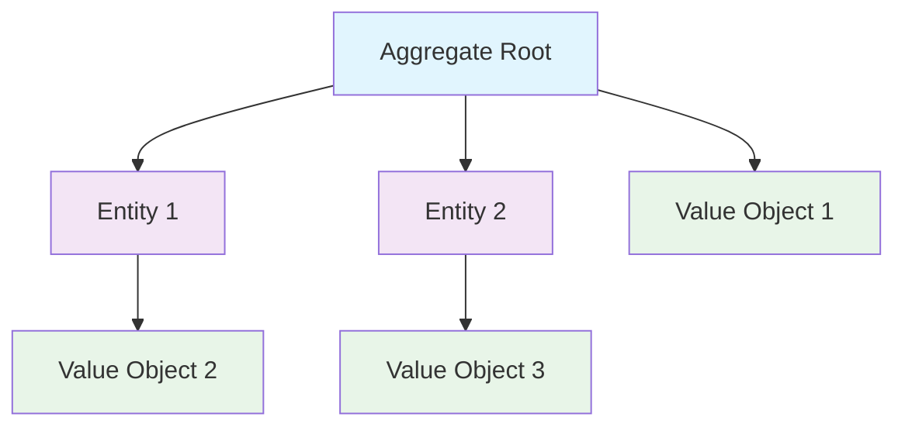

## 🏷️ Tags

#type/area #area/architecture #concept/microservice #concept/clean-architecture #concept/ddd 

---

> [!abstract]+ Определение **Aggregate** - это кластер связанных объектов, которые рассматриваются как единое целое для целей изменения данных. **Aggregate Root** - единственная точка входа для доступа к элементам агрегата.

---

## 🎯 Ключевые концепции

### Что такое Aggregate?



> [!info]+ Основные принципы Aggregate
> 
> - **Инкапсуляция**: Агрегат скрывает внутреннюю сложность
> - **Консистентность**: Обеспечивает целостность данных внутри границ
> - **Транзакционность**: Изменения происходят атомарно
> - **Единая точка входа**: Доступ только через Aggregate Root

---

## 🏗️ Структура Aggregate

### Базовый пример - Заказ

```csharp
// Aggregate Root
public class Order : AggregateRoot
{
    private readonly List<OrderItem> _items = new();
    
    public OrderId Id { get; private set; }
    public CustomerId CustomerId { get; private set; }
    public OrderStatus Status { get; private set; }
    public Money TotalAmount { get; private set; }
    public DateTime CreatedAt { get; private set; }
    
    // Доступ к items только для чтения
    public IReadOnlyCollection<OrderItem> Items => _items.AsReadOnly();
    
    public Order(CustomerId customerId)
    {
        Id = OrderId.NewId();
        CustomerId = customerId;
        Status = OrderStatus.Draft;
        TotalAmount = Money.Zero;
        CreatedAt = DateTime.UtcNow;
        
        // Domain Event
        AddDomainEvent(new OrderCreatedEvent(Id, CustomerId));
    }
    
    // Бизнес-логика инкапсулирована
    public void AddItem(ProductId productId, int quantity, Money unitPrice)
    {
        if (Status != OrderStatus.Draft)
            throw new InvalidOperationException("Cannot modify confirmed order");
            
        var existingItem = _items.FirstOrDefault(x => x.ProductId == productId);
        
        if (existingItem != null)
        {
            existingItem.ChangeQuantity(existingItem.Quantity + quantity);
        }
        else
        {
            _items.Add(new OrderItem(productId, quantity, unitPrice));
        }
        
        RecalculateTotal();
    }
    
    public void RemoveItem(ProductId productId)
    {
        if (Status != OrderStatus.Draft)
            throw new InvalidOperationException("Cannot modify confirmed order");
            
        var item = _items.FirstOrDefault(x => x.ProductId == productId);
        if (item != null)
        {
            _items.Remove(item);
            RecalculateTotal();
        }
    }
    
    public void Confirm()
    {
        if (!_items.Any())
            throw new InvalidOperationException("Cannot confirm empty order");
            
        Status = OrderStatus.Confirmed;
        AddDomainEvent(new OrderConfirmedEvent(Id, TotalAmount));
    }
    
    private void RecalculateTotal()
    {
        TotalAmount = Money.Sum(_items.Select(x => x.LineTotal));
    }
}
```

### Entity внутри Aggregate

```csharp
// Entity (НЕ Aggregate Root)
public class OrderItem : Entity
{
    public ProductId ProductId { get; private set; }
    public int Quantity { get; private set; }
    public Money UnitPrice { get; private set; }
    public Money LineTotal => UnitPrice.Multiply(Quantity);
    
    internal OrderItem(ProductId productId, int quantity, Money unitPrice)
    {
        if (quantity <= 0)
            throw new ArgumentException("Quantity must be positive");
            
        ProductId = productId;
        Quantity = quantity;
        UnitPrice = unitPrice;
    }
    
    internal void ChangeQuantity(int newQuantity)
    {
        if (newQuantity <= 0)
            throw new ArgumentException("Quantity must be positive");
            
        Quantity = newQuantity;
    }
}
```

---

## ⚡ Правила проектирования Aggregates

> [!warning]+ Важные ограничения
> 
> 1. **Размер**: Агрегаты должны быть маленькими
> 2. **Ссылки**: Между агрегатами только по ID
> 3. **Транзакции**: Одна транзакция = один агрегат
> 4. **Консистентность**: Немедленная внутри, eventual между агрегатами

### ✅ Правильно

```csharp
public class Customer : AggregateRoot
{
    public CustomerId Id { get; private set; }
    public string Name { get; private set; }
    public Email Email { get; private set; }
    
    // Ссылка на другой агрегат только по ID
    private readonly List<OrderId> _orderIds = new();
    public IReadOnlyCollection<OrderId> OrderIds => _orderIds.AsReadOnly();
    
    public void PlaceOrder(OrderId orderId)
    {
        _orderIds.Add(orderId);
        AddDomainEvent(new CustomerOrderPlacedEvent(Id, orderId));
    }
}
```

### ❌ Неправильно

```csharp
public class Customer : AggregateRoot
{
    public CustomerId Id { get; private set; }
    public string Name { get; private set; }
    
    // ПЛОХО: Прямые ссылки на другие агрегаты
    private readonly List<Order> _orders = new();
    public IReadOnlyCollection<Order> Orders => _orders.AsReadOnly();
}
```

---

## 🔄 Работа с Repository

### Repository для Aggregate Root

```csharp
public interface IOrderRepository
{
    Task<Order?> GetByIdAsync(OrderId id);
    Task<IEnumerable<Order>> GetByCustomerAsync(CustomerId customerId);
    Task SaveAsync(Order order);
    Task DeleteAsync(Order order);
}
```

### Реализация с Entity Framework

```csharp
public class OrderRepository : IOrderRepository
{
    private readonly ApplicationDbContext _context;
    
    public OrderRepository(ApplicationDbContext context)
    {
        _context = context;
    }
    
    public async Task<Order?> GetByIdAsync(OrderId id)
    {
        return await _context.Orders
            .Include(o => o.Items) // Загружаем весь агрегат
            .FirstOrDefaultAsync(o => o.Id == id);
    }
    
    public async Task SaveAsync(Order order)
    {
        if (_context.Entry(order).State == EntityState.Detached)
        {
            _context.Orders.Add(order);
        }
        
        await _context.SaveChangesAsync();
        
        // Публикация Domain Events
        await PublishDomainEventsAsync(order);
    }
    
    private async Task PublishDomainEventsAsync(AggregateRoot aggregate)
    {
        var events = aggregate.GetDomainEvents();
        aggregate.ClearDomainEvents();
        
        foreach (var @event in events)
        {
            await _mediator.Publish(@event);
        }
    }
}
```

---

## 🎪 Application Service

### Координация между агрегатами

```csharp
public class OrderApplicationService
{
    private readonly IOrderRepository _orderRepository;
    private readonly ICustomerRepository _customerRepository;
    private readonly IProductRepository _productRepository;
    
    public async Task<OrderId> CreateOrderAsync(
        CustomerId customerId, 
        List<OrderItemDto> items)
    {
        // Проверяем существование клиента
        var customer = await _customerRepository.GetByIdAsync(customerId);
        if (customer == null)
            throw new CustomerNotFoundException(customerId);
        
        // Создаем заказ
        var order = new Order(customerId);
        
        // Добавляем товары
        foreach (var item in items)
        {
            var product = await _productRepository.GetByIdAsync(item.ProductId);
            if (product == null)
                throw new ProductNotFoundException(item.ProductId);
                
            order.AddItem(item.ProductId, item.Quantity, product.Price);
        }
        
        await _orderRepository.SaveAsync(order);
        
        // Уведомляем клиента (через Domain Event)
        return order.Id;
    }
    
    public async Task ConfirmOrderAsync(OrderId orderId)
    {
        var order = await _orderRepository.GetByIdAsync(orderId);
        if (order == null)
            throw new OrderNotFoundException(orderId);
        
        order.Confirm();
        await _orderRepository.SaveAsync(order);
    }
}
```

---

## 🌟 Паттерны и лучшие практики

### 1. Aggregate Design Canvas

```markdown
| Аспект | Описание |
|--------|----------|
| **Название** | Order Aggregate |
| **Бизнес-функция** | Управление заказами клиентов |
| **Инварианты** | • Заказ не может быть пустым<br>• Подтвержденный заказ нельзя изменить |
| **Операции** | AddItem, RemoveItem, Confirm, Cancel |
| **События** | OrderCreated, OrderConfirmed, OrderCancelled |
```

### 2. Aggregate Root Base Class

```csharp
public abstract class AggregateRoot : Entity
{
    private readonly List<IDomainEvent> _domainEvents = new();
    
    public IReadOnlyCollection<IDomainEvent> GetDomainEvents()
        => _domainEvents.AsReadOnly();
    
    protected void AddDomainEvent(IDomainEvent domainEvent)
    {
        _domainEvents.Add(domainEvent);
    }
    
    public void ClearDomainEvents()
    {
        _domainEvents.Clear();
    }
}
```

### 3. Value Objects в Aggregates

```csharp
public class Money : ValueObject
{
    public decimal Amount { get; }
    public string Currency { get; }
    
    public Money(decimal amount, string currency = "USD")
    {
        if (amount < 0)
            throw new ArgumentException("Amount cannot be negative");
            
        Amount = amount;
        Currency = currency;
    }
    
    public Money Add(Money other)
    {
        if (Currency != other.Currency)
            throw new InvalidOperationException("Cannot add different currencies");
            
        return new Money(Amount + other.Amount, Currency);
    }
    
    public Money Multiply(int factor)
        => new Money(Amount * factor, Currency);
    
    public static Money Zero => new Money(0);
    
    protected override IEnumerable<object> GetEqualityComponents()
    {
        yield return Amount;
        yield return Currency;
    }
}
```

---

## 📊 Сравнение подходов

|Критерий|С Aggregates|Без Aggregates|
|---|---|---|
|**Консистентность**|🟢 Гарантированная|🔴 Не гарантированная|
|**Производительность**|🟡 Средняя|🟢 Высокая|
|**Сложность**|🟡 Средняя|🟢 Низкая|
|**Тестируемость**|🟢 Высокая|🟡 Средняя|
|**Расширяемость**|🟢 Высокая|🔴 Низкая|

---

## 🚨 Типичные ошибки

> [!danger]+ Частые проблемы
> 
> **1. Слишком большие агрегаты**
> 
> ```csharp
> // ПЛОХО: Агрегат содержит слишком много сущностей
> public class Customer : AggregateRoot
> {
>     public List<Order> Orders { get; set; } // Много заказов
>     public List<Address> Addresses { get; set; } // Много адресов  
>     public List<PaymentMethod> PaymentMethods { get; set; } // И т.д.
> }
> ```
> 
> **2. Нарушение границ агрегата**
> 
> ```csharp
> // ПЛОХО: Прямой доступ к вложенным сущностям
> var orderItem = order.Items.First();
> orderItem.ChangeQuantity(5); // Обходим бизнес-логику!
> ```
> 
> **3. Множественные изменения агрегатов в одной транзакции**
> 
> ```csharp
> // ПЛОХО: Изменяем несколько агрегатов
> customer.UpdateProfile(name);
> order.AddItem(productId, quantity);
> product.DecreaseStock(quantity);
> // Нарушает принцип транзакционности DDD
> ```

---

## 🎯 Резюме

> [!success]+ Ключевые выводы
> 
> - **Aggregates** обеспечивают консистентность данных в бизнес-границах
> - **Aggregate Root** - единственная точка входа для изменений
> - Держите агрегаты **маленькими** и **сфокусированными**
> - Используйте **ID** для ссылок между агрегатами
> - Одна транзакция = один агрегат
> - **Domain Events** для координации между агрегатами

---

## 📚 Дополнительные ресурсы

- [[Domain Events|Domain Events]]
- [[Entities and Value Objects|Entities and Value Objects]]
- [[02 - Areas/Architecture/DDD/Repository Pattern]]
- [[Event Sourcing with Aggregates]]

