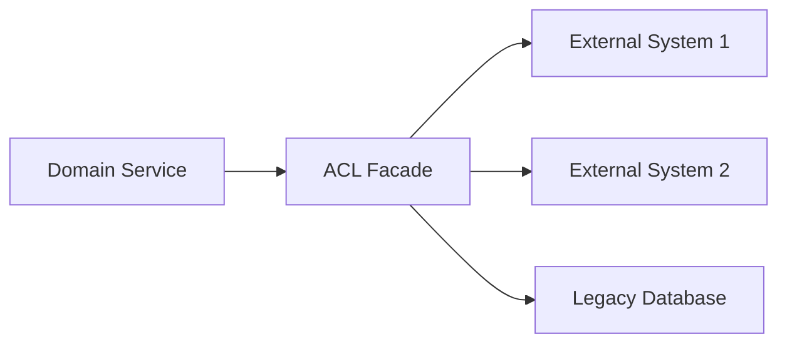
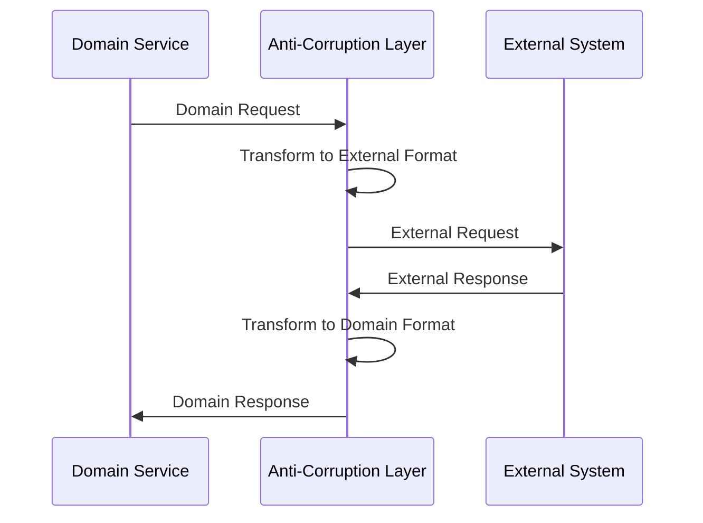

## 🏷️ Tags

#type/area #area/architecture #concept/microservice #concept/clean-architecture #concept/ddd 

---

> [!abstract] Определение **Anti-Corruption Layer** — это слой в архитектуре приложения, который защищает доменную модель от внешних систем и их моделей данных, предотвращая "загрязнение" внутренней логики.

## 📋 Основные концепции

### Что такое ACL?

Anti-Corruption Layer действует как переводчик между:

- **Внутренней доменной моделью** (наша чистая бизнес-логика)
- **Внешними системами** (legacy, third-party API, другие bounded contexts)

### 🎯 Цели ACL

- [x] **Изоляция домена** от внешних изменений
- [x] **Преобразование** данных между различными моделями
- [x] **Защита** от некачественных внешних API
- [x] **Абстракция** сложности интеграций

---

## 🏗️ Архитектурные паттерны

### 1. Facade Pattern



### 2. Adapter Pattern

```csharp
// Доменная модель
public class Customer
{
    public CustomerId Id { get; }
    public string Name { get; }
    public Email Email { get; }
    public Address Address { get; }
}

// Внешняя модель (Legacy система)
public class LegacyCustomerData
{
    public int customer_id { get; set; }
    public string full_name { get; set; }
    public string email_addr { get; set; }
    public string street_address { get; set; }
    public string city_name { get; set; }
}

// ACL Adapter
public class CustomerAdapter : ICustomerRepository
{
    private readonly ILegacyCustomerService _legacyService;
    
    public CustomerAdapter(ILegacyCustomerService legacyService)
    {
        _legacyService = legacyService;
    }
    
    public async Task<Customer> GetByIdAsync(CustomerId customerId)
    {
        var legacyData = await _legacyService.GetCustomer(customerId.Value);
        
        return new Customer(
            new CustomerId(legacyData.customer_id),
            legacyData.full_name,
            new Email(legacyData.email_addr),
            new Address(legacyData.street_address, legacyData.city_name)
        );
    }
}
```

---

## 💡 Практические примеры

### Пример 1: Интеграция с Payment Gateway

> [!example]- Сценарий Наша система управления заказами должна интегрироваться с внешним платежным шлюзом, который имеет собственную модель данных.

**Доменная модель:**

```csharp
public class PaymentRequest
{
    public OrderId OrderId { get; }
    public Money Amount { get; }
    public CustomerId CustomerId { get; }
    public PaymentMethod Method { get; }
}

public class PaymentResult
{
    public bool IsSuccessful { get; }
    public string TransactionId { get; }
    public string ErrorMessage { get; }
}
```

**ACL для платежного шлюза:**

```csharp
public class PaymentGatewayAdapter : IPaymentService
{
    private readonly IPaymentGatewayClient _gatewayClient;
    
    public async Task<PaymentResult> ProcessPaymentAsync(PaymentRequest request)
    {
        // Преобразование доменной модели в модель шлюза
        var gatewayRequest = new PaymentGatewayRequest
        {
            OrderReference = request.OrderId.ToString(),
            AmountInCents = (int)(request.Amount.Value * 100),
            Currency = request.Amount.Currency.Code,
            CustomerId = request.CustomerId.Value.ToString(),
            PaymentType = MapPaymentMethod(request.Method)
        };
        
        try
        {
            var gatewayResponse = await _gatewayClient.ProcessPayment(gatewayRequest);
            
            // Преобразование ответа шлюза в доменную модель
            return new PaymentResult(
                gatewayResponse.Status == "SUCCESS",
                gatewayResponse.TransactionId,
                gatewayResponse.ErrorDetails
            );
        }
        catch (PaymentGatewayException ex)
        {
            return new PaymentResult(false, null, $"Gateway error: {ex.Message}");
        }
    }
    
    private string MapPaymentMethod(PaymentMethod method)
    {
        return method switch
        {
            PaymentMethod.CreditCard => "CC",
            PaymentMethod.DebitCard => "DC", 
            PaymentMethod.BankTransfer => "BT",
            _ => throw new InvalidOperationException($"Unsupported payment method: {method}")
        };
    }
}
```

### Пример 2: Legacy Database Integration

> [!warning] Проблема Унаследованная база данных с плохой структурой и нарушениями нормализации

**ACL для работы с Legacy DB:**

```csharp
public class LegacyOrderAdapter : IOrderRepository
{
    private readonly ILegacyDbContext _legacyDb;
    private readonly ILogger<LegacyOrderAdapter> _logger;
    
    public async Task<Order> GetOrderAsync(OrderId orderId)
    {
        // Сложный запрос к денормализованной legacy таблице
        var legacyOrder = await _legacyDb.OrderData
            .Where(o => o.order_num == orderId.Value)
            .FirstOrDefaultAsync();
            
        if (legacyOrder == null)
            throw new OrderNotFoundException(orderId);
            
        // Преобразование в доменную модель
        return new Order(
            new OrderId(legacyOrder.order_num),
            new CustomerId(legacyOrder.cust_id),
            ParseOrderItems(legacyOrder.items_json), // JSON в legacy поле
            new Money(legacyOrder.total_amt, Currency.USD),
            ParseOrderStatus(legacyOrder.status_code)
        );
    }
    
    private List<OrderItem> ParseOrderItems(string itemsJson)
    {
        try
        {
            var items = JsonSerializer.Deserialize<LegacyOrderItem[]>(itemsJson);
            return items.Select(item => new OrderItem(
                new ProductId(item.prod_id),
                item.quantity,
                new Money(item.unit_price, Currency.USD)
            )).ToList();
        }
        catch (JsonException ex)
        {
            _logger.LogError(ex, "Failed to parse legacy order items JSON");
            return new List<OrderItem>();
        }
    }
}
```

---

## 🔄 Типы Anti-Corruption Layers

|Тип|Описание|Когда использовать|
|---|---|---|
|**Facade**|Упрощает интерфейс внешней системы|Сложные внешние API|
|**Adapter**|Преобразует интерфейсы|Несовместимые модели данных|
|**Translator**|Конвертирует модели данных|Разные форматы данных|
|**Service Wrapper**|Оборачивает внешние сервисы|Добавление функциональности|

---

## ⚠️ Challenges & Solutions

### Проблема: Performance Overhead

> [!bug] Проблема Дополнительный слой может снижать производительность

**Решение:**

```csharp
public class CachedPaymentAdapter : IPaymentService
{
    private readonly IPaymentService _baseAdapter;
    private readonly IMemoryCache _cache;
    
    public async Task<PaymentResult> ProcessPaymentAsync(PaymentRequest request)
    {
        var cacheKey = $"payment_{request.OrderId}";
        
        if (_cache.TryGetValue(cacheKey, out PaymentResult cached))
            return cached;
            
        var result = await _baseAdapter.ProcessPaymentAsync(request);
        
        _cache.Set(cacheKey, result, TimeSpan.FromMinutes(5));
        return result;
    }
}
```

### Проблема: Complex Data Mapping

> [!bug] Проблема  
> Сложное преобразование между различными моделями данных

**Решение с AutoMapper:**

```csharp
public class CustomerMappingProfile : Profile
{
    public CustomerMappingProfile()
    {
        CreateMap<LegacyCustomerData, Customer>()
            .ConstructUsing(src => new Customer(
                new CustomerId(src.customer_id),
                src.full_name,
                new Email(src.email_addr),
                new Address(src.street_address, src.city_name)
            ));
    }
}

public class AutoMapperCustomerAdapter : ICustomerRepository
{
    private readonly IMapper _mapper;
    private readonly ILegacyCustomerService _legacyService;
    
    public async Task<Customer> GetByIdAsync(CustomerId customerId)
    {
        var legacyData = await _legacyService.GetCustomer(customerId.Value);
        return _mapper.Map<Customer>(legacyData);
    }
}
```

---

## 🚀 Best Practices

### ✅ DO

- **Держите ACL тонким** - только преобразование данных
- **Используйте интерфейсы** для абстракции внешних систем
- **Логируйте ошибки** интеграции подробно
- **Тестируйте преобразования** данных тщательно
- **Изолируйте внешние зависимости** в отдельные проекты

### ❌ DON'T

- **Не добавляйте бизнес-логику** в ACL
- **Не делайте ACL слишком умным** - он должен быть простым
- **Не игнорируйте ошибки** внешних систем
- **Не создавайте тесную связанность** с внешними моделями

---

## 📊 Диаграмма взаимодействия



---

## 📚 Связанные паттерны

- [[Repository Pattern]] - часто используется вместе с ACL
- [[Gateway Pattern]] - альтернативный подход к интеграции
- [[Bounded Context|Bounded Context]] - определяет границы для ACL
- [[Domain Events|Domain Events]] - для уведомления об изменениях через ACL

---

> [!tip] Ключевая идея Anti-Corruption Layer — это не просто технический слой, это **архитектурная граница**, которая защищает целостность вашего домена от внешнего мира.
