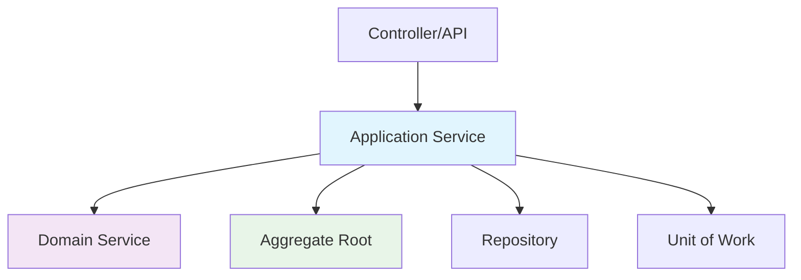

## 🏷️ Tags

#type/area #area/architecture #concept/microservice #concept/clean-architecture #concept/ddd 

---

> [!abstract] Краткое описание **Application Services** - это слой координации в DDD, который оркестрирует бизнес-логику между доменными объектами и внешним миром. Они служат точкой входа для use cases приложения.

---

## 🎯 Основные принципы

> [!tip] Ключевая идея Application Services **НЕ СОДЕРЖАТ** бизнес-логику, а только **КООРДИНИРУЮТ** её выполнение между доменными объектами.

### Что делают Application Services:

- ✅ Координируют выполнение use cases
- ✅ Управляют транзакциями
- ✅ Валидируют входные данные
- ✅ Преобразуют DTO в доменные объекты
- ✅ Обеспечивают безопасность и авторизацию

### Что НЕ делают Application Services:

- ❌ Не содержат бизнес-логику
- ❌ Не знают о деталях инфраструктуры
- ❌ Не работают напрямую с базой данных

---

## 🏗️ Структура Application Service



---

## 💡 Базовый пример

> [!example] Сервис управления заказами

```csharp
public class OrderApplicationService
{
    private readonly IOrderRepository _orderRepository;
    private readonly ICustomerRepository _customerRepository;
    private readonly IUnitOfWork _unitOfWork;
    private readonly IDomainEventPublisher _eventPublisher;

    public OrderApplicationService(
        IOrderRepository orderRepository,
        ICustomerRepository customerRepository,
        IUnitOfWork unitOfWork,
        IDomainEventPublisher eventPublisher)
    {
        _orderRepository = orderRepository;
        _customerRepository = customerRepository;
        _unitOfWork = unitOfWork;
        _eventPublisher = eventPublisher;
    }

    public async Task<OrderDto> CreateOrderAsync(CreateOrderRequest request)
    {
        // 1. Валидация входных данных
        if (request == null || !request.Items.Any())
            throw new ArgumentException("Order must contain items");

        // 2. Получение доменных объектов
        var customer = await _customerRepository.GetByIdAsync(request.CustomerId);
        if (customer == null)
            throw new CustomerNotFoundException(request.CustomerId);

        // 3. Создание aggregate root через фабричный метод
        var order = Order.Create(
            customerId: customer.Id,
            shippingAddress: request.ShippingAddress);

        // 4. Добавление товаров (бизнес-логика в домене)
        foreach (var item in request.Items)
        {
            order.AddItem(item.ProductId, item.Quantity, item.Price);
        }

        // 5. Сохранение
        await _orderRepository.AddAsync(order);
        await _unitOfWork.CommitAsync();

        // 6. Публикация событий
        await _eventPublisher.PublishAsync(order.DomainEvents);

        return OrderDto.FromDomain(order);
    }
}
```

---

## 🔄 Паттерны использования

### 1. Command-Query Separation

> [!info] Разделение команд и запросов Разделяйте операции изменения (Commands) и чтения (Queries)

```csharp
// Command Service
public class OrderCommandService
{
    public async Task<Guid> CreateOrderAsync(CreateOrderCommand command)
    {
        // Логика создания заказа
    }
    
    public async Task UpdateOrderStatusAsync(UpdateOrderStatusCommand command)
    {
        // Логика обновления статуса
    }
}

// Query Service  
public class OrderQueryService
{
    public async Task<OrderDto> GetOrderAsync(Guid orderId)
    {
        // Логика получения заказа
    }
    
    public async Task<List<OrderDto>> GetOrdersAsync(OrderFilter filter)
    {
        // Логика поиска заказов
    }
}
```

### 2. Request-Response Pattern

```csharp
public class PaymentApplicationService
{
    public async Task<ProcessPaymentResponse> ProcessPaymentAsync(
        ProcessPaymentRequest request)
    {
        try
        {
            // 1. Валидация
            ValidatePaymentRequest(request);
            
            // 2. Получение aggregate
            var payment = await _paymentRepository.GetByIdAsync(request.PaymentId);
            
            // 3. Выполнение бизнес-операции
            var result = payment.Process(request.Amount, request.PaymentMethod);
            
            // 4. Сохранение
            await _unitOfWork.CommitAsync();
            
            return new ProcessPaymentResponse
            {
                Success = true,
                TransactionId = result.TransactionId,
                Status = result.Status
            };
        }
        catch (DomainException ex)
        {
            return new ProcessPaymentResponse
            {
                Success = false,
                ErrorMessage = ex.Message
            };
        }
    }
}
```

---

## ⚡ Обработка транзакций

> [!warning] Важно Application Services должны управлять границами транзакций

```csharp
public class InventoryApplicationService
{
    public async Task<bool> ReserveProductsAsync(List<ReserveProductRequest> requests)
    {
        using var transaction = await _unitOfWork.BeginTransactionAsync();
        
        try
        {
            foreach (var request in requests)
            {
                var product = await _productRepository.GetByIdAsync(request.ProductId);
                
                // Бизнес-логика резервирования в домене
                product.Reserve(request.Quantity);
                
                await _productRepository.UpdateAsync(product);
            }
            
            await _unitOfWork.CommitAsync();
            await transaction.CommitAsync();
            
            return true;
        }
        catch (Exception)
        {
            await transaction.RollbackAsync();
            throw;
        }
    }
}
```

---

## 🎭 Обработка доменных событий

```csharp
public class UserApplicationService
{
    public async Task RegisterUserAsync(RegisterUserRequest request)
    {
        // Создание пользователя
        var user = User.Create(request.Email, request.Password);
        
        // Доменное событие генерируется внутри aggregate
        // user.DomainEvents содержит UserRegisteredEvent
        
        await _userRepository.AddAsync(user);
        await _unitOfWork.CommitAsync();
        
        // Публикация событий после успешного сохранения
        foreach (var domainEvent in user.DomainEvents)
        {
            await _eventPublisher.PublishAsync(domainEvent);
        }
        
        user.ClearEvents();
    }
}
```

---

## 🔒 Авторизация и валидация

```csharp
public class AccountApplicationService
{
    public async Task TransferMoneyAsync(TransferMoneyRequest request)
    {
        // 1. Авторизация
        if (!await _authService.CanAccessAccountAsync(request.FromAccountId))
            throw new UnauthorizedAccessException();
            
        // 2. Валидация входных данных
        if (request.Amount <= 0)
            throw new ArgumentException("Amount must be positive");
            
        // 3. Бизнес-валидация через домен
        var fromAccount = await _accountRepository.GetByIdAsync(request.FromAccountId);
        var toAccount = await _accountRepository.GetByIdAsync(request.ToAccountId);
        
        // 4. Выполнение операции (вся логика в домене)
        var transaction = fromAccount.TransferTo(toAccount, request.Amount);
        
        // 5. Сохранение
        await _transactionRepository.AddAsync(transaction);
        await _unitOfWork.CommitAsync();
    }
}
```

---

## 📋 DTO и маппинг

> [!note] Best Practice Используйте отдельные DTO для входящих и исходящих данных

```csharp
// Входящий DTO
public class CreateCustomerRequest
{
    public string FirstName { get; set; }
    public string LastName { get; set; }
    public string Email { get; set; }
    public AddressDto Address { get; set; }
}

// Исходящий DTO
public class CustomerDto
{
    public Guid Id { get; set; }
    public string FullName { get; set; }
    public string Email { get; set; }
    public AddressDto Address { get; set; }
    public DateTime CreatedAt { get; set; }
    
    public static CustomerDto FromDomain(Customer customer)
    {
        return new CustomerDto
        {
            Id = customer.Id,
            FullName = customer.FullName,
            Email = customer.Email.Value,
            Address = AddressDto.FromDomain(customer.Address),
            CreatedAt = customer.CreatedAt
        };
    }
}
```

---

## 🏆 Лучшие практики

> [!success] ✅ Делайте так

|Принцип|Описание|Пример|
|---|---|---|
|**Тонкие сервисы**|Минимум логики, максимум координации|`service.CreateOrder()` только координирует|
|**Одна ответственность**|Один сервис = один bounded context|`OrderService`, `PaymentService`|
|**Immutable DTOs**|Неизменяемые объекты передачи данных|`readonly` свойства|
|**Explicit dependencies**|Явные зависимости через конструктор|DI контейнер|

> [!error] ❌ Не делайте так

- Не помещайте бизнес-логику в Application Services
- Не создавайте "божественные" сервисы с множеством методов
- Не работайте напрямую с инфраструктурой
- Не игнорируйте доменные события

---

## 📚 Связанные концепции

```dataview
LIST
FROM #ddd
WHERE contains(file.name, "Domain") OR contains(file.name, "Repository") OR contains(file.name, "UnitOfWork")
```
---

> [!quote] Помните _"Application Services являются клиентами доменной модели, а не её частью"_ - Eric Evans