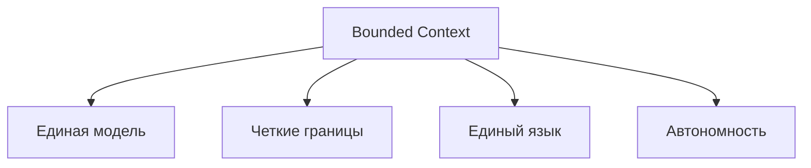
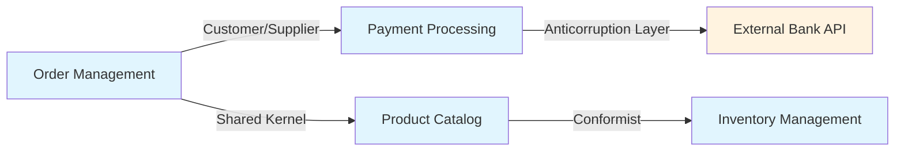

## 🏷️ Tags

#type/area #area/architecture #concept/microservice #concept/clean-architecture #concept/ddd 

---

> [!info]  **Bounded Context** — это центральная концепция Domain-Driven Design, определяющая явные границы, внутри которых конкретная доменная модель применима и имеет четкое значение.

---

## 🎯 Ключевые принципы



### 📋 Основные характеристики

- **Языковая граница**: Внутри контекста все термины имеют однозначное значение
- **Модельная граница**: Одна и та же сущность может иметь разные модели в разных контекстах
- **Техническая граница**: Часто соответствует границам сервиса/модуля
- **Организационная граница**: Может отражать структуру команд

---

## 💡 Практические примеры

### Пример 1: E-commerce платформа

```
┌─────────────────┐  ┌─────────────────┐  ┌─────────────────┐
│   Sales Context │  │Inventory Context│  │Shipping Context │
│                 │  │                 │  │                 │
│ Product:        │  │ Product:        │  │ Product:        │
│ - name          │  │ - sku           │  │ - weight        │
│ - price         │  │ - quantity      │  │ - dimensions    │
│ - description   │  │ - location      │  │ - fragility     │
│                 │  │                 │  │                 │
│ Customer:       │  │                 │  │ Customer:       │
│ - preferences   │  │                 │  │ - address       │
│ - history       │  │                 │  │ - delivery_pref │
└─────────────────┘  └─────────────────┘  └─────────────────┘
```

> [!example] Один Product — разные модели. В **Sales Context** продукт — это маркетинговая сущность с ценой и описанием. В **Inventory Context** — это физический объект с количеством и местоположением. В **Shipping Context** — это груз с весом и габаритами.

### Пример 2: Банковская система

|Context|User представлен как|Ключевые атрибуты|
|---|---|---|
|**Authentication**|Учетная запись|username, password, 2FA|
|**Lending**|Заемщик|creditScore, income, debts|
|**Marketing**|Клиент|preferences, segments, campaigns|
|**Compliance**|Субъект|KYC status, risk level, documents|

---

## 🔄 Взаимодействие между контекстами

### Context Map - Карта взаимосвязей



### Паттерны интеграции

> [!tip] **Shared Kernel** Общая модель для тесно связанных контекстов
> 
> ```
> OrderItem ←→ ProductInfo (общая структура)
> ```

> [!warning] **Anticorruption Layer** Защитный слой от внешних систем
> 
> ```
> Internal Model ←→ [ACL] ←→ Legacy System
> ```

> [!note] **Published Language** Стандартизированный формат обмена
> 
> ```
> OrderCreated Event: {orderId, customerId, items[]}
> ```

---

## 🛠 Как определить границы контекста?

### 📊 Матрица анализа

|Критерий|Вопросы для анализа|
|---|---|
|**Язык**|Используют ли команды одинаковые термины для одних понятий?|
|**Данные**|Нужны ли одни и те же данные в разном виде?|
|**Бизнес-цели**|Решают ли разные задачи бизнеса?|
|**Изменения**|Меняются ли требования независимо?|
|**Команды**|Работают ли разные команды над функциональностью?|

### 🎯 Event Storming для выявления границ

```
📝 Domain Events → 👥 Actors → 🏛 Aggregates → 🚧 Boundaries
```

> [!success] Признаки правильных границ
> 
> - [ ] Команда может работать автономно
> - [ ] Минимум дублирования бизнес-логики
> - [ ] Четкие интерфейсы взаимодействия
> - [ ] Сильная связанность внутри, слабая — снаружи

---

## ⚠️ Типичные ошибки

> [!danger] **Анемичные контексты** Контекст содержит только CRUD операции без бизнес-логики
> 
> ```
> ❌ UserService.save(user)
> ✅ AccountService.upgradeToVip(customerId)
> ```

> [!danger] **Слишком мелкие контексты** Чрезмерная декомпозиция приводит к сложности интеграции
> 
> ```
> ❌ Отдельные контексты для: User, Profile, Settings
> ✅ Единый контекст: User Management
> ```

> [!danger] **Игнорирование Conway's Law** Структура системы отражает структуру команд
> 
> ```
> Команда A + Команда B → Общий контекст = Проблемы
> ```

---

## 🚀 Практические шаги внедрения

### Фаза 1: Исследование 🔍

```
1. Провести Event Storming сессии
2. Выявить ключевые агрегаты  
3. Определить языковые границы
4. Проанализировать организационную структуру
```

### Фаза 2: Моделирование 📐

```
1. Создать Context Map
2. Выбрать паттерны интеграции
3. Спроектировать API между контекстами
4. Определить стратегию развертывания
```

### Фаза 3: Реализация ⚡

```
1. Начать с наиболее независимого контекста
2. Реализовать Anticorruption Layers
3. Настроить мониторинг границ
4. Документировать решения
```

---

## 📚 Связанные концепции

- [[Ubiquitous Language]] - общий язык домена
- [[Domain Events]] - события для интеграции контекстов
- [[Aggregates]] - границы консистентности внутри контекста
- [[Context Mapping]] - стратегии взаимодействия контекстов

---

> [!quote] Eric Evans "Bounded Context delimits the applicability of a particular model. Within those bounds, all terms and phrases of the Ubiquitous Language have specific meaning, and the model reflects that language with precision."

**Помни**: Bounded Context — это не просто техническая граница, это граница понимания и ответственности в бизнес-домене! 🎯