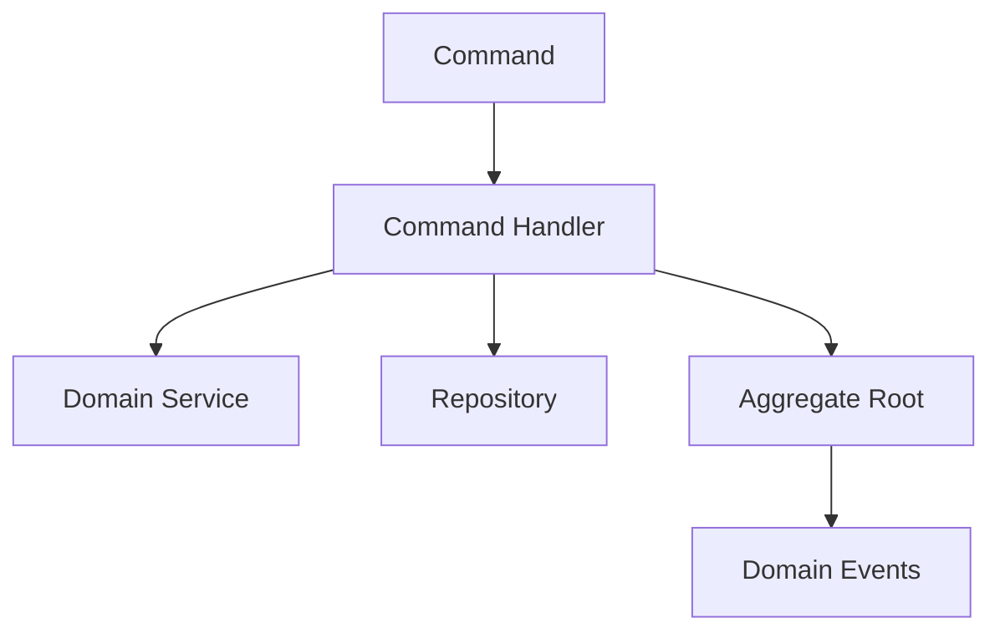

## 🏷️ Tags

#type/area #area/architecture #concept/microservice #concept/clean-architecture #concept/ddd 

---

> [!abstract] Краткое описание **Command Handler** — это компонент в Domain-Driven Design, который обрабатывает команды (Commands) и координирует их выполнение в доменной логике. Это мост между слоем приложения и доменной моделью.

## 📋 Основные концепции

### Что такое Command Handler?

Command Handler — это паттерн, который:

- **Принимает команды** от слоя приложения
- **Загружает необходимые агрегаты** из репозитория
- **Выполняет бизнес-операции** через доменную модель
- **Сохраняет изменения** обратно в репозиторий

> [!tip] Принцип работы Один Handler = Одна Command = Одна бизнес-операция

---

## 🏗️ Структура Command Handler



### Базовый интерфейс

```csharp
public interface ICommandHandler<in TCommand>
    where TCommand : ICommand
{
    Task HandleAsync(TCommand command, CancellationToken cancellationToken = default);
}

public interface ICommandHandler<in TCommand, TResult>
    where TCommand : ICommand<TResult>
{
    Task<TResult> HandleAsync(TCommand command, CancellationToken cancellationToken = default);
}
```

---

## 💡 Практические примеры

### Пример 1: Создание заказа

> [!example] Create Order Command Handler

**Command:**

```csharp
public record CreateOrderCommand(
    Guid CustomerId,
    IReadOnlyList<OrderItemDto> Items,
    Address ShippingAddress
) : ICommand<Guid>;

public record OrderItemDto(
    Guid ProductId,
    int Quantity,
    decimal Price
);
```

**Handler:**

```csharp
public class CreateOrderCommandHandler : ICommandHandler<CreateOrderCommand, Guid>
{
    private readonly IOrderRepository _orderRepository;
    private readonly ICustomerRepository _customerRepository;
    private readonly IProductRepository _productRepository;
    private readonly IDomainEventDispatcher _eventDispatcher;

    public CreateOrderCommandHandler(
        IOrderRepository orderRepository,
        ICustomerRepository customerRepository,
        IProductRepository productRepository,
        IDomainEventDispatcher eventDispatcher)
    {
        _orderRepository = orderRepository;
        _customerRepository = customerRepository;
        _productRepository = productRepository;
        _eventDispatcher = eventDispatcher;
    }

    public async Task<Guid> HandleAsync(
        CreateOrderCommand command, 
        CancellationToken cancellationToken = default)
    {
        // 1. Валидация и загрузка данных
        var customer = await _customerRepository.GetByIdAsync(command.CustomerId);
        if (customer == null)
            throw new CustomerNotFoundException(command.CustomerId);

        // 2. Создание агрегата
        var order = Order.Create(
            OrderId.New(),
            customer.Id,
            command.ShippingAddress);

        // 3. Добавление товаров
        foreach (var item in command.Items)
        {
            var product = await _productRepository.GetByIdAsync(item.ProductId);
            if (product == null)
                throw new ProductNotFoundException(item.ProductId);

            order.AddItem(product.Id, item.Quantity, item.Price);
        }

        // 4. Сохранение
        await _orderRepository.SaveAsync(order);
        
        // 5. Публикация доменных событий
        await _eventDispatcher.DispatchAsync(order.DomainEvents);

        return order.Id.Value;
    }
}
```

### Пример 2: Изменение статуса заказа

> [!example] Change Order Status Command Handler

**Command:**

```csharp
public record ChangeOrderStatusCommand(
    Guid OrderId,
    OrderStatus NewStatus,
    string? Reason = null
) : ICommand;
```

**Handler:**

```csharp
public class ChangeOrderStatusCommandHandler : ICommandHandler<ChangeOrderStatusCommand>
{
    private readonly IOrderRepository _orderRepository;
    private readonly IUnitOfWork _unitOfWork;

    public ChangeOrderStatusCommandHandler(
        IOrderRepository orderRepository,
        IUnitOfWork unitOfWork)
    {
        _orderRepository = orderRepository;
        _unitOfWork = unitOfWork;
    }

    public async Task HandleAsync(
        ChangeOrderStatusCommand command,
        CancellationToken cancellationToken = default)
    {
        using var transaction = await _unitOfWork.BeginTransactionAsync();
        
        try
        {
            // Загрузка агрегата
            var order = await _orderRepository.GetByIdAsync(
                new OrderId(command.OrderId));
                
            if (order == null)
                throw new OrderNotFoundException(command.OrderId);

            // Выполнение доменной операции
            order.ChangeStatus(command.NewStatus, command.Reason);

            // Сохранение
            await _orderRepository.SaveAsync(order);
            await transaction.CommitAsync();
        }
        catch
        {
            await transaction.RollbackAsync();
            throw;
        }
    }
}
```

---

## 🎯 Лучшие практики

> [!success] ✅ Что делать правильно

### 1. Единственная ответственность

```csharp
// ✅ Хорошо - один handler на одну команду
public class CreateUserCommandHandler : ICommandHandler<CreateUserCommand>
{
    public async Task HandleAsync(CreateUserCommand command) 
    {
        // Логика создания пользователя
    }
}
```

### 2. Использование транзакций

```csharp
public class TransferMoneyCommandHandler : ICommandHandler<TransferMoneyCommand>
{
    public async Task HandleAsync(TransferMoneyCommand command)
    {
        using var transaction = await _unitOfWork.BeginTransactionAsync();
        
        try
        {
            var fromAccount = await _repository.GetByIdAsync(command.FromAccountId);
            var toAccount = await _repository.GetByIdAsync(command.ToAccountId);
            
            fromAccount.Withdraw(command.Amount);
            toAccount.Deposit(command.Amount);
            
            await _repository.SaveAsync(fromAccount);
            await _repository.SaveAsync(toAccount);
            
            await transaction.CommitAsync();
        }
        catch
        {
            await transaction.RollbackAsync();
            throw;
        }
    }
}
```

### 3. Валидация входных данных

```csharp
public class UpdateProductCommandHandler : ICommandHandler<UpdateProductCommand>
{
    private readonly IValidator<UpdateProductCommand> _validator;
    
    public async Task HandleAsync(UpdateProductCommand command)
    {
        // Валидация команды
        var validationResult = await _validator.ValidateAsync(command);
        if (!validationResult.IsValid)
            throw new ValidationException(validationResult.Errors);
            
        // Основная логика...
    }
}
```

> [!danger] ❌ Чего избегать

### 1. Слишком много логики в Handler

```csharp
// ❌ Плохо - слишком много ответственности
public class CreateOrderCommandHandler : ICommandHandler<CreateOrderCommand>
{
    public async Task HandleAsync(CreateOrderCommand command)
    {
        // Не должно быть здесь:
        // - Сложных вычислений
        // - Бизнес-правил
        // - Форматирования данных
        // - Отправки email/SMS
    }
}
```

### 2. Прямое обращение к инфраструктуре

```csharp
// ❌ Плохо - нарушение принципов DDD
public class BadCommandHandler
{
    public async Task HandleAsync(SomeCommand command)
    {
        // НЕ делайте так!
        using var connection = new SqlConnection(connectionString);
        var sql = "INSERT INTO Orders...";
        await connection.ExecuteAsync(sql, command);
    }
}
```

---

## 🔧 Регистрация в DI Container

### ASP.NET Core пример

```csharp
// Startup.cs или Program.cs
public void ConfigureServices(IServiceCollection services)
{
    // Автоматическая регистрация всех handlers
    services.Scan(scan => scan
        .FromApplicationDependencies()
        .AddClasses(classes => classes.AssignableTo(typeof(ICommandHandler<>)))
        .AsImplementedInterfaces()
        .WithScopedLifetime());
        
    // Или вручную
    services.AddScoped<ICommandHandler<CreateOrderCommand, Guid>, 
                     CreateOrderCommandHandler>();
    services.AddScoped<ICommandHandler<ChangeOrderStatusCommand>, 
                     ChangeOrderStatusCommandHandler>();
}
```

---

## 🚀 Продвинутые техники

### 1. Декораторы для Cross-Cutting Concerns

```csharp
public class LoggingCommandHandlerDecorator<TCommand> 
    : ICommandHandler<TCommand> where TCommand : ICommand
{
    private readonly ICommandHandler<TCommand> _handler;
    private readonly ILogger<LoggingCommandHandlerDecorator<TCommand>> _logger;

    public async Task HandleAsync(TCommand command, CancellationToken cancellationToken)
    {
        _logger.LogInformation("Executing command {CommandType}", typeof(TCommand).Name);
        
        var stopwatch = Stopwatch.StartNew();
        try
        {
            await _handler.HandleAsync(command, cancellationToken);
            _logger.LogInformation("Command {CommandType} executed successfully in {ElapsedMs}ms", 
                typeof(TCommand).Name, stopwatch.ElapsedMilliseconds);
        }
        catch (Exception ex)
        {
            _logger.LogError(ex, "Command {CommandType} failed after {ElapsedMs}ms", 
                typeof(TCommand).Name, stopwatch.ElapsedMilliseconds);
            throw;
        }
    }
}
```

### 2. Command Dispatcher

```csharp
public interface ICommandDispatcher
{
    Task DispatchAsync<TCommand>(TCommand command) where TCommand : ICommand;
    Task<TResult> DispatchAsync<TCommand, TResult>(TCommand command) 
        where TCommand : ICommand<TResult>;
}

public class CommandDispatcher : ICommandDispatcher
{
    private readonly IServiceProvider _serviceProvider;

    public CommandDispatcher(IServiceProvider serviceProvider)
    {
        _serviceProvider = serviceProvider;
    }

    public async Task DispatchAsync<TCommand>(TCommand command) where TCommand : ICommand
    {
        var handler = _serviceProvider.GetRequiredService<ICommandHandler<TCommand>>();
        await handler.HandleAsync(command);
    }

    public async Task<TResult> DispatchAsync<TCommand, TResult>(TCommand command) 
        where TCommand : ICommand<TResult>
    {
        var handler = _serviceProvider.GetRequiredService<ICommandHandler<TCommand, TResult>>();
        return await handler.HandleAsync(command);
    }
}
```

---

## 📊 Сравнение подходов

|Аспект|Command Handler|Service Layer|Controller|
|---|---|---|---|
|**Ответственность**|Одна команда|Множество операций|HTTP-запросы|
|**Тестируемость**|⭐⭐⭐⭐⭐|⭐⭐⭐|⭐⭐|
|**SOLID принципы**|⭐⭐⭐⭐⭐|⭐⭐⭐|⭐⭐|
|**Переиспользование**|⭐⭐⭐⭐|⭐⭐⭐⭐⭐|⭐|

---

## 🔗 Связанные паттерны

```dataview
LIST
FROM #concept/ddd
WHERE contains(file.name, "commands") OR contains(file.name, "cqrs") OR contains(file.name, "aggregate")
SORT file.name ASC
```

> [!note] Дополнительное чтение
> 
> - [[CQRS Pattern]]
> - [[Domain Events]]
> - [[Aggregates & Aggregate Root|Aggregates & Aggregate Root]]
> - [[Repository Pattern]]

---

## 📝 Резюме

Command Handlers в DDD обеспечивают:

- ✅ **Разделение ответственности** между слоями
- ✅ **Простоту тестирования** каждого handler'а отдельно
- ✅ **Централизованную обработку** команд
- ✅ **Легкую расширяемость** через декораторы
- ✅ **Соблюдение принципов** SOLID и Clean Architecture

> [!quote] Главный принцип "Один Handler должен делать одну вещь, но делать её хорошо"