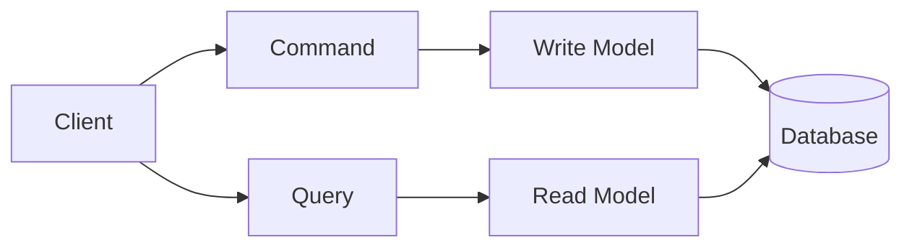

## 🏷️ Tags

#type/area #area/architecture #concept/microservice #concept/clean-architecture #concept/ddd 

---

> [!info] Основная концепция **Command Query Separation (CQS)** - принцип разделения операций на команды (изменяют состояние) и запросы (возвращают данные) без побочных эффектов.

---

## 🎯 Ключевые принципы



### Commands (Команды)

- **Изменяют** состояние системы
- **Не возвращают** данные (void или Task)
- Представляют **намерения** пользователя

### Queries (Запросы)

- **Читают** данные без изменений
- **Возвращают** результат
- **Идемпотентны** (повторный вызов безопасен)

---

## 📝 Commands - Структура и примеры

### Базовая структура команды

```csharp
// Интерфейс команды
public interface ICommand
{
    // Команды обычно не возвращают данных
}

// Пример команды
public class CreateOrderCommand : ICommand
{
    public Guid CustomerId { get; init; }
    public List<OrderItem> Items { get; init; }
    public DateTime OrderDate { get; init; }
    
    public CreateOrderCommand(Guid customerId, List<OrderItem> items)
    {
        CustomerId = customerId;
        Items = items ?? throw new ArgumentNullException(nameof(items));
        OrderDate = DateTime.UtcNow;
    }
}
```

### Command Handler

> [!tip] Command Handler Обработчик команды содержит бизнес-логику и координирует работу с доменными объектами.

```csharp
public interface ICommandHandler<in TCommand> where TCommand : ICommand
{
    Task HandleAsync(TCommand command, CancellationToken cancellationToken = default);
}

public class CreateOrderCommandHandler : ICommandHandler<CreateOrderCommand>
{
    private readonly IOrderRepository _orderRepository;
    private readonly ICustomerRepository _customerRepository;
    private readonly IUnitOfWork _unitOfWork;

    public CreateOrderCommandHandler(
        IOrderRepository orderRepository,
        ICustomerRepository customerRepository,
        IUnitOfWork unitOfWork)
    {
        _orderRepository = orderRepository;
        _customerRepository = customerRepository;
        _unitOfWork = unitOfWork;
    }

    public async Task HandleAsync(CreateOrderCommand command, CancellationToken cancellationToken = default)
    {
        // 1. Валидация
        var customer = await _customerRepository.GetByIdAsync(command.CustomerId);
        if (customer == null)
            throw new CustomerNotFoundException(command.CustomerId);

        // 2. Создание доменного объекта
        var order = Order.Create(
            customerId: command.CustomerId,
            items: command.Items
        );

        // 3. Сохранение
        await _orderRepository.AddAsync(order);
        await _unitOfWork.CommitAsync(cancellationToken);
    }
}
```

### Примеры различных типов команд

> [!example]- Создание (Create Commands)
> 
> ```csharp
> public class RegisterUserCommand : ICommand
> {
>     public string Email { get; init; }
>     public string Password { get; init; }
>     public string FirstName { get; init; }
>     public string LastName { get; init; }
> }
> ```

> [!example]- Обновление (Update Commands)
> 
> ```csharp
> public class UpdateUserProfileCommand : ICommand
> {
>     public Guid UserId { get; init; }
>     public string FirstName { get; init; }
>     public string LastName { get; init; }
>     public string Phone { get; init; }
> }
> ```

> [!example]- Удаление (Delete Commands)
> 
> ```csharp
> public class DeleteOrderCommand : ICommand
> {
>     public Guid OrderId { get; init; }
>     public string Reason { get; init; }
> }
> ```

---

## 🔍 Queries - Структура и примеры

### Базовая структура запроса

```csharp
// Интерфейс запроса с результатом
public interface IQuery<out TResult>
{
    // Запросы возвращают данные
}

// Пример запроса
public class GetOrderByIdQuery : IQuery<OrderDto>
{
    public Guid OrderId { get; init; }
    
    public GetOrderByIdQuery(Guid orderId)
    {
        if (orderId == Guid.Empty)
            throw new ArgumentException("Order ID cannot be empty", nameof(orderId));
            
        OrderId = orderId;
    }
}
```

### Query Handler

```csharp
public interface IQueryHandler<in TQuery, TResult> where TQuery : IQuery<TResult>
{
    Task<TResult> HandleAsync(TQuery query, CancellationToken cancellationToken = default);
}

public class GetOrderByIdQueryHandler : IQueryHandler<GetOrderByIdQuery, OrderDto>
{
    private readonly IReadOnlyOrderRepository _orderRepository;

    public GetOrderByIdQueryHandler(IReadOnlyOrderRepository orderRepository)
    {
        _orderRepository = orderRepository;
    }

    public async Task<OrderDto> HandleAsync(GetOrderByIdQuery query, CancellationToken cancellationToken = default)
    {
        var order = await _orderRepository.GetByIdAsync(query.OrderId);
        
        if (order == null)
            return null; // или throw new OrderNotFoundException

        return new OrderDto
        {
            Id = order.Id,
            CustomerId = order.CustomerId,
            Items = order.Items.Select(i => new OrderItemDto
            {
                ProductId = i.ProductId,
                Quantity = i.Quantity,
                Price = i.Price
            }).ToList(),
            TotalAmount = order.TotalAmount,
            Status = order.Status.ToString(),
            CreatedAt = order.CreatedAt
        };
    }
}
```

### Типы запросов с примерами

> [!example]- Получение по ID
> 
> ```csharp
> public class GetUserByIdQuery : IQuery<UserDto>
> {
>     public Guid UserId { get; init; }
> }
> ```

> [!example]- Поиск с фильтрацией
> 
> ```csharp
> public class SearchOrdersQuery : IQuery<PagedResult<OrderSummaryDto>>
> {
>     public string CustomerEmail { get; init; }
>     public OrderStatus? Status { get; init; }
>     public DateTime? FromDate { get; init; }
>     public DateTime? ToDate { get; init; }
>     public int Page { get; init; } = 1;
>     public int PageSize { get; init; } = 20;
> }
> ```

> [!example]- Получение списков
> 
> ```csharp
> public class GetActiveProductsQuery : IQuery<List<ProductDto>>
> {
>     public int? CategoryId { get; init; }
>     public bool OnlyInStock { get; init; } = true;
> }
> ```

---

## 🏗️ Архитектурная организация

### Структура папок

```
📁 Application
├── 📁 Commands
│   ├── 📄 CreateOrderCommand.cs
│   ├── 📄 UpdateOrderCommand.cs
│   └── 📁 Handlers
│       ├── 📄 CreateOrderCommandHandler.cs
│       └── 📄 UpdateOrderCommandHandler.cs
├── 📁 Queries
│   ├── 📄 GetOrderByIdQuery.cs
│   ├── 📄 SearchOrdersQuery.cs
│   └── 📁 Handlers
│       ├── 📄 GetOrderByIdQueryHandler.cs
│       └── 📄 SearchOrdersQueryHandler.cs
└── 📁 DTOs
    ├── 📄 OrderDto.cs
    └── 📄 OrderSummaryDto.cs
```

### Dependency Injection настройка

```csharp
// Program.cs или Startup.cs
public void ConfigureServices(IServiceCollection services)
{
    // Регистрация обработчиков команд
    services.AddScoped<ICommandHandler<CreateOrderCommand>, CreateOrderCommandHandler>();
    services.AddScoped<ICommandHandler<UpdateOrderCommand>, UpdateOrderCommandHandler>();
    
    // Регистрация обработчиков запросов
    services.AddScoped<IQueryHandler<GetOrderByIdQuery, OrderDto>, GetOrderByIdQueryHandler>();
    services.AddScoped<IQueryHandler<SearchOrdersQuery, PagedResult<OrderSummaryDto>>, SearchOrdersQueryHandler>();
    
    // Или использовать Mediator pattern (MediatR)
    services.AddMediatR(typeof(CreateOrderCommand).Assembly);
}
```

---

## 🔄 Использование MediatR

> [!note] MediatR Pattern Популярная библиотека для реализации паттерна Mediator в .NET приложениях.

### Установка и настройка

```bash
Install-Package MediatR
Install-Package MediatR.Extensions.Microsoft.DependencyInjection
```

### Адаптация под MediatR

```csharp
// Команда
public class CreateOrderCommand : IRequest
{
    public Guid CustomerId { get; init; }
    public List<OrderItem> Items { get; init; }
}

// Handler команды
public class CreateOrderCommandHandler : IRequestHandler<CreateOrderCommand>
{
    private readonly IOrderRepository _orderRepository;

    public CreateOrderCommandHandler(IOrderRepository orderRepository)
    {
        _orderRepository = orderRepository;
    }

    public async Task<Unit> Handle(CreateOrderCommand request, CancellationToken cancellationToken)
    {
        var order = Order.Create(request.CustomerId, request.Items);
        await _orderRepository.AddAsync(order);
        return Unit.Value;
    }
}

// Запрос
public class GetOrderByIdQuery : IRequest<OrderDto>
{
    public Guid OrderId { get; init; }
}

// Handler запроса
public class GetOrderByIdQueryHandler : IRequestHandler<GetOrderByIdQuery, OrderDto>
{
    private readonly IOrderRepository _orderRepository;

    public GetOrderByIdQueryHandler(IOrderRepository orderRepository)
    {
        _orderRepository = orderRepository;
    }

    public async Task<OrderDto> Handle(GetOrderByIdQuery request, CancellationToken cancellationToken)
    {
        var order = await _orderRepository.GetByIdAsync(request.OrderId);
        return MapToDto(order);
    }
}
```

### Использование в контроллере

```csharp
[ApiController]
[Route("api/[controller]")]
public class OrdersController : ControllerBase
{
    private readonly IMediator _mediator;

    public OrdersController(IMediator mediator)
    {
        _mediator = mediator;
    }

    [HttpPost]
    public async Task<IActionResult> CreateOrder([FromBody] CreateOrderCommand command)
    {
        await _mediator.Send(command);
        return Ok();
    }

    [HttpGet("{id}")]
    public async Task<ActionResult<OrderDto>> GetOrder(Guid id)
    {
        var query = new GetOrderByIdQuery { OrderId = id };
        var result = await _mediator.Send(query);
        
        return result != null ? Ok(result) : NotFound();
    }
}
```

---

## ⚡ Преимущества и недостатки

### ✅ Преимущества

|Аспект|Описание|
|---|---|
|**Разделение ответственности**|Четкое разграничение операций чтения и записи|
|**Тестируемость**|Легко тестировать каждый handler отдельно|
|**Масштабируемость**|Возможность оптимизации чтения и записи независимо|
|**Читаемость кода**|Явное выражение намерений через команды|

### ❌ Недостатки

|Проблема|Описание|
|---|---|
|**Сложность**|Больше классов и интерфейсов|
|**Производительность**|Дополнительные слои абстракции|
|**Избыточность**|Может быть излишним для простых CRUD операций|

---

## 🎛️ Расширенные возможности

### Валидация команд

> [!tip] FluentValidation Рекомендуется использовать FluentValidation для валидации команд.

```csharp
public class CreateOrderCommandValidator : AbstractValidator<CreateOrderCommand>
{
    public CreateOrderCommandValidator()
    {
        RuleFor(x => x.CustomerId)
            .NotEmpty()
            .WithMessage("Customer ID is required");

        RuleFor(x => x.Items)
            .NotEmpty()
            .WithMessage("Order must contain at least one item");

        RuleForEach(x => x.Items)
            .SetValidator(new OrderItemValidator());
    }
}
```

### Декораторы для Cross-Cutting Concerns

```csharp
// Логирование
public class LoggingCommandDecorator<TCommand> : ICommandHandler<TCommand> 
    where TCommand : ICommand
{
    private readonly ICommandHandler<TCommand> _handler;
    private readonly ILogger<LoggingCommandDecorator<TCommand>> _logger;

    public LoggingCommandDecorator(ICommandHandler<TCommand> handler, ILogger<LoggingCommandDecorator<TCommand>> logger)
    {
        _handler = handler;
        _logger = logger;
    }

    public async Task HandleAsync(TCommand command, CancellationToken cancellationToken = default)
    {
        var commandName = typeof(TCommand).Name;
        _logger.LogInformation("Executing command {CommandName}", commandName);

        try
        {
            await _handler.HandleAsync(command, cancellationToken);
            _logger.LogInformation("Command {CommandName} executed successfully", commandName);
        }
        catch (Exception ex)
        {
            _logger.LogError(ex, "Command {CommandName} execution failed", commandName);
            throw;
        }
    }
}
```

---

**Связанные темы:**

- [[CQRS Pattern]]
- [[Event Sourcing]]
- [[Domain Events|Domain Events]]
- [[MediatR Pattern]]
- [[Repository Pattern]]