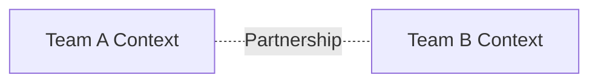
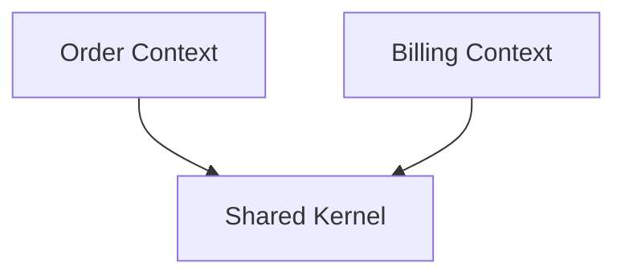
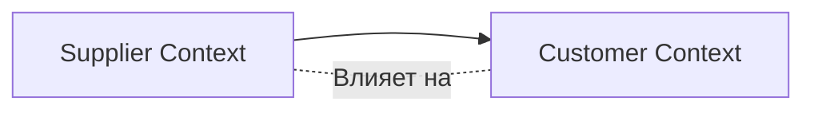
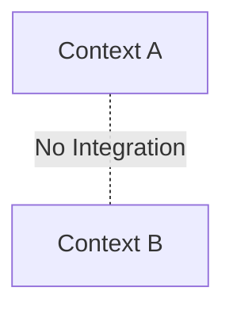
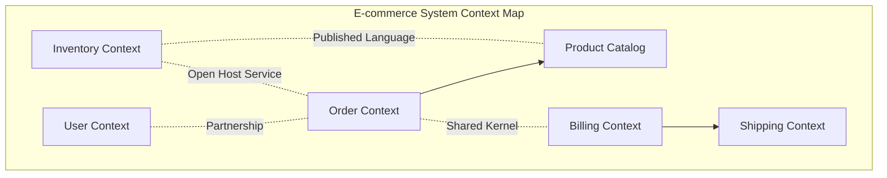
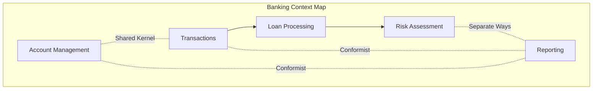

## 🏷️ Tags

#type/area #area/architecture #concept/microservice #concept/clean-architecture #concept/ddd 

---

> [!abstract] Ключевая концепция **Context Mapping** в Domain-Driven Design — это стратегический инструмент для определения отношений и интеграционных паттернов между различными Bounded Context'ами в системе.

---

## 📋 Содержание

- [[#🎯 Основные понятия|Основные понятия]]
- [[#🔗 Типы связей между контекстами|Типы связей]]
- [[#📊 Диаграмма Context Map|Диаграмма Context Map]]
- [[#💡 Практические примеры|Практические примеры]]
- [[#⚡ Best Practices|Best Practices]]

---

## 🎯 Основные понятия

### Bounded Context

> [!info] Определение **Bounded Context** — это явно определенные границы, в которых конкретная доменная модель применима и имеет смысл.

### Context Map

> [!tip] Context Map Визуальное представление всех Bounded Context'ов в системе и отношений между ними. Помогает команде понимать архитектурные решения и зависимости.

---

## 🔗 Типы связей между контекстами

### 1. 🤝 Partnership (Партнерство)



> [!example] Пример **Контекст заказов** и **Контекст доставки** работают в тесном сотрудничестве. Обе команды координируют изменения и развивают интеграцию совместно.

**Характеристики:**

- Взаимная зависимость команд
- Совместное планирование релизов
- Общие цели и успех

---

### 2. 👥 Shared Kernel (Общее ядро)



> [!warning] Осторожно! Shared Kernel требует тщательной координации между командами при внесении изменений.

> [!example] Пример Общая модель **Customer** используется в контекстах **Sales** и **Support**. Изменения в этой модели требуют согласования обеих команд.

---

### 3. 👆 Customer/Supplier (Клиент/Поставщик)



#### 🎭 Варианты:

##### Conformist (Конформист)

> [!note] Conformist **Downstream** команда принимает модель **upstream** команды без изменений.

> [!example] Пример **Reporting Context** использует данные от **Sales Context** в том виде, в котором они предоставляются.

##### Anticorruption Layer (Антикоррупционный слой)

```python
# Пример ACL
class OrderAdapter:
    def translate_external_order(self, external_order):
        return InternalOrder(
            id=external_order.order_id,
            customer=self._map_customer(external_order.client),
            items=self._map_items(external_order.products)
        )
```

> [!success] Преимущества ACL
> 
> - Защищает внутреннюю модель от внешних изменений
> - Позволяет эволюционировать независимо
> - Упрощает тестирование

---

### 4. 🚫 Separate Ways (Разные пути)



> [!example] Пример **HR Context** и **Product Catalog Context** не имеют точек пересечения и развиваются независимо.

---

### 5. 🔀 Open Host Service (Открытый хост-сервис)

```json
// API для интеграции с множественными клиентами
{
  "service": "Payment API",
  "version": "v2",
  "endpoints": [
    "POST /payments",
    "GET /payments/{id}",
    "PUT /payments/{id}/cancel"
  ]
}
```

> [!info] Open Host Service Один контекст предоставляет стандартизированный API для множества других контекстов.

---

### 6. 📋 Published Language (Опубликованный язык)

```xml
<!-- Стандартный формат обмена данными -->
<Order xmlns="https://company.com/order/v1">
  <OrderId>12345</OrderId>
  <CustomerId>67890</CustomerId>
  <Items>
    <Item>
      <ProductId>P001</ProductId>
      <Quantity>2</Quantity>
    </Item>
  </Items>
</Order>
```

---

## 📊 Диаграмма Context Map



---

## 💡 Практические примеры

### Пример 1: Интернет-магазин

|Context|Роль|Интеграционный паттерн|
|---|---|---|
|**User Management**|Upstream|Open Host Service|
|**Product Catalog**|Upstream|Published Language|
|**Order Processing**|Hub|Partnership с Billing|
|**Inventory**|Supplier|Customer/Supplier|
|**Reporting**|Downstream|Conformist|

### Пример 2: Банковская система



---

## ⚡ Best Practices

### ✅ Do's

> [!success] Рекомендации
> 
> - **Документируйте** все интеграционные паттерны
> - **Регулярно пересматривайте** Context Map при изменениях в бизнесе
> - **Минимизируйте** Shared Kernel — используйте только когда необходимо
> - **Используйте ACL** для защиты от нестабильных upstream сервисов

### ❌ Don'ts

> [!danger] Избегайте
> 
> - Слишком много **Partnership** отношений
> - **Shared Kernel** без четкой ответственности команд
> - Игнорирование **временных ограничений** при интеграции
> - Отсутствие **версионирования** в Published Language

---

### 🛠️ Инструменты для Context Mapping

|Инструмент|Назначение|
|---|---|
|**Domain Storytelling**|Выявление границ контекстов|
|**Event Storming**|Понимание доменных событий|
|**Context Canvas**|Документирование контекста|
|**Wardley Maps**|Стратегическое планирование|

---

## 🔍 Заключение

> [!quote] Ключевая мысль "Context Mapping — это не только техническое решение, но и организационный инструмент, который помогает командам лучше понимать свои границы ответственности и способы взаимодействия."

**Context Mapping позволяет:**

- 🎯 Четко определить границы ответственности
- 🔄 Выбрать правильные паттерны интеграции
- 📈 Планировать эволюцию системы
- 🤝 Улучшить коммуникацию между командами
