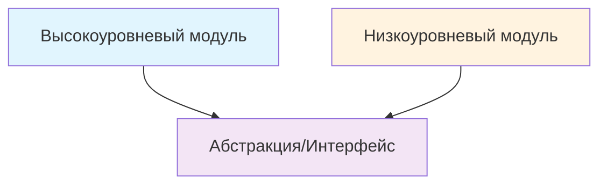

## 🏷️ Tags

#type/area #area/architecture #concept/microservice #concept/clean-architecture #concept/ddd 

---

> [!info] Определение **Dependency Inversion Principle (DIP)** — последний из SOLID принципов, который гласит:
> 
> - Модули высокого уровня не должны зависеть от модулей низкого уровня. Оба должны зависеть от абстракций
> - Абстракции не должны зависеть от деталей. Детали должны зависеть от абстракций

---

## 🎯 Ключевые концепции

### Инверсия управления (IoC)



### Традиционная зависимость vs DIP

|❌ Без DIP|✅ С DIP|
|---|---|
|`OrderService → EmailService`|`OrderService → INotificationService ← EmailService`|
|Прямая зависимость|Зависимость через абстракцию|

---

## 📝 Примеры на .NET

### ❌ Нарушение DIP

```csharp
// Низкоуровневый модуль
public class EmailService
{
    public void SendEmail(string to, string subject, string body)
    {
        // Логика отправки email
        Console.WriteLine($"Email sent to {to}");
    }
}

// Высокоуровневый модуль зависит от конкретной реализации
public class OrderService
{
    private readonly EmailService _emailService;
    
    public OrderService()
    {
        _emailService = new EmailService(); // Жёсткая зависимость!
    }
    
    public void ProcessOrder(Order order)
    {
        // Обработка заказа...
        _emailService.SendEmail(order.CustomerEmail, "Order Confirmed", "...");
    }
}
```

> [!warning] Проблемы
> 
> - Сложно тестировать
> - Невозможно заменить способ уведомления
> - Нарушение принципа единственной ответственности
> - Тесная связанность модулей

### ✅ Соблюдение DIP

```csharp
// Абстракция
public interface INotificationService
{
    Task SendNotificationAsync(string recipient, string subject, string message);
}

// Низкоуровневые модули реализуют абстракцию
public class EmailNotificationService : INotificationService
{
    public async Task SendNotificationAsync(string recipient, string subject, string message)
    {
        // Логика отправки email
        await Task.Delay(100); // Имитация отправки
        Console.WriteLine($"Email sent to {recipient}: {subject}");
    }
}

public class SmsNotificationService : INotificationService
{
    public async Task SendNotificationAsync(string recipient, string subject, string message)
    {
        // Логика отправки SMS
        await Task.Delay(50);
        Console.WriteLine($"SMS sent to {recipient}: {message}");
    }
}

// Высокоуровневый модуль зависит от абстракции
public class OrderService
{
    private readonly INotificationService _notificationService;
    
    public OrderService(INotificationService notificationService)
    {
        _notificationService = notificationService;
    }
    
    public async Task ProcessOrderAsync(Order order)
    {
        // Обработка заказа...
        
        await _notificationService.SendNotificationAsync(
            order.CustomerEmail, 
            "Order Confirmed", 
            $"Your order #{order.Id} has been confirmed"
        );
    }
}
```

---

## 🏗️ Реализация в DDD

### Domain Layer

```csharp
namespace Domain.Services
{
    // Доменный сервис определяет контракт
    public interface IOrderNotificationService
    {
        Task NotifyOrderCreatedAsync(Order order);
        Task NotifyOrderShippedAsync(Order order, TrackingInfo tracking);
    }
}

namespace Domain.Entities
{
    public class Order
    {
        public OrderId Id { get; private set; }
        public CustomerId CustomerId { get; private set; }
        public OrderStatus Status { get; private set; }
        
        // Доменная логика без зависимости от инфраструктуры
        public void MarkAsShipped(TrackingInfo tracking)
        {
            if (Status != OrderStatus.Confirmed)
                throw new InvalidOperationException("Only confirmed orders can be shipped");
                
            Status = OrderStatus.Shipped;
            // Доменное событие вместо прямого вызова уведомления
            AddDomainEvent(new OrderShippedEvent(Id, tracking));
        }
    }
}
```

### Application Layer

```csharp
namespace Application.Services
{
    public class OrderApplicationService
    {
        private readonly IOrderRepository _orderRepository;
        private readonly IOrderNotificationService _notificationService;
        
        public OrderApplicationService(
            IOrderRepository orderRepository,
            IOrderNotificationService notificationService)
        {
            _orderRepository = orderRepository;
            _notificationService = notificationService;
        }
        
        public async Task CreateOrderAsync(CreateOrderCommand command)
        {
            var order = new Order(command.CustomerId, command.Items);
            
            await _orderRepository.SaveAsync(order);
            await _notificationService.NotifyOrderCreatedAsync(order);
        }
    }
}
```

### Infrastructure Layer

```csharp
namespace Infrastructure.Services
{
    // Конкретная реализация в слое инфраструктуры
    public class EmailOrderNotificationService : IOrderNotificationService
    {
        private readonly IEmailService _emailService;
        private readonly ICustomerRepository _customerRepository;
        
        public EmailOrderNotificationService(
            IEmailService emailService, 
            ICustomerRepository customerRepository)
        {
            _emailService = emailService;
            _customerRepository = customerRepository;
        }
        
        public async Task NotifyOrderCreatedAsync(Order order)
        {
            var customer = await _customerRepository.GetByIdAsync(order.CustomerId);
            
            await _emailService.SendAsync(new EmailMessage
            {
                To = customer.Email,
                Subject = "Order Created",
                Body = $"Your order #{order.Id} has been created successfully"
            });
        }
        
        public async Task NotifyOrderShippedAsync(Order order, TrackingInfo tracking)
        {
            var customer = await _customerRepository.GetByIdAsync(order.CustomerId);
            
            await _emailService.SendAsync(new EmailMessage
            {
                To = customer.Email,
                Subject = "Order Shipped",
                Body = $"Your order #{order.Id} has been shipped. Tracking: {tracking.Number}"
            });
        }
    }
}
```

---

## 🔧 Dependency Injection в .NET

### Program.cs (Minimal API)

```csharp
var builder = WebApplication.CreateBuilder(args);

// Регистрация зависимостей
builder.Services.AddScoped<IOrderRepository, SqlOrderRepository>();
builder.Services.AddScoped<ICustomerRepository, SqlCustomerRepository>();
builder.Services.AddScoped<IEmailService, SmtpEmailService>();
builder.Services.AddScoped<IOrderNotificationService, EmailOrderNotificationService>();
builder.Services.AddScoped<OrderApplicationService>();

var app = builder.Build();
```

### Использование с различными реализациями

```csharp
// Для разных окружений можно использовать разные реализации
if (builder.Environment.IsDevelopment())
{
    builder.Services.AddScoped<IOrderNotificationService, ConsoleOrderNotificationService>();
}
else
{
    builder.Services.AddScoped<IOrderNotificationService, EmailOrderNotificationService>();
}

// Или даже композитную реализацию
builder.Services.AddScoped<IOrderNotificationService, CompositeOrderNotificationService>();

public class CompositeOrderNotificationService : IOrderNotificationService
{
    private readonly IEnumerable<IOrderNotificationService> _services;
    
    public CompositeOrderNotificationService(IEnumerable<IOrderNotificationService> services)
    {
        _services = services;
    }
    
    public async Task NotifyOrderCreatedAsync(Order order)
    {
        await Task.WhenAll(_services.Select(s => s.NotifyOrderCreatedAsync(order)));
    }
}
```

---

## 🧪 Unit Testing

> [!tip] Преимущества для тестирования DIP делает код легко тестируемым через использование моков и стабов

```csharp
[Test]
public async Task ProcessOrder_ShouldSendNotification()
{
    // Arrange
    var mockNotificationService = new Mock<INotificationService>();
    var orderService = new OrderService(mockNotificationService.Object);
    var order = new Order { Id = 1, CustomerEmail = "test@example.com" };
    
    // Act
    await orderService.ProcessOrderAsync(order);
    
    // Assert
    mockNotificationService.Verify(
        x => x.SendNotificationAsync(
            "test@example.com", 
            "Order Confirmed", 
            It.IsAny<string>()), 
        Times.Once);
}

[Test]
public async Task ProcessOrder_WithDifferentNotificationService_ShouldWork()
{
    // Можем легко заменить реализацию для тестирования
    var stubNotificationService = new StubNotificationService();
    var orderService = new OrderService(stubNotificationService);
    var order = new Order { Id = 1, CustomerEmail = "test@example.com" };
    
    await orderService.ProcessOrderAsync(order);
    
    Assert.That(stubNotificationService.NotificationsSent, Is.EqualTo(1));
}

public class StubNotificationService : INotificationService
{
    public int NotificationsSent { get; private set; }
    
    public Task SendNotificationAsync(string recipient, string subject, string message)
    {
        NotificationsSent++;
        return Task.CompletedTask;
    }
}
```

---

## 📊 Сравнительная таблица

|Аспект|Без DIP|С DIP|
|---|---|---|
|**Тестируемость**|Сложно|Легко|
|**Расширяемость**|Сложно|Легко|
|**Связанность**|Высокая|Низкая|
|**Гибкость**|Низкая|Высокая|
|**Нарушение SRP**|Часто|Редко|

---

## ✅ Лучшие практики

> [!success] DO
> 
> - Определяйте интерфейсы в том же слое, где они используются
> - Используйте Constructor Injection как основной способ внедрения зависимостей
> - Создавайте небольшие, сфокусированные интерфейсы (Interface Segregation)
> - Регистрируйте зависимости в Composition Root (Program.cs, Startup.cs)

> [!failure] DON'T
> 
> - Не создавайте интерфейсы "на всякий случай" — только когда есть реальная необходимость в абстракции
> - Не используйте Service Locator вместо Dependency Injection
> - Не делайте циклические зависимости между слоями
> - Не смешивайте бизнес-логику с логикой инфраструктуры

---

## 🔗 Связанные концепции

- [[SOLID Principles]]
- [[Dependency Injection]]
- [[Domain-Driven Design]]
- [[Clean Architecture]]
- [[Inversion of Control]]

---

_Dependency Inversion Principle — это основа для создания гибких, тестируемых и поддерживаемых приложений в DDD архитектуре._