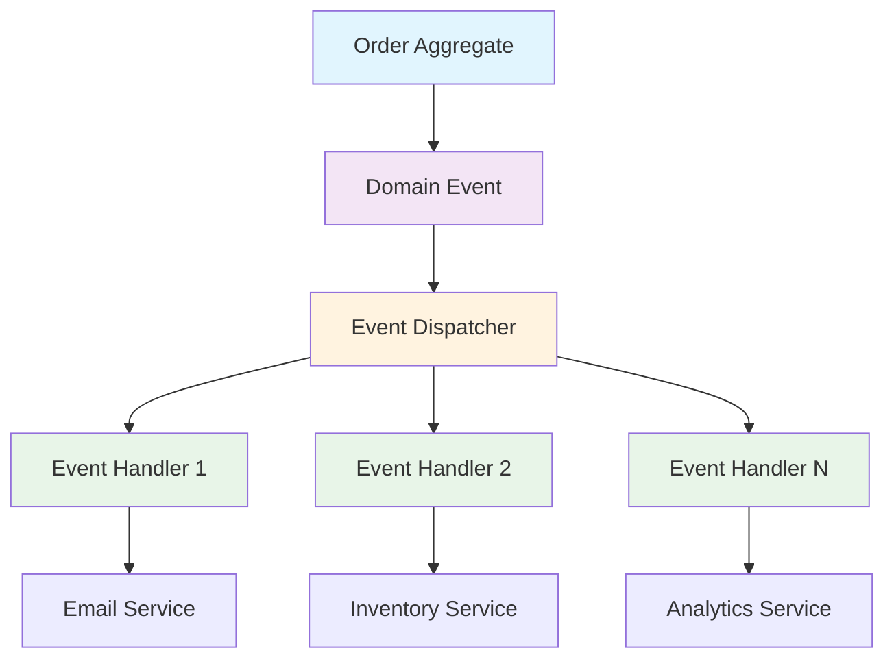

## 🏷️ Tags

#type/area #area/architecture #concept/microservice #concept/clean-architecture #concept/ddd 

---

## 🎯 Что такое Domain Events?

**Domain Events** - это события, которые происходят в доменной модели и имеют значение для бизнеса. Они представляют собой факты о том, что что-то важное произошло в домене.

> [!tip] 💡 Ключевая идея Domain Events позволяют доменным объектам сообщать о важных изменениях, не нарушая принципы инкапсуляции и разделения ответственности.

---

## 🏗️ Базовая структура

### 1. Интерфейс Domain Event

```csharp
public interface IDomainEvent
{
    DateTime OccurredAt { get; }
    Guid EventId { get; }
}
```

### 2. Базовая реализация

```csharp
public abstract class DomainEvent : IDomainEvent
{
    public DateTime OccurredAt { get; } = DateTime.UtcNow;
    public Guid EventId { get; } = Guid.NewGuid();
}
```

---

## 🎭 Паттерны реализации

### Pattern #1: События в Aggregate Root

```csharp
public abstract class AggregateRoot
{
    private readonly List<IDomainEvent> _domainEvents = new();
    
    public IReadOnlyCollection<IDomainEvent> DomainEvents => _domainEvents.AsReadOnly();
    
    protected void AddDomainEvent(IDomainEvent domainEvent)
    {
        _domainEvents.Add(domainEvent);
    }
    
    public void ClearDomainEvents()
    {
        _domainEvents.Clear();
    }
}
```

### Pattern #2: Статический диспетчер

```csharp
public static class DomainEvents
{
    private static List<Type> _handlers = new();
    
    public static void Register<T>(Action<T> callback) where T : IDomainEvent
    {
        _handlers.Add(typeof(T));
    }
    
    public static void Raise<T>(T domainEvent) where T : IDomainEvent
    {
        // Логика обработки события
    }
}
```

---

## 🚀 Практический пример: E-Commerce

### 📦 Доменные события

```csharp
public class OrderCreatedEvent : DomainEvent
{
    public Guid OrderId { get; }
    public decimal TotalAmount { get; }
    public string CustomerEmail { get; }
    
    public OrderCreatedEvent(Guid orderId, decimal totalAmount, string customerEmail)
    {
        OrderId = orderId;
        TotalAmount = totalAmount;
        CustomerEmail = customerEmail;
    }
}

public class PaymentProcessedEvent : DomainEvent
{
    public Guid OrderId { get; }
    public decimal Amount { get; }
    public string PaymentMethod { get; }
    
    public PaymentProcessedEvent(Guid orderId, decimal amount, string paymentMethod)
    {
        OrderId = orderId;
        Amount = amount;
        PaymentMethod = paymentMethod;
    }
}
```

### 🛍️ Aggregate: Order

```csharp
public class Order : AggregateRoot
{
    public Guid Id { get; private set; }
    public string CustomerEmail { get; private set; }
    public decimal TotalAmount { get; private set; }
    public OrderStatus Status { get; private set; }
    
    public static Order Create(string customerEmail, List<OrderItem> items)
    {
        var order = new Order
        {
            Id = Guid.NewGuid(),
            CustomerEmail = customerEmail,
            TotalAmount = items.Sum(x => x.Price * x.Quantity),
            Status = OrderStatus.Created
        };
        
        // 🎉 Генерируем событие
        order.AddDomainEvent(new OrderCreatedEvent(
            order.Id, 
            order.TotalAmount, 
            order.CustomerEmail
        ));
        
        return order;
    }
    
    public void ProcessPayment(decimal amount, string paymentMethod)
    {
        if (amount != TotalAmount)
            throw new InvalidOperationException("Payment amount mismatch");
            
        Status = OrderStatus.Paid;
        
        // 🎉 Генерируем событие
        AddDomainEvent(new PaymentProcessedEvent(Id, amount, paymentMethod));
    }
}
```

---

## 🎯 Обработчики событий (Event Handlers)

### Interface для обработчика

```csharp
public interface IDomainEventHandler<in T> where T : IDomainEvent
{
    Task HandleAsync(T domainEvent, CancellationToken cancellationToken = default);
}
```

### Конкретные обработчики

```csharp
// 📧 Отправка email при создании заказа
public class SendOrderConfirmationEmailHandler : IDomainEventHandler<OrderCreatedEvent>
{
    private readonly IEmailService _emailService;
    
    public SendOrderConfirmationEmailHandler(IEmailService emailService)
    {
        _emailService = emailService;
    }
    
    public async Task HandleAsync(OrderCreatedEvent domainEvent, CancellationToken cancellationToken = default)
    {
        await _emailService.SendOrderConfirmationAsync(
            domainEvent.CustomerEmail,
            domainEvent.OrderId,
            domainEvent.TotalAmount
        );
    }
}

// 📦 Обновление склада при оплате
public class UpdateInventoryHandler : IDomainEventHandler<PaymentProcessedEvent>
{
    private readonly IInventoryService _inventoryService;
    
    public UpdateInventoryHandler(IInventoryService inventoryService)
    {
        _inventoryService = inventoryService;
    }
    
    public async Task HandleAsync(PaymentProcessedEvent domainEvent, CancellationToken cancellationToken = default)
    {
        await _inventoryService.ReserveItemsForOrderAsync(domainEvent.OrderId);
    }
}
```

---

## ⚙️ Инфраструктура: Диспетчер событий

### MediatR подход

```csharp
public class DomainEventDispatcher
{
    private readonly IMediator _mediator;
    
    public DomainEventDispatcher(IMediator mediator)
    {
        _mediator = mediator;
    }
    
    public async Task DispatchEventsAsync(AggregateRoot aggregate)
    {
        var events = aggregate.DomainEvents.ToList();
        aggregate.ClearDomainEvents();
        
        foreach (var domainEvent in events)
        {
            await _mediator.Publish(domainEvent);
        }
    }
}
```

### Регистрация в DI контейнере

```csharp
// Program.cs или Startup.cs
services.AddMediatR(cfg => cfg.RegisterServicesFromAssembly(typeof(Program).Assembly));
services.AddScoped<DomainEventDispatcher>();

// Регистрация обработчиков
services.AddScoped<IDomainEventHandler<OrderCreatedEvent>, SendOrderConfirmationEmailHandler>();
services.AddScoped<IDomainEventHandler<PaymentProcessedEvent>, UpdateInventoryHandler>();
```

---

## 🔄 Интеграция с Repository Pattern

```csharp
public class OrderRepository : IOrderRepository
{
    private readonly DbContext _context;
    private readonly DomainEventDispatcher _eventDispatcher;
    
    public OrderRepository(DbContext context, DomainEventDispatcher eventDispatcher)
    {
        _context = context;
        _eventDispatcher = eventDispatcher;
    }
    
    public async Task<Order> SaveAsync(Order order)
    {
        _context.Orders.Add(order);
        await _context.SaveChangesAsync();
        
        // 🚀 Отправляем события после сохранения
        await _eventDispatcher.DispatchEventsAsync(order);
        
        return order;
    }
}
```

---

## 📈 Продвинутые техники

### 🎭 Conditional Events

```csharp
public class Order : AggregateRoot
{
    public void MarkAsShipped()
    {
        if (Status != OrderStatus.Paid)
            throw new InvalidOperationException("Can only ship paid orders");
            
        Status = OrderStatus.Shipped;
        
        // Условное создание события
        if (TotalAmount > 1000)
        {
            AddDomainEvent(new HighValueOrderShippedEvent(Id, TotalAmount));
        }
        
        AddDomainEvent(new OrderShippedEvent(Id));
    }
}
```

### 🔄 Event Sourcing интеграция

```csharp
public class EventStore
{
    public async Task AppendEventsAsync<T>(Guid aggregateId, IEnumerable<IDomainEvent> events) 
        where T : AggregateRoot
    {
        foreach (var @event in events)
        {
            var eventData = new EventData
            {
                AggregateId = aggregateId,
                EventType = @event.GetType().Name,
                Data = JsonSerializer.Serialize(@event),
                OccurredAt = @event.OccurredAt
            };
            
            // Сохранение в Event Store
            await SaveEventAsync(eventData);
        }
    }
}
```

---

## ⚠️ Best Practices и подводные камни

> [!warning] 🚨 Важные моменты
> 
> **DO:**
> 
> - ✅ Делайте события иммутабельными
> - ✅ Используйте прошедшее время в названиях событий
> - ✅ Включайте всю необходимую информацию в событие
> - ✅ Обрабатывайте события асинхронно когда возможно
> 
> **DON'T:**
> 
> - ❌ Не делайте события слишком детализированными
> - ❌ Не создавайте зависимости между обработчиками
> - ❌ Не обрабатывайте события в том же транзакционном контексте

### 🎯 Тестирование событий

```csharp
[Test]
public void Order_Create_Should_Raise_OrderCreatedEvent()
{
    // Arrange
    var customerEmail = "test@example.com";
    var items = new List<OrderItem> { new OrderItem("Product", 100, 2) };
    
    // Act
    var order = Order.Create(customerEmail, items);
    
    // Assert
    Assert.That(order.DomainEvents, Has.Count.EqualTo(1));
    Assert.That(order.DomainEvents.First(), Is.TypeOf<OrderCreatedEvent>());
    
    var orderEvent = (OrderCreatedEvent)order.DomainEvents.First();
    Assert.That(orderEvent.CustomerEmail, Is.EqualTo(customerEmail));
    Assert.That(orderEvent.TotalAmount, Is.EqualTo(200));
}
```

---

## 🎨 Диаграмма архитектуры



---

## 🔗 Связанные темы

- [[DDD Aggregates]]
- [[CQRS Pattern]]
- [[Event Sourcing]]
- [[Repository Pattern]]
- [[MediatR Pattern|MediatR Pattern]]

## 📚 Дополнительное чтение

> [!quote] 📖 Рекомендуемые источники
> 
> - "Domain-Driven Design" by Eric Evans
> - "Implementing Domain-Driven Design" by Vaughn Vernon
> - Microsoft .NET Application Architecture Guides

---

