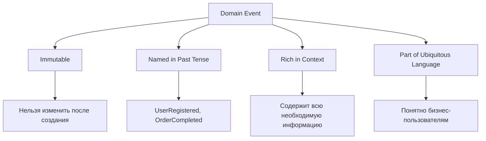
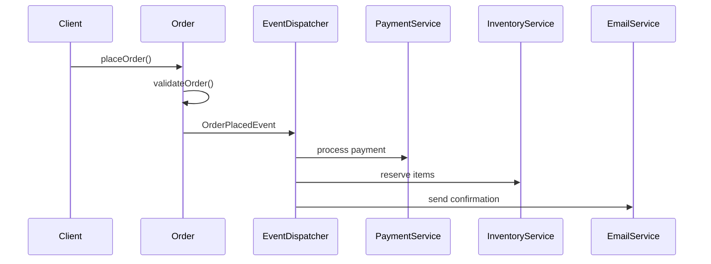
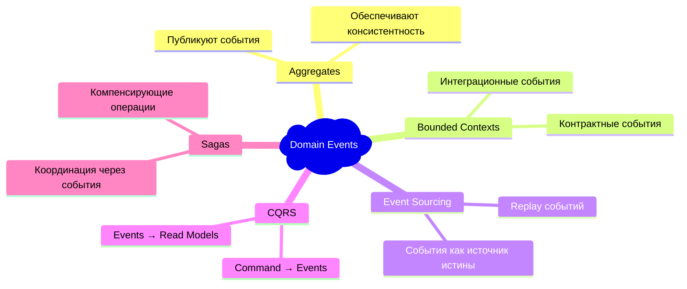

## 🏷️ Tags

#type/area #area/architecture #concept/microservice #concept/clean-architecture #concept/ddd 

---

> [!info] Определение **Domain Events** — это события, которые происходят в предметной области и представляют собой значимые изменения состояния доменных объектов. Они являются частью Ubiquitous Language и отражают бизнес-процессы.

---

## 🎯 Основные характеристики



---

## 🔧 Структура Domain Event

### Базовый интерфейс

```typescript
interface DomainEvent {
  readonly eventId: string;
  readonly occurredOn: Date;
  readonly eventVersion: number;
}
```

### Пример конкретного события

```csharp
public class UserRegisteredEvent : IDomainEvent
{
    public Guid EventId { get; }
    public DateTime OccurredOn { get; }
    public int EventVersion { get; }
    
    // Доменные данные
    public Guid UserId { get; }
    public string Email { get; }
    public string FullName { get; }
    public DateTime RegistrationDate { get; }
    
    public UserRegisteredEvent(Guid userId, string email, string fullName)
    {
        EventId = Guid.NewGuid();
        OccurredOn = DateTime.UtcNow;
        EventVersion = 1;
        
        UserId = userId;
        Email = email;
        FullName = fullName;
        RegistrationDate = DateTime.UtcNow;
    }
}
```

---

## 📋 Паттерны использования

### 1. Публикация событий из Aggregate

> [!tip] Aggregate Root как Publisher Aggregate Root накапливает события и публикует их после успешного сохранения

```csharp
public class User : AggregateRoot
{
    private readonly List<IDomainEvent> _domainEvents = new();
    
    public void Register(string email, string fullName)
    {
        // Бизнес-логика регистрации
        ValidateEmail(email);
        
        // Изменение состояния
        this.Email = email;
        this.FullName = fullName;
        this.Status = UserStatus.Active;
        
        // Добавление события
        AddDomainEvent(new UserRegisteredEvent(Id, email, fullName));
    }
    
    private void AddDomainEvent(IDomainEvent domainEvent)
    {
        _domainEvents.Add(domainEvent);
    }
    
    public IReadOnlyList<IDomainEvent> GetDomainEvents() => _domainEvents.AsReadOnly();
    
    public void ClearDomainEvents() => _domainEvents.Clear();
}
```

### 2. Event Handlers

```csharp
public class UserRegisteredEventHandler : IDomainEventHandler<UserRegisteredEvent>
{
    private readonly IEmailService _emailService;
    private readonly ILogger<UserRegisteredEventHandler> _logger;
    
    public async Task Handle(UserRegisteredEvent domainEvent)
    {
        // Отправка welcome email
        await _emailService.SendWelcomeEmail(
            domainEvent.Email, 
            domainEvent.FullName
        );
        
        // Логирование
        _logger.LogInformation(
            "Welcome email sent to user {UserId}", 
            domainEvent.UserId
        );
    }
}
```

---

## 🏗️ Архитектурные паттерны

### Event Dispatcher

```typescript
interface IEventDispatcher {
  dispatch(event: DomainEvent): Promise<void>;
  subscribe<T extends DomainEvent>(
    eventType: new (...args: any[]) => T,
    handler: (event: T) => Promise<void>
  ): void;
}

class EventDispatcher implements IEventDispatcher {
  private handlers = new Map<string, Array<(event: any) => Promise<void>>>();
  
  subscribe<T extends DomainEvent>(
    eventType: new (...args: any[]) => T,
    handler: (event: T) => Promise<void>
  ): void {
    const eventName = eventType.name;
    if (!this.handlers.has(eventName)) {
      this.handlers.set(eventName, []);
    }
    this.handlers.get(eventName)!.push(handler);
  }
  
  async dispatch(event: DomainEvent): Promise<void> {
    const eventName = event.constructor.name;
    const eventHandlers = this.handlers.get(eventName) || [];
    
    await Promise.all(
      eventHandlers.map(handler => handler(event))
    );
  }
}
```

---

## 🔄 Интеграция с Repository

> [!example] Пример сохранения с публикацией событий

```csharp
public class UserRepository : IUserRepository
{
    private readonly DbContext _context;
    private readonly IEventDispatcher _eventDispatcher;
    
    public async Task SaveAsync(User user)
    {
        // Получаем события до сохранения
        var events = user.GetDomainEvents();
        
        try
        {
            // Сохраняем изменения
            _context.Users.Update(user);
            await _context.SaveChangesAsync();
            
            // Очищаем события
            user.ClearDomainEvents();
            
            // Публикуем события после успешного сохранения
            foreach (var domainEvent in events)
            {
                await _eventDispatcher.DispatchAsync(domainEvent);
            }
        }
        catch
        {
            // В случае ошибки события не публикуются
            throw;
        }
    }
}
```

---

## 📊 Практические примеры

### E-commerce система



### События заказа

```csharp
// События жизненного цикла заказа
public class OrderPlacedEvent : IDomainEvent
{
    public Guid OrderId { get; }
    public Guid CustomerId { get; }
    public decimal TotalAmount { get; }
    public List<OrderItem> Items { get; }
    public DateTime PlacedAt { get; }
}

public class OrderPaidEvent : IDomainEvent
{
    public Guid OrderId { get; }
    public decimal Amount { get; }
    public string PaymentMethod { get; }
    public DateTime PaidAt { get; }
}

public class OrderShippedEvent : IDomainEvent
{
    public Guid OrderId { get; }
    public string TrackingNumber { get; }
    public Address ShippingAddress { get; }
    public DateTime ShippedAt { get; }
}

public class OrderCancelledEvent : IDomainEvent
{
    public Guid OrderId { get; }
    public string CancellationReason { get; }
    public DateTime CancelledAt { get; }
}
```

---

## ⚖️ Преимущества и недостатки

### ✅ Преимущества

|Аспект|Описание|
|---|---|
|**Слабая связанность**|Компоненты не знают друг о друге напрямую|
|**Расширяемость**|Легко добавлять новые обработчики|
|**Аудит**|Полная история изменений|
|**Интеграция**|Простая интеграция между bounded contexts|

### ❌ Возможные проблемы

> [!warning] Осторожно!
> 
> - Увеличение сложности системы
> - Проблемы с отладкой асинхронных процессов
> - Eventual consistency
> - Необходимость обработки ошибок в handlers

---

## 🎯 Best Practices

### 1. Именование событий

```typescript
// ✅ Хорошо - прошедшее время, бизнес-язык
class CustomerRegistered extends DomainEvent {}
class OrderCompleted extends DomainEvent {}
class PaymentProcessed extends DomainEvent {}

// ❌ Плохо - техническая терминология
class CustomerCreateEvent extends DomainEvent {}
class UserUpdatedEvent extends DomainEvent {}
```

### 2. Содержимое событий

> [!tip] Правило богатых событий Включайте в событие всю информацию, которая может понадобиться обработчикам

```csharp
// ✅ Богатое событие
public class ProductPriceChangedEvent : IDomainEvent
{
    public Guid ProductId { get; }
    public decimal OldPrice { get; }
    public decimal NewPrice { get; }
    public string ChangedBy { get; }
    public string Reason { get; }
    public DateTime EffectiveDate { get; }
}

// ❌ Бедное событие
public class ProductPriceChangedEvent : IDomainEvent
{
    public Guid ProductId { get; }
    public decimal NewPrice { get; }
}
```

### 3. Идемпотентность обработчиков

```csharp
public class OrderConfirmationHandler : IDomainEventHandler<OrderPaidEvent>
{
    public async Task Handle(OrderPaidEvent domainEvent)
    {
        // Проверяем, не обрабатывали ли уже это событие
        var alreadyProcessed = await _processedEvents
            .AnyAsync(pe => pe.EventId == domainEvent.EventId);
            
        if (alreadyProcessed) return;
        
        // Обрабатываем событие
        await _emailService.SendOrderConfirmation(domainEvent.OrderId);
        
        // Помечаем как обработанное
        await _processedEvents.AddAsync(
            new ProcessedEvent(domainEvent.EventId)
        );
    }
}
```

---

## 🔍 Связь с другими паттернами DDD



---

> [!quote] Помни Domain Events — это не просто техническое решение, а способ моделирования бизнес-процессов. Они должны отражать важные моменты в жизненном цикле предметной области и быть понятными бизнесу.