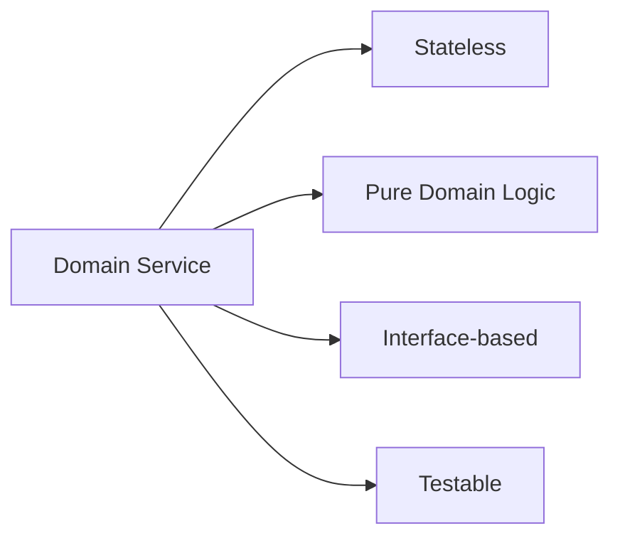
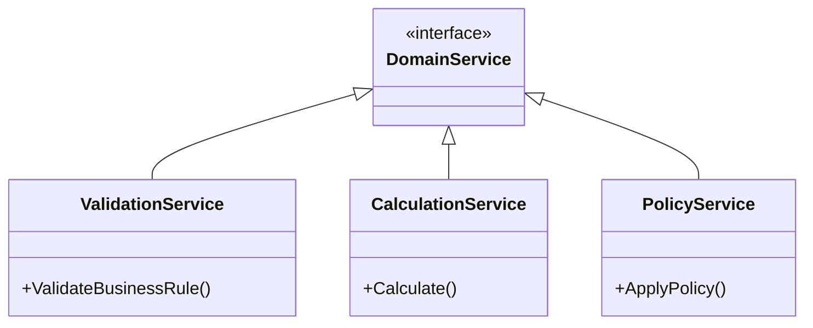
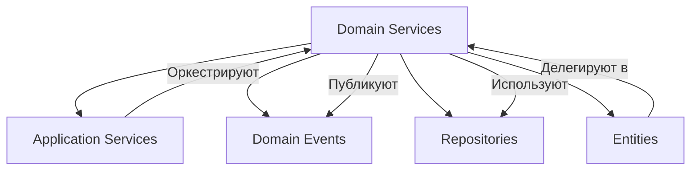

## 🏷️ Tags

#type/area #area/architecture #concept/microservice #concept/clean-architecture #concept/ddd 

---

> [!abstract] Краткое описание **Domain Services** — это сервисы, которые инкапсулируют доменную логику, не принадлежащую конкретной сущности или объекту-значению. Они представляют операции или процессы предметной области.

---

## 📋 Содержание

- [[#Что такое Domain Services]]
- [[#Когда использовать Domain Services]]
- [[#Типы Domain Services]]
- [[#Примеры на .NET]]
- [[#Антипаттерны]]
- [[#Связанные понятия]]

---

## 🎯 Что такое Domain Services

Domain Services решают задачи, которые:

- **Не принадлежат** одной конкретной сущности
- **Требуют знаний** о нескольких объектах домена
- **Представляют бизнес-процессы** предметной области

> [!tip] Ключевая идея Domain Service — это когда бизнес-логика не "помещается" в Entity или Value Object

### Характеристики Domain Services



---

## 🤔 Когда использовать Domain Services

> [!question] Задайте себе вопросы:
> 
> - Логика затрагивает несколько сущностей?
> - Операция не естественна для одной Entity?
> - Есть внешние зависимости (но доменные)?

### ✅ Используйте когда:

- Валидация между несколькими агрегатами
- Сложные вычисления с участием нескольких объектов
- Доменные правила, не принадлежащие одной сущности

### ❌ НЕ используйте когда:

- Можно поместить логику в Entity/Value Object
- Нужен доступ к базе данных (это Application Service)
- Логика не относится к предметной области

---

## 🏗️ Типы Domain Services



---

## 💻 Примеры на .NET

### Пример 1: Валидация уникальности

> [!example] Проверка уникальности email пользователя

**Интерфейс:**

```csharp
public interface IUserUniquenessService
{
    Task<bool> IsEmailUniqueAsync(Email email, UserId? excludeUserId = null);
}
```

**Реализация:**

```csharp
public class UserUniquenessService : IUserUniquenessService
{
    private readonly IUserRepository _userRepository;
    
    public UserUniquenessService(IUserRepository userRepository)
    {
        _userRepository = userRepository;
    }
    
    public async Task<bool> IsEmailUniqueAsync(Email email, UserId? excludeUserId = null)
    {
        var existingUser = await _userRepository.FindByEmailAsync(email);
        
        if (existingUser == null)
            return true;
            
        return excludeUserId != null && existingUser.Id == excludeUserId;
    }
}
```

**Использование в Entity:**

```csharp
public class User : Entity<UserId>
{
    private Email _email;
    
    public async Task ChangeEmailAsync(
        Email newEmail, 
        IUserUniquenessService uniquenessService)
    {
        if (!await uniquenessService.IsEmailUniqueAsync(newEmail, Id))
        {
            throw new DomainException("Email уже используется");
        }
        
        _email = newEmail;
        AddDomainEvent(new UserEmailChangedEvent(Id, newEmail));
    }
}
```

---

### Пример 2: Сложные вычисления

> [!example] Расчет скидки на основе множества правил

**Интерфейс:**

```csharp
public interface IDiscountCalculationService
{
    decimal CalculateDiscount(Customer customer, Order order, IReadOnlyList<Product> products);
}
```

**Реализация:**

```csharp
public class DiscountCalculationService : IDiscountCalculationService
{
    public decimal CalculateDiscount(
        Customer customer, 
        Order order, 
        IReadOnlyList<Product> products)
    {
        var baseDiscount = 0m;
        
        // Скидка по статусу клиента
        baseDiscount += customer.Status switch
        {
            CustomerStatus.Regular => 0.05m,
            CustomerStatus.Premium => 0.10m,
            CustomerStatus.VIP => 0.15m,
            _ => 0m
        };
        
        // Скидка за объем
        if (order.TotalAmount > 10000m)
            baseDiscount += 0.03m;
            
        // Скидка за количество товаров определенной категории
        var electronicsCount = products.Count(p => p.Category == Category.Electronics);
        if (electronicsCount >= 3)
            baseDiscount += 0.02m;
            
        return Math.Min(baseDiscount, 0.25m); // Максимум 25%
    }
}
```

---

### Пример 3: Доменная политика

> [!example] Политика назначения задач

**Интерфейс:**

```csharp
public interface ITaskAssignmentPolicy
{
    Employee? FindBestAssignee(Task task, IReadOnlyList<Employee> availableEmployees);
    bool CanAssign(Task task, Employee employee);
}
```

**Реализация:**

```csharp
public class TaskAssignmentPolicy : ITaskAssignmentPolicy
{
    public Employee? FindBestAssignee(Task task, IReadOnlyList<Employee> availableEmployees)
    {
        var suitableEmployees = availableEmployees
            .Where(emp => CanAssign(task, emp))
            .ToList();
            
        if (!suitableEmployees.Any())
            return null;
            
        // Выбираем сотрудника с наименьшей загрузкой и подходящими навыками
        return suitableEmployees
            .Where(emp => emp.HasRequiredSkills(task.RequiredSkills))
            .OrderBy(emp => emp.CurrentWorkload)
            .ThenByDescending(emp => emp.ExperienceLevel)
            .First();
    }
    
    public bool CanAssign(Task task, Employee employee)
    {
        return employee.IsAvailable && 
               employee.HasRequiredSkills(task.RequiredSkills) &&
               employee.CurrentWorkload < employee.MaxWorkload;
    }
}
```

---

## ⚠️ Антипаттерны

> [!danger] Анемичные Domain Services
> 
> ```csharp
> // ❌ ПЛОХО: Просто перекладывание данных
> public class UserService
> {
>     public void CreateUser(string name, string email)
>     {
>         var user = new User { Name = name, Email = email };
>         _repository.Save(user);
>     }
> }
> ```

> [!danger] Божественные сервисы
> 
> ```csharp
> // ❌ ПЛОХО: Один сервис для всего
> public class OrderService
> {
>     public void CreateOrder() { }
>     public void CancelOrder() { }
>     public void CalculateShipping() { }
>     public void ProcessPayment() { }
>     public void SendNotification() { }
> }
> ```

---

## 🔄 Связанные понятия



### Связи с другими паттернами:

- **[[Application Services]]** — оркестрируют Domain Services
- **[[Repositories]]** — предоставляют данные для Domain Services
- **[[Domain Events|Domain Events]]** — публикуются из Domain Services
- **[[Entities and Value Objects|Entities and Value Objects]]** — делегируют сложную логику в Domain Services

---

## 📚 Ключевые принципы

> [!note] Принципы проектирования Domain Services
> 
> 1. **Stateless** — без состояния между вызовами
> 2. **Pure Domain Logic** — только доменная логика
> 3. **Interface Segregation** — узкие интерфейсы
> 4. **Dependency Inversion** — зависимость от абстракций
> 5. **Single Responsibility** — одна ответственность

---

## 🎯 Заключение

Domain Services — это **мост между сложными доменными операциями** и простотой Entity/Value Objects. Они помогают сохранить **богатую доменную модель**, избегая анемичных объектов.

**Помните:** Domain Service должен решать **доменную задачу**, а не техническую!

---

