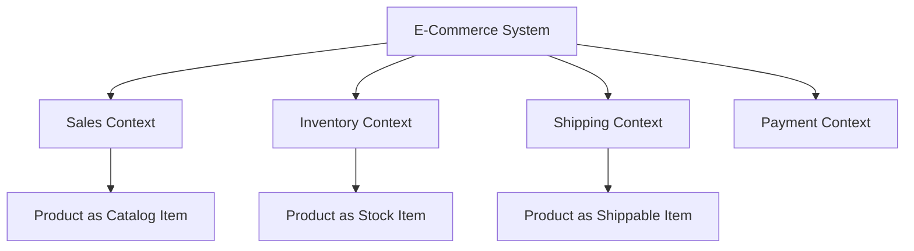
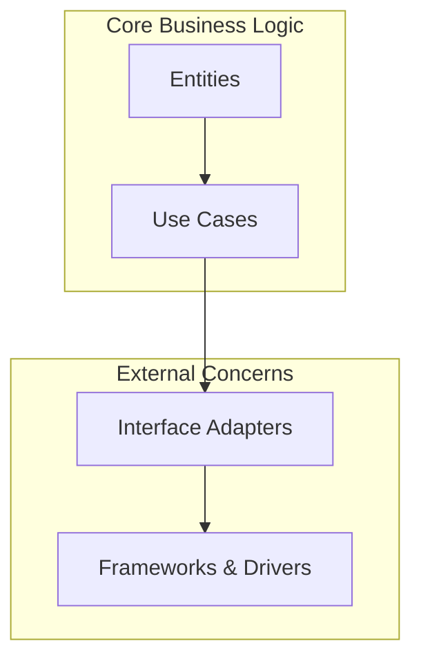
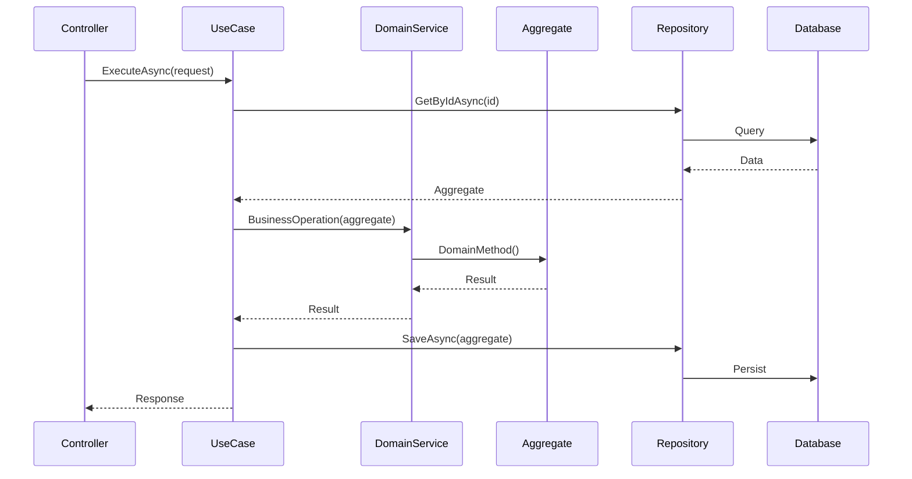
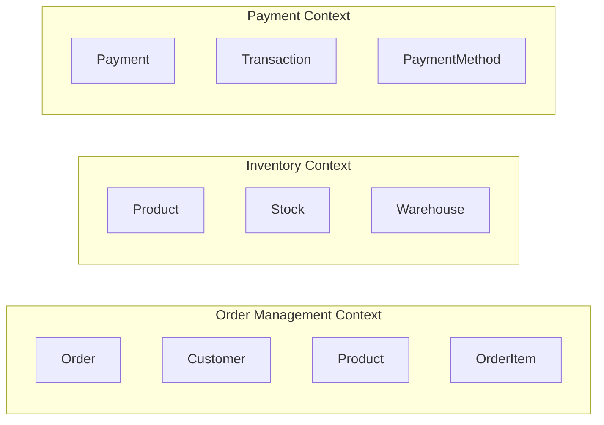

---
tags:
  - DDD
  - CleanArchitecture
  - DotNet
  - SoftwareArchitecture
  - DomainModeling
  - CQRS
  - EventSourcing
  - Microservices
  - SoftwareDesign
  - BestPractices
title: Domain-Driven Design (DDD) и Чистая архитектура в .NET
aliases:
  - Domain-Driven Design (DDD) и Чистая архитектура в .NET
linter-yaml-title-alias: Domain-Driven Design (DDD) и Чистая архитектура в .NET
date created: Friday, August 8th 2025, 5:22:02 am
date modified: Thursday, August 21st 2025, 7:52:48 am
---
# Domain-Driven Design (DDD) и Чистая архитектура в .NET

> [!info] Цель документа Это руководство поможет вам понять принципы DDD, их связь с чистой архитектурой и практическое применение в .NET приложениях

---

## 📚 Содержание

- [[#Что такое Domain-Driven Design|Что такое DDD]]
- [[#Основные концепции DDD|Основные концепции]]
- [[#Чистая архитектура|Чистая архитектура]]
- [[#Связь DDD и Clean Architecture|Связь DDD и Clean Architecture]]
- [[#Практические примеры|Практические примеры]]
- [[#Архитектурные паттерны|Архитектурные паттерны]]
- [[#Заключение|Заключение]]

---

## 🎯 Что такое Domain-Driven Design

**Domain-Driven Design (DDD)** — это подход к разработке программного обеспечения, который фокусируется на моделировании сложной предметной области через тесное сотрудничество технических экспертов и экспертов предметной области.

> [!quote] Эрик Эванс "Сердце программного обеспечения находится в его способности решать проблемы, связанные с предметной областью для его пользователя"

### 🔑 Ключевые принципы DDD

1. **Ubiquitous Language** (Единый язык)
2. **Bounded Context** (Ограниченный контекст)
3. **Domain Model** (Модель предметной области)
4. **Strategic Design** (Стратегическое проектирование)
5. **Tactical Design** (Тактическое проектирование)

---

## 🏗️ Основные концепции DDD

### 1. 🎭 CQRS (Command Query Responsibility Segregation)

Разделение операций чтения и записи на разные модели.

```csharp
// Command Side (Write Model)
public interface ICreateOrderCommand
{
    Task<OrderId> ExecuteAsync(CreateOrderRequest request);
}

public class CreateOrderCommandHandler : ICreateOrderCommand
{
    private readonly IOrderRepository _repository;
    private readonly IUnitOfWork _unitOfWork;
    
    public async Task<OrderId> ExecuteAsync(CreateOrderRequest request)
    {
        var order = new Order(OrderId.New(), new CustomerId(request.CustomerId));
        
        foreach (var item in request.Items)
        {
            order.AddItem(
                new ProductId(item.ProductId), 
                item.Quantity, 
                new Money(item.UnitPrice));
        }
        
        await _repository.SaveAsync(order);
        await _unitOfWork.CommitAsync();
        
        return order.Id;
    }
}

// Query Side (Read Model)
public interface IOrderQueryService
{
    Task<OrderDetailsDto> GetOrderDetailsAsync(Guid orderId);
    Task<List<OrderSummaryDto>> GetOrdersByCustomerAsync(Guid customerId);
}

public class OrderQueryService : IOrderQueryService
{
    private readonly IReadDbContext _readContext;
    
    public OrderQueryService(IReadDbContext readContext)
    {
        _readContext = readContext;
    }
    
    public async Task<OrderDetailsDto> GetOrderDetailsAsync(Guid orderId)
    {
        // Оптимизированный запрос для чтения
        var orderView = await _readContext.OrderViews
            .Include(o => o.Items)
            .ThenInclude(i => i.Product)
            .FirstOrDefaultAsync(o => o.Id == orderId);
            
        return orderView?.ToDto();
    }
    
    public async Task<List<OrderSummaryDto>> GetOrdersByCustomerAsync(Guid customerId)
    {
        // Денормализованные данные для быстрого чтения
        return await _readContext.OrderSummaries
            .Where(o => o.CustomerId == customerId)
            .OrderByDescending(o => o.CreatedAt)
            .Select(o => new OrderSummaryDto
            {
                Id = o.Id,
                OrderNumber = o.OrderNumber,
                TotalAmount = o.TotalAmount,
                Status = o.Status,
                CreatedAt = o.CreatedAt
            })
            .ToListAsync();
    }
}
```

### 2. 📊 Event Sourcing

Сохранение состояния как последовательности событий.

```csharp
// Event Store
public interface IEventStore
{
    Task SaveEventsAsync(Guid aggregateId, IEnumerable<IDomainEvent> events, int expectedVersion);
    Task<List<IDomainEvent>> GetEventsAsync(Guid aggregateId);
}

// Aggregate с поддержкой Event Sourcing
public abstract class EventSourcedAggregateRoot<TId> : AggregateRoot<TId>
{
    private readonly List<IDomainEvent> _uncommittedEvents = new();
    public int Version { get; private set; } = -1;
    
    protected void ApplyChange(IDomainEvent @event)
    {
        ApplyChange(@event, true);
    }
    
    private void ApplyChange(IDomainEvent @event, bool isNew)
    {
        // Применение события к состоянию агрегата
        var method = GetType().GetMethod("Apply", new[] { @event.GetType() });
        if (method == null)
            throw new InvalidOperationException($"Apply method not found for {@event.GetType().Name}");
            
        method.Invoke(this, new object[] { @event });
        
        if (isNew)
        {
            _uncommittedEvents.Add(@event);
        }
    }
    
    public void LoadFromHistory(IEnumerable<IDomainEvent> history)
    {
        foreach (var @event in history)
        {
            ApplyChange(@event, false);
            Version++;
        }
    }
    
    public IEnumerable<IDomainEvent> GetUncommittedChanges()
    {
        return _uncommittedEvents.AsReadOnly();
    }
    
    public void MarkChangesAsCommitted()
    {
        _uncommittedEvents.Clear();
    }
}

// Пример использования
public class BankAccount : EventSourcedAggregateRoot<AccountId>
{
    public Money Balance { get; private set; }
    public AccountStatus Status { get; private set; }
    
    // Конструктор для восстановления из событий
    public BankAccount() { }
    
    // Конструктор для создания нового агрегата
    public BankAccount(AccountId id, CustomerId ownerId, Money initialDeposit)
    {
        ApplyChange(new AccountOpenedEvent(id, ownerId, initialDeposit));
    }
    
    public void Deposit(Money amount)
    {
        if (Status != AccountStatus.Active)
            throw new InvalidOperationException("Account is not active");
            
        ApplyChange(new MoneyDepositedEvent(Id, amount, DateTime.UtcNow));
    }
    
    public void Withdraw(Money amount)
    {
        if (Status != AccountStatus.Active)
            throw new InvalidOperationException("Account is not active");
            
        if (Balance < amount)
            throw new InsufficientFundsException();
            
        ApplyChange(new MoneyWithdrawnEvent(Id, amount, DateTime.UtcNow));
    }
    
    // Применение событий к состоянию
    private void Apply(AccountOpenedEvent @event)
    {
        Id = @event.AccountId;
        Balance = @event.InitialDeposit;
        Status = AccountStatus.Active;
    }
    
    private void Apply(MoneyDepositedEvent @event)
    {
        Balance = Balance.Add(@event.Amount);
    }
    
    private void Apply(MoneyWithdrawnEvent @event)
    {
        Balance = Balance.Subtract(@event.Amount);
    }
}

// Repository для Event Sourcing
public class EventSourcedAccountRepository : IAccountRepository
{
    private readonly IEventStore _eventStore;
    
    public async Task<BankAccount> GetByIdAsync(AccountId id)
    {
        var events = await _eventStore.GetEventsAsync(id.Value);
        if (!events.Any()) return null;
        
        var account = new BankAccount();
        account.LoadFromHistory(events);
        
        return account;
    }
    
    public async Task SaveAsync(BankAccount account)
    {
        var uncommittedEvents = account.GetUncommittedChanges();
        await _eventStore.SaveEventsAsync(
            account.Id.Value, 
            uncommittedEvents, 
            account.Version);
            
        account.MarkChangesAsCommitted();
    }
}
```

### 3. 🔄 Saga Pattern

Управление распределенными транзакциями.

```csharp
// Saga для обработки заказа
public class OrderProcessingSaga : Saga<OrderProcessingSagaData>
{
    public async Task Handle(OrderCreatedEvent @event)
    {
        Data.OrderId = @event.OrderId;
        Data.CustomerId = @event.CustomerId;
        Data.TotalAmount = @event.TotalAmount;
        
        // Шаг 1: Резервирование товаров
        await SendCommand(new ReserveInventoryCommand
        {
            OrderId = @event.OrderId,
            Items = @event.Items
        });
    }
    
    public async Task Handle(InventoryReservedEvent @event)
    {
        Data.InventoryReserved = true;
        
        // Шаг 2: Обработка платежа
        await SendCommand(new ProcessPaymentCommand
        {
            OrderId = Data.OrderId,
            CustomerId = Data.CustomerId,
            Amount = Data.TotalAmount
        });
    }
    
    public async Task Handle(PaymentProcessedEvent @event)
    {
        Data.PaymentProcessed = true;
        
        // Шаг 3: Подтверждение заказа
        await SendCommand(new ConfirmOrderCommand
        {
            OrderId = Data.OrderId
        });
        
        // Завершение саги
        MarkAsComplete();
    }
    
    // Компенсирующие действия при ошибках
    public async Task Handle(PaymentFailedEvent @event)
    {
        if (Data.InventoryReserved)
        {
            await SendCommand(new ReleaseInventoryCommand
            {
                OrderId = Data.OrderId
            });
        }
        
        await SendCommand(new CancelOrderCommand
        {
            OrderId = Data.OrderId,
            Reason = "Payment failed"
        });
        
        MarkAsComplete();
    }
}

public class OrderProcessingSagaData
{
    public Guid OrderId { get; set; }
    public Guid CustomerId { get; set; }
    public decimal TotalAmount { get; set; }
    public bool InventoryReserved { get; set; }
    public bool PaymentProcessed { get; set; }
}
```

### 4. 📬 Outbox Pattern

Обеспечение надежной доставки доменных событий.

```csharp
// Outbox запись
public class OutboxMessage
{
    public Guid Id { get; set; }
    public string EventType { get; set; }
    public string EventData { get; set; }
    public DateTime CreatedAt { get; set; }
    public DateTime? ProcessedAt { get; set; }
    public bool IsProcessed { get; set; }
}

// Unit of Work с поддержкой Outbox
public class UnitOfWork : IUnitOfWork
{
    private readonly DbContext _context;
    private readonly IDomainEventSerializer _eventSerializer;
    
    public async Task CommitAsync()
    {
        using var transaction = await _context.Database.BeginTransactionAsync();
        
        try
        {
            // Сохранение доменных событий в Outbox
            await SaveDomainEventsToOutbox();
            
            // Сохранение изменений в БД
            await _context.SaveChangesAsync();
            
            await transaction.CommitAsync();
        }
        catch
        {
            await transaction.RollbackAsync();
            throw;
        }
    }
    
    private async Task SaveDomainEventsToOutbox()
    {
        var aggregates = _context.ChangeTracker.Entries<IAggregateRoot>()
            .Where(x => x.Entity.DomainEvents.Any())
            .Select(x => x.Entity);
        
        var outboxMessages = new List<OutboxMessage>();
        
        foreach (var aggregate in aggregates)
        {
            foreach (var domainEvent in aggregate.DomainEvents)
            {
                var outboxMessage = new OutboxMessage
                {
                    Id = Guid.NewGuid(),
                    EventType = domainEvent.GetType().Name,
                    EventData = _eventSerializer.Serialize(domainEvent),
                    CreatedAt = DateTime.UtcNow,
                    IsProcessed = false
                };
                
                outboxMessages.Add(outboxMessage);
            }
            
            aggregate.ClearDomainEvents();
        }
        
        await _context.Set<OutboxMessage>().AddRangeAsync(outboxMessages);
    }
}

// Background service для обработки Outbox
public class OutboxProcessorService : BackgroundService
{
    private readonly IServiceScopeFactory _scopeFactory;
    private readonly ILogger<OutboxProcessorService> _logger;
    
    protected override async Task ExecuteAsync(CancellationToken stoppingToken)
    {
        while (!stoppingToken.IsCancellationRequested)
        {
            try
            {
                using var scope = _scopeFactory.CreateScope();
                var processor = scope.ServiceProvider.GetRequiredService<IOutboxProcessor>();
                
                await processor.ProcessPendingMessagesAsync();
            }
            catch (Exception ex)
            {
                _logger.LogError(ex, "Error processing outbox messages");
            }
            
            await Task.Delay(TimeSpan.FromSeconds(30), stoppingToken);
        }
    }
}
```

---

## 🛡️ Тестирование

### 1. 🧪 Unit Tests для Domain

```csharp
public class OrderTests
{
    [Fact]
    public void AddItem_ValidItem_ShouldAddToOrder()
    {
        // Arrange
        var order = new Order(OrderId.New(), new CustomerId(Guid.NewGuid()));
        var productId = new ProductId(Guid.NewGuid());
        var quantity = 2;
        var unitPrice = new Money(10.00m);
        
        // Act
        order.AddItem(productId, quantity, unitPrice);
        
        // Assert
        Assert.Single(order.Items);
        Assert.Equal(quantity, order.Items.First().Quantity);
        Assert.Equal(new Money(20.00m), order.TotalAmount);
    }
    
    [Fact]
    public void AddItem_ExceedsMaxItems_ShouldThrowException()
    {
        // Arrange
        var order = new Order(OrderId.New(), new CustomerId(Guid.NewGuid()));
        
        // Добавляем максимальное количество товаров
        for (int i = 0; i < 20; i++)
        {
            order.AddItem(new ProductId(Guid.NewGuid()), 1, new Money(10));
        }
        
        // Act & Assert
        var exception = Assert.Throws<InvalidOperationException>(() =>
            order.AddItem(new ProductId(Guid.NewGuid()), 1, new Money(10)));
            
        Assert.Equal("Maximum 20 items per order", exception.Message);
    }
    
    [Fact]
    public void Confirm_ValidOrder_ShouldRaiseDomainEvent()
    {
        // Arrange
        var order = new Order(OrderId.New(), new CustomerId(Guid.NewGuid()));
        order.AddItem(new ProductId(Guid.NewGuid()), 1, new Money(10));
        
        // Act
        order.Confirm();
        
        // Assert
        Assert.Equal(OrderStatus.Confirmed, order.Status);
        Assert.Contains(order.DomainEvents, e => e is OrderConfirmedEvent);
    }
}
```

### 2. 🔧 Integration Tests

```csharp
public class CreateOrderUseCaseTests : IClassFixture<WebApplicationFactory<Program>>
{
    private readonly WebApplicationFactory<Program> _factory;
    private readonly DbContext _context;
    
    public CreateOrderUseCaseTests(WebApplicationFactory<Program> factory)
    {
        _factory = factory;
        _context = factory.Services.CreateScope().ServiceProvider
            .GetRequiredService<DbContext>();
    }
    
    [Fact]
    public async Task ExecuteAsync_ValidRequest_ShouldCreateOrder()
    {
        // Arrange
        var customer = new Customer(new CustomerId(Guid.NewGuid()), "Test Customer");
        var product = new Product(new ProductId(Guid.NewGuid()), "Test Product", new Money(10));
        
        await _context.AddRangeAsync(customer, product);
        await _context.SaveChangesAsync();
        
        var useCase = _factory.Services.GetRequiredService<ICreateOrderUseCase>();
        var request = new CreateOrderRequest
        {
            CustomerId = customer.Id.Value,
            Items = new[]
            {
                new CreateOrderRequestItem
                {
                    ProductId = product.Id.Value,
                    Quantity = 2
                }
            }
        };
        
        // Act
        var response = await useCase.ExecuteAsync(request);
        
        // Assert
        Assert.True(response.IsSuccess);
        
        var order = await _context.Set<Order>()
            .Include(o => o.Items)
            .FirstAsync(o => o.Id.Value == response.OrderId);
            
        Assert.Equal(customer.Id, order.CustomerId);
        Assert.Single(order.Items);
        Assert.Equal(2, order.Items.First().Quantity);
    }
}
```

### 3. 🏛️ Architecture Tests

```csharp
public class ArchitectureTests
{
    private readonly Assembly _domainAssembly = typeof(Order).Assembly;
    private readonly Assembly _applicationAssembly = typeof(CreateOrderUseCase).Assembly;
    private readonly Assembly _infrastructureAssembly = typeof(OrderRepository).Assembly;
    
    [Fact]
    public void Domain_ShouldNotDependOnOtherLayers()
    {
        var result = Types.InAssembly(_domainAssembly)
            .Should()
            .NotHaveDependencyOnAny(
                _applicationAssembly.GetName().Name,
                _infrastructureAssembly.GetName().Name)
            .GetResult();
            
        Assert.True(result.IsSuccessful, string.Join(", ", result.FailingTypes));
    }
    
    [Fact]
    public void Application_ShouldNotDependOnInfrastructure()
    {
        var result = Types.InAssembly(_applicationAssembly)
            .Should()
            .NotHaveDependencyOn(_infrastructureAssembly.GetName().Name)
            .GetResult();
            
        Assert.True(result.IsSuccessful);
    }
    
    [Fact]
    public void Entities_ShouldBeSealed()
    {
        var result = Types.InAssembly(_domainAssembly)
            .That().Inherit(typeof(Entity<>))
            .Should()
            .BeSealed()
            .GetResult();
            
        Assert.True(result.IsSuccessful);
    }
    
    [Fact]
    public void ValueObjects_ShouldBeImmutable()
    {
        var valueObjectTypes = Types.InAssembly(_domainAssembly)
            .That().Inherit(typeof(ValueObject))
            .GetTypes();
            
        foreach (var type in valueObjectTypes)
        {
            var properties = type.GetProperties(BindingFlags.Public | BindingFlags.Instance);
            foreach (var property in properties)
            {
                Assert.True(property.SetMethod == null || !property.SetMethod.IsPublic,
                    $"Property {property.Name} in {type.Name} should not have public setter");
            }
        }
    }
}
```

---

## ⚡ Performance и Optimization

### 1. 📊 N+1 Query Problem

```csharp
// ❌ Плохо - N+1 запросов
public async Task<List<OrderDto>> GetOrdersWithCustomersAsync()
{
    var orders = await _context.Orders.ToListAsync();
    var result = new List<OrderDto>();
    
    foreach (var order in orders)
    {
        // Дополнительный запрос для каждого заказа
        var customer = await _context.Customers
            .FirstAsync(c => c.Id == order.CustomerId);
            
        result.Add(new OrderDto
        {
            Id = order.Id.Value,
            CustomerName = customer.Name,
            TotalAmount = order.TotalAmount.Amount
        });
    }
    
    return result;
}

// ✅ Хорошо - один запрос с JOIN
public async Task<List<OrderDto>> GetOrdersWithCustomersAsync()
{
    return await _context.Orders
        .Include(o => o.Customer)
        .Select(o => new OrderDto
        {
            Id = o.Id.Value,
            CustomerName = o.Customer.Name,
            TotalAmount = o.TotalAmount.Amount
        })
        .ToListAsync();
}
```

### 2. 🚀 Caching Strategies

```csharp
public class CachedProductService : IProductService
{
    private readonly IProductService _productService;
    private readonly IMemoryCache _cache;
    
    public CachedProductService(IProductService productService, IMemoryCache cache)
    {
        _productService = productService;
        _cache = cache;
    }
    
    public async Task<Product> GetByIdAsync(ProductId id)
    {
        var cacheKey = $"product:{id.Value}";
        
        if (_cache.TryGetValue(cacheKey, out Product cachedProduct))
        {
            return cachedProduct;
        }
        
        var product = await _productService.GetByIdAsync(id);
        if (product != null)
        {
            _cache.Set(cacheKey, product, TimeSpan.FromMinutes(15));
        }
        
        return product;
    }
}

// Инвалидация кэша при изменении продукта
public class ProductPriceChangedEventHandler : IDomainEventHandler<ProductPriceChangedEvent>
{
    private readonly IMemoryCache _cache;
    
    public async Task HandleAsync(ProductPriceChangedEvent domainEvent)
    {
        var cacheKey = $"product:{domainEvent.ProductId.Value}";
        _cache.Remove(cacheKey);
    }
}
```

### 3. 📄 Pagination

```csharp
public class PagedResult<T>
{
    public IEnumerable<T> Items { get; set; }
    public int TotalCount { get; set; }
    public int PageNumber { get; set; }
    public int PageSize { get; set; }
    public int TotalPages => (int)Math.Ceiling((double)TotalCount / PageSize);
    public bool HasNextPage => PageNumber < TotalPages;
    public bool HasPreviousPage => PageNumber > 1;
}

public async Task<PagedResult<OrderSummaryDto>> GetOrdersPagedAsync(
    GetOrdersQuery query)
{
    var ordersQuery = _context.Orders.AsQueryable();
    
    // Фильтрация
    if (query.CustomerId.HasValue)
    {
        ordersQuery = ordersQuery.Where(o => o.CustomerId.Value == query.CustomerId.Value);
    }
    
    if (query.Status.HasValue)
    {
        ordersQuery = ordersQuery.Where(o => o.Status == query.Status.Value);
    }
    
    // Подсчет общего количества
    var totalCount = await ordersQuery.CountAsync();
    
    // Пагинация и проекция
    var items = await ordersQuery
        .OrderByDescending(o => o.CreatedAt)
        .Skip((query.PageNumber - 1) * query.PageSize)
        .Take(query.PageSize)
        .Select(o => new OrderSummaryDto
        {
            Id = o.Id.Value,
            CustomerName = o.Customer.Name,
            Status = o.Status.ToString(),
            TotalAmount = o.TotalAmount.Amount,
            CreatedAt = o.CreatedAt
        })
        .ToListAsync();
    
    return new PagedResult<OrderSummaryDto>
    {
        Items = items,
        TotalCount = totalCount,
        PageNumber = query.PageNumber,
        PageSize = query.PageSize
    };
}
```

---

## 🚨 Распространенные ошибки и как их избежать

### 1. ❌ Анемичная доменная модель

```csharp
// ❌ Плохо - анемичная модель
public class Order
{
    public Guid Id { get; set; }
    public Guid CustomerId { get; set; }
    public List<OrderItem> Items { get; set; }
    public decimal TotalAmount { get; set; }
    public OrderStatus Status { get; set; }
}

public class OrderService
{
    public void AddItemToOrder(Order order, Guid productId, int quantity)
    {
        // Бизнес-логика в сервисе, а не в доменной модели
        var item = new OrderItem
        {
            ProductId = productId,
            Quantity = quantity
        };
        
        order.Items.Add(item);
        order.TotalAmount = order.Items.Sum(i => i.Price * i.Quantity);
    }
}

// ✅ Хорошо - богатая доменная модель
public class Order : AggregateRoot<OrderId>
{
    private readonly List<OrderItem> _items = new();
    
    public OrderId Id { get; private set; }
    public CustomerId CustomerId { get; private set; }
    public Money TotalAmount { get; private set; }
    public OrderStatus Status { get; private set; }
    public IReadOnlyList<OrderItem> Items => _items.AsReadOnly();
    
    public void AddItem(ProductId productId, int quantity, Money unitPrice)
    {
        // Бизнес-логика инкапсулирована в доменной модели
        if (quantity <= 0)
            throw new ArgumentException("Quantity must be positive");
            
        if (Status != OrderStatus.Draft)
            throw new InvalidOperationException("Cannot modify confirmed order");
        
        var item = new OrderItem(productId, quantity, unitPrice);
        _items.Add(item);
        RecalculateTotal();
        
        RaiseDomainEvent(new OrderItemAddedEvent(Id, productId, quantity));
    }
    
    private void RecalculateTotal()
    {
        TotalAmount = _items.Sum(item => item.TotalPrice);
    }
}
```

### 2. ❌ Нарушение границ агрегатов

```csharp
// ❌ Плохо - агрегат ссылается на другой агрегат
public class Order : AggregateRoot<OrderId>
{
    public Customer Customer { get; set; } // Нарушение границы агрегата
    public List<Product> Products { get; set; } // Нарушение границы агрегата
}

// ✅ Хорошо - ссылка только по ID
public class Order : AggregateRoot<OrderId>
{
    public CustomerId CustomerId { get; private set; } // Только ID
    
    private readonly List<OrderItem> _items = new();
    
    public void AddItem(ProductId productId, int quantity, Money unitPrice)
    {
        // Ссылка на Product только по ID
        var item = new OrderItem(productId, quantity, unitPrice);
        _items.Add(item);
    }
}

public class OrderItem : Entity<OrderItemId>
{
    public ProductId ProductId { get; private set; } // Только ID продукта
    public int Quantity { get; private set; }
    public Money UnitPrice { get; private set; }
}
```

### 3. ❌ Слишком большие агрегаты

```csharp
// ❌ Плохо - слишком большой агрегат
public class Customer : AggregateRoot<CustomerId>
{
    public List<Order> Orders { get; set; } // Может быть тысячи заказов
    public List<Address> Addresses { get; set; }
    public List<PaymentMethod> PaymentMethods { get; set; }
    public List<Preference> Preferences { get; set; }
}

// ✅ Хорошо - небольшие сфокусированные агрегаты
public class Customer : AggregateRoot<CustomerId>
{
    public string Name { get; private set; }
    public Email Email { get; private set; }
    public CustomerStatus Status { get; private set; }
    
    // Нет прямых ссылок на Orders, Addresses и т.д.
    // Они управляются как отдельные агрегаты
}

public class Order : AggregateRoot<OrderId>
{
    public CustomerId CustomerId { get; private set; } // Ссылка по ID
    // ... остальная логика заказа
}
```

---

## 📋 Checklist для внедрения DDD + Clean Architecture

### ✅ Стратегическое проектирование

- [ ] Определены Bounded Context'ы
- [ ] Создан Context Map
- [ ] Определен Ubiquitous Language
- [ ] Выделены Core, Supporting и Generic субдомены

### ✅ Тактическое проектирование

- [ ] Определены Aggregates и их границы
- [ ] Выделены Entities и Value Objects
- [ ] Определены Domain Services
- [ ] Созданы Repository интерфейсы
- [ ] Определены Domain Events

### ✅ Архитектурная структура

- [ ] Разделение на слои (Domain, Application, Infrastructure)
- [ ] Правило зависимостей соблюдено
- [ ] Use Cases четко определены
- [ ] Интерфейсы определены в правильных слоях

### ✅ Реализация

- [ ] Repository Pattern реализован
- [ ] Unit of Work Pattern реализован
- [ ] Domain Events обрабатываются
- [ ] Валидация на всех уровнях
- [ ] Error Handling стратегия определена

### ✅ Тестирование

- [ ] Unit тесты для Domain логики
- [ ] Integration тесты для Use Cases
- [ ] Architecture тесты для проверки зависимостей
- [ ] Тесты для Domain Events

---

## 📚 Полезные ресурсы

### 📖 Книги

- **"Domain-Driven Design"** by Eric Evans
- **"Implementing Domain-Driven Design"** by Vaughn Vernon
- **"Clean Architecture"** by Robert C. Martin
- **"Patterns, Principles, and Practices of Domain-Driven Design"** by Scott Millett

### 🔗 Ссылки

- [Microsoft .NET Application Architecture Guides](https://docs.microsoft.com/en-us/dotnet/architecture/)
- [DDD Community](https://dddcommunity.org/)
- [Clean Architecture Template](https://github.com/jasontaylordev/CleanArchitecture)

### 🛠️ Инструменты

- **FluentValidation** - для валидации
- **MediatR** - для CQRS и событий
- **AutoMapper** - для маппинга DTO
- **EF Core** - для persistence
- **FluentAssertions** - для тестов

---

## 🎯 Заключение

> [!success] Ключевые преимущества DDD + Clean Architecture
> 
> **1. Maintainability** - Четкое разделение ответственности
> 
> **2. Testability** - Изолированная бизнес-логика легко тестируется
> 
> **3. Flexibility** - Простота изменения внешних зависимостей
> 
> **4. Business Focus** - Код отражает предметную область

**Domain-Driven Design** и **Clean Architecture** — это мощное сочетание для создания масштабируемых, поддерживаемых и тестируемых приложений. DDD помогает правильно моделировать сложную предметную область, а Clean Architecture обеспечивает четкую структуру кода.

### 🚀 С чего начать?

1. **Изучите предметную область** - проведите Event Storming сессии
2. **Определите границы** - выделите Bounded Context'ы
3. **Начните с малого** - выберите один контекст для начала
4. **Итеративно развивайтесь** - постепенно добавляйте сложность
5. **Тестируйте на каждом шаге** - обеспечьте качество с самого начала

> [!tip] Практический совет Не пытайтесь внедрить все паттерны сразу. Начните с простой Clean Architecture структуры и постепенно добавляйте DDD концепции по мере необходимости.

### 🎖️ Критерии успеха

Вы успешно применили DDD + Clean Architecture, если:

- ✅ Разработчики легко понимают бизнес-логику
- ✅ Изменения в одной части не ломают другие
- ✅ Тесты выполняются быстро и надежно
- ✅ Новые функции добавляются без больших усилий
- ✅ Техническая и бизнес команды говорят на одном языке

---

> [!quote] Напоследок _"Architecture is about the important stuff... whatever that is"_ - Ralph Johnson
> 
> Помните: архитектура должна решать реальные проблемы вашего бизнеса, а не быть самоцелью.

---

Общий язык, который используется всеми участниками проекта - разработчиками, аналитиками, заказчиками.

> [!example] Пример единого языка для банковской системы
> 
> - **Account** (Счет) - не "record" или "data"
> - **Transaction** (Транзакция) - не "operation"
> - **Balance** (Баланс) - не "amount"
> - **Overdraft** (Овердрафт) - не "negative balance"

### 2. 🔲 Bounded Context (Ограниченный контекст)

Явные границы, в рамках которых модель предметной области имеет определенное значение.



### 3. 🎭 Entities и Value Objects

#### 🆔 Entity (Сущность)

Объект с уникальной идентичностью, которая не изменяется в течение жизненного цикла объекта.

```csharp
public class Customer : Entity<CustomerId>
{
    public CustomerId Id { get; private set; }
    public string Name { get; private set; }
    public Email Email { get; private set; }
    public Address Address { get; private set; }
    
    public Customer(CustomerId id, string name, Email email)
    {
        Id = id ?? throw new ArgumentNullException(nameof(id));
        Name = name ?? throw new ArgumentNullException(nameof(name));
        Email = email ?? throw new ArgumentNullException(nameof(email));
    }
    
    public void ChangeAddress(Address newAddress)
    {
        Address = newAddress ?? throw new ArgumentNullException(nameof(newAddress));
        // Может создать доменное событие
        RaiseDomainEvent(new CustomerAddressChangedEvent(Id, newAddress));
    }
}

public abstract class Entity<T>
{
    public T Id { get; protected set; }
    private List<IDomainEvent> _domainEvents = new List<IDomainEvent>();
    
    public IReadOnlyList<IDomainEvent> DomainEvents => _domainEvents.AsReadOnly();
    
    protected void RaiseDomainEvent(IDomainEvent domainEvent)
    {
        _domainEvents.Add(domainEvent);
    }
    
    public void ClearDomainEvents()
    {
        _domainEvents.Clear();
    }
}
```

#### 💎 Value Object (Объект-значение)

Объект без идентичности, определяемый своими атрибутами.

```csharp
public class Email : ValueObject
{
    public string Value { get; private set; }
    
    public Email(string value)
    {
        if (string.IsNullOrWhiteSpace(value))
            throw new ArgumentException("Email cannot be empty");
            
        if (!IsValidEmail(value))
            throw new ArgumentException("Invalid email format");
            
        Value = value.ToLowerInvariant();
    }
    
    private bool IsValidEmail(string email)
    {
        // Валидация email
        return Regex.IsMatch(email, @"^[^@\s]+@[^@\s]+\.[^@\s]+$");
    }
    
    protected override IEnumerable<object> GetEqualityComponents()
    {
        yield return Value;
    }
}

public abstract class ValueObject
{
    protected abstract IEnumerable<object> GetEqualityComponents();
    
    public override bool Equals(object obj)
    {
        if (obj == null || GetType() != obj.GetType())
            return false;
            
        var other = (ValueObject)obj;
        return GetEqualityComponents().SequenceEqual(other.GetEqualityComponents());
    }
    
    public override int GetHashCode()
    {
        return GetEqualityComponents()
            .Select(x => x?.GetHashCode() ?? 0)
            .Aggregate((x, y) => x ^ y);
    }
}
```

### 4. 🎪 Aggregates (Агрегаты)

Кластер доменных объектов, которые могут рассматриваться как единое целое.

```csharp
public class Order : AggregateRoot<OrderId>
{
    private List<OrderItem> _items = new List<OrderItem>();
    
    public OrderId Id { get; private set; }
    public CustomerId CustomerId { get; private set; }
    public OrderStatus Status { get; private set; }
    public Money TotalAmount { get; private set; }
    public IReadOnlyList<OrderItem> Items => _items.AsReadOnly();
    
    public Order(OrderId id, CustomerId customerId)
    {
        Id = id ?? throw new ArgumentNullException(nameof(id));
        CustomerId = customerId ?? throw new ArgumentNullException(nameof(customerId));
        Status = OrderStatus.Pending;
        TotalAmount = Money.Zero;
        
        RaiseDomainEvent(new OrderCreatedEvent(Id, CustomerId));
    }
    
    public void AddItem(ProductId productId, int quantity, Money unitPrice)
    {
        if (Status != OrderStatus.Pending)
            throw new InvalidOperationException("Cannot modify confirmed order");
            
        var existingItem = _items.FirstOrDefault(x => x.ProductId == productId);
        if (existingItem != null)
        {
            existingItem.ChangeQuantity(existingItem.Quantity + quantity);
        }
        else
        {
            _items.Add(new OrderItem(productId, quantity, unitPrice));
        }
        
        RecalculateTotal();
        RaiseDomainEvent(new OrderItemAddedEvent(Id, productId, quantity));
    }
    
    public void Confirm()
    {
        if (Status != OrderStatus.Pending)
            throw new InvalidOperationException("Only pending orders can be confirmed");
            
        if (!_items.Any())
            throw new InvalidOperationException("Cannot confirm empty order");
            
        Status = OrderStatus.Confirmed;
        RaiseDomainEvent(new OrderConfirmedEvent(Id));
    }
    
    private void RecalculateTotal()
    {
        TotalAmount = _items.Sum(item => item.TotalPrice);
    }
}
```

### 5. 🏪 Domain Services

Сервисы для операций, которые не принадлежат конкретной сущности или объекту-значению.

```csharp
public interface IOrderDomainService
{
    Task<bool> CanPlaceOrderAsync(CustomerId customerId, Money orderAmount);
    Task<Money> CalculateDiscountAsync(CustomerId customerId, Order order);
}

public class OrderDomainService : IOrderDomainService
{
    private readonly ICustomerRepository _customerRepository;
    private readonly IDiscountPolicy _discountPolicy;
    
    public OrderDomainService(
        ICustomerRepository customerRepository,
        IDiscountPolicy discountPolicy)
    {
        _customerRepository = customerRepository;
        _discountPolicy = discountPolicy;
    }
    
    public async Task<bool> CanPlaceOrderAsync(CustomerId customerId, Money orderAmount)
    {
        var customer = await _customerRepository.GetByIdAsync(customerId);
        if (customer == null) return false;
        
        // Бизнес-логика проверки возможности размещения заказа
        return customer.CreditLimit >= orderAmount && 
               customer.Status == CustomerStatus.Active;
    }
    
    public async Task<Money> CalculateDiscountAsync(CustomerId customerId, Order order)
    {
        var customer = await _customerRepository.GetByIdAsync(customerId);
        return await _discountPolicy.CalculateDiscountAsync(customer, order);
    }
}
```

### 6. 📚 Repositories

Абстракция для доступа к агрегатам.

```csharp
public interface IOrderRepository
{
    Task<Order> GetByIdAsync(OrderId id);
    Task<IEnumerable<Order>> GetByCustomerIdAsync(CustomerId customerId);
    Task SaveAsync(Order order);
    Task DeleteAsync(OrderId id);
}

// Реализация в Infrastructure слое
public class OrderRepository : IOrderRepository
{
    private readonly DbContext _context;
    
    public OrderRepository(DbContext context)
    {
        _context = context;
    }
    
    public async Task<Order> GetByIdAsync(OrderId id)
    {
        return await _context.Set<Order>()
            .Include(o => o.Items)
            .FirstOrDefaultAsync(o => o.Id == id);
    }
    
    public async Task SaveAsync(Order order)
    {
        _context.Set<Order>().Update(order);
        await _context.SaveChangesAsync();
    }
    
    // ... остальные методы
}
```

---

## 🏛️ Чистая архитектура

**Clean Architecture** — архитектурный подход, предложенный Робертом Мартином (Uncle Bob), который организует код в концентрические слои с четкими правилами зависимостей.

### 📊 Слои чистой архитектуры



> [!important] Правило зависимостей Зависимости должны указывать только внутрь. Внутренние слои не должны знать о внешних.

### 1. 🎯 Entities (Сущности)

Корпоративная бизнес-логика приложения.

```csharp
// Domain/Entities/Product.cs
public class Product : Entity<ProductId>
{
    public string Name { get; private set; }
    public Money Price { get; private set; }
    public ProductCategory Category { get; private set; }
    public int StockQuantity { get; private set; }
    
    public Product(ProductId id, string name, Money price, ProductCategory category)
    {
        Id = id ?? throw new ArgumentNullException(nameof(id));
        Name = name ?? throw new ArgumentNullException(nameof(name));
        Price = price ?? throw new ArgumentNullException(nameof(price));
        Category = category ?? throw new ArgumentNullException(nameof(category));
        StockQuantity = 0;
    }
    
    public void UpdatePrice(Money newPrice)
    {
        if (newPrice.Amount <= 0)
            throw new ArgumentException("Price must be positive");
            
        var oldPrice = Price;
        Price = newPrice;
        
        RaiseDomainEvent(new ProductPriceChangedEvent(Id, oldPrice, newPrice));
    }
    
    public bool IsAvailable(int requestedQuantity)
    {
        return StockQuantity >= requestedQuantity;
    }
    
    public void ReserveStock(int quantity)
    {
        if (!IsAvailable(quantity))
            throw new InsufficientStockException($"Not enough stock for product {Id}");
            
        StockQuantity -= quantity;
        RaiseDomainEvent(new ProductStockReservedEvent(Id, quantity));
    }
}
```

### 2. 🎮 Use Cases (Сценарии использования)

Специфичная для приложения бизнес-логика.

```csharp
// Application/UseCases/Orders/CreateOrderUseCase.cs
public class CreateOrderUseCase : ICreateOrderUseCase
{
    private readonly IOrderRepository _orderRepository;
    private readonly IProductRepository _productRepository;
    private readonly IOrderDomainService _orderDomainService;
    private readonly IUnitOfWork _unitOfWork;
    
    public CreateOrderUseCase(
        IOrderRepository orderRepository,
        IProductRepository productRepository,
        IOrderDomainService orderDomainService,
        IUnitOfWork unitOfWork)
    {
        _orderRepository = orderRepository;
        _productRepository = productRepository;
        _orderDomainService = orderDomainService;
        _unitOfWork = unitOfWork;
    }
    
    public async Task<CreateOrderResponse> ExecuteAsync(CreateOrderRequest request)
    {
        // Валидация входных данных
        var validationResult = await ValidateRequest(request);
        if (!validationResult.IsSuccess)
        {
            return CreateOrderResponse.Failure(validationResult.Errors);
        }
        
        // Создание заказа
        var order = new Order(
            OrderId.New(), 
            new CustomerId(request.CustomerId));
        
        // Добавление товаров
        foreach (var item in request.Items)
        {
            var product = await _productRepository.GetByIdAsync(new ProductId(item.ProductId));
            if (product == null)
            {
                return CreateOrderResponse.Failure($"Product {item.ProductId} not found");
            }
            
            if (!product.IsAvailable(item.Quantity))
            {
                return CreateOrderResponse.Failure($"Insufficient stock for product {product.Name}");
            }
            
            order.AddItem(product.Id, item.Quantity, product.Price);
            product.ReserveStock(item.Quantity);
        }
        
        // Проверка возможности размещения заказа
        var canPlace = await _orderDomainService.CanPlaceOrderAsync(
            order.CustomerId, 
            order.TotalAmount);
            
        if (!canPlace)
        {
            return CreateOrderResponse.Failure("Customer cannot place this order");
        }
        
        // Сохранение
        await _orderRepository.SaveAsync(order);
        await _unitOfWork.CommitAsync();
        
        return CreateOrderResponse.Success(order.Id.Value);
    }
    
    private async Task<ValidationResult> ValidateRequest(CreateOrderRequest request)
    {
        var validator = new CreateOrderRequestValidator();
        return await validator.ValidateAsync(request);
    }
}
```

### 3. 🔌 Interface Adapters (Адаптеры интерфейсов)

Преобразование данных между use cases и внешними агентами.

```csharp
// WebApi/Controllers/OrdersController.cs
[ApiController]
[Route("api/[controller]")]
public class OrdersController : ControllerBase
{
    private readonly ICreateOrderUseCase _createOrderUseCase;
    private readonly IGetOrderUseCase _getOrderUseCase;
    
    public OrdersController(
        ICreateOrderUseCase createOrderUseCase,
        IGetOrderUseCase getOrderUseCase)
    {
        _createOrderUseCase = createOrderUseCase;
        _getOrderUseCase = getOrderUseCase;
    }
    
    [HttpPost]
    public async Task<ActionResult<CreateOrderResponseDto>> CreateOrder(
        [FromBody] CreateOrderRequestDto dto)
    {
        var request = new CreateOrderRequest
        {
            CustomerId = dto.CustomerId,
            Items = dto.Items.Select(i => new CreateOrderRequestItem
            {
                ProductId = i.ProductId,
                Quantity = i.Quantity
            }).ToList()
        };
        
        var response = await _createOrderUseCase.ExecuteAsync(request);
        
        if (!response.IsSuccess)
        {
            return BadRequest(new { Errors = response.Errors });
        }
        
        return Ok(new CreateOrderResponseDto { OrderId = response.OrderId });
    }
    
    [HttpGet("{id:guid}")]
    public async Task<ActionResult<OrderDto>> GetOrder(Guid id)
    {
        var request = new GetOrderRequest { OrderId = id };
        var response = await _getOrderUseCase.ExecuteAsync(request);
        
        if (response.Order == null)
        {
            return NotFound();
        }
        
        return Ok(MapToDto(response.Order));
    }
    
    private OrderDto MapToDto(Order order)
    {
        return new OrderDto
        {
            Id = order.Id.Value,
            CustomerId = order.CustomerId.Value,
            Status = order.Status.ToString(),
            TotalAmount = order.TotalAmount.Amount,
            Items = order.Items.Select(i => new OrderItemDto
            {
                ProductId = i.ProductId.Value,
                Quantity = i.Quantity,
                UnitPrice = i.UnitPrice.Amount,
                TotalPrice = i.TotalPrice.Amount
            }).ToList()
        };
    }
}
```

### 4. 🛠️ Frameworks & Drivers

Внешние инструменты, базы данных, веб-фреймворки.

```csharp
// Infrastructure/Persistence/EntityConfigurations/OrderConfiguration.cs
public class OrderConfiguration : IEntityTypeConfiguration<Order>
{
    public void Configure(EntityTypeBuilder<Order> builder)
    {
        builder.HasKey(o => o.Id);
        
        builder.Property(o => o.Id)
            .HasConversion(
                id => id.Value,
                value => new OrderId(value));
        
        builder.Property(o => o.CustomerId)
            .HasConversion(
                id => id.Value,
                value => new CustomerId(value));
        
        builder.OwnsOne(o => o.TotalAmount, money =>
        {
            money.Property(m => m.Amount).HasColumnName("TotalAmount");
            money.Property(m => m.Currency).HasColumnName("Currency");
        });
        
        builder.HasMany(o => o.Items)
            .WithOne()
            .HasForeignKey("OrderId");
        
        // Игнорирование доменных событий для EF Core
        builder.Ignore(o => o.DomainEvents);
    }
}
```

---

## 🤝 Связь DDD и Clean Architecture

> [!success] Идеальное сочетание DDD и Clean Architecture прекрасно дополняют друг друга, где DDD предоставляет тактические паттерны для моделирования домена, а Clean Architecture - структурную организацию кода.

### 📋 Соответствие концепций

|DDD|Clean Architecture|Описание|
|---|---|---|
|**Domain Model**|**Entities**|Основная бизнес-логика|
|**Application Services**|**Use Cases**|Оркестрация бизнес-операций|
|**Infrastructure**|**Frameworks & Drivers**|Внешние зависимости|
|**Domain Services**|**Entities/Use Cases**|Доменная логика между агрегатами|

### 🏗️ Архитектурная структура проекта

```
Solution/
├── 📁 Core/
│   ├── 📁 Domain/
│   │   ├── 📁 Entities/
│   │   ├── 📁 ValueObjects/
│   │   ├── 📁 DomainEvents/
│   │   ├── 📁 Services/
│   │   └── 📁 Repositories/ (интерфейсы)
│   │
│   └── 📁 Application/
│       ├── 📁 UseCases/
│       ├── 📁 DTOs/
│       ├── 📁 Interfaces/
│       └── 📁 Services/
│
├── 📁 Infrastructure/
│   ├── 📁 Persistence/
│   ├── 📁 ExternalServices/
│   └── 📁 Messaging/
│
├── 📁 WebApi/
│   ├── 📁 Controllers/
│   ├── 📁 DTOs/
│   └── 📁 Middleware/
│
└── 📁 Tests/
    ├── 📁 UnitTests/
    ├── 📁 IntegrationTests/
    └── 📁 ArchitectureTests/
```

### 🔄 Поток данных



---

## 💡 Практические примеры

### 🏪 Пример: Система управления заказами

#### 1. 🎯 Определение Bounded Context



#### 2. 🗂️ Структура Aggregate

```csharp
// Корень агрегата
public class Order : AggregateRoot<OrderId>
{
    // Список дочерних сущностей (часть агрегата)
    private readonly List<OrderItem> _items = new();
    
    // Value Objects
    public Money TotalAmount { get; private set; }
    public ShippingAddress ShippingAddress { get; private set; }
    
    // Инварианты агрегата
    public void AddItem(ProductId productId, int quantity, Money unitPrice)
    {
        // Проверка бизнес-правил
        if (quantity <= 0)
            throw new ArgumentException("Quantity must be positive");
            
        if (Status != OrderStatus.Draft)
            throw new InvalidOperationException("Cannot modify confirmed order");
        
        // Максимум 20 позиций в заказе
        if (_items.Count >= 20)
            throw new InvalidOperationException("Maximum 20 items per order");
        
        var existingItem = _items.FirstOrDefault(x => x.ProductId == productId);
        if (existingItem != null)
        {
            existingItem.UpdateQuantity(existingItem.Quantity + quantity);
        }
        else
        {
            _items.Add(new OrderItem(productId, quantity, unitPrice));
        }
        
        RecalculateTotal();
        RaiseDomainEvent(new OrderItemAddedEvent(Id, productId, quantity));
    }
    
    // Бизнес-операция
    public void Ship(ShippingAddress address)
    {
        if (Status != OrderStatus.Confirmed)
            throw new InvalidOperationException("Only confirmed orders can be shipped");
            
        if (address == null)
            throw new ArgumentNullException(nameof(address));
            
        ShippingAddress = address;
        Status = OrderStatus.Shipped;
        
        RaiseDomainEvent(new OrderShippedEvent(Id, address));
    }
}
```

#### 3. 🔄 Use Case Implementation

```csharp
public class ShipOrderUseCase : IShipOrderUseCase
{
    private readonly IOrderRepository _orderRepository;
    private readonly IShippingService _shippingService;
    private readonly IDomainEventDispatcher _eventDispatcher;
    private readonly IUnitOfWork _unitOfWork;
    
    public async Task<ShipOrderResponse> ExecuteAsync(ShipOrderRequest request)
    {
        // Получение агрегата
        var order = await _orderRepository.GetByIdAsync(new OrderId(request.OrderId));
        if (order == null)
            return ShipOrderResponse.NotFound();
        
        // Создание value object
        var shippingAddress = new ShippingAddress(
            request.Street,
            request.City,
            request.PostalCode,
            request.Country);
        
        // Выполнение доменной операции
        order.Ship(shippingAddress);
        
        // Вызов внешнего сервиса
        var trackingNumber = await _shippingService.CreateShipmentAsync(
            order.Id,
            shippingAddress,
            order.Items);
        
        order.SetTrackingNumber(trackingNumber);
        
        // Сохранение изменений
        await _orderRepository.SaveAsync(order);
        
        // Публикация доменных событий
        await _eventDispatcher.DispatchAsync(order.DomainEvents);
        order.ClearDomainEvents();
        
        await _unitOfWork.CommitAsync();
        
        return ShipOrderResponse.Success(trackingNumber);
    }
}
```

#### 4. 📧 Domain Events

```csharp
// Доменное событие
public record OrderShippedEvent(OrderId OrderId, ShippingAddress Address) : IDomainEvent;

// Обработчик события
public class OrderShippedEventHandler : IDomainEventHandler<OrderShippedEvent>
{
    private readonly IEmailService _emailService;
    private readonly ICustomerRepository _customerRepository;
    
    public async Task HandleAsync(OrderShippedEvent domainEvent)
    {
        var order = await _orderRepository.GetByIdAsync(domainEvent.OrderId);
        var customer = await _customerRepository.GetByIdAsync(order.CustomerId);
        
        await _emailService.SendShippingNotificationAsync(
            customer.Email,
            order.TrackingNumber,
            domainEvent.Address);
    }
}
```

### 🏦 Пример: Банковская система

#### 1. 📊 Моделирование домена

```csharp
public class BankAccount : AggregateRoot<AccountId>
{
    private readonly List<Transaction> _transactions = new();
    
    public Money Balance { get; private set; }
    public Money CreditLimit { get; private set; }
    public AccountStatus Status { get; private set; }
    public CustomerId OwnerId { get; private set; }
    
    public void Withdraw(Money amount, string description)
    {
        if (amount.Amount <= 0)
            throw new ArgumentException("Amount must be positive");
            
        if (Status != AccountStatus.Active)
            throw new InvalidOperationException("Account is not active");
        
        var availableBalance = Balance + CreditLimit;
        if (amount > availableBalance)
            throw new InsufficientFundsException("Insufficient funds");
        
        var transaction = new Transaction(
            TransactionId.New(),
            TransactionType.Debit,
            amount,
            description,
            DateTime.UtcNow);
        
        _transactions.Add(transaction);
        Balance = Balance.Subtract(amount);
        
        RaiseDomainEvent(new FundsWithdrawnEvent(Id, amount, Balance));
    }
    
    public void Deposit(Money amount, string description)
    {
        if (amount.Amount <= 0)
            throw new ArgumentException("Amount must be positive");
            
        var transaction = new Transaction(
            TransactionId.New(),
            TransactionType.Credit,
            amount,
            description,
            DateTime.UtcNow);
        
        _transactions.Add(transaction);
        Balance = Balance.Add(amount);
        
        RaiseDomainEvent(new FundsDepositedEvent(Id, amount, Balance));
    }
}

// Доменный сервис для операций между счетами
public class MoneyTransferService : IDomainService
{
    public void TransferMoney(
        BankAccount fromAccount,
        BankAccount toAccount,
        Money amount,
        string description)
    {
        if (fromAccount.Id == toAccount.Id)
            throw new InvalidOperationException("Cannot transfer to same account");
        
        // Atomic операция - либо обе операции, либо никакие
        fromAccount.Withdraw(amount, $"Transfer to {toAccount.Id}: {description}");
        toAccount.Deposit(amount, $"Transfer from {fromAccount.Id}: {description}");
    }
}
```


> [!note] 📝 Как найти домены/субдомены
> 1. Спсиок кто пользуется
> 2. Напиши 5-7 ключевых действий (глаголы): “добавить фильм из api”, “простановка статуса”, “оценить”, “поиск/фильтр”
> 3. Выпиши 6-10 существительных (предметы)": “Фильм, Сериал, Книга, Экземпляр, Оценка, Статус, Источник”.
> 
> Глаголы подскажут Use Cases (Application), существительные - модель (Domain). Совпадающие группы глаголов/существительных → кандидаты в bounded contexts.

