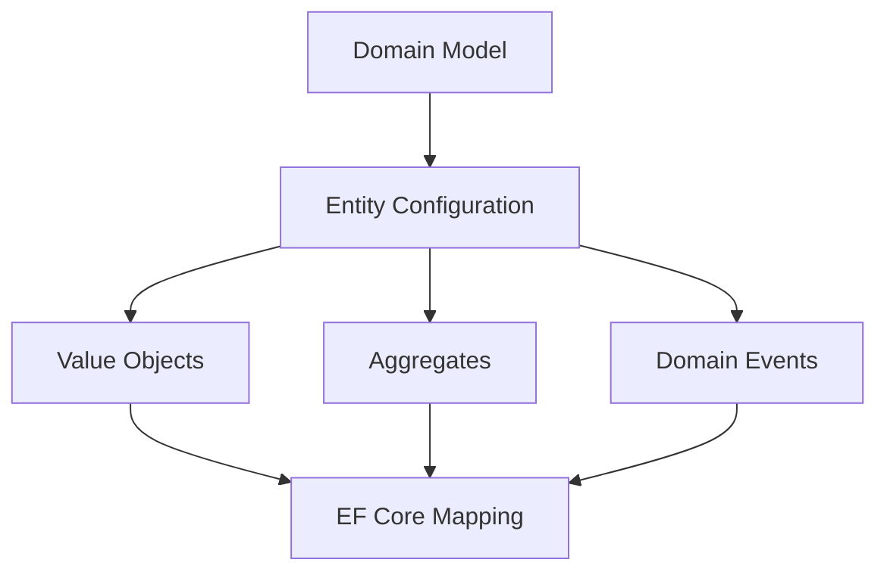

## 🏷️ Tags

#type/area #area/architecture #concept/microservice #concept/clean-architecture #concept/ddd 

---

> [!info] **Domain-Driven Design с Entity Framework Core** Правильная настройка EF Core для соблюдения принципов DDD - ключ к чистой архитектуре

## 🎯 Основные принципы



---

## 🏗️ Структура конфигураций

### Базовая организация

```csharp
// Domain/Entities/Order.cs
public class Order : AggregateRoot<OrderId>
{
    public CustomerId CustomerId { get; private set; }
    public Money TotalAmount { get; private set; }
    public OrderStatus Status { get; private set; }
    private readonly List<OrderLine> _orderLines = new();
    
    public IReadOnlyCollection<OrderLine> OrderLines => _orderLines.AsReadOnly();
}
```

> [!tip] **Принцип инкапсуляции** Доменные сущности должны защищать свое внутреннее состояние через private setters и методы

---

## 📋 Entity Configurations

### 1. Конфигурация основной сущности

```csharp
// Infrastructure/Configurations/OrderConfiguration.cs
public class OrderConfiguration : IEntityTypeConfiguration<Order>
{
    public void Configure(EntityTypeBuilder<Order> builder)
    {
        // Настройка Primary Key
        builder.HasKey(o => o.Id);
        
        // Конверсия для strongly-typed ID
        builder.Property(o => o.Id)
            .HasConversion(
                orderId => orderId.Value,
                value => new OrderId(value));
        
        // Конфигурация Value Object
        builder.OwnsOne(o => o.TotalAmount, money =>
        {
            money.Property(m => m.Amount)
                .HasColumnName("TotalAmount")
                .HasPrecision(18, 2);
            
            money.Property(m => m.Currency)
                .HasColumnName("Currency")
                .HasMaxLength(3);
        });
        
        // Enum как строка
        builder.Property(o => o.Status)
            .HasConversion<string>()
            .HasMaxLength(50);
        
        // Navigation Properties
        builder.HasMany(o => o.OrderLines)
            .WithOne()
            .HasForeignKey("OrderId")
            .OnDelete(DeleteBehavior.Cascade);
    }
}
```

### 2. Конфигурация Value Objects

> [!warning] **Owned Types** Value Objects должны конфигурироваться как Owned Types, а не как отдельные сущности

```csharp
// Value Object
public record Money(decimal Amount, string Currency)
{
    public static Money Zero => new(0, "USD");
    
    public Money Add(Money other)
    {
        if (Currency != other.Currency)
            throw new InvalidOperationException("Cannot add different currencies");
        
        return new Money(Amount + other.Amount, Currency);
    }
}

// Конфигурация
builder.OwnsOne(o => o.TotalAmount, money =>
{
    money.Property(m => m.Amount).HasColumnName("Amount");
    money.Property(m => m.Currency).HasColumnName("Currency");
    
    // Добавление индекса
    money.HasIndex(m => m.Currency);
});
```

---

## 🎭 Strongly Typed IDs

### Реализация

```csharp
// Domain/ValueObjects/OrderId.cs
public record OrderId(Guid Value)
{
    public static OrderId New() => new(Guid.NewGuid());
    public static OrderId Empty => new(Guid.Empty);
}

// Converter для EF Core
public class OrderIdConverter : ValueConverter<OrderId, Guid>
{
    public OrderIdConverter() : base(
        orderId => orderId.Value,
        value => new OrderId(value))
    {
    }
}

// Регистрация в DbContext
protected override void ConfigureConventions(ModelConfigurationBuilder configurationBuilder)
{
    configurationBuilder.Properties<OrderId>()
        .HaveConversion<OrderIdConverter>();
}
```

> [!success] **Преимущества Strongly Typed IDs**
> 
> - Защита от ошибок типизации
> - Явное разделение доменов
> - Лучшая читаемость кода

---

## 🔄 Агрегаты и связи

### Правильная настройка агрегатов

```csharp
public class OrderConfiguration : IEntityTypeConfiguration<Order>
{
    public void Configure(EntityTypeBuilder<Order> builder)
    {
        builder.ToTable("Orders");
        
        // Агрегатный корень
        builder.HasKey(o => o.Id);
        
        // Внешние ссылки только на другие агрегаты
        builder.Property(o => o.CustomerId)
            .HasConversion(
                id => id.Value,
                value => new CustomerId(value));
        
        // Дочерние сущности внутри агрегата
        builder.OwnsMany(o => o.OrderLines, orderLine =>
        {
            orderLine.WithOwner().HasForeignKey("OrderId");
            orderLine.Property<int>("Id");
            orderLine.HasKey("Id");
            
            orderLine.Property(ol => ol.ProductId)
                .HasConversion(
                    id => id.Value,
                    value => new ProductId(value));
                    
            orderLine.OwnsOne(ol => ol.Price, price =>
            {
                price.Property(p => p.Amount).HasColumnName("Price");
                price.Property(p => p.Currency).HasColumnName("Currency");
            });
        });
    }
}
```

> [!note] **Границы агрегатов** Один агрегат = одна транзакция. Связи между агрегатами только через ID

---

## 📅 Domain Events

### Конфигурация событий

```csharp
// Base класс для агрегатов
public abstract class AggregateRoot<TId> : Entity<TId>
{
    private readonly List<IDomainEvent> _domainEvents = new();
    
    public IReadOnlyCollection<IDomainEvent> DomainEvents => 
        _domainEvents.AsReadOnly();
    
    protected void AddDomainEvent(IDomainEvent domainEvent)
    {
        _domainEvents.Add(domainEvent);
    }
    
    public void ClearDomainEvents()
    {
        _domainEvents.Clear();
    }
}

// Interceptor для публикации событий
public class DomainEventInterceptor : SaveChangesInterceptor
{
    private readonly IMediator _mediator;
    
    public override async ValueTask<InterceptionResult<int>> SavingChangesAsync(
        DbContextEventData eventData, 
        InterceptionResult<int> result,
        CancellationToken cancellationToken = default)
    {
        await PublishDomainEventsAsync(eventData.Context);
        return await base.SavingChangesAsync(eventData, result, cancellationToken);
    }
    
    private async Task PublishDomainEventsAsync(DbContext? context)
    {
        if (context is null) return;
        
        var aggregates = context.ChangeTracker.Entries<AggregateRoot<object>>()
            .Select(entry => entry.Entity)
            .Where(entity => entity.DomainEvents.Any())
            .ToList();
        
        var domainEvents = aggregates
            .SelectMany(aggregate => aggregate.DomainEvents)
            .ToList();
        
        aggregates.ForEach(aggregate => aggregate.ClearDomainEvents());
        
        foreach (var domainEvent in domainEvents)
        {
            await _mediator.Publish(domainEvent);
        }
    }
}
```

---

## 📊 Специальные сценарии

### Конфигурация для сложных Value Objects

```csharp
// Адрес как Value Object
public record Address(
    string Street,
    string City,
    string PostalCode,
    string Country)
{
    public string FullAddress => $"{Street}, {City}, {PostalCode}, {Country}";
}

// Конфигурация
builder.OwnsOne(c => c.Address, address =>
{
    address.Property(a => a.Street)
        .HasColumnName("Street")
        .HasMaxLength(200);
        
    address.Property(a => a.City)
        .HasColumnName("City")
        .HasMaxLength(100);
        
    address.Property(a => a.PostalCode)
        .HasColumnName("PostalCode")
        .HasMaxLength(20);
        
    address.Property(a => a.Country)
        .HasColumnName("Country")
        .HasMaxLength(50);
        
    // Индекс на составной ключ
    address.HasIndex(a => new { a.City, a.PostalCode });
});
```

### Конфигурация Enum с бизнес-логикой

```csharp
// Smart Enum
public class OrderStatus : SmartEnum<OrderStatus>
{
    public static readonly OrderStatus Pending = new(nameof(Pending), 1);
    public static readonly OrderStatus Confirmed = new(nameof(Confirmed), 2);
    public static readonly OrderStatus Shipped = new(nameof(Shipped), 3);
    public static readonly OrderStatus Delivered = new(nameof(Delivered), 4);
    
    private OrderStatus(string name, int value) : base(name, value) { }
    
    public bool CanTransitionTo(OrderStatus newStatus)
    {
        return Value < newStatus.Value;
    }
}

// EF Core конфигурация
builder.Property(o => o.Status)
    .HasConversion(
        status => status.Name,
        name => OrderStatus.FromName(name));
```

---

## ⚡ Performance Tips

> [!tip] **Оптимизация запросов**
> 
> ```csharp
> // Правильная загрузка агрегата
> var order = await context.Orders
>     .Include(o => o.OrderLines)
>     .FirstOrDefaultAsync(o => o.Id == orderId);
> 
> // Проекция для чтения
> var orderSummary = await context.Orders
>     .Where(o => o.CustomerId == customerId)
>     .Select(o => new OrderSummaryDto
>     {
>         Id = o.Id.Value,
>         TotalAmount = o.TotalAmount.Amount,
>         Status = o.Status.Name
>     })
>     .ToListAsync();
> ```

---

## 📝 Checklist

- [ ] Все агрегаты имеют strongly-typed ID
- [ ] Value Objects конфигурируются как Owned Types
- [ ] Связи между агрегатами только через ID
- [ ] Domain Events правильно публикуются
- [ ] Enum конфигурируются как строки или Smart Enums
- [ ] Применены нужные индексы для производительности
- [ ] Границы транзакций соответствуют границам агрегатов

> [!success] **Результат** Правильная конфигурация EF Core позволяет сохранить принципы DDD и обеспечить высокую производительность приложения

---

## 🔗 Связанные заметки

- [[Value Objects in EF|Value Objects in EF]]
- [[Aggregate Design Patterns]]
- [[EF Core Performance Tips]]
- [[Domain Events Implementation]]