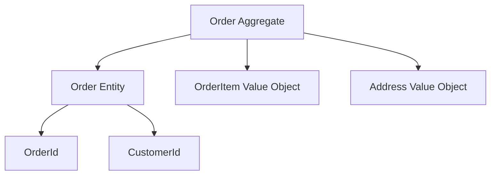

## 🏷️ Tags

#type/area #area/architecture #concept/microservice #concept/clean-architecture #concept/ddd 

---

> [!info] Цель документа Изучить принципы маппинга доменных сущностей в Entity Framework Core в контексте Domain-Driven Design

## 🎯 Ключевые концепции

### Агрегаты и Сущности

В DDD **агрегат** - это кластер связанных объектов, которые рассматриваются как единое целое для изменения данных.



---

## 🏗️ Основные паттерны маппинга

### 1. Aggregate Root Mapping

> [!example] Пример агрегата Order
> 
> ```csharp
> public class Order : AggregateRoot<OrderId>
> {
>     public CustomerId CustomerId { get; private set; }
>     public Address ShippingAddress { get; private set; }
>     private readonly List<OrderItem> _items = new();
>     public IReadOnlyList<OrderItem> Items => _items.AsReadOnly();
>     
>     // Бизнес-методы
>     public void AddItem(ProductId productId, int quantity, Money price)
>     {
>         // Бизнес-логика
>     }
> }
> ```

### 2. Value Objects Mapping

**Value Object** - объект без идентичности, определяемый только своими атрибутами.

```csharp
public class Address : ValueObject
{
    public string Street { get; private set; }
    public string City { get; private set; }
    public string PostalCode { get; private set; }
    
    protected override IEnumerable<object> GetAtomicValues()
    {
        yield return Street;
        yield return City;
        yield return PostalCode;
    }
}
```

### 3. Entity Configuration

> [!tip] Конфигурация через Fluent API Используйте `IEntityTypeConfiguration<T>` для каждой сущности

```csharp
public class OrderConfiguration : IEntityTypeConfiguration<Order>
{
    public void Configure(EntityTypeBuilder<Order> builder)
    {
        // Настройка ключа
        builder.HasKey(o => o.Id);
        builder.Property(o => o.Id)
               .HasConversion(id => id.Value, value => new OrderId(value));
        
        // Value Object как Owned Entity
        builder.OwnsOne(o => o.ShippingAddress, address =>
        {
            address.Property(a => a.Street).HasColumnName("ShippingStreet");
            address.Property(a => a.City).HasColumnName("ShippingCity");
            address.Property(a => a.PostalCode).HasColumnName("ShippingPostalCode");
        });
        
        // Коллекция сущностей
        builder.HasMany(o => o.Items)
               .WithOne()
               .HasForeignKey("OrderId")
               .OnDelete(DeleteBehavior.Cascade);
    }
}
```

---

## 💾 Стратегии маппинга

### Table Per Hierarchy (TPH)

> [!note] Когда использовать
> 
> - Небольшое количество подтипов
> - Схожие свойства у наследников

```csharp
public abstract class Payment
{
    public PaymentId Id { get; protected set; }
    public Money Amount { get; protected set; }
}

public class CreditCardPayment : Payment
{
    public string CardNumber { get; private set; }
    public DateTime ExpiryDate { get; private set; }
}

public class BankTransferPayment : Payment
{
    public string AccountNumber { get; private set; }
    public string BankCode { get; private set; }
}

// Конфигурация
builder.Entity<Payment>()
       .HasDiscriminator<string>("PaymentType")
       .HasValue<CreditCardPayment>("CreditCard")
       .HasValue<BankTransferPayment>("BankTransfer");
```

### Table Per Type (TPT)

> [!warning] Осторожно с производительностью TPT может привести к сложным JOIN-запросам

```csharp
// Конфигурация TPT
builder.Entity<Payment>().ToTable("Payments");
builder.Entity<CreditCardPayment>().ToTable("CreditCardPayments");
builder.Entity<BankTransferPayment>().ToTable("BankTransferPayments");
```

---

## 🔄 Конвертация доменных типов

### Strongly Typed IDs

```csharp
public record OrderId(Guid Value);
public record CustomerId(Guid Value);

// Value Converter
public class OrderIdConverter : ValueConverter<OrderId, Guid>
{
    public OrderIdConverter() : base(
        id => id.Value,
        value => new OrderId(value))
    {
    }
}

// Регистрация в OnModelCreating
protected override void ConfigureConventions(ModelConfigurationBuilder configurationBuilder)
{
    configurationBuilder.Properties<OrderId>().HaveConversion<OrderIdConverter>();
    configurationBuilder.Properties<CustomerId>().HaveConversion<CustomerIdConverter>();
}
```

### Enumeration Classes

> [!example] Пример Enumeration
> 
> ```csharp
> public abstract class OrderStatus : Enumeration
> {
>     public static readonly OrderStatus Pending = new PendingStatus();
>     public static readonly OrderStatus Confirmed = new ConfirmedStatus();
>     public static readonly OrderStatus Shipped = new ShippedStatus();
>     
>     protected OrderStatus(int id, string name) : base(id, name) { }
>     
>     private class PendingStatus : OrderStatus
>     {
>         public PendingStatus() : base(1, "Pending") { }
>     }
> }
> ```

```csharp
// Конвертация Enumeration
builder.Property(o => o.Status)
       .HasConversion(
           status => status.Id,
           id => OrderStatus.FromValue<OrderStatus>(id));
```

---

## 📊 Сложные сценарии

### 1. Aggregate Boundaries

> [!important] Правило агрегатов Один агрегат = одна транзакция

```csharp
public class OrderAggregate
{
    public void ChangeShippingAddress(Address newAddress)
    {
        // Валидация внутри агрегата
        if (Status == OrderStatus.Shipped)
            throw new DomainException("Cannot change address for shipped order");
            
        ShippingAddress = newAddress;
        AddDomainEvent(new OrderAddressChangedEvent(Id, newAddress));
    }
}
```

### 2. Domain Events

```csharp
public abstract class AggregateRoot<TId> : Entity<TId>
{
    private readonly List<IDomainEvent> _domainEvents = new();
    public IReadOnlyList<IDomainEvent> DomainEvents => _domainEvents.AsReadOnly();
    
    protected void AddDomainEvent(IDomainEvent domainEvent)
    {
        _domainEvents.Add(domainEvent);
    }
    
    public void ClearDomainEvents()
    {
        _domainEvents.Clear();
    }
}

// В DbContext
public override async Task<int> SaveChangesAsync(CancellationToken cancellationToken = default)
{
    var domainEvents = GetDomainEvents();
    var result = await base.SaveChangesAsync(cancellationToken);
    await DispatchDomainEvents(domainEvents);
    return result;
}
```

### 3. Complex Value Objects

```csharp
public class Money : ValueObject
{
    public decimal Amount { get; private set; }
    public Currency Currency { get; private set; }
    
    // Конфигурация как Owned Entity
    builder.OwnsOne(o => o.Price, money =>
    {
        money.Property(m => m.Amount)
             .HasColumnType("decimal(18,2)")
             .HasColumnName("Amount");
        money.Property(m => m.Currency)
             .HasConversion<string>()
             .HasColumnName("Currency");
    });
}
```

---

## 🎯 Best Practices

> [!success] Рекомендации
> 
> 1. **Инкапсуляция**: Используйте private setters для доменных свойств
> 2. **Валидация**: Вся бизнес-логика внутри доменных объектов
> 3. **Неизменяемость**: Value Objects должны быть immutable
> 4. **Границы**: Четко определяйте границы агрегатов

### Repository Pattern

```csharp
public interface IOrderRepository
{
    Task<Order?> GetByIdAsync(OrderId id);
    Task<Order> AddAsync(Order order);
    Task UpdateAsync(Order order);
    Task DeleteAsync(Order order);
}

public class OrderRepository : IOrderRepository
{
    private readonly ApplicationDbContext _context;
    
    public async Task<Order?> GetByIdAsync(OrderId id)
    {
        return await _context.Orders
            .Include(o => o.Items)
            .FirstOrDefaultAsync(o => o.Id == id);
    }
}
```

### Unit of Work

```csharp
public class ApplicationDbContext : DbContext, IUnitOfWork
{
    public DbSet<Order> Orders { get; set; }
    public DbSet<Customer> Customers { get; set; }
    
    public async Task<bool> SaveEntitiesAsync(CancellationToken cancellationToken = default)
    {
        // Dispatch domain events
        await DispatchDomainEventsAsync();
        
        var result = await SaveChangesAsync(cancellationToken);
        return result > 0;
    }
}
```

---

## 🚀 Заключение

|Паттерн|Использование|Преимущества|
|---|---|---|
|**Aggregate Root**|Основная сущность агрегата|Инкапсуляция бизнес-логики|
|**Value Objects**|Объекты без идентичности|Immutability, валидация|
|**Owned Entities**|Вложенные объекты|Нормализация данных|
|**Strongly Typed IDs**|Типобезопасные идентификаторы|Предотвращение ошибок|

> [!quote] Помни "Модель домена должна отражать бизнес, а не структуру базы данных"

---

## 📚 Дополнительные ресурсы

- [[Domain Events]] - Реализация доменных событий
- [[Value Objects Patterns]] - Паттерны для Value Objects
- [[Aggregate Design]] - Проектирование агрегатов
- [[Repository Pattern]] - Реализация репозиториев
