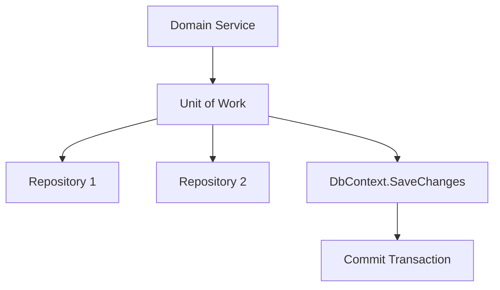

## 🏷️ Tags

#type/area #area/architecture #concept/microservice #concept/clean-architecture #concept/ddd 

---

> [!info] Основные понятия **Domain-Driven Design (DDD)** с **Entity Framework Core** требует грамотного управления транзакциями для поддержания целостности данных и бизнес-правил.

## 🎯 Ключевые принципы

### Unit of Work Pattern



### Aggregate Boundaries

> [!warning] Важно! Транзакции должны затрагивать только **один агрегат** за раз для обеспечения консистентности.

---

## 💡 Базовые подходы

### 1. Implicit Transactions (по умолчанию)

```csharp
public class OrderService
{
    private readonly OrderContext _context;
    
    public OrderService(OrderContext context)
    {
        _context = context;
    }
    
    public async Task CreateOrderAsync(Order order)
    {
        _context.Orders.Add(order);
        // EF автоматически оборачивает в транзакцию
        await _context.SaveChangesAsync();
    }
}
```

> [!tip] Совет `SaveChanges()` автоматически создаёт транзакцию, если её нет

### 2. Explicit Transactions (явные)

```csharp
public class OrderService
{
    private readonly OrderContext _context;
    
    public async Task ProcessOrderWithPaymentAsync(Order order, Payment payment)
    {
        using var transaction = await _context.Database.BeginTransactionAsync();
        
        try
        {
            // Создаём заказ
            _context.Orders.Add(order);
            await _context.SaveChangesAsync();
            
            // Обрабатываем платёж
            payment.OrderId = order.Id;
            _context.Payments.Add(payment);
            await _context.SaveChangesAsync();
            
            await transaction.CommitAsync();
        }
        catch
        {
            await transaction.RollbackAsync();
            throw;
        }
    }
}
```

---

## 🏗️ DDD Patterns с EF Transactions

### Repository Pattern + UoW

```csharp
public interface IUnitOfWork : IDisposable
{
    IOrderRepository Orders { get; }
    ICustomerRepository Customers { get; }
    Task<int> SaveChangesAsync();
    Task<IDbContextTransaction> BeginTransactionAsync();
}

public class UnitOfWork : IUnitOfWork
{
    private readonly DomainContext _context;
    private IOrderRepository _orders;
    private ICustomerRepository _customers;
    
    public UnitOfWork(DomainContext context)
    {
        _context = context;
    }
    
    public IOrderRepository Orders => 
        _orders ??= new OrderRepository(_context);
        
    public ICustomerRepository Customers => 
        _customers ??= new CustomerRepository(_context);
    
    public async Task<int> SaveChangesAsync()
    {
        return await _context.SaveChangesAsync();
    }
    
    public async Task<IDbContextTransaction> BeginTransactionAsync()
    {
        return await _context.Database.BeginTransactionAsync();
    }
    
    public void Dispose()
    {
        _context.Dispose();
    }
}
```

### Domain Service с транзакциями

```csharp
public class OrderDomainService
{
    private readonly IUnitOfWork _unitOfWork;
    private readonly IInventoryService _inventoryService;
    
    public OrderDomainService(
        IUnitOfWork unitOfWork,
        IInventoryService inventoryService)
    {
        _unitOfWork = unitOfWork;
        _inventoryService = inventoryService;
    }
    
    public async Task ProcessOrderAsync(CreateOrderCommand command)
    {
        using var transaction = await _unitOfWork.BeginTransactionAsync();
        
        try
        {
            // 1. Создание агрегата заказа
            var customer = await _unitOfWork.Customers
                .GetByIdAsync(command.CustomerId);
            
            var order = Order.Create(
                customer.Id,
                command.DeliveryAddress,
                command.Items);
            
            // 2. Проверка и резервирование товара
            foreach (var item in order.Items)
            {
                var available = await _inventoryService
                    .CheckAvailabilityAsync(item.ProductId, item.Quantity);
                
                if (!available)
                {
                    throw new InsufficientInventoryException(
                        item.ProductId, item.Quantity);
                }
                
                await _inventoryService
                    .ReserveAsync(item.ProductId, item.Quantity);
            }
            
            // 3. Сохранение изменений
            _unitOfWork.Orders.Add(order);
            await _unitOfWork.SaveChangesAsync();
            
            await transaction.CommitAsync();
            
            // 4. Публикация события (вне транзакции)
            await PublishOrderCreatedEventAsync(order);
        }
        catch
        {
            await transaction.RollbackAsync();
            throw;
        }
    }
}
```

---

## 🔄 Advanced Patterns

### 1. Saga Pattern для распределённых транзакций

```csharp
public class OrderSaga
{
    private readonly IUnitOfWork _unitOfWork;
    private readonly IEventBus _eventBus;
    
    public async Task HandleOrderCreatedAsync(OrderCreated @event)
    {
        var saga = new OrderProcessingSaga(@event.OrderId);
        
        // Шаг 1: Резервирование товара
        await saga.ExecuteStepAsync(
            "ReserveInventory",
            async () => await ReserveInventoryAsync(@event.OrderId),
            async () => await CancelInventoryReservationAsync(@event.OrderId)
        );
        
        // Шаг 2: Обработка платежа
        await saga.ExecuteStepAsync(
            "ProcessPayment", 
            async () => await ProcessPaymentAsync(@event.OrderId),
            async () => await RefundPaymentAsync(@event.OrderId)
        );
        
        // Шаг 3: Подтверждение заказа
        await saga.ExecuteStepAsync(
            "ConfirmOrder",
            async () => await ConfirmOrderAsync(@event.OrderId),
            async () => await CancelOrderAsync(@event.OrderId)
        );
    }
}
```

### 2. Outbox Pattern для событий

```csharp
public class OutboxService
{
    private readonly DomainContext _context;
    
    public async Task SaveEventsAsync<T>(T aggregate) where T : AggregateRoot
    {
        var events = aggregate.GetDomainEvents();
        
        foreach (var domainEvent in events)
        {
            var outboxEvent = new OutboxEvent
            {
                Id = Guid.NewGuid(),
                Type = domainEvent.GetType().Name,
                Data = JsonSerializer.Serialize(domainEvent),
                CreatedAt = DateTime.UtcNow,
                Processed = false
            };
            
            _context.OutboxEvents.Add(outboxEvent);
        }
        
        aggregate.ClearEvents();
        await _context.SaveChangesAsync();
    }
}

// Использование в Application Service
public class CreateOrderHandler
{
    public async Task<OrderId> HandleAsync(CreateOrderCommand command)
    {
        using var transaction = await _context.Database.BeginTransactionAsync();
        
        try
        {
            var order = Order.Create(/* params */);
            _context.Orders.Add(order);
            
            // Сохраняем события в outbox в той же транзакции
            await _outboxService.SaveEventsAsync(order);
            
            await transaction.CommitAsync();
            return order.Id;
        }
        catch
        {
            await transaction.RollbackAsync();
            throw;
        }
    }
}
```

---

## ⚠️ Best Practices

### ✅ DO

- [ ] Используйте **одну транзакцию на агрегат**
- [ ] Применяйте **Unit of Work** для координации изменений
- [ ] Обрабатывайте **исключения** и откатывайте транзакции
- [ ] Используйте **Outbox Pattern** для событий
- [ ] Делайте транзакции **короткими**

### ❌ DON'T

- [ ] Не создавайте **длительные транзакции**
- [ ] Не изменяйте **несколько агрегатов** в одной транзакции
- [ ] Не вызывайте **внешние сервисы** внутри транзакций
- [ ] Не забывайте обрабатывать **исключения**

### 📋 Чеклист для review

```markdown
- [ ] Транзакция затрагивает только один агрегат?
- [ ] Есть обработка исключений и rollback?
- [ ] События публикуются после commit'а?
- [ ] Используется правильный isolation level?
- [ ] Транзакция максимально короткая?
```

---

## 📊 Isolation Levels

|Level|Read Uncommitted|Read Committed|Repeatable Read|Serializable|
|---|---|---|---|---|
|**Dirty Read**|✅|❌|❌|❌|
|**Non-repeatable Read**|✅|✅|❌|❌|
|**Phantom Read**|✅|✅|✅|❌|
|**Performance**|🔥🔥🔥🔥|🔥🔥🔥|🔥🔥|🔥|

```csharp
// Установка isolation level
using var transaction = await _context.Database
    .BeginTransactionAsync(IsolationLevel.ReadCommitted);
```

---

## 🔗 Связанные темы

- [[Domain Events]]
- [[Aggregate Design]]
- [[Repository Pattern]]
- [[Unit of Work]]
- [[CQRS]]
- [[Event Sourcing]]

---

> [!quote] Помни "Транзакция должна быть атомарной операцией над агрегатом, поддерживающей инварианты домена"
