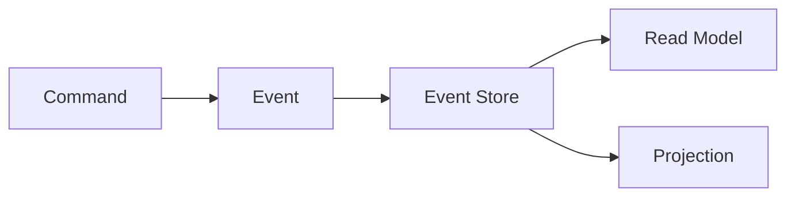
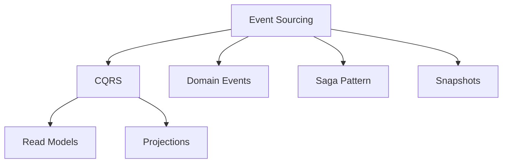

## 🏷️ Tags

#type/area #area/architecture #concept/microservice #concept/clean-architecture #concept/ddd 

---

> [!info] Основная идея **Event Sourcing** — паттерн, при котором состояние приложения определяется последовательностью событий, а не текущими значениями в базе данных.

---

## 🎯 Ключевые концепции

### Event Store

**Хранилище событий** — единственный источник истины в системе.



### События vs Состояние

|Традиционный подход|Event Sourcing|
|---|---|
|Сохраняем текущее состояние|Сохраняем последовательность событий|
|Теряем историю изменений|Полная история изменений|
|UPDATE/DELETE операции|Только INSERT операции|

---

## 📋 Преимущества и недостатки

> [!success] ✅ Преимущества
> 
> - **Полная история** изменений
> - **Аудит** "из коробки"
> - **Replay** событий для восстановления состояния
> - **Temporal queries** - запросы на любой момент времени
> - **Debugging** упрощается

> [!warning] ❌ Недостатки
> 
> - **Сложность** запросов
> - **Eventual Consistency**
> - **Размер** хранилища растёт
> - **Versioning** событий может быть проблемой

---

## 🛠️ Реализация на .NET

### 1. Базовые интерфейсы

```csharp
// Базовый интерфейс для событий
public interface IDomainEvent
{
    Guid EventId { get; }
    DateTime OccurredOn { get; }
    int Version { get; }
}

// Базовое событие
public abstract class DomainEvent : IDomainEvent
{
    public Guid EventId { get; private set; } = Guid.NewGuid();
    public DateTime OccurredOn { get; private set; } = DateTime.UtcNow;
    public int Version { get; private set; }

    protected DomainEvent(int version = 1)
    {
        Version = version;
    }
}
```

### 2. Пример доменных событий

```csharp
// События банковского счёта
public class AccountOpenedEvent : DomainEvent
{
    public Guid AccountId { get; private set; }
    public string Owner { get; private set; }
    public decimal InitialBalance { get; private set; }

    public AccountOpenedEvent(Guid accountId, string owner, decimal initialBalance)
    {
        AccountId = accountId;
        Owner = owner;
        InitialBalance = initialBalance;
    }
}

public class MoneyDepositedEvent : DomainEvent
{
    public Guid AccountId { get; private set; }
    public decimal Amount { get; private set; }

    public MoneyDepositedEvent(Guid accountId, decimal amount)
    {
        AccountId = accountId;
        Amount = amount;
    }
}

public class MoneyWithdrawnEvent : DomainEvent
{
    public Guid AccountId { get; private set; }
    public decimal Amount { get; private set; }

    public MoneyWithdrawnEvent(Guid accountId, decimal amount)
    {
        AccountId = accountId;
        Amount = amount;
    }
}
```

### 3. Агрегат с Event Sourcing

```csharp
public class BankAccount
{
    private readonly List<IDomainEvent> _uncommittedEvents = new();
    
    public Guid Id { get; private set; }
    public string Owner { get; private set; }
    public decimal Balance { get; private set; }
    public int Version { get; private set; }

    // Конструктор для создания нового агрегата
    public BankAccount(Guid id, string owner, decimal initialBalance)
    {
        if (initialBalance < 0)
            throw new ArgumentException("Initial balance cannot be negative");

        ApplyEvent(new AccountOpenedEvent(id, owner, initialBalance));
    }

    // Конструктор для восстановления из событий
    private BankAccount() { }

    // Бизнес-методы
    public void Deposit(decimal amount)
    {
        if (amount <= 0)
            throw new ArgumentException("Amount must be positive");

        ApplyEvent(new MoneyDepositedEvent(Id, amount));
    }

    public void Withdraw(decimal amount)
    {
        if (amount <= 0)
            throw new ArgumentException("Amount must be positive");
        
        if (Balance - amount < 0)
            throw new InvalidOperationException("Insufficient funds");

        ApplyEvent(new MoneyWithdrawnEvent(Id, amount));
    }

    // Применение события
    private void ApplyEvent(IDomainEvent domainEvent)
    {
        When(domainEvent);
        _uncommittedEvents.Add(domainEvent);
        Version++;
    }

    // Обработка событий (проекция состояния)
    private void When(IDomainEvent domainEvent)
    {
        switch (domainEvent)
        {
            case AccountOpenedEvent e:
                Id = e.AccountId;
                Owner = e.Owner;
                Balance = e.InitialBalance;
                break;
                
            case MoneyDepositedEvent e:
                Balance += e.Amount;
                break;
                
            case MoneyWithdrawnEvent e:
                Balance -= e.Amount;
                break;
        }
    }

    // Восстановление агрегата из событий
    public static BankAccount FromEvents(IEnumerable<IDomainEvent> events)
    {
        var account = new BankAccount();
        
        foreach (var evt in events.OrderBy(e => e.OccurredOn))
        {
            account.When(evt);
            account.Version++;
        }
        
        return account;
    }

    // Получение неподтверждённых событий
    public IEnumerable<IDomainEvent> GetUncommittedEvents()
    {
        return _uncommittedEvents.AsReadOnly();
    }

    // Пометка событий как подтверждённых
    public void MarkEventsAsCommitted()
    {
        _uncommittedEvents.Clear();
    }
}
```

### 4. Event Store

```csharp
public interface IEventStore
{
    Task SaveEventsAsync(Guid aggregateId, IEnumerable<IDomainEvent> events, int expectedVersion);
    Task<IEnumerable<IDomainEvent>> GetEventsAsync(Guid aggregateId);
}

public class InMemoryEventStore : IEventStore
{
    private readonly Dictionary<Guid, List<IDomainEvent>> _events = new();

    public Task SaveEventsAsync(Guid aggregateId, IEnumerable<IDomainEvent> events, int expectedVersion)
    {
        if (!_events.ContainsKey(aggregateId))
            _events[aggregateId] = new List<IDomainEvent>();

        var currentVersion = _events[aggregateId].Count;
        
        // Optimistic concurrency check
        if (currentVersion != expectedVersion)
            throw new ConcurrencyException($"Expected version {expectedVersion}, but was {currentVersion}");

        _events[aggregateId].AddRange(events);
        
        return Task.CompletedTask;
    }

    public Task<IEnumerable<IDomainEvent>> GetEventsAsync(Guid aggregateId)
    {
        if (_events.TryGetValue(aggregateId, out var events))
            return Task.FromResult(events.AsEnumerable());
        
        return Task.FromResult(Enumerable.Empty<IDomainEvent>());
    }
}
```

### 5. Repository с Event Sourcing

```csharp
public class EventSourcingRepository<T> where T : class
{
    private readonly IEventStore _eventStore;
    private readonly Func<IEnumerable<IDomainEvent>, T> _fromEventsFactory;

    public EventSourcingRepository(IEventStore eventStore, Func<IEnumerable<IDomainEvent>, T> fromEventsFactory)
    {
        _eventStore = eventStore;
        _fromEventsFactory = fromEventsFactory;
    }

    public async Task<T> GetByIdAsync(Guid id)
    {
        var events = await _eventStore.GetEventsAsync(id);
        
        if (!events.Any())
            return null;

        return _fromEventsFactory(events);
    }

    public async Task SaveAsync(T aggregate, int expectedVersion)
    {
        // Используем рефлексию или интерфейс для получения событий
        var getUncommittedEventsMethod = typeof(T).GetMethod("GetUncommittedEvents");
        var markAsCommittedMethod = typeof(T).GetMethod("MarkEventsAsCommitted");
        var idProperty = typeof(T).GetProperty("Id");

        if (getUncommittedEventsMethod == null || markAsCommittedMethod == null || idProperty == null)
            throw new InvalidOperationException("Aggregate must implement event sourcing pattern");

        var uncommittedEvents = (IEnumerable<IDomainEvent>)getUncommittedEventsMethod.Invoke(aggregate, null);
        var aggregateId = (Guid)idProperty.GetValue(aggregate);

        if (uncommittedEvents.Any())
        {
            await _eventStore.SaveEventsAsync(aggregateId, uncommittedEvents, expectedVersion);
            markAsCommittedMethod.Invoke(aggregate, null);
        }
    }
}
```

---

## 🔍 Практический пример использования

```csharp
class Program
{
    static async Task Main(string[] args)
    {
        // Настройка
        var eventStore = new InMemoryEventStore();
        var repository = new EventSourcingRepository<BankAccount>(
            eventStore, 
            events => BankAccount.FromEvents(events)
        );

        var accountId = Guid.NewGuid();

        // Создание счёта
        var account = new BankAccount(accountId, "John Doe", 1000m);
        await repository.SaveAsync(account, 0);

        // Операции со счётом
        var loadedAccount = await repository.GetByIdAsync(accountId);
        loadedAccount.Deposit(500m);
        loadedAccount.Withdraw(200m);
        
        await repository.SaveAsync(loadedAccount, loadedAccount.Version);

        // Восстановление текущего состояния
        var finalAccount = await repository.GetByIdAsync(accountId);
        Console.WriteLine($"Final balance: {finalAccount.Balance}"); // 1300

        // Просмотр истории событий
        var events = await eventStore.GetEventsAsync(accountId);
        foreach (var evt in events)
        {
            Console.WriteLine($"{evt.GetType().Name}: {evt.OccurredOn}");
        }
    }
}
```

---

## 📊 Проекции (Read Models)

> [!tip] Зачем нужны проекции? Event Store оптимизирован для записи, но чтение может быть медленным. Проекции решают эту проблему.

```csharp
public class AccountSummaryProjection
{
    public Guid AccountId { get; set; }
    public string Owner { get; set; }
    public decimal Balance { get; set; }
    public int TransactionCount { get; set; }
    public DateTime LastActivity { get; set; }
}

public class AccountSummaryProjector
{
    private readonly Dictionary<Guid, AccountSummaryProjection> _projections = new();

    public void Handle(AccountOpenedEvent evt)
    {
        _projections[evt.AccountId] = new AccountSummaryProjection
        {
            AccountId = evt.AccountId,
            Owner = evt.Owner,
            Balance = evt.InitialBalance,
            TransactionCount = 0,
            LastActivity = evt.OccurredOn
        };
    }

    public void Handle(MoneyDepositedEvent evt)
    {
        if (_projections.TryGetValue(evt.AccountId, out var projection))
        {
            projection.Balance += evt.Amount;
            projection.TransactionCount++;
            projection.LastActivity = evt.OccurredOn;
        }
    }

    public void Handle(MoneyWithdrawnEvent evt)
    {
        if (_projections.TryGetValue(evt.AccountId, out var projection))
        {
            projection.Balance -= evt.Amount;
            projection.TransactionCount++;
            projection.LastActivity = evt.OccurredOn;
        }
    }

    public AccountSummaryProjection GetSummary(Guid accountId)
    {
        return _projections.TryGetValue(accountId, out var projection) ? projection : null;
    }
}
```

---

## 🔄 CQRS + Event Sourcing

```csharp
// Command Handler
public class BankAccountCommandHandler
{
    private readonly EventSourcingRepository<BankAccount> _repository;

    public BankAccountCommandHandler(EventSourcingRepository<BankAccount> repository)
    {
        _repository = repository;
    }

    public async Task Handle(OpenAccountCommand command)
    {
        var account = new BankAccount(command.AccountId, command.Owner, command.InitialBalance);
        await _repository.SaveAsync(account, 0);
    }

    public async Task Handle(DepositMoneyCommand command)
    {
        var account = await _repository.GetByIdAsync(command.AccountId);
        account.Deposit(command.Amount);
        await _repository.SaveAsync(account, account.Version - 1);
    }
}

// Query Handler
public class BankAccountQueryHandler
{
    private readonly AccountSummaryProjector _projector;

    public BankAccountQueryHandler(AccountSummaryProjector projector)
    {
        _projector = projector;
    }

    public AccountSummaryProjection Handle(GetAccountSummaryQuery query)
    {
        return _projector.GetSummary(query.AccountId);
    }
}
```

---

## 📝 Лучшие практики

> [!note] 💡 Советы по дизайну событий
> 
> - **Именуй события в прошедшем времени**: `OrderCreated`, а не `CreateOrder`
> - **Делай события неизменяемыми** (immutable)
> - **Включай всю необходимую информацию** в событие
> - **Версионируй события** для совместимости

> [!warning] ⚠️ Что нужно учесть
> 
> - **Снапшоты** для агрегатов с большим количеством событий
> - **Обработка версионирования** событий при изменении схемы
> - **Стратегии архивации** старых событий
> - **Мониторинг производительности** проекций

---

## 🎯 Когда использовать Event Sourcing

### ✅ Подходит когда:

- Нужна **полная история** изменений
- Важен **аудит** операций
- Бизнес-процессы **сложные** и меняются
- Нужны **временные запросы**
- Система должна быть **отказоустойчивой**

### ❌ Не подходит когда:

- **Простые CRUD** операции
- **Производительность запросов** критична
- Команда **не готова** к сложности
- **Малый объём** данных

---

## 📚 Связанные паттерны



> [!info] 🔗 См. также:
> 
> - [[CQRS Pattern]]
> - [[Domain Events]]
> - [[Saga Pattern]]
> - [[Aggregate Pattern]]