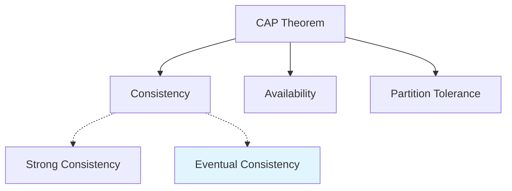
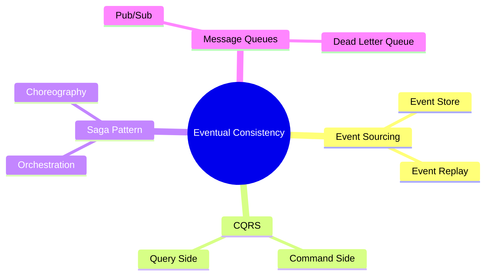

## 🏷️ Tags

#type/area #area/architecture #concept/microservice #concept/clean-architecture #concept/ddd 

---

> [!abstract] Определение **Eventual Consistency** - это модель согласованности данных в распределённых системах, при которой система гарантирует, что если не будет новых обновлений, то в конечном итоге все узлы будут иметь одинаковые данные.

---

## 🎯 Ключевые концепции

### Основные принципы

> [!info] CAP теорема В распределённых системах можно гарантировать только 2 из 3 свойств:
> 
> - **C**onsistency (Согласованность)
> - **A**vailability (Доступность)
> - **P**artition tolerance (Устойчивость к разделению)



### Типы согласованности

|Тип|Описание|Применение|
|---|---|---|
|**Strong Consistency**|Все узлы видят одинаковые данные одновременно|Банковские операции|
|**Weak Consistency**|Нет гарантий когда данные станут согласованными|Игры, чаты|
|**Eventual Consistency**|Данные станут согласованными "в конечном итоге"|Социальные сети, DNS|

---

## 🏗️ Реализация в .NET

### 1. Event Sourcing с Eventual Consistency

```csharp
// Domain Event
public abstract class DomainEvent
{
    public Guid Id { get; } = Guid.NewGuid();
    public DateTime OccurredOn { get; } = DateTime.UtcNow;
}

public class OrderCreatedEvent : DomainEvent
{
    public Guid OrderId { get; }
    public decimal Amount { get; }
    public Guid CustomerId { get; }

    public OrderCreatedEvent(Guid orderId, decimal amount, Guid customerId)
    {
        OrderId = orderId;
        Amount = amount;
        CustomerId = customerId;
    }
}

// Event Store
public interface IEventStore
{
    Task AppendEventsAsync(Guid aggregateId, IEnumerable<DomainEvent> events);
    Task<IEnumerable<DomainEvent>> GetEventsAsync(Guid aggregateId);
}

public class InMemoryEventStore : IEventStore
{
    private readonly Dictionary<Guid, List<DomainEvent>> _events = new();

    public Task AppendEventsAsync(Guid aggregateId, IEnumerable<DomainEvent> events)
    {
        if (!_events.ContainsKey(aggregateId))
            _events[aggregateId] = new List<DomainEvent>();
        
        _events[aggregateId].AddRange(events);
        return Task.CompletedTask;
    }

    public Task<IEnumerable<DomainEvent>> GetEventsAsync(Guid aggregateId)
    {
        return Task.FromResult(_events.GetValueOrDefault(aggregateId, new List<DomainEvent>())
            .AsEnumerable());
    }
}
```

### 2. Event Handler для синхронизации Read Models

```csharp
// Read Model
public class OrderSummary
{
    public Guid OrderId { get; set; }
    public decimal Amount { get; set; }
    public string Status { get; set; }
    public DateTime CreatedAt { get; set; }
}

// Event Handler
public class OrderProjectionHandler
{
    private readonly IRepository<OrderSummary> _repository;
    private readonly ILogger<OrderProjectionHandler> _logger;

    public OrderProjectionHandler(
        IRepository<OrderSummary> repository, 
        ILogger<OrderProjectionHandler> logger)
    {
        _repository = repository;
        _logger = logger;
    }

    public async Task Handle(OrderCreatedEvent @event)
    {
        try
        {
            var orderSummary = new OrderSummary
            {
                OrderId = @event.OrderId,
                Amount = @event.Amount,
                Status = "Created",
                CreatedAt = @event.OccurredOn
            };

            await _repository.SaveAsync(orderSummary);
            _logger.LogInformation($"Order summary created for {orderSummary.OrderId}");
        }
        catch (Exception ex)
        {
            _logger.LogError(ex, $"Failed to create order summary for {@event.OrderId}");
            // Retry mechanism or dead letter queue
            throw;
        }
    }
}
```

### 3. Saga Pattern для координации

```csharp
public class OrderProcessingSaga
{
    private readonly IEventPublisher _eventPublisher;
    private readonly ILogger<OrderProcessingSaga> _logger;

    public OrderProcessingSaga(IEventPublisher eventPublisher, ILogger<OrderProcessingSaga> logger)
    {
        _eventPublisher = eventPublisher;
        _logger = logger;
    }

    public async Task Handle(OrderCreatedEvent @event)
    {
        _logger.LogInformation($"Starting order processing saga for order {@event.OrderId}");

        // Step 1: Reserve inventory
        await _eventPublisher.PublishAsync(new ReserveInventoryCommand(@event.OrderId, @event.Amount));
        
        // Step 2: Process payment (will be handled after inventory reservation)
        // Step 3: Ship order (will be handled after payment)
    }

    public async Task Handle(InventoryReservedEvent @event)
    {
        _logger.LogInformation($"Inventory reserved for order {@event.OrderId}, processing payment");
        await _eventPublisher.PublishAsync(new ProcessPaymentCommand(@event.OrderId, @event.Amount));
    }

    public async Task Handle(PaymentProcessedEvent @event)
    {
        _logger.LogInformation($"Payment processed for order {@event.OrderId}, shipping order");
        await _eventPublisher.PublishAsync(new ShipOrderCommand(@event.OrderId));
    }
}
```

---

## ⚡ Практический пример с MassTransit

> [!tip] Популярная библиотека **MassTransit** - одна из самых популярных библиотек для работы с сообщениями в .NET

```csharp
// Startup.cs
public void ConfigureServices(IServiceCollection services)
{
    services.AddMassTransit(x =>
    {
        x.UsingRabbitMq((context, cfg) =>
        {
            cfg.Host("rabbitmq://localhost");
            
            // Настройка retry policy для eventual consistency
            cfg.UseMessageRetry(r => r.Interval(3, TimeSpan.FromSeconds(5)));
            
            cfg.ConfigureEndpoints(context);
        });

        x.AddConsumer<OrderCreatedConsumer>();
        x.AddConsumer<InventoryUpdatedConsumer>();
    });
}

// Consumer для обработки событий
public class OrderCreatedConsumer : IConsumer<OrderCreatedEvent>
{
    private readonly IOrderReadModelRepository _repository;

    public OrderCreatedConsumer(IOrderReadModelRepository repository)
    {
        _repository = repository;
    }

    public async Task Consume(ConsumeContext<OrderCreatedEvent> context)
    {
        var order = new OrderReadModel
        {
            Id = context.Message.OrderId,
            Amount = context.Message.Amount,
            Status = OrderStatus.Created,
            CreatedAt = context.Message.OccurredOn
        };

        await _repository.CreateAsync(order);
        
        // Публикуем следующее событие
        await context.Publish(new OrderReadModelUpdatedEvent(order.Id));
    }
}
```

---

## 🔄 Паттерны обработки

### Идемпотентность

> [!warning] Важно! Обработчики событий должны быть **идемпотентными** - повторное выполнение не должно изменять результат

```csharp
public class IdempotentEventHandler
{
    private readonly IProcessedEventRepository _processedEvents;
    private readonly IOrderRepository _orderRepository;

    public async Task Handle(OrderCreatedEvent @event)
    {
        // Проверяем, не обрабатывали ли мы уже это событие
        if (await _processedEvents.ExistsAsync(@event.Id))
        {
            return; // Событие уже обработано
        }

        try
        {
            // Обрабатываем событие
            var order = new Order(@event.OrderId, @event.Amount, @event.CustomerId);
            await _orderRepository.SaveAsync(order);

            // Помечаем как обработанное
            await _processedEvents.MarkAsProcessedAsync(@event.Id);
        }
        catch (Exception)
        {
            // В случае ошибки не помечаем как обработанное
            throw;
        }
    }
}
```

### Compensation Actions

```csharp
public class OrderSagaWithCompensation
{
    public async Task Handle(PaymentFailedEvent @event)
    {
        // Компенсирующие действия при ошибке
        await _eventPublisher.PublishAsync(new ReleaseInventoryCommand(@event.OrderId));
        await _eventPublisher.PublishAsync(new CancelOrderCommand(@event.OrderId));
        
        _logger.LogWarning($"Order {@event.OrderId} cancelled due to payment failure");
    }
}
```

---

## 🎭 Преимущества и недостатки

### ✅ Преимущества

> [!success] Плюсы
> 
> - **Высокая доступность** системы
> - **Масштабируемость** и производительность
> - **Устойчивость** к сетевым проблемам
> - **Гибкость** архитектуры

### ❌ Недостатки

> [!danger] Минусы
> 
> - **Сложность** отладки и тестирования
> - **Временная несогласованность** данных
> - **Сложная обработка ошибок**
> - **Duplicate events** и необходимость идемпотентности

---

## 🛠️ Best Practices

### 1. Monitoring и Observability

```csharp
public class EventHandlerWithMetrics
{
    private readonly IMetrics _metrics;
    private readonly ILogger _logger;

    public async Task Handle(DomainEvent @event)
    {
        using var activity = ActivitySource.StartActivity($"Handle{@event.GetType().Name}");
        var stopwatch = Stopwatch.StartNew();

        try
        {
            await ProcessEvent(@event);
            
            _metrics.Counter("events.processed")
                .WithTag("event_type", @event.GetType().Name)
                .WithTag("status", "success")
                .Increment();
        }
        catch (Exception ex)
        {
            _metrics.Counter("events.processed")
                .WithTag("event_type", @event.GetType().Name)
                .WithTag("status", "error")
                .Increment();
            
            _logger.LogError(ex, "Failed to process event {EventType}", @event.GetType().Name);
            throw;
        }
        finally
        {
            stopwatch.Stop();
            _metrics.Histogram("events.processing_duration")
                .WithTag("event_type", @event.GetType().Name)
                .Record(stopwatch.ElapsedMilliseconds);
        }
    }
}
```

### 2. Circuit Breaker Pattern

```csharp
public class ResilientEventHandler
{
    private readonly ICircuitBreaker _circuitBreaker;
    
    public async Task Handle(DomainEvent @event)
    {
        await _circuitBreaker.ExecuteAsync(async () =>
        {
            await ProcessEvent(@event);
        });
    }
}
```

---

## 📊 Мониторинг согласованности

### Health Checks

```csharp
public class EventualConsistencyHealthCheck : IHealthCheck
{
    private readonly IEventStore _eventStore;
    private readonly IReadModelRepository _readModelRepository;

    public async Task<HealthCheckResult> CheckHealthAsync(
        HealthCheckContext context, 
        CancellationToken cancellationToken = default)
    {
        try
        {
            var lastEventTime = await _eventStore.GetLastEventTimeAsync();
            var lastReadModelUpdate = await _readModelRepository.GetLastUpdateTimeAsync();
            
            var lag = lastEventTime - lastReadModelUpdate;
            
            if (lag > TimeSpan.FromMinutes(5))
            {
                return HealthCheckResult.Degraded($"Read model lag: {lag.TotalMinutes:F1} minutes");
            }
            
            return HealthCheckResult.Healthy("System is eventually consistent");
        }
        catch (Exception ex)
        {
            return HealthCheckResult.Unhealthy("Failed to check consistency", ex);
        }
    }
}
```

---

## 🔗 Связанные концепции



---

## 📚 Заключение

> [!note] Резюме **Eventual Consistency** - мощный инструмент для построения масштабируемых распределённых систем. Ключ к успеху - правильная архитектура событий, идемпотентность операций и надёжный мониторинг.

### Когда использовать:

- Высоконагруженные системы
- Микросервисная архитектура
- Системы с географически распределёнными узлами
- Приложения, где доступность важнее немедленной согласованности

### Когда НЕ использовать:

- Финансовые транзакции (требуют strong consistency)
- Системы реального времени с жёсткими требованиями
- Простые монолитные приложения

---
