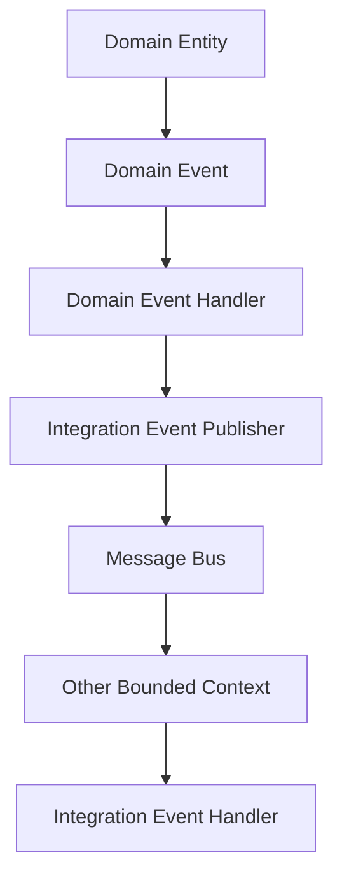

## 🏷️ Tags

#type/area #area/architecture #concept/microservice #concept/clean-architecture #concept/ddd 

---

> [!info] Определение **Integration Events** - это события, которые используются для синхронизации состояния между различными Bounded Context'ами в микросервисной архитектуре. Они обеспечивают слабую связанность между доменами.

---

## 🎯 Основные концепции

### Domain Events vs Integration Events

|Аспект|Domain Events|Integration Events|
|---|---|---|
|**Область действия**|Внутри Bounded Context|Между Bounded Context'ами|
|**Цель**|Бизнес-логика домена|Интеграция систем|
|**Публикация**|Внутри транзакции|После коммита транзакции|
|**Обработка**|Синхронная/Асинхронная|Асинхронная|

---

## 🏗️ Архитектура Integration Events



---

## 💻 Реализация на .NET

### 1. Базовые интерфейсы

```csharp
// Маркерный интерфейс для Integration Event
public interface IIntegrationEvent
{
    Guid Id { get; }
    DateTime OccurredOn { get; }
}

// Обработчик Integration Event
public interface IIntegrationEventHandler<T> where T : IIntegrationEvent
{
    Task Handle(T @event);
}
```

### 2. Базовый класс Integration Event

```csharp
public abstract record IntegrationEvent : IIntegrationEvent
{
    public Guid Id { get; init; } = Guid.NewGuid();
    public DateTime OccurredOn { get; init; } = DateTime.UtcNow;
}
```

### 3. Конкретный Integration Event

```csharp
// Integration Event для уведомления о создании заказа
public record OrderCreatedIntegrationEvent : IntegrationEvent
{
    public Guid OrderId { get; init; }
    public Guid CustomerId { get; init; }
    public decimal TotalAmount { get; init; }
    public string CustomerEmail { get; init; }
    public List<OrderItem> Items { get; init; } = new();
}

public record OrderItem
{
    public Guid ProductId { get; init; }
    public int Quantity { get; init; }
    public decimal UnitPrice { get; init; }
}
```

---

## 🔄 Паттерн Outbox

> [!warning] Проблема Как гарантировать, что Integration Event будет опубликован, если операция с базой данных успешна?

### Решение: Transactional Outbox Pattern

```csharp
// Таблица для хранения неопубликованных событий
public class OutboxEvent
{
    public Guid Id { get; set; }
    public string Type { get; set; }
    public string Data { get; set; }
    public DateTime OccurredOn { get; set; }
    public DateTime? ProcessedOn { get; set; }
}

// Сервис для работы с Outbox
public class OutboxService
{
    private readonly DbContext _context;
    private readonly IIntegrationEventPublisher _publisher;

    public async Task SaveEventAsync<T>(T @event) where T : IIntegrationEvent
    {
        var outboxEvent = new OutboxEvent
        {
            Id = @event.Id,
            Type = typeof(T).Name,
            Data = JsonSerializer.Serialize(@event),
            OccurredOn = @event.OccurredOn
        };

        _context.OutboxEvents.Add(outboxEvent);
        await _context.SaveChangesAsync();
    }

    public async Task PublishPendingEventsAsync()
    {
        var pendingEvents = await _context.OutboxEvents
            .Where(e => e.ProcessedOn == null)
            .ToListAsync();

        foreach (var outboxEvent in pendingEvents)
        {
            // Десериализация и публикация события
            var @event = DeserializeEvent(outboxEvent);
            await _publisher.PublishAsync(@event);

            outboxEvent.ProcessedOn = DateTime.UtcNow;
        }

        await _context.SaveChangesAsync();
    }
}
```

---

## 🚀 Publisher и Subscriber

### Event Publisher

```csharp
public interface IIntegrationEventPublisher
{
    Task PublishAsync<T>(T @event) where T : IIntegrationEvent;
}

public class RabbitMqIntegrationEventPublisher : IIntegrationEventPublisher
{
    private readonly IConnection _connection;
    private readonly ILogger<RabbitMqIntegrationEventPublisher> _logger;

    public async Task PublishAsync<T>(T @event) where T : IIntegrationEvent
    {
        using var channel = _connection.CreateModel();
        
        var exchangeName = typeof(T).Name;
        channel.ExchangeDeclare(exchangeName, ExchangeType.Fanout);

        var message = JsonSerializer.Serialize(@event);
        var body = Encoding.UTF8.GetBytes(message);

        var properties = channel.CreateBasicProperties();
        properties.MessageId = @event.Id.ToString();
        properties.Timestamp = new AmqpTimestamp(
            ((DateTimeOffset)@event.OccurredOn).ToUnixTimeSeconds()
        );

        channel.BasicPublish(
            exchange: exchangeName,
            routingKey: "",
            basicProperties: properties,
            body: body
        );

        _logger.LogInformation(
            "Published integration event {EventId} of type {EventType}", 
            @event.Id, typeof(T).Name
        );
    }
}
```

### Event Handler

```csharp
// Обработчик в Billing Bounded Context
public class OrderCreatedIntegrationEventHandler 
    : IIntegrationEventHandler<OrderCreatedIntegrationEvent>
{
    private readonly IBillingService _billingService;
    private readonly ILogger<OrderCreatedIntegrationEventHandler> _logger;

    public async Task Handle(OrderCreatedIntegrationEvent @event)
    {
        try
        {
            await _billingService.CreateInvoiceAsync(new CreateInvoiceCommand
            {
                OrderId = @event.OrderId,
                CustomerId = @event.CustomerId,
                Amount = @event.TotalAmount,
                CustomerEmail = @event.CustomerEmail
            });

            _logger.LogInformation(
                "Invoice created for order {OrderId}", @event.OrderId
            );
        }
        catch (Exception ex)
        {
            _logger.LogError(ex, 
                "Failed to process OrderCreated event for order {OrderId}", 
                @event.OrderId
            );
            throw;
        }
    }
}
```

---

## ⚙️ Конфигурация в DI Container

```csharp
// Program.cs или Startup.cs
services.AddScoped<IIntegrationEventPublisher, RabbitMqIntegrationEventPublisher>();
services.AddScoped<OutboxService>();

// Регистрация обработчиков
services.AddScoped<IIntegrationEventHandler<OrderCreatedIntegrationEvent>, 
                   OrderCreatedIntegrationEventHandler>();

// Background service для обработки Outbox
services.AddHostedService<OutboxProcessorService>();
```

---

## 🔥 Best Practices

> [!tip] Рекомендации
> 
> 1. **Идемпотентность** - обработчики должны быть идемпотентными
> 2. **Версионирование** - добавляйте версию к событиям для обратной совместимости
> 3. **Retry Policy** - используйте политики повторных попыток
> 4. **Dead Letter Queue** - обрабатывайте неуспешные события

### Идемпотентный обработчик

```csharp
public class IdempotentOrderCreatedHandler 
    : IIntegrationEventHandler<OrderCreatedIntegrationEvent>
{
    private readonly IProcessedEventRepository _processedEvents;
    private readonly IBillingService _billingService;

    public async Task Handle(OrderCreatedIntegrationEvent @event)
    {
        // Проверяем, не обрабатывали ли уже это событие
        if (await _processedEvents.ExistsAsync(@event.Id))
        {
            return; // Событие уже обработано
        }

        await _billingService.CreateInvoiceAsync(/*...*/);

        // Сохраняем информацию об обработанном событии
        await _processedEvents.MarkAsProcessedAsync(@event.Id);
    }
}
```

### Версионирование событий

```csharp
public record OrderCreatedIntegrationEventV2 : IntegrationEvent
{
    public int Version { get; init; } = 2;
    public Guid OrderId { get; init; }
    public Guid CustomerId { get; init; }
    public decimal TotalAmount { get; init; }
    public string CustomerEmail { get; init; }
    public List<OrderItem> Items { get; init; } = new();
    public string CurrencyCode { get; init; } // Новое поле в v2
    public ShippingAddress ShippingAddress { get; init; } // Новое поле в v2
}
```

---

## 📊 Мониторинг и Observability

```csharp
public class InstrumentedIntegrationEventPublisher : IIntegrationEventPublisher
{
    private readonly IIntegrationEventPublisher _inner;
    private readonly IMetrics _metrics;
    private readonly ActivitySource _activitySource;

    public async Task PublishAsync<T>(T @event) where T : IIntegrationEvent
    {
        using var activity = _activitySource.StartActivity($"Publish {typeof(T).Name}");
        activity?.SetTag("event.id", @event.Id.ToString());
        activity?.SetTag("event.type", typeof(T).Name);

        var stopwatch = Stopwatch.StartNew();
        
        try
        {
            await _inner.PublishAsync(@event);
            
            _metrics.Counter("integration_events_published")
                .WithTag("event_type", typeof(T).Name)
                .Increment();
        }
        catch (Exception ex)
        {
            _metrics.Counter("integration_events_failed")
                .WithTag("event_type", typeof(T).Name)
                .Increment();
            
            activity?.SetStatus(ActivityStatusCode.Error, ex.Message);
            throw;
        }
        finally
        {
            _metrics.Histogram("integration_event_publish_duration")
                .WithTag("event_type", typeof(T).Name)
                .Record(stopwatch.ElapsedMilliseconds);
        }
    }
}
```

---

## 🎪 Практический пример: E-commerce система

### Сценарий

При создании заказа должны сработать следующие действия:

1. 📧 Отправить email подтверждение
2. 💰 Создать инвойс в Billing
3. 📦 Зарезервировать товар в Inventory
4. 🚚 Создать задачу доставки в Shipping

```csharp
// В Order Bounded Context
public class Order : AggregateRoot
{
    public void Create(/*...*/)
    {
        // Бизнес логика создания заказа
        
        // Поднимаем Domain Event
        RaiseDomainEvent(new OrderCreatedDomainEvent(Id, CustomerId, Items));
    }
}

// Domain Event Handler публикует Integration Event
public class OrderCreatedDomainEventHandler 
    : IDomainEventHandler<OrderCreatedDomainEvent>
{
    private readonly OutboxService _outboxService;

    public async Task Handle(OrderCreatedDomainEvent domainEvent)
    {
        var integrationEvent = new OrderCreatedIntegrationEvent
        {
            OrderId = domainEvent.OrderId,
            CustomerId = domainEvent.CustomerId,
            TotalAmount = domainEvent.TotalAmount,
            CustomerEmail = domainEvent.CustomerEmail,
            Items = domainEvent.Items.Select(i => new OrderItem
            {
                ProductId = i.ProductId,
                Quantity = i.Quantity,
                UnitPrice = i.UnitPrice
            }).ToList()
        };

        await _outboxService.SaveEventAsync(integrationEvent);
    }
}
```

---

## 🔍 Отладка и тестирование

### Unit тестирование обработчика

```csharp
[Test]
public async Task Handle_OrderCreatedEvent_ShouldCreateInvoice()
{
    // Arrange
    var billingService = new Mock<IBillingService>();
    var handler = new OrderCreatedIntegrationEventHandler(
        billingService.Object, Mock.Of<ILogger<OrderCreatedIntegrationEventHandler>>()
    );
    
    var @event = new OrderCreatedIntegrationEvent
    {
        OrderId = Guid.NewGuid(),
        CustomerId = Guid.NewGuid(),
        TotalAmount = 100.00m,
        CustomerEmail = "test@example.com"
    };

    // Act
    await handler.Handle(@event);

    // Assert
    billingService.Verify(x => x.CreateInvoiceAsync(
        It.Is<CreateInvoiceCommand>(cmd => 
            cmd.OrderId == @event.OrderId &&
            cmd.Amount == @event.TotalAmount
        )), Times.Once);
}
```

---

## 📚 Заключение

> [!success] Ключевые преимущества Integration Events
> 
> - ✅ **Слабая связанность** между Bounded Context'ами
> - ✅ **Масштабируемость** системы
> - ✅ **Устойчивость к сбоям** через Outbox Pattern
> - ✅ **Возможность аудита** всех межсервисных взаимодействий

> [!note] Помните Integration Events - это не просто техническое решение, а важная архитектурная граница между доменами. Дизайн событий должен отражать бизнес-смысл, а не техническую реализацию.

---

## 🔗 Связанные концепции

- [[Domain Events]]
- [[Bounded Context]]
- [[Saga Pattern]]
- [[CQRS]]
- [[Event Sourcing]]
