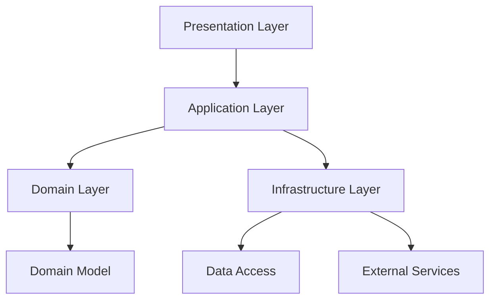
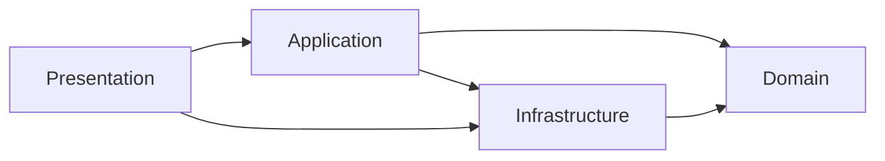

## 🏷️ Tags

#type/area #area/architecture #concept/microservice #concept/clean-architecture #concept/ddd 

---

> [!info] Domain-Driven Design (DDD) **Layer Separation** — это архитектурный принцип разделения приложения на изолированные слои с четко определенными зависимостями и ответственностью.

## 🏗️ Основные слои DDD



### 1. 🎨 Presentation Layer (Слой представления)

> [!example]- Контроллеры, UI компоненты Отвечает за взаимодействие с пользователем и внешними системами

```csharp
[ApiController]
[Route("api/[controller]")]
public class OrderController : ControllerBase
{
    private readonly IOrderService _orderService;
    
    public OrderController(IOrderService orderService)
    {
        _orderService = orderService;
    }
    
    [HttpPost]
    public async Task<IActionResult> CreateOrder([FromBody] CreateOrderDto dto)
    {
        var command = new CreateOrderCommand(dto.CustomerId, dto.Items);
        var result = await _orderService.CreateOrderAsync(command);
        return Ok(result);
    }
}
```

### 2. 🚀 Application Layer (Слой приложения)

> [!example]- Сервисы приложения, команды, запросы Координирует бизнес-логику и управляет транзакциями

```csharp
public interface IOrderService
{
    Task<OrderResult> CreateOrderAsync(CreateOrderCommand command);
}

public class OrderService : IOrderService
{
    private readonly IOrderRepository _orderRepository;
    private readonly IPaymentService _paymentService;
    private readonly IUnitOfWork _unitOfWork;
    
    public async Task<OrderResult> CreateOrderAsync(CreateOrderCommand command)
    {
        // Валидация
        if (command.Items == null || !command.Items.Any())
            throw new DomainException("Order must have items");
            
        // Создание доменной модели
        var order = Order.Create(command.CustomerId, command.Items);
        
        // Сохранение
        await _orderRepository.AddAsync(order);
        await _unitOfWork.SaveChangesAsync();
        
        return new OrderResult(order.Id, order.Status);
    }
}
```

### 3. 💎 Domain Layer (Доменный слой)

> [!important] Ядро системы Содержит бизнес-логику, доменные модели, правила и инварианты

#### Domain Entities

```csharp
public class Order : AggregateRoot
{
    private readonly List<OrderItem> _items = new();
    
    public OrderId Id { get; private set; }
    public CustomerId CustomerId { get; private set; }
    public OrderStatus Status { get; private set; }
    public DateTime CreatedAt { get; private set; }
    public IReadOnlyList<OrderItem> Items => _items.AsReadOnly();
    
    private Order() { } // EF Constructor
    
    private Order(CustomerId customerId, IEnumerable<OrderItem> items)
    {
        Id = OrderId.New();
        CustomerId = customerId;
        Status = OrderStatus.Pending;
        CreatedAt = DateTime.UtcNow;
        _items.AddRange(items);
        
        // Доменное событие
        AddDomainEvent(new OrderCreatedEvent(Id, CustomerId));
    }
    
    public static Order Create(CustomerId customerId, IEnumerable<OrderItemDto> itemDtos)
    {
        var items = itemDtos.Select(dto => 
            OrderItem.Create(dto.ProductId, dto.Quantity, dto.Price));
            
        return new Order(customerId, items);
    }
    
    public void ConfirmPayment()
    {
        if (Status != OrderStatus.Pending)
            throw new DomainException("Can only confirm pending orders");
            
        Status = OrderStatus.Confirmed;
        AddDomainEvent(new OrderConfirmedEvent(Id));
    }
}
```

#### Value Objects

```csharp
public record OrderId(Guid Value)
{
    public static OrderId New() => new(Guid.NewGuid());
    public static implicit operator Guid(OrderId id) => id.Value;
}

public record Money(decimal Amount, string Currency)
{
    public static Money operator +(Money left, Money right)
    {
        if (left.Currency != right.Currency)
            throw new DomainException("Cannot add different currencies");
            
        return new Money(left.Amount + right.Amount, left.Currency);
    }
}
```

#### Domain Services

```csharp
public interface IOrderDomainService
{
    bool CanProcessOrder(Order order, Customer customer);
}

public class OrderDomainService : IOrderDomainService
{
    public bool CanProcessOrder(Order order, Customer customer)
    {
        return customer.IsActive && 
               customer.CreditLimit >= order.TotalAmount;
    }
}
```

### 4. 🔧 Infrastructure Layer (Слой инфраструктуры)

> [!example]- Репозитории, внешние сервисы, БД Реализует технические детали и внешние зависимости

```csharp
// Repository Implementation
public class OrderRepository : IOrderRepository
{
    private readonly AppDbContext _context;
    
    public OrderRepository(AppDbContext context)
    {
        _context = context;
    }
    
    public async Task<Order> GetByIdAsync(OrderId id)
    {
        return await _context.Orders
            .Include(o => o.Items)
            .FirstOrDefaultAsync(o => o.Id == id);
    }
    
    public async Task AddAsync(Order order)
    {
        await _context.Orders.AddAsync(order);
    }
}

// External Service
public class PaymentService : IPaymentService
{
    private readonly HttpClient _httpClient;
    
    public async Task<PaymentResult> ProcessPaymentAsync(PaymentRequest request)
    {
        // Вызов внешнего API
        var response = await _httpClient.PostAsJsonAsync("/payments", request);
        return await response.Content.ReadFromJsonAsync<PaymentResult>();
    }
}
```

## 📋 Принципы разделения слоев

|Принцип|Описание|Пример нарушения ❌|
|---|---|---|
|**Dependency Inversion**|Зависимости направлены к центру|Domain зависит от Infrastructure|
|**Single Responsibility**|Каждый слой имеет одну ответственность|Controller содержит бизнес-логику|
|**Separation of Concerns**|Разделение забот между слоями|Repository в Domain слое|

## 🎯 Направление зависимостей

> [!warning] Правило зависимостей Зависимости должны быть направлены **ТОЛЬКО** к доменному слою!



## 💡 Преимущества Layer Separation

> [!success] Плюсы архитектуры
> 
> - ✅ **Тестируемость** — легко mock'ать зависимости
> - ✅ **Maintainability** — изменения изолированы
> - ✅ **Flexibility** — замена реализаций без изменения логики
> - ✅ **Scalability** — независимое развитие слоев

## 🔄 Dependency Injection Setup

```csharp
// Program.cs
var builder = WebApplication.CreateBuilder(args);

// Domain Services
builder.Services.AddScoped<IOrderDomainService, OrderDomainService>();

// Application Services
builder.Services.AddScoped<IOrderService, OrderService>();

// Infrastructure Services
builder.Services.AddScoped<IOrderRepository, OrderRepository>();
builder.Services.AddScoped<IPaymentService, PaymentService>();
builder.Services.AddScoped<IUnitOfWork, UnitOfWork>();

// DbContext
builder.Services.AddDbContext<AppDbContext>(options =>
    options.UseSqlServer(connectionString));
```

## 📚 Практические рекомендации

> [!tip] Best Practices
> 
> 1. **Domain слой** не должен зависеть от других слоев
> 2. **Application слой** координирует, но не содержит бизнес-правил
> 3. **Infrastructure** реализует интерфейсы из Domain
> 4. Используйте **Dependency Injection** для разрешения зависимостей
> 5. Покрывайте **Domain слой** unit-тестами на 100%

> [!note] Связанные концепции
> 
> - [[Clean Architecture]]
> - [[CQRS Pattern]]
> - [[Repository Pattern]]
> - [[Unit of Work Pattern]]

---

