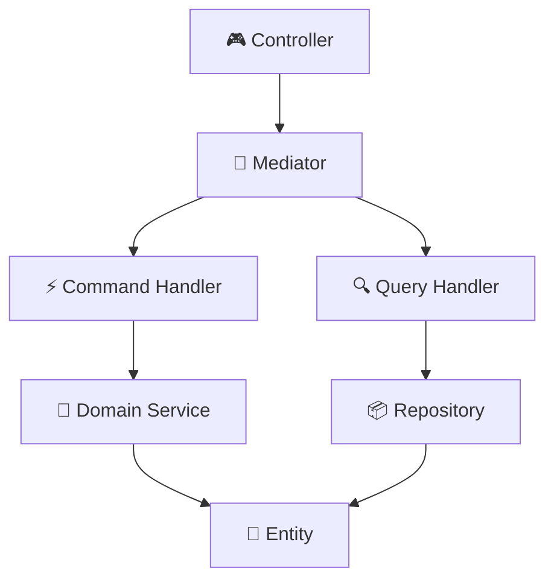

## 🏷️ Tags

#type/area #area/architecture #concept/microservice #concept/clean-architecture #concept/ddd 

---

> [!abstract]+ 📋 Краткое содержание **MediatR** в контексте **Domain-Driven Design** - это паттерн посредника, который помогает реализовать слабую связанность между компонентами приложения через централизованную обработку команд, запросов и уведомлений.

---

## 🎯 Что такое MediatR Pattern?

**MediatR** - это библиотека для .NET, реализующая паттерн **Mediator**, который:

- Централизует обработку бизнес-логики
- Разделяет команды (Commands) и запросы (Queries) - принцип **CQRS**
- Обеспечивает слабую связанность между компонентами
- Упрощает тестирование и поддержку кода

> [!tip]+ 💡 Ключевая идея Вместо прямого вызова сервисов, все запросы проходят через единого посредника - **Mediator**

---

## 🏗️ Архитектура DDD с MediatR



---

## 📦 Установка

```bash
Install-Package MediatR
Install-Package MediatR.Extensions.Microsoft.DependencyInjection
```

---

## 🔧 Базовая настройка

### Program.cs (Регистрация)

```csharp
builder.Services.AddMediatR(cfg => 
    cfg.RegisterServicesFromAssembly(typeof(Program).Assembly));
```

### Контроллер

```csharp
[ApiController]
[Route("api/[controller]")]
public class UsersController : ControllerBase
{
    private readonly IMediator _mediator;

    public UsersController(IMediator mediator)
    {
        _mediator = mediator;
    }

    [HttpPost]
    public async Task<IActionResult> CreateUser(CreateUserCommand command)
    {
        var result = await _mediator.Send(command);
        return Ok(result);
    }

    [HttpGet("{id}")]
    public async Task<IActionResult> GetUser(int id)
    {
        var query = new GetUserQuery { Id = id };
        var user = await _mediator.Send(query);
        return Ok(user);
    }
}
```

---

## ⚡ Commands (Команды)

> [!info]+ 📝 Команды изменяют состояние системы Commands отвечают за операции **создания**, **обновления** и **удаления**

### Создание команды

```csharp
public class CreateUserCommand : IRequest<int>
{
    public string FirstName { get; set; }
    public string LastName { get; set; }
    public string Email { get; set; }
}
```

### Command Handler

```csharp
public class CreateUserCommandHandler : IRequestHandler<CreateUserCommand, int>
{
    private readonly IUserRepository _userRepository;
    private readonly IUserDomainService _domainService;

    public CreateUserCommandHandler(
        IUserRepository userRepository,
        IUserDomainService domainService)
    {
        _userRepository = userRepository;
        _domainService = domainService;
    }

    public async Task<int> Handle(CreateUserCommand request, CancellationToken cancellationToken)
    {
        // 🔍 Проверка бизнес-правил через Domain Service
        await _domainService.ValidateUniqueEmailAsync(request.Email);

        // 🏗️ Создание доменной сущности
        var user = User.Create(request.FirstName, request.LastName, request.Email);

        // 💾 Сохранение
        await _userRepository.AddAsync(user);
        await _userRepository.SaveChangesAsync();

        return user.Id;
    }
}
```

---

## 🔍 Queries (Запросы)

> [!success]+ 📊 Запросы возвращают данные Queries отвечают за операции **чтения** без изменения состояния

### Создание запроса

```csharp
public class GetUserQuery : IRequest<UserDto>
{
    public int Id { get; set; }
}

public class UserDto
{
    public int Id { get; set; }
    public string FullName { get; set; }
    public string Email { get; set; }
}
```

### Query Handler

```csharp
public class GetUserQueryHandler : IRequestHandler<GetUserQuery, UserDto>
{
    private readonly IUserRepository _userRepository;

    public GetUserQueryHandler(IUserRepository userRepository)
    {
        _userRepository = userRepository;
    }

    public async Task<UserDto> Handle(GetUserQuery request, CancellationToken cancellationToken)
    {
        var user = await _userRepository.GetByIdAsync(request.Id);
        
        if (user == null)
            throw new UserNotFoundException($"User with ID {request.Id} not found");

        return new UserDto
        {
            Id = user.Id,
            FullName = $"{user.FirstName} {user.LastName}",
            Email = user.Email
        };
    }
}
```

---

## 🔔 Notifications (Уведомления)

> [!warning]+ 📡 Уведомления для событий Notifications позволяют реализовать паттерн **Observer** для доменных событий

### Domain Event

```csharp
public class UserCreatedEvent : INotification
{
    public int UserId { get; }
    public string Email { get; }
    public DateTime CreatedAt { get; }

    public UserCreatedEvent(int userId, string email)
    {
        UserId = userId;
        Email = email;
        CreatedAt = DateTime.UtcNow;
    }
}
```

### Event Handlers

```csharp
public class SendWelcomeEmailHandler : INotificationHandler<UserCreatedEvent>
{
    private readonly IEmailService _emailService;

    public SendWelcomeEmailHandler(IEmailService emailService)
    {
        _emailService = emailService;
    }

    public async Task Handle(UserCreatedEvent notification, CancellationToken cancellationToken)
    {
        await _emailService.SendWelcomeEmailAsync(notification.Email);
    }
}

public class LogUserCreationHandler : INotificationHandler<UserCreatedEvent>
{
    private readonly ILogger<LogUserCreationHandler> _logger;

    public LogUserCreationHandler(ILogger<LogUserCreationHandler> logger)
    {
        _logger = logger;
    }

    public async Task Handle(UserCreatedEvent notification, CancellationToken cancellationToken)
    {
        _logger.LogInformation($"New user created: {notification.UserId}");
    }
}
```

### Публикация события

```csharp
public async Task<int> Handle(CreateUserCommand request, CancellationToken cancellationToken)
{
    var user = User.Create(request.FirstName, request.LastName, request.Email);
    
    await _userRepository.AddAsync(user);
    await _userRepository.SaveChangesAsync();

    // 🔔 Публикация доменного события
    var userCreatedEvent = new UserCreatedEvent(user.Id, user.Email);
    await _mediator.Publish(userCreatedEvent, cancellationToken);

    return user.Id;
}
```

---

## 🛡️ Pipeline Behaviors (Поведения)

> [!note]+ ⚙️ Кросс-функциональные возможности Pipeline Behaviors позволяют добавить **валидацию**, **логирование**, **кеширование** и другие аспекты

### Поведение для валидации

```csharp
public class ValidationBehavior<TRequest, TResponse> : IPipelineBehavior<TRequest, TResponse>
    where TRequest : IRequest<TResponse>
{
    private readonly IEnumerable<IValidator<TRequest>> _validators;

    public ValidationBehavior(IEnumerable<IValidator<TRequest>> validators)
    {
        _validators = validators;
    }

    public async Task<TResponse> Handle(TRequest request, RequestHandlerDelegate<TResponse> next, CancellationToken cancellationToken)
    {
        if (_validators.Any())
        {
            var validationResults = await Task.WhenAll(
                _validators.Select(validator => validator.ValidateAsync(request, cancellationToken)));

            var errors = validationResults
                .Where(result => !result.IsValid)
                .SelectMany(result => result.Errors)
                .ToList();

            if (errors.Any())
                throw new ValidationException(errors);
        }

        return await next();
    }
}
```

### Поведение для логирования

```csharp
public class LoggingBehavior<TRequest, TResponse> : IPipelineBehavior<TRequest, TResponse>
    where TRequest : IRequest<TResponse>
{
    private readonly ILogger<LoggingBehavior<TRequest, TResponse>> _logger;

    public LoggingBehavior(ILogger<LoggingBehavior<TRequest, TResponse>> logger)
    {
        _logger = logger;
    }

    public async Task<TResponse> Handle(TRequest request, RequestHandlerDelegate<TResponse> next, CancellationToken cancellationToken)
    {
        var requestName = typeof(TRequest).Name;
        
        _logger.LogInformation("📥 Handling {RequestName}", requestName);
        
        var stopwatch = Stopwatch.StartNew();
        var response = await next();
        stopwatch.Stop();
        
        _logger.LogInformation("📤 Handled {RequestName} in {ElapsedMs}ms", requestName, stopwatch.ElapsedMilliseconds);
        
        return response;
    }
}
```

### Регистрация поведений

```csharp
builder.Services.AddMediatR(cfg =>
{
    cfg.RegisterServicesFromAssembly(typeof(Program).Assembly);
    cfg.AddBehavior<ValidationBehavior<,>>();
    cfg.AddBehavior<LoggingBehavior<,>>();
});
```

---

## 📊 Сравнение подходов

|Аспект|Без MediatR|С MediatR|
|---|---|---|
|**Связанность**|Высокая|Низкая|
|**Тестируемость**|Сложная|Простая|
|**Структура кода**|Размытая|Четкая|
|**CQRS**|Нет разделения|Четкое разделение|
|**Кросс-аспекты**|В каждом методе|Централизованно|

---

## ✅ Преимущества MediatR

> [!success]+ 🎯 Основные преимущества
> 
> - **Слабая связанность** - компоненты не знают друг о друге напрямую
> - **Единая точка входа** - все запросы проходят через Mediator
> - **CQRS из коробки** - четкое разделение команд и запросов
> - **Простое тестирование** - каждый handler тестируется изолированно
> - **Расширяемость** - легко добавлять новые behaviors
> - **Чистая архитектура** - соответствует принципам DDD

---

## ⚠️ Недостатки и ограничения

> [!warning]+ 🚨 Потенциальные проблемы
> 
> - **Дополнительная абстракция** - может усложнить простые сценарии
> - **Производительность** - небольшие накладные расходы на reflection
> - **Кривая обучения** - требует понимания паттерна Mediator
> - **Скрытые зависимости** - труднее отследить вызовы через IDE

---

## 🎯 Лучшие практики

> [!tip]+ 💎 Рекомендации
> 
> 1. **Одна ответственность** - один handler для одной операции
> 2. **Валидация на входе** - используйте ValidationBehavior
> 3. **Доменные события** - публикуйте через Notifications
> 4. **Изолированное тестирование** - тестируйте каждый handler отдельно
> 5. **Структура папок** - организуйте код по фичам
> 6. **Используйте DTO** - не возвращайте доменные сущности из Queries

---

## 📁 Рекомендуемая структура проекта

```
📦 MyApp.Application/
├── 📁 Features/
│   ├── 📁 Users/
│   │   ├── 📁 Commands/
│   │   │   ├── CreateUserCommand.cs
│   │   │   └── CreateUserCommandHandler.cs
│   │   ├── 📁 Queries/
│   │   │   ├── GetUserQuery.cs
│   │   │   └── GetUserQueryHandler.cs
│   │   └── 📁 Events/
│   │       ├── UserCreatedEvent.cs
│   │       └── UserCreatedEventHandlers.cs
│   └── 📁 Orders/
├── 📁 Behaviors/
│   ├── ValidationBehavior.cs
│   └── LoggingBehavior.cs
└── 📁 Common/
    ├── Interfaces/
    └── DTOs/
```

---

## 🎓 Заключение

> [!abstract]+ 📚 Резюме **MediatR Pattern** в DDD приложениях обеспечивает:
> 
> - Четкое разделение ответственности между компонентами
> - Простую реализацию CQRS
> - Централизованную обработку кросс-функциональных аспектов
> - Высокую тестируемость и поддерживаемость кода
> 
> Это мощный инструмент для создания **чистой архитектуры** в .NET приложениях! 🚀

---

