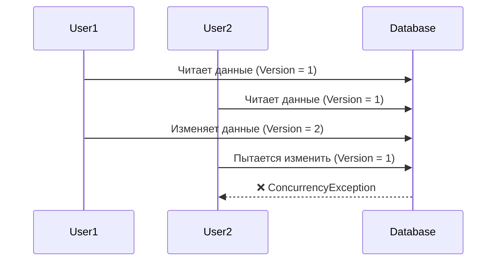

## 🏷️ Tags

#type/area #area/architecture #concept/microservice #concept/clean-architecture #concept/ddd 

---

> [!abstract] Краткое содержание **Optimistic Concurrency** в DDD — это стратегия управления одновременным доступом к данным, которая предполагает, что конфликты возникают редко. Вместо блокировки ресурсов заранее, система проверяет наличие изменений только в момент сохранения.

---

## 🎯 Основные концепции

### Что такое Optimistic Concurrency?



> [!info] Ключевая идея Система **доверяет**, что конфликты редки, и проверяет их только при сохранении

---

## ⚖️ Optimistic vs Pessimistic

|Аспект|🟢 Optimistic|🔴 Pessimistic|
|---|---|---|
|**Блокировка**|Нет блокировок до сохранения|Блокировка при чтении|
|**Производительность**|Высокая при редких конфликтах|Низкая из-за ожидания|
|**Сложность**|Требует обработки исключений|Проще в реализации|
|**Сценарий**|Веб-приложения, редкие изменения|Критичные операции|

---

## 🛠️ Реализация в .NET

### 1. Базовая модель с Version Token

```csharp
public abstract class AggregateRoot
{
    public int Version { get; protected set; } = 0;
    
    public void MarkAsModified()
    {
        Version++;
    }
}

public class Order : AggregateRoot
{
    public int Id { get; private set; }
    public decimal TotalAmount { get; private set; }
    public OrderStatus Status { get; private set; }
    
    public void UpdateAmount(decimal newAmount)
    {
        if (Status == OrderStatus.Cancelled)
            throw new InvalidOperationException("Cannot modify cancelled order");
            
        TotalAmount = newAmount;
        MarkAsModified(); // Увеличиваем версию
    }
}
```

### 2. Repository с проверкой версии

```csharp
public class OrderRepository
{
    private readonly AppDbContext _context;
    
    public async Task<Order> GetByIdAsync(int id)
    {
        return await _context.Orders.FindAsync(id);
    }
    
    public async Task SaveAsync(Order order)
    {
        var existing = await _context.Orders.FindAsync(order.Id);
        
        // 🔍 Проверяем версию
        if (existing.Version != order.Version - 1)
        {
            throw new ConcurrencyException(
                $"Order was modified by another user. " +
                $"Expected version: {order.Version - 1}, " +
                $"Actual version: {existing.Version}");
        }
        
        _context.Orders.Update(order);
        await _context.SaveChangesAsync();
    }
}
```

### 3. Entity Framework Core Integration

```csharp
public class AppDbContext : DbContext
{
    protected override void OnModelCreating(ModelBuilder modelBuilder)
    {
        modelBuilder.Entity<Order>(entity =>
        {
            // 🔧 Настраиваем Optimistic Concurrency
            entity.Property(e => e.Version)
                  .IsConcurrencyToken()
                  .HasDefaultValue(0);
        });
    }
}

// Альтернативный способ с RowVersion
public class Product : AggregateRoot
{
    [Timestamp] // SQL Server RowVersion
    public byte[] RowVersion { get; set; }
    
    public string Name { get; set; }
    public decimal Price { get; set; }
}
```

---

## 🎪 Практические сценарии

### Сценарий 1: Обновление профиля пользователя

```csharp
// ❌ Проблема: два пользователя редактируют профиль одновременно
public class UserProfileService
{
    public async Task UpdateProfileAsync(int userId, UpdateProfileCommand command)
    {
        var user = await _repository.GetByIdAsync(userId);
        
        // Пользователь 1 читает: Version = 5
        // Пользователь 2 читает: Version = 5
        
        user.UpdateEmail(command.Email);     // Version = 6
        user.UpdatePhone(command.Phone);     // Version = 6
        
        try
        {
            await _repository.SaveAsync(user);
            // ✅ Первый успешно сохраняет
            // ❌ Второй получает ConcurrencyException
        }
        catch (ConcurrencyException ex)
        {
            // 🔄 Retry logic или уведомление пользователя
            throw new BusinessException("Profile was updated by another session");
        }
    }
}
```

### Сценарий 2: Обработка заказов

```csharp
public class OrderProcessingService
{
    public async Task ProcessOrderAsync(int orderId)
    {
        var order = await _repository.GetByIdAsync(orderId);
        
        // Проверяем бизнес-правила
        if (order.Status != OrderStatus.Pending)
            return; // Уже обработан
            
        order.MarkAsProcessing();
        order.CalculateShipping();
        
        try 
        {
            await _repository.SaveAsync(order);
            await _eventBus.PublishAsync(new OrderProcessedEvent(order.Id));
        }
        catch (ConcurrencyException)
        {
            // Кто-то уже обработал заказ - это нормально
            _logger.LogInformation($"Order {orderId} was already processed");
        }
    }
}
```

---

## 🚨 Обработка конфликтов

### Стратегии разрешения

> [!warning] Важно Всегда обрабатывайте `ConcurrencyException` - это нормальная часть работы системы!

```csharp
public class ConflictResolutionStrategies
{
    // 🔄 Стратегия 1: Retry с экспоненциальной задержкой
    public async Task<T> RetryOnConflict<T>(Func<Task<T>> operation, int maxRetries = 3)
    {
        for (int i = 0; i < maxRetries; i++)
        {
            try 
            {
                return await operation();
            }
            catch (ConcurrencyException) when (i < maxRetries - 1)
            {
                await Task.Delay(TimeSpan.FromMilliseconds(Math.Pow(2, i) * 100));
            }
        }
        throw new MaxRetriesExceededException();
    }
    
    // 📊 Стратегия 2: Merge изменений
    public async Task MergeChanges(Order original, Order modified, Order current)
    {
        // Умное слияние изменений
        if (original.TotalAmount != modified.TotalAmount && 
            original.TotalAmount == current.TotalAmount)
        {
            current.UpdateAmount(modified.TotalAmount);
        }
        
        await _repository.SaveAsync(current);
    }
    
    // 👤 Стратегия 3: Уведомление пользователя
    public async Task<ConflictResult> HandleUserConflict(ConflictData conflict)
    {
        return new ConflictResult
        {
            Message = "Document was modified by another user",
            OriginalData = conflict.Original,
            ConflictingData = conflict.Current,
            RequiresUserDecision = true
        };
    }
}
```

---

## 📈 Мониторинг и метрики

```csharp
public class ConcurrencyMetrics
{
    private readonly IMetricsLogger _metrics;
    
    public async Task TrackConcurrencyConflict(string entityType, Exception ex)
    {
        _metrics.Counter("concurrency.conflicts")
               .WithTag("entity_type", entityType)
               .Increment();
               
        _logger.LogWarning(ex, 
            "Concurrency conflict detected for {EntityType}", entityType);
    }
}
```

> [!tip] Best Practices
> 
> - 📊 Мониторьте частоту конфликтов
> - 🔄 Реализуйте retry logic
> - 👥 Информируйте пользователей о конфликтах
> - ⚡ Минимизируйте время между чтением и записью

---

## 🎯 Когда использовать

### ✅ Подходящие сценарии

- **Веб-приложения** с редкими одновременными изменениями
- **Документооборот** где конфликты исключительны
- **Системы с высокой нагрузкой чтения** и редкой записью
- **Микросервисы** для минимизации блокировок

### ❌ Неподходящие сценарии

- **Банковские операции** (требуют строгой консистентности)
- **Счетчики** с частыми изменениями
- **Аукционы в реальном времени**
- **Системы с высокой конкуренцией за ресурсы**

---

## 💡 Заключение

> [!success] Ключевые выводы
> 
> - **Optimistic Concurrency** оптимален для систем с редкими конфликтами
> - Требует **обязательной обработки** исключений конкурентности
> - Обеспечивает **высокую производительность** в веб-приложениях
> - Должен использоваться с **proper retry logic** и мониторингом

```csharp
// 🏆 Финальный пример: Complete Implementation
public class OptimisticConcurrencyPattern<T> where T : AggregateRoot
{
    public async Task<Result<T>> ExecuteWithOptimisticConcurrency<TResult>(
        Func<T, Task<TResult>> operation,
        T aggregate,
        int maxRetries = 3)
    {
        return await RetryPolicy.ExecuteAsync(async () =>
        {
            try
            {
                var result = await operation(aggregate);
                await _repository.SaveAsync(aggregate);
                return Result.Success(result);
            }
            catch (ConcurrencyException ex)
            {
                await _metrics.TrackConflict(typeof(T).Name);
                throw; // Будет обработано retry policy
            }
        }, maxRetries);
    }
}
```

---

## 📚 Дополнительные ресурсы

- [[Event Sourcing]] - альтернативный подход к concurrency
- [[Saga Pattern]] - для управления distributed transactions
- [[CQRS]] - разделение команд и запросов
