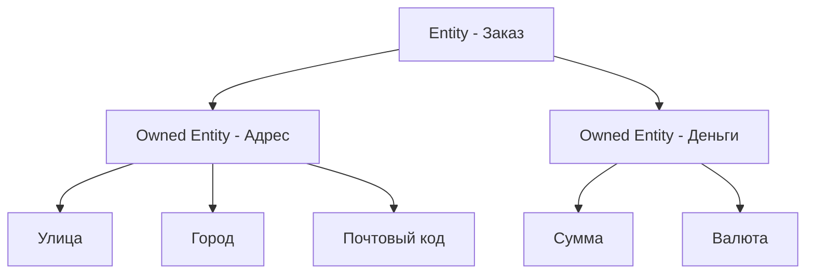

## 🏷️ Tags

#type/area #area/architecture #concept/microservice #concept/clean-architecture #concept/ddd 

---

> [!info] 📚 Определение **Owned Entities** (Принадлежащие сущности) - это объекты-значения в EF Core, которые не имеют собственной идентичности и полностью принадлежат родительской сущности.

---

## 🎯 Ключевые концепции



### 🔑 Основные принципы

|Принцип|Описание|
|---|---|
|**Без идентичности**|Не имеют собственного ID|
|**Принадлежность**|Существуют только в контексте родительской сущности|
|**Жизненный цикл**|Управляется родительской сущностью|
|**Инкапсуляция**|Содержат логику и валидацию|

---

## 💡 Практические примеры

### 📍 Пример 1: Адрес как Owned Entity

```csharp
// Value Object - Адрес
public class Address
{
    public string Street { get; private set; }
    public string City { get; private set; }
    public string PostalCode { get; private set; }
    public string Country { get; private set; }

    private Address() { } // Для EF Core

    public Address(string street, string city, string postalCode, string country)
    {
        if (string.IsNullOrWhiteSpace(street))
            throw new ArgumentException("Street is required");
        
        Street = street;
        City = city;
        PostalCode = postalCode;
        Country = country;
    }

    public string GetFullAddress() => $"{Street}, {City}, {PostalCode}, {Country}";
}

// Родительская сущность
public class Customer
{
    public int Id { get; private set; }
    public string Name { get; private set; }
    public Address ShippingAddress { get; private set; } // Owned Entity
    public Address BillingAddress { get; private set; }  // Owned Entity

    public void UpdateShippingAddress(Address address)
    {
        ShippingAddress = address ?? throw new ArgumentNullException(nameof(address));
    }
}
```

> [!tip] 💡 Совет Используйте приватные сеттеры и конструкторы для инкапсуляции логики валидации.

### 💰 Пример 2: Денежные средства

```csharp
public class Money
{
    public decimal Amount { get; private set; }
    public string Currency { get; private set; }

    private Money() { }

    public Money(decimal amount, string currency)
    {
        if (amount < 0)
            throw new ArgumentException("Amount cannot be negative");
        
        if (string.IsNullOrWhiteSpace(currency))
            throw new ArgumentException("Currency is required");

        Amount = amount;
        Currency = currency;
    }

    public Money Add(Money other)
    {
        if (Currency != other.Currency)
            throw new InvalidOperationException("Cannot add money with different currencies");
        
        return new Money(Amount + other.Amount, Currency);
    }

    public override string ToString() => $"{Amount:C} {Currency}";
}

public class Order
{
    public int Id { get; private set; }
    public Money TotalAmount { get; private set; } // Owned Entity
    public DateTime CreatedAt { get; private set; }

    public void UpdateTotal(Money amount)
    {
        TotalAmount = amount;
    }
}
```

---

## ⚙️ Конфигурация в EF Core

### 📊 Через Fluent API

```csharp
public class ApplicationDbContext : DbContext
{
    public DbSet<Customer> Customers { get; set; }
    public DbSet<Order> Orders { get; set; }

    protected override void OnModelCreating(ModelBuilder modelBuilder)
    {
        // Конфигурация Address как Owned Entity
        modelBuilder.Entity<Customer>()
            .OwnsOne(c => c.ShippingAddress, sa =>
            {
                sa.Property(a => a.Street).HasColumnName("ShippingStreet");
                sa.Property(a => a.City).HasColumnName("ShippingCity");
                sa.Property(a => a.PostalCode).HasColumnName("ShippingPostalCode");
                sa.Property(a => a.Country).HasColumnName("ShippingCountry");
            });

        modelBuilder.Entity<Customer>()
            .OwnsOne(c => c.BillingAddress, ba =>
            {
                ba.Property(a => a.Street).HasColumnName("BillingStreet");
                ba.Property(a => a.City).HasColumnName("BillingCity");
                ba.Property(a => a.PostalCode).HasColumnName("BillingPostalCode");
                ba.Property(a => a.Country).HasColumnName("BillingCountry");
            });

        // Конфигурация Money как Owned Entity
        modelBuilder.Entity<Order>()
            .OwnsOne(o => o.TotalAmount, ta =>
            {
                ta.Property(m => m.Amount).HasColumnName("TotalAmount");
                ta.Property(m => m.Currency).HasColumnName("Currency");
            });
    }
}
```

### 📋 Через Data Annotations

```csharp
public class Customer
{
    public int Id { get; private set; }
    public string Name { get; private set; }
    
    [Owned]
    public Address ShippingAddress { get; private set; }
    
    [Owned]
    public Address BillingAddress { get; private set; }
}
```

---

## 📊 Сравнение подходов

|Аспект|Entity|Owned Entity|Value Object|
|---|---|---|---|
|**Идентичность**|✅ Есть ID|❌ Нет ID|❌ Нет ID|
|**Жизненный цикл**|Независимый|Зависимый|Зависимый|
|**Таблица БД**|Собственная|В родительской|В родительской|
|**Изменяемость**|Мутабельный|Иммутабельный|Иммутабельный|

---

## ✅ Лучшие практики

> [!success] ✨ Do
> 
> - Используйте для Value Objects без собственной идентичности
> - Инкапсулируйте бизнес-логику внутри Owned Entity
> - Делайте их иммутабельными
> - Добавляйте валидацию в конструктор

> [!error] ❌ Don't
> 
> - Не используйте для сущностей с собственным жизненным циклом
> - Не создавайте сложные иерархии Owned Entities
> - Не забывайте про производительность при глубокой вложенности

---

## 🧪 Тестирование

```csharp
[Test]
public void Address_Should_ValidateRequiredFields()
{
    // Arrange & Act & Assert
    Assert.Throws<ArgumentException>(() => 
        new Address("", "Moscow", "123456", "Russia"));
}

[Test]
public void Money_Should_AddSameCurrency()
{
    // Arrange
    var money1 = new Money(100, "USD");
    var money2 = new Money(50, "USD");

    // Act
    var result = money1.Add(money2);

    // Assert
    Assert.AreEqual(150, result.Amount);
    Assert.AreEqual("USD", result.Currency);
}
```

---

## 🔗 Связанные темы

- [[Value Objects in EF|Value Objects in EF]]
- [[Aggregates & Aggregate Root|Aggregates & Aggregate Root]]
- [[Entity Framework Core]]
- [[Domain Modeling]]

> [!quote] 💭 Заключение Owned Entities - мощный инструмент DDD для моделирования объектов-значений в EF Core. Они помогают инкапсулировать логику, обеспечивают целостность данных и делают код более выразительным.

---
