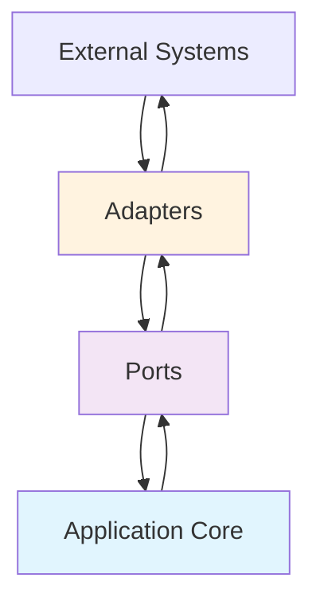

## 🏷️ Tags

#type/area #area/architecture #concept/microservice #concept/clean-architecture #concept/ddd 

---

> [!abstract] Ключевая идея **Ports & Adapters** (также известен как **Hexagonal Architecture**) - это архитектурный паттерн, который изолирует бизнес-логику приложения от внешних деталей через определение портов и адаптеров.

---

## 🏗️ Основные концепции

### Что такое Ports & Adapters?



> [!info] Определение
> 
> - **Port (Порт)** - интерфейс, который определяет, как взаимодействовать с приложением
> - **Adapter (Адаптер)** - реализация порта для конкретной технологии
> - **Application Core** - бизнес-логика, изолированная от внешних деталей

---

## 🔧 Типы портов

### Primary Ports (Входящие)

Порты для **входящих** запросов (от UI, API, CLI)

```csharp
// Primary Port - интерфейс для управления заказами
public interface IOrderService
{
    Task<OrderDto> CreateOrderAsync(CreateOrderRequest request);
    Task<OrderDto> GetOrderAsync(int orderId);
    Task<List<OrderDto>> GetOrdersAsync();
}
```

### Secondary Ports (Исходящие)

Порты для **исходящих** зависимостей (база данных, внешние API)

```csharp
// Secondary Port - интерфейс для работы с хранилищем
public interface IOrderRepository
{
    Task<Order> SaveAsync(Order order);
    Task<Order> GetByIdAsync(int id);
    Task<List<Order>> GetAllAsync();
}

// Secondary Port - интерфейс для уведомлений
public interface INotificationService
{
    Task SendOrderConfirmationAsync(Order order);
}
```

---

## 🔌 Реализация адаптеров

### Primary Adapters (Входящие)

#### Web API Controller

```csharp
[ApiController]
[Route("api/[controller]")]
public class OrdersController : ControllerBase
{
    private readonly IOrderService _orderService;

    public OrdersController(IOrderService orderService)
    {
        _orderService = orderService;
    }

    [HttpPost]
    public async Task<ActionResult<OrderDto>> CreateOrder(
        [FromBody] CreateOrderRequest request)
    {
        var order = await _orderService.CreateOrderAsync(request);
        return CreatedAtAction(nameof(GetOrder), 
            new { id = order.Id }, order);
    }

    [HttpGet("{id}")]
    public async Task<ActionResult<OrderDto>> GetOrder(int id)
    {
        var order = await _orderService.GetOrderAsync(id);
        return Ok(order);
    }
}
```

#### CLI Adapter

```csharp
public class OrderCliAdapter
{
    private readonly IOrderService _orderService;

    public OrderCliAdapter(IOrderService orderService)
    {
        _orderService = orderService;
    }

    public async Task HandleCreateOrderCommand(string[] args)
    {
        var request = ParseCreateOrderRequest(args);
        var order = await _orderService.CreateOrderAsync(request);
        
        Console.WriteLine($"Order created: {order.Id}");
    }
}
```

### Secondary Adapters (Исходящие)

#### Database Adapter (Entity Framework)

```csharp
public class EfOrderRepository : IOrderRepository
{
    private readonly ApplicationDbContext _context;

    public EfOrderRepository(ApplicationDbContext context)
    {
        _context = context;
    }

    public async Task<Order> SaveAsync(Order order)
    {
        _context.Orders.Add(order);
        await _context.SaveChangesAsync();
        return order;
    }

    public async Task<Order> GetByIdAsync(int id)
    {
        return await _context.Orders
            .FirstOrDefaultAsync(o => o.Id == id);
    }

    public async Task<List<Order>> GetAllAsync()
    {
        return await _context.Orders.ToListAsync();
    }
}
```

#### Email Notification Adapter

```csharp
public class EmailNotificationAdapter : INotificationService
{
    private readonly IEmailService _emailService;

    public EmailNotificationAdapter(IEmailService emailService)
    {
        _emailService = emailService;
    }

    public async Task SendOrderConfirmationAsync(Order order)
    {
        var emailContent = CreateOrderConfirmationEmail(order);
        await _emailService.SendAsync(
            order.CustomerEmail, 
            "Order Confirmation", 
            emailContent);
    }
}
```

---

## 🏢 Бизнес-логика (Application Core)

```csharp
public class OrderService : IOrderService
{
    private readonly IOrderRepository _orderRepository;
    private readonly INotificationService _notificationService;

    public OrderService(
        IOrderRepository orderRepository,
        INotificationService notificationService)
    {
        _orderRepository = orderRepository;
        _notificationService = notificationService;
    }

    public async Task<OrderDto> CreateOrderAsync(CreateOrderRequest request)
    {
        // Валидация бизнес-правил
        ValidateOrderRequest(request);
        
        // Создание доменной сущности
        var order = new Order(
            request.CustomerId,
            request.Items,
            DateTime.UtcNow);

        // Сохранение через порт
        var savedOrder = await _orderRepository.SaveAsync(order);
        
        // Отправка уведомления через порт
        await _notificationService.SendOrderConfirmationAsync(savedOrder);
        
        return MapToDto(savedOrder);
    }

    private void ValidateOrderRequest(CreateOrderRequest request)
    {
        if (request.Items == null || !request.Items.Any())
            throw new ArgumentException("Order must contain at least one item");
        
        if (request.Items.Any(item => item.Quantity <= 0))
            throw new ArgumentException("Item quantities must be positive");
    }
}
```

---

## ⚙️ Dependency Injection Configuration

```csharp
public class Startup
{
    public void ConfigureServices(IServiceCollection services)
    {
        // Primary Ports (Application Services)
        services.AddScoped<IOrderService, OrderService>();
        
        // Secondary Ports - Database
        services.AddScoped<IOrderRepository, EfOrderRepository>();
        
        // Secondary Ports - External Services
        services.AddScoped<INotificationService, EmailNotificationAdapter>();
        services.AddScoped<IEmailService, SmtpEmailService>();
        
        // Infrastructure
        services.AddDbContext<ApplicationDbContext>(options =>
            options.UseSqlServer(connectionString));
    }
}
```

---

## 🎯 Преимущества

> [!success] Ключевые преимущества
> 
> - **Тестируемость** - легко мокать внешние зависимости
> - **Гибкость** - можно менять адаптеры без изменения бизнес-логики
> - **Независимость от фреймворков** - бизнес-логика не зависит от конкретных технологий
> - **Чистая архитектура** - четкое разделение ответственностей

### Пример тестирования

```csharp
[Test]
public async Task CreateOrder_ValidRequest_ReturnsOrderDto()
{
    // Arrange
    var mockRepository = new Mock<IOrderRepository>();
    var mockNotification = new Mock<INotificationService>();
    
    var service = new OrderService(
        mockRepository.Object, 
        mockNotification.Object);
    
    var request = new CreateOrderRequest
    {
        CustomerId = 1,
        Items = new[] { new OrderItem { ProductId = 1, Quantity = 2 } }
    };

    // Act
    var result = await service.CreateOrderAsync(request);

    // Assert
    Assert.NotNull(result);
    mockRepository.Verify(r => r.SaveAsync(It.IsAny<Order>()), Times.Once);
    mockNotification.Verify(n => n.SendOrderConfirmationAsync(It.IsAny<Order>()), Times.Once);
}
```

---

## 📊 Сравнение с другими паттернами

|Аспект|Ports & Adapters|Layered Architecture|Clean Architecture|
|---|---|---|---|
|**Направление зависимостей**|Внутрь к ядру|Вниз по слоям|Внутрь к ядру|
|**Тестируемость**|⭐⭐⭐⭐⭐|⭐⭐⭐|⭐⭐⭐⭐⭐|
|**Гибкость**|⭐⭐⭐⭐⭐|⭐⭐|⭐⭐⭐⭐|
|**Простота понимания**|⭐⭐⭐|⭐⭐⭐⭐⭐|⭐⭐⭐|

---

## 🚀 Практические рекомендации

> [!tip] Best Practices
> 
> 1. **Определяйте порты на основе бизнес-потребностей**, а не технических деталей
> 2. **Держите адаптеры тонкими** - минимум логики, максимум адаптации
> 3. **Используйте DTO** для передачи данных через границы
> 4. **Тестируйте бизнес-логику изолированно** от адаптеров

> [!warning] Частые ошибки
> 
> - Смешивание бизнес-логики с адаптерами
> - Слишком детализированные интерфейсы портов
> - Прямые зависимости между адаптерами
> - Игнорирование принципа инверсии зависимостей

---

## 📚 Связанные концепции

- [[Clean Architecture]]
- [[Domain-Driven Design]]
- [[Dependency Inversion Principle|Dependency Inversion Principle]]
- [[Repository Pattern]]
- [[CQRS Pattern]]

---
