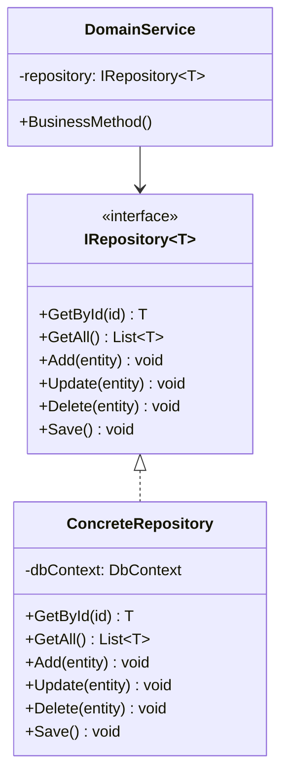

## 🏷️ Tags

#type/area #area/architecture #concept/microservice #concept/clean-architecture #concept/ddd 

---

> [!abstract] Краткое описание Repository Pattern в Domain-Driven Design обеспечивает абстракцию доступа к данным, инкапсулируя логику получения и сохранения объектов домена. Это позволяет сосредоточиться на бизнес-логике, а не на деталях хранения данных.

---

## 📋 Содержание

- [[#🎯 Основные концепции|🎯 Основные концепции]]
- [[#🏗️ Структура паттерна|🏗️ Структура паттерна]]
- [[#💻 Примеры реализации|💻 Примеры реализации]]
- [[#✅ Преимущества и недостатки|✅ Преимущества и недостатки]]
- [[#🔧 Лучшие практики|🔧 Лучшие практики]]

---

## 🎯 Основные концепции

> [!info] Определение **Repository Pattern** — это паттерн проектирования, который инкапсулирует логику доступа к источникам данных, предоставляя единообразный интерфейс для работы с коллекциями объектов домена.

### Ключевые принципы

- **Абстракция** — скрывает детали работы с хранилищем данных
- **Единообразие** — предоставляет консистентный API для всех операций
- **Тестируемость** — позволяет легко создавать mock-объекты для тестирования

> [!tip] В контексте DDD Repository работает с **Aggregate Root** объектами и обеспечивает их целостность при загрузке и сохранении.

---

## 🏗️ Структура паттерна



---

## 💻 Примеры реализации

### 🔸 Базовый интерфейс Repository

```csharp
public interface IRepository<T> where T : class, IAggregateRoot
{
    Task<T?> GetByIdAsync(Guid id);
    Task<IEnumerable<T>> GetAllAsync();
    Task<IEnumerable<T>> FindAsync(Expression<Func<T, bool>> predicate);
    void Add(T entity);
    void Update(T entity);
    void Remove(T entity);
}
```

### 🔸 Специфичный интерфейс для домена

```csharp
public interface IUserRepository : IRepository<User>
{
    Task<User?> GetByEmailAsync(string email);
    Task<IEnumerable<User>> GetActiveUsersAsync();
    Task<bool> ExistsByEmailAsync(string email);
}
```

### 🔸 Реализация Repository

```csharp
public class UserRepository : IUserRepository
{
    private readonly ApplicationDbContext _context;

    public UserRepository(ApplicationDbContext context)
    {
        _context = context ?? throw new ArgumentNullException(nameof(context));
    }

    public async Task<User?> GetByIdAsync(Guid id)
    {
        return await _context.Users
            .Include(u => u.Profile)
            .FirstOrDefaultAsync(u => u.Id == id);
    }

    public async Task<IEnumerable<User>> GetAllAsync()
    {
        return await _context.Users
            .Include(u => u.Profile)
            .ToListAsync();
    }

    public async Task<IEnumerable<User>> FindAsync(Expression<Func<User, bool>> predicate)
    {
        return await _context.Users
            .Where(predicate)
            .ToListAsync();
    }

    public async Task<User?> GetByEmailAsync(string email)
    {
        return await _context.Users
            .FirstOrDefaultAsync(u => u.Email.Value == email);
    }

    public async Task<IEnumerable<User>> GetActiveUsersAsync()
    {
        return await _context.Users
            .Where(u => u.IsActive)
            .ToListAsync();
    }

    public async Task<bool> ExistsByEmailAsync(string email)
    {
        return await _context.Users
            .AnyAsync(u => u.Email.Value == email);
    }

    public void Add(User entity)
    {
        _context.Users.Add(entity);
    }

    public void Update(User entity)
    {
        _context.Entry(entity).State = EntityState.Modified;
    }

    public void Remove(User entity)
    {
        _context.Users.Remove(entity);
    }
}
```

### 🔸 Unit of Work паттерн

> [!note] Важно Repository часто используется вместе с Unit of Work для управления транзакциями.

```csharp
public interface IUnitOfWork : IDisposable
{
    IUserRepository Users { get; }
    IOrderRepository Orders { get; }
    Task<int> SaveChangesAsync();
    Task BeginTransactionAsync();
    Task CommitTransactionAsync();
    Task RollbackTransactionAsync();
}

public class UnitOfWork : IUnitOfWork
{
    private readonly ApplicationDbContext _context;
    private IDbContextTransaction? _transaction;

    public UnitOfWork(ApplicationDbContext context)
    {
        _context = context;
        Users = new UserRepository(_context);
        Orders = new OrderRepository(_context);
    }

    public IUserRepository Users { get; }
    public IOrderRepository Orders { get; }

    public async Task<int> SaveChangesAsync()
    {
        return await _context.SaveChangesAsync();
    }

    public async Task BeginTransactionAsync()
    {
        _transaction = await _context.Database.BeginTransactionAsync();
    }

    public async Task CommitTransactionAsync()
    {
        if (_transaction != null)
            await _transaction.CommitAsync();
    }

    public async Task RollbackTransactionAsync()
    {
        if (_transaction != null)
            await _transaction.RollbackAsync();
    }

    public void Dispose()
    {
        _transaction?.Dispose();
        _context.Dispose();
    }
}
```

### 🔸 Использование в Application Service

```csharp
public class UserService
{
    private readonly IUnitOfWork _unitOfWork;

    public UserService(IUnitOfWork unitOfWork)
    {
        _unitOfWork = unitOfWork;
    }

    public async Task<User> CreateUserAsync(CreateUserCommand command)
    {
        // Проверка бизнес-правил
        if (await _unitOfWork.Users.ExistsByEmailAsync(command.Email))
        {
            throw new DomainException("User with this email already exists");
        }

        // Создание пользователя
        var user = User.Create(
            command.Name, 
            Email.Create(command.Email), 
            command.Password);

        // Добавление в репозиторий
        _unitOfWork.Users.Add(user);
        
        // Сохранение изменений
        await _unitOfWork.SaveChangesAsync();

        return user;
    }
}
```

---

## ✅ Преимущества и недостатки

### ✅ Преимущества

|Преимущество|Описание|
|---|---|
|**🎯 Разделение обязанностей**|Бизнес-логика отделена от логики доступа к данным|
|**🧪 Тестируемость**|Легко создавать mock-объекты для unit-тестов|
|**🔄 Гибкость**|Простая замена источника данных|
|**📦 Инкапсуляция**|Скрывает сложность работы с ORM/БД|

### ❌ Недостатки

> [!warning] Возможные проблемы
> 
> - **Избыточность** — может добавлять лишний слой абстракции
> - **Сложность** — увеличивает количество классов и интерфейсов
> - **Performance** — может снижать производительность из-за дополнительных абстракций

---

## 🔧 Лучшие практики

### 📌 1. Работа с Aggregate Root

```csharp
// ✅ Правильно - работаем только с Aggregate Root
public interface IOrderRepository : IRepository<Order>
{
    Task<Order?> GetOrderWithItemsAsync(Guid orderId);
}

// ❌ Неправильно - не создаваем репозитории для внутренних сущностей
// public interface IOrderItemRepository : IRepository<OrderItem> { }
```

### 📌 2. Специфичные методы

```csharp
public interface IUserRepository : IRepository<User>
{
    // ✅ Специфичные методы для бизнес-потребностей
    Task<User?> GetByEmailAsync(string email);
    Task<IEnumerable<User>> GetActiveUsersAsync();
    Task<int> GetActiveUsersCountAsync();
}
```

### 📌 3. Обработка исключений

```csharp
public async Task<User?> GetByIdAsync(Guid id)
{
    try
    {
        return await _context.Users
            .Include(u => u.Profile)
            .FirstOrDefaultAsync(u => u.Id == id);
    }
    catch (Exception ex)
    {
        _logger.LogError(ex, "Error retrieving user with ID: {UserId}", id);
        throw new RepositoryException("Failed to retrieve user", ex);
    }
}
```

### 📌 4. Регистрация в DI контейнере

```csharp
// Program.cs или Startup.cs
services.AddScoped<IUserRepository, UserRepository>();
services.AddScoped<IOrderRepository, OrderRepository>();
services.AddScoped<IUnitOfWork, UnitOfWork>();
```

---

> [!example] Заключение Repository Pattern в DDD обеспечивает чистое разделение между бизнес-логикой и слоем доступа к данным. При правильном применении он значительно улучшает архитектуру приложения, делая код более тестируемым и поддерживаемым.

---

## 🔗 Связанные концепции

- [[Domain-Driven Design]]
- [[Unit of Work Pattern]]
- [[Aggregates & Aggregate Root|Aggregates & Aggregate Root]]
- [[Specification Pattern]]
- [[CQRS]]

---

> [!quote] Совет _"Repository should speak the language of the domain, not the database"_ - Martin Fowler