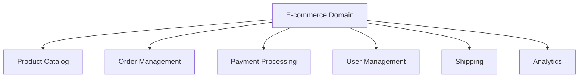
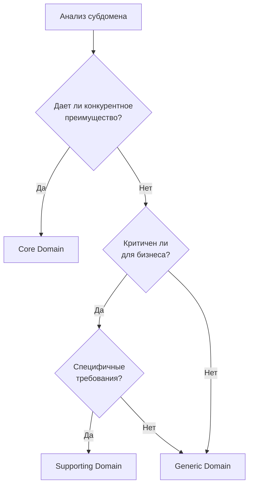
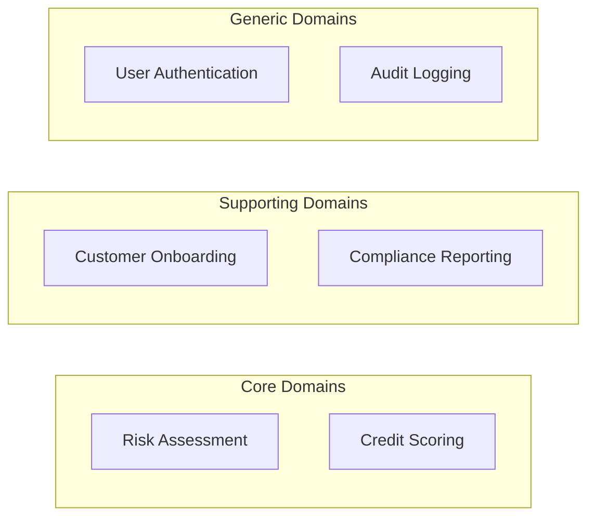

## 🏷️ Tags

#type/area #area/architecture #concept/microservice #concept/clean-architecture #concept/ddd 

---

> [!abstract] **Субдомены** в Domain-Driven Design — это способ разделения большого бизнес-домена на логические части для упрощения понимания и разработки сложных систем.

---

## 📋 Содержание

- [[#🎯 Что такое Subdomains]]
- [[#🔍 Типы субдоменов]]
- [[#⚖️ Как определить тип субдомена]]
- [[#💡 Практические примеры]]
- [[#🚀 Стратегии реализации]]
- [[#⚠️ Частые ошибки]]

---

## 🎯 Что такое Subdomains

**Субдомен** — это логическая часть бизнес-домена, которая решает конкретную бизнес-задачу.



> [!tip] Ключевая идея Субдомены помогают **разбить сложность** на управляемые части и определить **приоритеты** в разработке.

---

## 🔍 Типы субдоменов

### 🏆 Core Domain (Ядерный)

> [!success] **Конкурентное преимущество**
> 
> - Основная бизнес-логика
> - Уникальность компании
> - Максимальные инвестиции

**Характеристики:**

- ⭐ Высокая сложность
- 💎 Уникальная логика
- 🎯 Стратегическое значение

### 🔧 Supporting Domain (Поддерживающий)

> [!info] **Необходимая поддержка**
> 
> - Критичен для бизнеса
> - Не дает конкурентных преимуществ
> - Специфичен для компании

**Характеристики:**

- 📊 Средняя сложность
- 🏢 Специфичные требования
- ⚖️ Умеренные инвестиции

### 🛠️ Generic Domain (Общий)

> [!note] **Стандартные решения**
> 
> - Не критичен для бизнеса
> - Стандартная функциональность
> - Можно купить готовое решение

**Характеристики:**

- 📦 Низкая сложность
- 🔄 Стандартная логика
- 💰 Минимальные инвестиции

---

## ⚖️ Как определить тип субдомена



### 📝 Контрольные вопросы

> [!question] Для определения типа задайте себе:
> 
> 1. **Конкурентное преимущество**: Отличает ли это нас от конкурентов?
> 2. **Бизнес-критичность**: Можем ли мы без этого работать?
> 3. **Уникальность**: Есть ли готовые решения на рынке?
> 4. **Инвестиции**: Сколько ресурсов готовы вложить?

---

## 💡 Практические примеры

### 🛒 E-commerce платформа

|Субдомен|Тип|Обоснование|
|---|---|---|
|**Recommendation Engine**|🏆 Core|Уникальные алгоритмы, конкурентное преимущество|
|**Inventory Management**|🔧 Supporting|Критично, но есть стандартные подходы|
|**Email Notifications**|🛠️ Generic|Стандартная функция, можно использовать сервисы|

### 🏦 Банковская система



### 🚗 Сервис каршеринга

> [!example] Пример классификации
> 
> **🏆 Core Domain:**
> 
> - Алгоритм ценообразования
> - Оптимизация маршрутов
> - Прогнозирование спроса
> 
> **🔧 Supporting Domain:**
> 
> - Управление автопарком
> - Система штрафов
> - Техническое обслуживание
> 
> **🛠️ Generic Domain:**
> 
> - Платежная система
> - SMS уведомления
> - Система аутентификации

---

## 🚀 Стратегии реализации

### 🏆 Для Core Domain

> [!success] **Максимальные инвестиции**
> 
> ```
> ✅ Лучшие разработчики
> ✅ Собственная разработка
> ✅ Высокое покрытие тестами
> ✅ Детальное документирование
> ✅ Continuous monitoring
> ```

### 🔧 Для Supporting Domain

> [!info] **Сбалансированный подход**
> 
> ```
> ⚖️ Средний уровень команды
> ⚖️ Адаптация готовых решений
> ⚖️ Стандартное тестирование
> ⚖️ Базовая документация
> ```

### 🛠️ Для Generic Domain

> [!note] **Минимальные затраты**
> 
> ```
> 💰 Покупка готовых решений
> 💰 Использование SaaS
> 💰 Аутсорсинг
> 💰 Минимальная кастомизация
> ```

---

## ⚠️ Частые ошибки

> [!warning] **Антипаттерны**
> 
> 🚫 **Все домены считать Core**
> 
> - Приводит к распылению ресурсов
> - Снижает фокус на главном
> 
> 🚫 **Игнорировать Supporting домены**
> 
> - Создает технический долг
> - Может сломать весь бизнес-процесс
> 
> 🚫 **Переоценивать Generic домены**
> 
> - Изобретение велосипеда
> - Неоправданные затраты

---

## 📚 Связанные концепции

- [[Bounded Context|Bounded Contex]] - логические границы в коде
- [[Context Mapping|Context Mapping]] - взаимодействие между контекстами
- [[Strategic Design]] - стратегические решения в DDD
- [[Ubiquitous Language|Ubiquitous Language]] - единый язык домена

---

## 🎯 Ключевые выводы

> [!summary] Помните главное
> 
> 1. **Субдомены** помогают структурировать сложность
> 2. **Классификация** определяет стратегию инвестиций
> 3. **Core Domain** — ваше конкурентное преимущество
> 4. **Периодически пересматривайте** классификацию субдоменов

---
