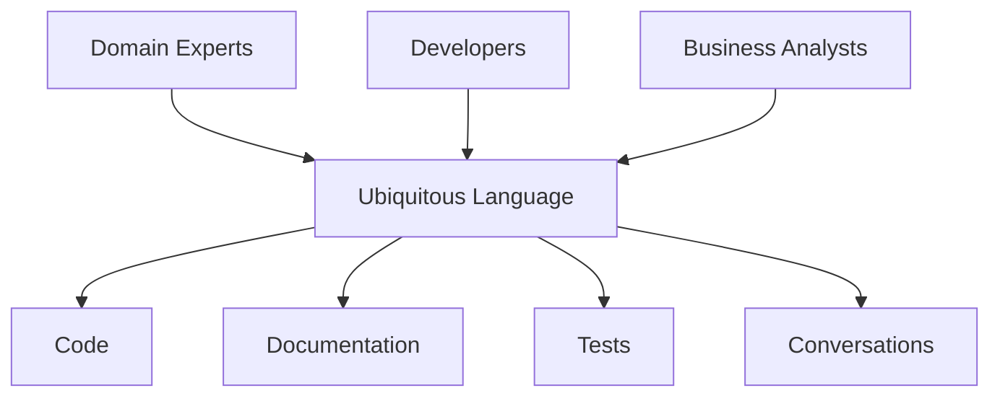
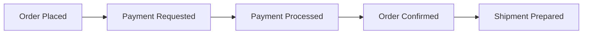

## 🏷️ Tags

#type/area #area/architecture #concept/microservice #concept/clean-architecture #concept/ddd 

---

> [!abstract] Ключевая концепция **Ubiquitous Language** (Единый язык) — это общий словарь терминов и понятий, который используется всеми участниками проекта: разработчиками, аналитиками, экспертами предметной области и заинтересованными сторонами.

---

## 🎯 Цель и назначение

Ubiquitous Language решает фундаментальную проблему **потери смысла при переводе** между:

- Бизнес-экспертами ↔️ Разработчиками
- Требованиями ↔️ Кодом
- Документацией ↔️ Реализацией

> [!tip] Золотое правило Если термин есть в коде, он **обязательно** должен быть в разговоре с экспертами. И наоборот.

---

## 🏗️ Структура Ubiquitous Language



### Компоненты единого языка:

|Компонент|Описание|Пример|
|---|---|---|
|**Entities**|Основные объекты домена|`Customer`, `Order`, `Product`|
|**Value Objects**|Объекты-значения|`Money`, `Address`, `Email`|
|**Aggregates**|Группы связанных объектов|`OrderAggregate`|
|**Domain Services**|Доменные сервисы|`PricingService`, `ShippingCalculator`|
|**Domain Events**|События домена|`OrderPlaced`, `PaymentProcessed`|

---

## 💡 Практические примеры

### ❌ Плохой пример (без Ubiquitous Language)

> [!failure] Проблемная ситуация
> 
> **Бизнес говорит**: "Когда клиент оформляет заказ..." **Код содержит**: `UserTransaction.create()` **База данных**: `user_purchases` **Документация**: "Процесс создания покупки пользователем"

**Проблемы:**

- 4 разных термина для одного понятия
- Потеря контекста при обсуждении
- Сложность в поддержке

### ✅ Хороший пример (с Ubiquitous Language)

> [!success] Правильный подход
> 
> **Везде используется**: `Order` (Заказ)
> 
> - Бизнес: "Клиент размещает **заказ**"
> - Код: `Order.place()`
> - БД: `orders`
> - Тесты: `when_customer_places_order()`

---

## 🔧 Практическое применение

### 1. В коде

```java
// ✅ Используем термины из Ubiquitous Language
public class Order {
    private CustomerId customerId;
    private List<OrderLine> orderLines;
    private OrderStatus status;
    
    public void place() {
        // Размещение заказа
        this.status = OrderStatus.PLACED;
        DomainEvents.raise(new OrderPlaced(this.id));
    }
    
    public boolean canBeCancelled() {
        return this.status == OrderStatus.PLACED;
    }
}
```

### 2. В тестах

```java
// ✅ Тесты читаются как бизнес-сценарии
@Test
public void customer_can_place_order_with_valid_products() {
    // Given
    Customer customer = CustomerMother.validCustomer();
    Product product = ProductMother.availableProduct();
    
    // When
    Order order = customer.placeOrder(product, Quantity.of(2));
    
    // Then
    assertThat(order.getStatus()).isEqualTo(OrderStatus.PLACED);
}
```

### 3. В документации

> [!note] Глоссарий терминов
> 
> **Order (Заказ)** - запрос клиента на покупку товаров **OrderLine (Строка заказа)** - позиция в заказе с указанием товара и количества **Customer (Клиент)** - зарегистрированный пользователь системы **Product (Товар)** - предмет, доступный для покупки

---

## 🎨 Техники создания Ubiquitous Language

### Event Storming 🌪️



> [!info] Event Storming помогает
> 
> - Выявить ключевые события
> - Определить границы контекстов
> - Найти скрытые процессы

### Domain Modeling Sessions 🎯

- **Участники**: Эксперты домена + Разработчики
- **Цель**: Создать модель, понятную всем
- **Результат**: Shared understanding

### Glossary Building 📚

|Термин|Определение|Синонимы|Контекст|
|---|---|---|---|
|**Customer**|Физическое лицо, имеющее аккаунт|User, Client|Sales Context|
|**Subscriber**|Customer с активной подпиской|Premium User|Billing Context|

---

## 🚫 Антипаттерны и ошибки

> [!warning] Частые ошибки

### 1. Технический жаргон в бизнес-логике

```java
// ❌ Плохо
public class UserDAO {
    public void persistUser(UserEntity entity) { ... }
}

// ✅ Хорошо  
public class CustomerRepository {
    public void save(Customer customer) { ... }
}
```

### 2. Множественные термины для одного понятия

- ❌ User, Client, Customer для одной роли
- ✅ Один термин - Customer

### 3. Перевод на техническом уровне

```java
// ❌ Плохо - потеря смысла
public class OrderProcessor {
    public void process(OrderData data) { ... }
}

// ✅ Хорошо - сохранение бизнес-смысла
public class OrderFulfillmentService {
    public void fulfill(Order order) { ... }
}
```

---

## 📈 Эволюция языка

> [!abstract] Живой процесс Ubiquitous Language не статичен - он развивается вместе с пониманием домена

### Рефакторинг языка

```mermaid
gitgraph
    commit id: "Initial: User"
    commit id: "Refined: Customer"
    branch feature
    commit id: "Add: Subscriber"
    checkout main
    merge feature
    commit id: "Unified: Person roles"
```

### Индикаторы необходимости изменений:

- [ ] Появились новые бизнес-процессы
- [ ] Эксперты используют другие термины
- [ ] Код стал сложно объяснять бизнесу
- [ ] Возникают частые недопонимания

---

## ✅ Критерии успеха

> [!success] Ubiquitous Language работает, когда:

- **Новый разработчик** может понять код, прочитав бизнес-требования
- **Бизнес-эксперт** может обсуждать код с разработчиками
- **Тесты** читаются как бизнес-сценарии
- **Документация** синхронизирована с кодом
- **Рефакторинг** не ломает понимание домена

---

## 🛠️ Инструменты и практики

### Поддержание актуальности

```markdown
## Checklist для Code Review
- [ ] Используются термины из глоссария
- [ ] Новые термины согласованы с экспертами
- [ ] Названия классов/методов отражают бизнес-процессы
- [ ] Комментарии используют бизнес-язык
```

### Автоматизация проверок

> [!tip] Полезные практики
> 
> - **Architecture Decision Records (ADR)** для изменений языка
> - **Living Documentation** с автогенерацией из кода
> - **Domain-specific DSL** для бизнес-правил

---

## 🎓 Заключение

> [!quote] Martin Fowler "The domain model is the heart of the software, and the ubiquitous language is the blood that keeps it pumping."

**Ubiquitous Language - это инвестиция в:**

- 📞 Эффективную коммуникацию
- 🔧 Поддерживаемый код
- 📈 Масштабируемость команды
- 🎯 Точность реализации требований

---

_Помните: Код пишется один раз, но читается сотни раз. Инвестируйте в ясность языка!_ 💎