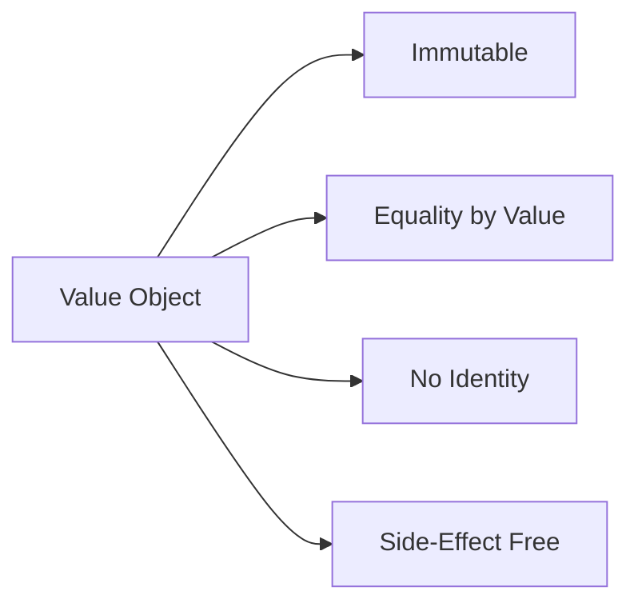

## 🏷️ Tags

#type/area #area/architecture #concept/microservice #concept/clean-architecture #concept/ddd 

---

> [!info] Определение **Value Object** — это объект, который определяется своими атрибутами, а не идентичностью. Два Value Object равны, если все их атрибуты равны.

## 📚 Основные характеристики



### ✅ Правила Value Objects

- [ ] **Неизменяемость** (Immutability)
- [ ] **Равенство по значению** (Value Equality)
- [ ] **Отсутствие идентичности** (No Identity)
- [ ] **Отсутствие побочных эффектов** (Side-Effect Free Functions)

---

## 🏗️ Реализация в .NET

### Базовый Value Object

```csharp
public abstract class ValueObject
{
    protected abstract IEnumerable<object> GetEqualityComponents();

    public override bool Equals(object obj)
    {
        if (obj == null || obj.GetType() != GetType())
            return false;

        var valueObject = (ValueObject)obj;
        return GetEqualityComponents().SequenceEqual(valueObject.GetEqualityComponents());
    }

    public override int GetHashCode()
    {
        return GetEqualityComponents()
            .Select(x => x?.GetHashCode() ?? 0)
            .Aggregate((x, y) => x ^ y);
    }

    public static bool operator ==(ValueObject left, ValueObject right)
    {
        return Equals(left, right);
    }

    public static bool operator !=(ValueObject left, ValueObject right)
    {
        return !Equals(left, right);
    }
}
```

### Пример: Money Value Object

```csharp
public class Money : ValueObject
{
    public decimal Amount { get; }
    public string Currency { get; }

    public Money(decimal amount, string currency)
    {
        if (amount < 0)
            throw new ArgumentException("Amount cannot be negative", nameof(amount));
        
        if (string.IsNullOrWhiteSpace(currency))
            throw new ArgumentException("Currency cannot be empty", nameof(currency));

        Amount = amount;
        Currency = currency.ToUpperInvariant();
    }

    protected override IEnumerable<object> GetEqualityComponents()
    {
        yield return Amount;
        yield return Currency;
    }

    public Money Add(Money other)
    {
        if (Currency != other.Currency)
            throw new InvalidOperationException("Cannot add different currencies");

        return new Money(Amount + other.Amount, Currency);
    }

    public override string ToString() => $"{Amount} {Currency}";
}
```

---

## 🗃️ Конфигурация в Entity Framework

### Owned Entity Types

> [!tip] Рекомендация Используйте `OwnsOne()` и `OwnsMany()` для конфигурации Value Objects как Owned Types

```csharp
public class Product
{
    public int Id { get; set; }
    public string Name { get; set; }
    public Money Price { get; set; } // Value Object
    public Address ShippingAddress { get; set; } // Value Object
}

public class ProductConfiguration : IEntityTypeConfiguration<Product>
{
    public void Configure(EntityTypeBuilder<Product> builder)
    {
        builder.HasKey(p => p.Id);
        
        // Конфигурация Money как Owned Type
        builder.OwnsOne(p => p.Price, money =>
        {
            money.Property(m => m.Amount)
                .HasColumnName("Price_Amount")
                .HasPrecision(18, 2);
                
            money.Property(m => m.Currency)
                .HasColumnName("Price_Currency")
                .HasMaxLength(3);
        });

        // Конфигурация Address как Owned Type
        builder.OwnsOne(p => p.ShippingAddress, address =>
        {
            address.Property(a => a.Street).HasColumnName("Address_Street");
            address.Property(a => a.City).HasColumnName("Address_City");
            address.Property(a => a.PostalCode).HasColumnName("Address_PostalCode");
        });
    }
}
```

### Value Conversions

```csharp
public class Email : ValueObject
{
    public string Value { get; }

    public Email(string value)
    {
        if (string.IsNullOrWhiteSpace(value))
            throw new ArgumentException("Email cannot be empty");
            
        if (!IsValidEmail(value))
            throw new ArgumentException("Invalid email format");

        Value = value;
    }

    protected override IEnumerable<object> GetEqualityComponents()
    {
        yield return Value;
    }

    private static bool IsValidEmail(string email)
    {
        return Regex.IsMatch(email, @"^[^@\s]+@[^@\s]+\.[^@\s]+$");
    }

    public override string ToString() => Value;
}

// Конфигурация с Value Converter
public class CustomerConfiguration : IEntityTypeConfiguration<Customer>
{
    public void Configure(EntityTypeBuilder<Customer> builder)
    {
        builder.Property(c => c.Email)
            .HasConversion(
                email => email.Value,           // To database
                value => new Email(value));     // From database
    }
}
```

---

## 🔄 Коллекции Value Objects

### Конфигурация OwnsMany

```csharp
public class Customer
{
    public int Id { get; set; }
    public string Name { get; set; }
    public List<Address> Addresses { get; set; } = new();
}

public class CustomerConfiguration : IEntityTypeConfiguration<Customer>
{
    public void Configure(EntityTypeBuilder<Customer> builder)
    {
        builder.OwnsMany(c => c.Addresses, address =>
        {
            address.WithOwner().HasForeignKey("CustomerId");
            address.Property<int>("Id"); // Shadow property для PK
            address.HasKey("Id");
            
            address.Property(a => a.Street).HasMaxLength(200);
            address.Property(a => a.City).HasMaxLength(100);
            address.Property(a => a.PostalCode).HasMaxLength(10);
        });
    }
}
```

---

## 🎯 Практические примеры

### PersonName Value Object

```csharp
public class PersonName : ValueObject
{
    public string FirstName { get; }
    public string LastName { get; }

    public PersonName(string firstName, string lastName)
    {
        FirstName = firstName?.Trim() ?? throw new ArgumentNullException(nameof(firstName));
        LastName = lastName?.Trim() ?? throw new ArgumentNullException(nameof(lastName));
    }

    protected override IEnumerable<object> GetEqualityComponents()
    {
        yield return FirstName;
        yield return LastName;
    }

    public string FullName => $"{FirstName} {LastName}";
    
    public override string ToString() => FullName;
}
```

### DateRange Value Object

```csharp
public class DateRange : ValueObject
{
    public DateTime StartDate { get; }
    public DateTime EndDate { get; }

    public DateRange(DateTime startDate, DateTime endDate)
    {
        if (startDate > endDate)
            throw new ArgumentException("Start date cannot be later than end date");

        StartDate = startDate;
        EndDate = endDate;
    }

    protected override IEnumerable<object> GetEqualityComponents()
    {
        yield return StartDate;
        yield return EndDate;
    }

    public int DurationInDays => (EndDate - StartDate).Days + 1;
    
    public bool Contains(DateTime date) => date >= StartDate && date <= EndDate;
    
    public bool Overlaps(DateRange other)
    {
        return StartDate <= other.EndDate && EndDate >= other.StartDate;
    }
}
```

---

## 💡 Best Practices

> [!warning] Важно помнить
> 
> - Value Objects должны быть **неизменяемыми**
> - Всегда валидируйте данные в **конструкторе**
> - Используйте **описательные имена** методов

### ✅ DO

```csharp
// ✅ Хороший пример - неизменяемый объект с валидацией
public class Temperature : ValueObject
{
    public double Value { get; }
    public TemperatureUnit Unit { get; }

    public Temperature(double value, TemperatureUnit unit)
    {
        if (unit == TemperatureUnit.Celsius && value < -273.15)
            throw new ArgumentException("Temperature cannot be below absolute zero");

        Value = value;
        Unit = unit;
    }

    public Temperature ConvertTo(TemperatureUnit targetUnit)
    {
        // Логика конвертации...
        return new Temperature(convertedValue, targetUnit);
    }
}
```

### ❌ DON'T

```csharp
// ❌ Плохой пример - изменяемый объект
public class BadTemperature : ValueObject
{
    public double Value { get; set; } // ❌ Setter
    public TemperatureUnit Unit { get; set; } // ❌ Setter

    public void ChangeValue(double newValue) // ❌ Мутирующий метод
    {
        Value = newValue;
    }
}
```

---

## 📊 Сравнение подходов

|Подход|Преимущества|Недостатки|
|---|---|---|
|**Owned Types**|🟢 Простота конфигурации<br/>🟢 Автоматический маппинг|🔴 Дублирование колонок<br/>🔴 Сложность с коллекциями|
|**Value Conversions**|🟢 Одна колонка<br/>🟢 Простота запросов|🔴 Ограничения типов<br/>🔴 Ручная конфигурация|
|**JSON Columns**|🟢 Гибкость структуры<br/>🟢 Поддержка сложных объектов|🔴 Производительность<br/>🔴 Ограниченность запросов|

---

## 🔗 Связанные концепции

- [[Entity Framework Configuration]]
- [[DDD Entities vs Value Objects]]
- [[Domain Modeling Patterns]]
- [[SOLID Principles in DDD]]

---

## 📝 Заключение

> [!success] Итог Value Objects в Entity Framework позволяют инкапсулировать бизнес-логику, обеспечить типобезопасность и создать более выразительную доменную модель. Правильное использование Owned Types и Value Conversions делает код более чистым и поддерживаемым.

**Ключевые моменты:**

- Используйте Value Objects для концептуально единых данных
- Обеспечьте неизменяемость и валидацию
- Выберите подходящую стратегию маппинга в EF
- Следуйте принципам DDD при проектировании