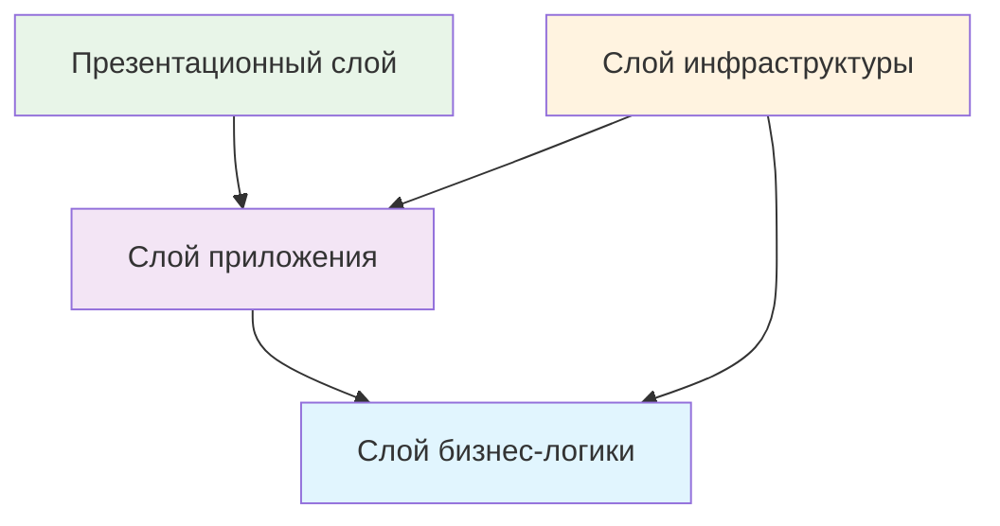
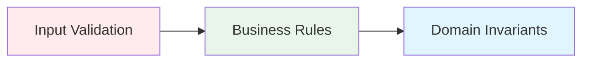

# Паттерн "Чистая архитектура" в .NET

> [!quote] "Архитектура должна кричать о том, для чего предназначена система, а не о фреймворках, которые она использует" - _Роберт Мартин_

## 📋 Содержание

- [[#🎯 Введение|🎯 Введение]]
- [[#🏗️ Принципы чистой архитектуры|🏗️ Принципы чистой архитектуры]]
- [[#📦 Структура слоев|📦 Структура слоев]]
- [[#🔧 Практическая реализация в .NET|🔧 Практическая реализация в .NET]]
- [[#💡 Полный пример приложения|💡 Полный пример приложения]]
- [[#⚡ Преимущества и недостатки|⚡ Преимущества и недостатки]]
- [[#📚 Лучшие практики|📚 Лучшие практики]]

---

## 🎯 Введение

**Чистая архитектура** (Clean Architecture) - это архитектурный паттерн, предложенный Робертом Мартином (Uncle Bob), который обеспечивает разделение ответственности и независимость компонентов системы.

> [!info] Ключевая идея Бизнес-логика приложения должна быть изолирована от внешних зависимостей (база данных, веб-фреймворки, внешние API).

### 🎨 Визуальное представление



---

## 🏗️ Принципы чистой архитектуры

### 1. 🔒 Принцип инверсии зависимостей (DIP)

> [!tip] Правило зависимостей Внутренние слои не должны знать о внешних. Зависимости направлены только внутрь.

### 2. 🎯 Разделение ответственности

Каждый слой имеет свою единственную ответственность:

|Слой|Ответственность|Зависимости|
|---|---|---|
|**Domain**|Бизнес-правила|Нет|
|**Application**|Сценарии использования|Domain|
|**Infrastructure**|Внешние системы|Application, Domain|
|**Presentation**|UI и контроллеры|Application|

### 3. 🧪 Независимость от фреймворков

> [!warning] Важно Архитектура не должна зависеть от конкретных фреймворков или технологий.

---

## 📦 Структура слоев

### 🏛️ 1. Domain Layer (Слой предметной области)

**Цель**: Содержит бизнес-сущности и правила предметной области.

```
📁 Domain/
├── 📁 Entities/
│   ├── User.cs
│   ├── Product.cs
│   └── Order.cs
├── 📁 ValueObjects/
│   ├── Email.cs
│   └── Money.cs
├── 📁 Interfaces/
│   ├── IUserRepository.cs
│   └── IProductRepository.cs
└── 📁 Exceptions/
    ├── DomainException.cs
    └── ValidationException.cs
```

> [!note] Характеристики Domain Layer
> 
> - 🚫 Не имеет зависимостей на другие слои
> - 📝 Содержит чистую бизнес-логику
> - 🔧 Определяет интерфейсы для внешних систем

### 🎪 2. Application Layer (Слой приложения)

**Цель**: Организует выполнение бизнес-сценариев.

```
📁 Application/
├── 📁 UseCases/
│   ├── 📁 Users/
│   │   ├── CreateUserCommand.cs
│   │   ├── CreateUserHandler.cs
│   │   └── GetUserQuery.cs
│   └── 📁 Products/
├── 📁 DTOs/
├── 📁 Interfaces/
└── 📁 Validators/
```

### 🌐 3. Infrastructure Layer (Слой инфраструктуры)

**Цель**: Реализация интерфейсов для работы с внешними системами.

```
📁 Infrastructure/
├── 📁 Data/
│   ├── ApplicationDbContext.cs
│   └── 📁 Repositories/
├── 📁 ExternalServices/
├── 📁 Identity/
└── 📁 Configurations/
```

### 🖥️ 4. Presentation Layer (Слой представления)

**Цель**: Точка входа в приложение (API, Web UI).

```
📁 Presentation/
├── 📁 Controllers/
├── 📁 Models/
├── 📁 Middlewares/
└── Program.cs
```

---

## 🔧 Практическая реализация в .NET

### 📋 Структура проекта

```
📁 CleanArchitectureApp/
├── 📦 CleanArchitectureApp.Domain
├── 📦 CleanArchitectureApp.Application  
├── 📦 CleanArchitectureApp.Infrastructure
├── 📦 CleanArchitectureApp.WebAPI
└── 📦 CleanArchitectureApp.Tests
```

### 🏛️ Domain Layer - Примеры кода

#### Сущность User

```csharp
// Domain/Entities/User.cs
public class User
{
    public Guid Id { get; private set; }
    public Email Email { get; private set; }
    public string FirstName { get; private set; }
    public string LastName { get; private set; }
    public DateTime CreatedAt { get; private set; }
    public bool IsActive { get; private set; }

    private User() { } // EF Core

    public User(Email email, string firstName, string lastName)
    {
        Id = Guid.NewGuid();
        Email = email ?? throw new ArgumentNullException(nameof(email));
        FirstName = firstName ?? throw new ArgumentNullException(nameof(firstName));
        LastName = lastName ?? throw new ArgumentNullException(nameof(lastName));
        CreatedAt = DateTime.UtcNow;
        IsActive = true;
        
        // Бизнес-правило: имя не должно быть пустым
        ValidateName(firstName, nameof(firstName));
        ValidateName(lastName, nameof(lastName));
    }

    public void Deactivate()
    {
        if (!IsActive)
            throw new DomainException("Пользователь уже деактивирован");
            
        IsActive = false;
    }

    public void UpdateName(string firstName, string lastName)
    {
        ValidateName(firstName, nameof(firstName));
        ValidateName(lastName, nameof(lastName));
        
        FirstName = firstName;
        LastName = lastName;
    }

    private static void ValidateName(string name, string paramName)
    {
        if (string.IsNullOrWhiteSpace(name) || name.Length < 2)
            throw new ValidationException($"{paramName} должно содержать минимум 2 символа");
    }
}
```

#### Value Object - Email

```csharp
// Domain/ValueObjects/Email.cs
public class Email : ValueObject
{
    public string Value { get; }

    public Email(string value)
    {
        if (string.IsNullOrWhiteSpace(value))
            throw new ValidationException("Email не может быть пустым");

        if (!IsValidEmail(value))
            throw new ValidationException("Неверный формат email");

        Value = value.ToLowerInvariant();
    }

    private static bool IsValidEmail(string email)
    {
        var pattern = @"^[^@\s]+@[^@\s]+\.[^@\s]+$";
        return Regex.IsMatch(email, pattern);
    }

    protected override IEnumerable<object> GetEqualityComponents()
    {
        yield return Value;
    }

    public static implicit operator string(Email email) => email.Value;
    public static implicit operator Email(string value) => new(value);
}
```

#### Repository Interface

```csharp
// Domain/Interfaces/IUserRepository.cs
public interface IUserRepository
{
    Task<User?> GetByIdAsync(Guid id);
    Task<User?> GetByEmailAsync(Email email);
    Task<IEnumerable<User>> GetAllActiveAsync();
    Task AddAsync(User user);
    Task UpdateAsync(User user);
    Task DeleteAsync(Guid id);
    Task<bool> ExistsAsync(Email email);
}
```

### 🎪 Application Layer - Примеры кода

#### Command для создания пользователя

```csharp
// Application/UseCases/Users/CreateUserCommand.cs
public record CreateUserCommand(
    string Email,
    string FirstName,
    string LastName) : IRequest<UserDto>;
```

#### Handler для команды

```csharp
// Application/UseCases/Users/CreateUserHandler.cs
public class CreateUserHandler : IRequestHandler<CreateUserCommand, UserDto>
{
    private readonly IUserRepository _userRepository;
    private readonly IMapper _mapper;
    private readonly IUnitOfWork _unitOfWork;

    public CreateUserHandler(
        IUserRepository userRepository, 
        IMapper mapper,
        IUnitOfWork unitOfWork)
    {
        _userRepository = userRepository;
        _mapper = mapper;
        _unitOfWork = unitOfWork;
    }

    public async Task<UserDto> Handle(CreateUserCommand request, CancellationToken cancellationToken)
    {
        // 1. Валидация
        var email = new Email(request.Email);
        
        if (await _userRepository.ExistsAsync(email))
            throw new ValidationException("Пользователь с таким email уже существует");

        // 2. Создание сущности
        var user = new User(email, request.FirstName, request.LastName);

        // 3. Сохранение
        await _userRepository.AddAsync(user);
        await _unitOfWork.SaveChangesAsync(cancellationToken);

        // 4. Возврат DTO
        return _mapper.Map<UserDto>(user);
    }
}
```

#### Query для получения пользователя

```csharp
// Application/UseCases/Users/GetUserQuery.cs
public record GetUserQuery(Guid UserId) : IRequest<UserDto>;

public class GetUserHandler : IRequestHandler<GetUserQuery, UserDto>
{
    private readonly IUserRepository _userRepository;
    private readonly IMapper _mapper;

    public GetUserHandler(IUserRepository userRepository, IMapper mapper)
    {
        _userRepository = userRepository;
        _mapper = mapper;
    }

    public async Task<UserDto> Handle(GetUserQuery request, CancellationToken cancellationToken)
    {
        var user = await _userRepository.GetByIdAsync(request.UserId);
        
        if (user == null)
            throw new NotFoundException("Пользователь не найден");

        return _mapper.Map<UserDto>(user);
    }
}
```

#### DTO

```csharp
// Application/DTOs/UserDto.cs
public record UserDto(
    Guid Id,
    string Email,
    string FirstName,
    string LastName,
    DateTime CreatedAt,
    bool IsActive);
```

### 🌐 Infrastructure Layer - Примеры кода

#### DbContext

```csharp
// Infrastructure/Data/ApplicationDbContext.cs
public class ApplicationDbContext : DbContext, IUnitOfWork
{
    public ApplicationDbContext(DbContextOptions<ApplicationDbContext> options) 
        : base(options) { }

    public DbSet<User> Users { get; set; }

    protected override void OnModelCreating(ModelBuilder modelBuilder)
    {
        modelBuilder.ApplyConfigurationsFromAssembly(typeof(ApplicationDbContext).Assembly);
    }

    public async Task<int> SaveChangesAsync(CancellationToken cancellationToken = default)
    {
        return await base.SaveChangesAsync(cancellationToken);
    }
}
```

#### Entity Configuration

```csharp
// Infrastructure/Data/Configurations/UserConfiguration.cs
public class UserConfiguration : IEntityTypeConfiguration<User>
{
    public void Configure(EntityTypeBuilder<User> builder)
    {
        builder.ToTable("Users");
        
        builder.HasKey(u => u.Id);
        
        builder.Property(u => u.FirstName)
            .IsRequired()
            .HasMaxLength(50);
            
        builder.Property(u => u.LastName)
            .IsRequired()
            .HasMaxLength(50);

        builder.OwnsOne(u => u.Email, email =>
        {
            email.Property(e => e.Value)
                .HasColumnName("Email")
                .IsRequired()
                .HasMaxLength(100);
        });

        builder.HasIndex(u => u.Email.Value)
            .IsUnique();
    }
}
```

#### Repository Implementation

```csharp
// Infrastructure/Data/Repositories/UserRepository.cs
public class UserRepository : IUserRepository
{
    private readonly ApplicationDbContext _context;

    public UserRepository(ApplicationDbContext context)
    {
        _context = context;
    }

    public async Task<User?> GetByIdAsync(Guid id)
    {
        return await _context.Users.FindAsync(id);
    }

    public async Task<User?> GetByEmailAsync(Email email)
    {
        return await _context.Users
            .Where(u => u.Email.Value == email.Value)
            .FirstOrDefaultAsync();
    }

    public async Task<IEnumerable<User>> GetAllActiveAsync()
    {
        return await _context.Users
            .Where(u => u.IsActive)
            .OrderBy(u => u.FirstName)
            .ToListAsync();
    }

    public async Task AddAsync(User user)
    {
        await _context.Users.AddAsync(user);
    }

    public Task UpdateAsync(User user)
    {
        _context.Users.Update(user);
        return Task.CompletedTask;
    }

    public async Task DeleteAsync(Guid id)
    {
        var user = await GetByIdAsync(id);
        if (user != null)
        {
            _context.Users.Remove(user);
        }
    }

    public async Task<bool> ExistsAsync(Email email)
    {
        return await _context.Users
            .AnyAsync(u => u.Email.Value == email.Value);
    }
}
```

### 🖥️ Presentation Layer - Примеры кода

#### Controller

```csharp
// Presentation/Controllers/UsersController.cs
[ApiController]
[Route("api/[controller]")]
public class UsersController : ControllerBase
{
    private readonly IMediator _mediator;

    public UsersController(IMediator mediator)
    {
        _mediator = mediator;
    }

    [HttpPost]
    [ProducesResponseType(typeof(UserDto), StatusCodes.Status201Created)]
    [ProducesResponseType(typeof(ValidationProblemDetails), StatusCodes.Status400BadRequest)]
    public async Task<ActionResult<UserDto>> CreateUser([FromBody] CreateUserRequest request)
    {
        var command = new CreateUserCommand(
            request.Email, 
            request.FirstName, 
            request.LastName);

        var result = await _mediator.Send(command);
        
        return CreatedAtAction(
            nameof(GetUser), 
            new { id = result.Id }, 
            result);
    }

    [HttpGet("{id:guid}")]
    [ProducesResponseType(typeof(UserDto), StatusCodes.Status200OK)]
    [ProducesResponseType(StatusCodes.Status404NotFound)]
    public async Task<ActionResult<UserDto>> GetUser(Guid id)
    {
        var query = new GetUserQuery(id);
        var result = await _mediator.Send(query);
        return Ok(result);
    }
}
```

#### Request Model

```csharp
// Presentation/Models/CreateUserRequest.cs
public record CreateUserRequest(
    string Email,
    string FirstName,
    string LastName);
```

#### Dependency Injection Configuration

```csharp
// Presentation/Program.cs
var builder = WebApplication.CreateBuilder(args);

// Domain - не нуждается в регистрации
// Application
builder.Services.AddApplication();
// Infrastructure  
builder.Services.AddInfrastructure(builder.Configuration);
// Presentation
builder.Services.AddPresentation();

var app = builder.Build();

// Middleware pipeline
app.UseExceptionHandling();
app.UseAuthentication();
app.UseAuthorization();
app.MapControllers();

app.Run();
```

---

## 💡 Полный пример приложения

> [!example] E-Commerce приложение Рассмотрим комплексный пример интернет-магазина с управлением продуктами и заказами.

### 🏛️ Domain Models

```csharp
// Domain/Entities/Product.cs
public class Product
{
    public Guid Id { get; private set; }
    public string Name { get; private set; }
    public string Description { get; private set; }
    public Money Price { get; private set; }
    public int StockQuantity { get; private set; }
    public bool IsAvailable => StockQuantity > 0;

    private Product() { }

    public Product(string name, string description, Money price, int stockQuantity)
    {
        Id = Guid.NewGuid();
        SetName(name);
        SetDescription(description);
        SetPrice(price);
        SetStockQuantity(stockQuantity);
    }

    public void UpdateStock(int quantity)
    {
        if (quantity < 0)
            throw new DomainException("Количество не может быть отрицательным");
            
        StockQuantity = quantity;
    }

    public void ReserveStock(int quantity)
    {
        if (quantity > StockQuantity)
            throw new InsufficientStockException(
                $"Недостаточно товара. Доступно: {StockQuantity}, запрошено: {quantity}");
                
        StockQuantity -= quantity;
    }

    // Private setters with validation
    private void SetName(string name)
    {
        if (string.IsNullOrWhiteSpace(name))
            throw new ValidationException("Название товара не может быть пустым");
        Name = name;
    }

    private void SetDescription(string description)
    {
        Description = description ?? string.Empty;
    }

    private void SetPrice(Money price)
    {
        if (price.Amount <= 0)
            throw new ValidationException("Цена должна быть больше нуля");
        Price = price;
    }

    private void SetStockQuantity(int quantity)
    {
        if (quantity < 0)
            throw new ValidationException("Количество не может быть отрицательным");
        StockQuantity = quantity;
    }
}
```

### 💰 Value Objects

```csharp
// Domain/ValueObjects/Money.cs
public class Money : ValueObject
{
    public decimal Amount { get; }
    public string Currency { get; }

    public Money(decimal amount, string currency = "RUB")
    {
        if (amount < 0)
            throw new ValidationException("Сумма не может быть отрицательной");

        if (string.IsNullOrWhiteSpace(currency))
            throw new ValidationException("Валюта обязательна");

        Amount = Math.Round(amount, 2);
        Currency = currency.ToUpperInvariant();
    }

    public Money Add(Money other)
    {
        if (Currency != other.Currency)
            throw new InvalidOperationException("Нельзя складывать деньги в разных валютах");

        return new Money(Amount + other.Amount, Currency);
    }

    public Money Multiply(int factor)
    {
        return new Money(Amount * factor, Currency);
    }

    protected override IEnumerable<object> GetEqualityComponents()
    {
        yield return Amount;
        yield return Currency;
    }

    public override string ToString() => $"{Amount:F2} {Currency}";
}
```

### 🛒 Aggregate Root - Order

```csharp
// Domain/Entities/Order.cs
public class Order : AggregateRoot
{
    public Guid Id { get; private set; }
    public Guid UserId { get; private set; }
    public DateTime CreatedAt { get; private set; }
    public OrderStatus Status { get; private set; }
    
    private readonly List<OrderItem> _items = new();
    public IReadOnlyList<OrderItem> Items => _items.AsReadOnly();
    
    public Money TotalAmount => _items
        .Aggregate(new Money(0), (sum, item) => sum.Add(item.TotalPrice));

    private Order() { }

    public Order(Guid userId)
    {
        Id = Guid.NewGuid();
        UserId = userId;
        CreatedAt = DateTime.UtcNow;
        Status = OrderStatus.Draft;
    }

    public void AddItem(Product product, int quantity)
    {
        if (Status != OrderStatus.Draft)
            throw new DomainException("Нельзя изменять подтвержденный заказ");

        if (quantity <= 0)
            throw new ValidationException("Количество должно быть больше нуля");

        var existingItem = _items.FirstOrDefault(i => i.ProductId == product.Id);
        if (existingItem != null)
        {
            existingItem.UpdateQuantity(existingItem.Quantity + quantity);
        }
        else
        {
            var orderItem = new OrderItem(product.Id, product.Name, product.Price, quantity);
            _items.Add(orderItem);
        }
    }

    public void RemoveItem(Guid productId)
    {
        if (Status != OrderStatus.Draft)
            throw new DomainException("Нельзя изменять подтвержденный заказ");

        var item = _items.FirstOrDefault(i => i.ProductId == productId);
        if (item != null)
        {
            _items.Remove(item);
        }
    }

    public void Confirm()
    {
        if (Status != OrderStatus.Draft)
            throw new DomainException("Заказ уже подтвержден");

        if (!_items.Any())
            throw new DomainException("Нельзя подтвердить пустой заказ");

        Status = OrderStatus.Confirmed;
        
        // Domain Event
        AddDomainEvent(new OrderConfirmedEvent(Id, UserId, TotalAmount));
    }

    public void Ship()
    {
        if (Status != OrderStatus.Confirmed)
            throw new DomainException("Можно отправить только подтвержденный заказ");

        Status = OrderStatus.Shipped;
        AddDomainEvent(new OrderShippedEvent(Id, UserId));
    }

    public void Complete()
    {
        if (Status != OrderStatus.Shipped)
            throw new DomainException("Можно завершить только отправленный заказ");

        Status = OrderStatus.Completed;
        AddDomainEvent(new OrderCompletedEvent(Id, UserId));
    }
}

public class OrderItem
{
    public Guid ProductId { get; private set; }
    public string ProductName { get; private set; }
    public Money UnitPrice { get; private set; }
    public int Quantity { get; private set; }
    public Money TotalPrice => UnitPrice.Multiply(Quantity);

    private OrderItem() { }

    public OrderItem(Guid productId, string productName, Money unitPrice, int quantity)
    {
        ProductId = productId;
        ProductName = productName;
        UnitPrice = unitPrice;
        SetQuantity(quantity);
    }

    public void UpdateQuantity(int quantity)
    {
        SetQuantity(quantity);
    }

    private void SetQuantity(int quantity)
    {
        if (quantity <= 0)
            throw new ValidationException("Количество должно быть больше нуля");
        Quantity = quantity;
    }
}

public enum OrderStatus
{
    Draft,
    Confirmed, 
    Shipped,
    Completed,
    Cancelled
}
```

### 📡 Domain Events

```csharp
// Domain/Events/OrderConfirmedEvent.cs
public record OrderConfirmedEvent(
    Guid OrderId, 
    Guid UserId, 
    Money TotalAmount) : IDomainEvent;

// Application/EventHandlers/OrderConfirmedEventHandler.cs
public class OrderConfirmedEventHandler : INotificationHandler<OrderConfirmedEvent>
{
    private readonly IProductRepository _productRepository;
    private readonly IEmailService _emailService;
    private readonly ILogger<OrderConfirmedEventHandler> _logger;

    public OrderConfirmedEventHandler(
        IProductRepository productRepository,
        IEmailService emailService,
        ILogger<OrderConfirmedEventHandler> logger)
    {
        _productRepository = productRepository;
        _emailService = emailService;
        _logger = logger;
    }

    public async Task Handle(OrderConfirmedEvent notification, CancellationToken cancellationToken)
    {
        try
        {
            // Резервируем товары
            // Отправляем email подтверждение
            await _emailService.SendOrderConfirmationAsync(
                notification.UserId, 
                notification.OrderId,
                notification.TotalAmount);
                
            _logger.LogInformation(
                "Заказ {OrderId} подтвержден на сумму {Amount}", 
                notification.OrderId, 
                notification.TotalAmount);
        }
        catch (Exception ex)
        {
            _logger.LogError(ex, 
                "Ошибка при обработке подтверждения заказа {OrderId}", 
                notification.OrderId);
        }
    }
}
```

---

## ⚡ Преимущества и недостатки

### ✅ Преимущества

> [!success] Плюсы Clean Architecture

#### 🧪 Тестируемость

- Бизнес-логика изолирована от внешних зависимостей
- Легкое моккинг интерфейсов
- Возможность юнит-тестирования без базы данных

#### 🔧 Гибкость

- Легкая замена внешних систем (база данных, веб-фреймворк)
- Независимость от технологических решений
- Возможность эволюции архитектуры

#### 👥 Командная разработка

- Четкое разделение ответственности
- Параллельная разработка разных слоев
- Лучшая читаемость кода

### ❌ Недостатки

> [!warning] Минусы Clean Architecture

#### 🏗️ Сложность

- Высокий порог входа для новых разработчиков
- Много абстракций и интерфейсов
- Over-engineering для простых проектов

#### ⏱️ Время разработки

- Дольше первоначальная разработка
- Больше кода для простых операций (boilerplate)
- Необходимость в дополнительном планировании

#### 🐛 Производительность

- Дополнительные слои абстракции
- Больше вызовов методов
- Использование рефлексии в DI

---

## 📚 Лучшие практики

### 🎯 Design Patterns

#### CQRS (Command Query Responsibility Segregation)

> [!tip] Разделение команд и запросов Используйте отдельные модели для чтения и записи данных.

```csharp
// Команда (изменяет состояние)
public record CreateProductCommand(string Name, decimal Price) : IRequest<Guid>;

// Запрос (возвращает данные) 
public record GetProductQuery(Guid Id) : IRequest<ProductDto>;
```

#### Repository Pattern

```csharp
// Правильный интерфейс репозитория
public interface IOrderRepository
{
    Task<Order?> GetByIdAsync(Guid id);
    Task<Order?> GetWithItemsAsync(Guid id);
    Task AddAsync(Order order);
    Task UpdateAsync(Order order);
    Task DeleteAsync(Guid id);
    
    // Специфичные бизнес-методы
    Task<IEnumerable<Order>> GetActiveOrdersByUserAsync(Guid userId);
    Task<IEnumerable<Order>> GetOrdersForShippingAsync();
}
```

#### Unit of Work Pattern

```csharp
public interface IUnitOfWork
{
    IUserRepository Users { get; }
    IProductRepository Products { get; }
    IOrderRepository Orders { get; }
    
    Task<int> SaveChangesAsync(CancellationToken cancellationToken = default);
    Task BeginTransactionAsync();
    Task CommitTransactionAsync();
    Task RollbackTransactionAsync();
}
```

### 🔧 Технические рекомендации

#### 1. Validation Strategy

> [!info] Многоуровневая валидация



```csharp
// 1. Input validation (Presentation)
public class CreateUserRequestValidator : AbstractValidator<CreateUserRequest>
{
    public CreateUserRequestValidator()
    {
        RuleFor(x => x.Email)
            .NotEmpty()
            .EmailAddress();
            
        RuleFor(x => x.FirstName)
            .NotEmpty()
            .Length(2, 50);
    }
}

// 2. Business rules (Application)
public class CreateUserHandler : IRequestHandler<CreateUserCommand, UserDto>
{
    public async Task<UserDto> Handle(CreateUserCommand request, CancellationToken cancellationToken)
    {
        // Business validation
        if (await _userRepository.ExistsAsync(new Email(request.Email)))
            throw new BusinessRuleException("Пользователь уже существует");
        
        // Domain creation with invariants
        var user = new User(request.Email, request.FirstName, request.LastName);
        // ...
    }
}

// 3. Domain invariants (Domain)
public class User
{
    public User(Email email, string firstName, string lastName)
    {
        // Domain invariants validation
        ValidateName(firstName, nameof(firstName));
        ValidateName(lastName, nameof(lastName));
        // ...
    }
}
```

#### 2. Error Handling Strategy

```csharp
// Domain/Exceptions/DomainException.cs
public abstract class DomainException : Exception
{
    protected DomainException(string message) : base(message) { }
    protected DomainException(string message, Exception innerException) 
        : base(message, innerException) { }
}

public class BusinessRuleException : DomainException
{
    public BusinessRuleException(string message) : base(message) { }
}

public class ValidationException : DomainException
{
    public ValidationException(string message) : base(message) { }
}

// Application/Common/Exceptions/NotFoundException.cs
public class NotFoundException : Exception
{
    public NotFoundException(string message) : base(message) { }
}

// Presentation/Middlewares/ExceptionHandlingMiddleware.cs
public class ExceptionHandlingMiddleware
{
    private readonly RequestDelegate _next;
    private readonly ILogger<ExceptionHandlingMiddleware> _logger;

    public ExceptionHandlingMiddleware(RequestDelegate next, ILogger<ExceptionHandlingMiddleware> logger)
    {
        _next = next;
        _logger = logger;
    }

    public async Task InvokeAsync(HttpContext context)
    {
        try
        {
            await _next(context);
        }
        catch (Exception ex)
        {
            await HandleExceptionAsync(context, ex);
        }
    }

    private async Task HandleExceptionAsync(HttpContext context, Exception exception)
    {
        context.Response.ContentType = "application/json";

        var response = exception switch
        {
            ValidationException => new ErrorResponse(
                StatusCodes.Status400BadRequest,
                "Validation Error",
                exception.Message),
                
            BusinessRuleException => new ErrorResponse(
                StatusCodes.Status422UnprocessableEntity,
                "Business Rule Violation", 
                exception.Message),
                
            NotFoundException => new ErrorResponse(
                StatusCodes.Status404NotFound,
                "Not Found",
                exception.Message),
                
            _ => new ErrorResponse(
                StatusCodes.Status500InternalServerError,
                "Internal Server Error",
                "Произошла внутренняя ошибка сервера")
        };

        context.Response.StatusCode = response.StatusCode;

        if (response.StatusCode == StatusCodes.Status500InternalServerError)
        {
            _logger.LogError(exception, "Необработанная ошибка");
        }

        await context.Response.WriteAsync(JsonSerializer.Serialize(response));
    }
}

public record ErrorResponse(int StatusCode, string Title, string Detail);
```

#### 3. Configuration Management

```csharp
// Infrastructure/DependencyInjection.cs
public static class DependencyInjection
{
    public static IServiceCollection AddInfrastructure(
        this IServiceCollection services, 
        IConfiguration configuration)
    {
        // Database
        services.AddDbContext<ApplicationDbContext>(options =>
            options.UseSqlServer(configuration.GetConnectionString("DefaultConnection")));

        // Repositories
        services.AddScoped<IUserRepository, UserRepository>();
        services.AddScoped<IProductRepository, ProductRepository>();
        services.AddScoped<IOrderRepository, OrderRepository>();
        services.AddScoped<IUnitOfWork, UnitOfWork>();

        // External Services
        services.Configure<EmailSettings>(configuration.GetSection("Email"));
        services.AddTransient<IEmailService, EmailService>();
        
        services.Configure<PaymentSettings>(configuration.GetSection("Payment"));
        services.AddTransient<IPaymentService, PaymentService>();

        return services;
    }
}

// Application/DependencyInjection.cs
public static class DependencyInjection
{
    public static IServiceCollection AddApplication(this IServiceCollection services)
    {
        // MediatR
        services.AddMediatR(cfg => cfg.RegisterServicesFromAssembly(Assembly.GetExecutingAssembly()));
        
        // AutoMapper
        services.AddAutoMapper(Assembly.GetExecutingAssembly());
        
        // FluentValidation
        services.AddValidatorsFromAssembly(Assembly.GetExecutingAssembly());
        
        // Behaviors
        services.AddTransient(typeof(IPipelineBehavior<,>), typeof(ValidationBehavior<,>));
        services.AddTransient(typeof(IPipelineBehavior<,>), typeof(LoggingBehavior<,>));
        
        return services;
    }
}
```

#### 4. Testing Strategy

> [!example] Пирамида тестирования

```mermaid
pyramid
    title Testing Pyramid
    "E2E Tests" : 10
    "Integration Tests" : 30  
    "Unit Tests" : 60
```

##### Unit Tests (Domain)

```csharp
// Tests/Domain/UserTests.cs
public class UserTests
{
    [Test]
    public void Constructor_WithValidData_CreatesUser()
    {
        // Arrange
        var email = new Email("test@example.com");
        var firstName = "John";
        var lastName = "Doe";

        // Act
        var user = new User(email, firstName, lastName);

        // Assert
        user.Email.Should().Be(email);
        user.FirstName.Should().Be(firstName);
        user.LastName.Should().Be(lastName);
        user.IsActive.Should().BeTrue();
        user.Id.Should().NotBeEmpty();
    }

    [Test]
    public void Constructor_WithEmptyFirstName_ThrowsValidationException()
    {
        // Arrange
        var email = new Email("test@example.com");
        var firstName = "";
        var lastName = "Doe";

        // Act & Assert
        Assert.Throws<ValidationException>(() => 
            new User(email, firstName, lastName));
    }

    [Test]
    public void Deactivate_WhenActive_DeactivatesUser()
    {
        // Arrange
        var user = CreateValidUser();

        // Act
        user.Deactivate();

        // Assert
        user.IsActive.Should().BeFalse();
    }

    [Test]
    public void Deactivate_WhenAlreadyDeactivated_ThrowsDomainException()
    {
        // Arrange
        var user = CreateValidUser();
        user.Deactivate();

        // Act & Assert
        Assert.Throws<DomainException>(() => user.Deactivate());
    }

    private static User CreateValidUser()
    {
        return new User(
            new Email("test@example.com"),
            "John",
            "Doe");
    }
}
```

##### Integration Tests (Application)

```csharp
// Tests/Application/Users/CreateUserHandlerTests.cs
public class CreateUserHandlerTests : TestBase
{
    private readonly CreateUserHandler _handler;
    private readonly Mock<IUserRepository> _userRepositoryMock;
    private readonly Mock<IUnitOfWork> _unitOfWorkMock;

    public CreateUserHandlerTests()
    {
        _userRepositoryMock = new Mock<IUserRepository>();
        _unitOfWorkMock = new Mock<IUnitOfWork>();
        var mapper = CreateMapper();
        
        _handler = new CreateUserHandler(
            _userRepositoryMock.Object,
            mapper,
            _unitOfWorkMock.Object);
    }

    [Test]
    public async Task Handle_WithValidCommand_CreatesUser()
    {
        // Arrange
        var command = new CreateUserCommand("test@example.com", "John", "Doe");
        
        _userRepositoryMock
            .Setup(x => x.ExistsAsync(It.IsAny<Email>()))
            .ReturnsAsync(false);

        // Act
        var result = await _handler.Handle(command, CancellationToken.None);

        // Assert
        result.Should().NotBeNull();
        result.Email.Should().Be("test@example.com");
        result.FirstName.Should().Be("John");
        result.LastName.Should().Be("Doe");

        _userRepositoryMock.Verify(x => x.AddAsync(It.IsAny<User>()), Times.Once);
        _unitOfWorkMock.Verify(x => x.SaveChangesAsync(It.IsAny<CancellationToken>()), Times.Once);
    }

    [Test]
    public async Task Handle_WithExistingEmail_ThrowsValidationException()
    {
        // Arrange
        var command = new CreateUserCommand("existing@example.com", "John", "Doe");
        
        _userRepositoryMock
            .Setup(x => x.ExistsAsync(It.IsAny<Email>()))
            .ReturnsAsync(true);

        // Act & Assert
        await Assert.ThrowsAsync<ValidationException>(() => 
            _handler.Handle(command, CancellationToken.None));
    }
}
```

##### End-to-End Tests

```csharp
// Tests/E2E/UsersE2ETests.cs
public class UsersE2ETests : IClassFixture<WebApplicationFactory<Program>>
{
    private readonly WebApplicationFactory<Program> _factory;
    private readonly HttpClient _client;

    public UsersE2ETests(WebApplicationFactory<Program> factory)
    {
        _factory = factory;
        _client = _factory.CreateClient();
    }

    [Test]
    public async Task CreateUser_WithValidData_ReturnsCreatedUser()
    {
        // Arrange
        var request = new CreateUserRequest(
            "integration@test.com",
            "Integration", 
            "Test");

        // Act
        var response = await _client.PostAsJsonAsync("/api/users", request);

        // Assert
        response.StatusCode.Should().Be(HttpStatusCode.Created);
        
        var userDto = await response.Content.ReadFromJsonAsync<UserDto>();
        userDto.Should().NotBeNull();
        userDto.Email.Should().Be("integration@test.com");
        userDto.FirstName.Should().Be("Integration");
        userDto.LastName.Should().Be("Test");
    }

    [Test]
    public async Task CreateUser_WithInvalidEmail_ReturnsBadRequest()
    {
        // Arrange
        var request = new CreateUserRequest("invalid-email", "Test", "User");

        // Act
        var response = await _client.PostAsJsonAsync("/api/users", request);

        // Assert
        response.StatusCode.Should().Be(HttpStatusCode.BadRequest);
    }
}
```

### 📊 Мониторинг и логирование

#### Application Insights Integration

```csharp
// Application/Behaviors/LoggingBehavior.cs
public class LoggingBehavior<TRequest, TResponse> : IPipelineBehavior<TRequest, TResponse>
    where TRequest : IRequest<TResponse>
{
    private readonly ILogger<LoggingBehavior<TRequest, TResponse>> _logger;

    public LoggingBehavior(ILogger<LoggingBehavior<TRequest, TResponse>> logger)
    {
        _logger = logger;
    }

    public async Task<TResponse> Handle(
        TRequest request, 
        RequestHandlerDelegate<TResponse> next, 
        CancellationToken cancellationToken)
    {
        var requestName = typeof(TRequest).Name;
        var requestGuid = Guid.NewGuid();

        _logger.LogInformation(
            "Начало выполнения запроса {RequestName} {@Request} {RequestGuid}",
            requestName, request, requestGuid);

        var stopwatch = Stopwatch.StartNew();

        try
        {
            var response = await next();
            
            stopwatch.Stop();
            
            _logger.LogInformation(
                "Завершение выполнения запроса {RequestName} {RequestGuid} за {ElapsedMs}ms",
                requestName, requestGuid, stopwatch.ElapsedMilliseconds);

            return response;
        }
        catch (Exception ex)
        {
            stopwatch.Stop();
            
            _logger.LogError(ex,
                "Ошибка при выполнении запроса {RequestName} {RequestGuid} за {ElapsedMs}ms",
                requestName, requestGuid, stopwatch.ElapsedMilliseconds);
                
            throw;
        }
    }
}
```

#### Performance Monitoring

```csharp
// Application/Behaviors/PerformanceBehavior.cs
public class PerformanceBehavior<TRequest, TResponse> : IPipelineBehavior<TRequest, TResponse>
    where TRequest : IRequest<TResponse>
{
    private readonly ILogger<PerformanceBehavior<TRequest, TResponse>> _logger;
    private const int SlowRequestThresholdMs = 3000;

    public PerformanceBehavior(ILogger<PerformanceBehavior<TRequest, TResponse>> logger)
    {
        _logger = logger;
    }

    public async Task<TResponse> Handle(
        TRequest request, 
        RequestHandlerDelegate<TResponse> next, 
        CancellationToken cancellationToken)
    {
        var stopwatch = Stopwatch.StartNew();
        var response = await next();
        stopwatch.Stop();

        if (stopwatch.ElapsedMilliseconds > SlowRequestThresholdMs)
        {
            var requestName = typeof(TRequest).Name;
            
            _logger.LogWarning(
                "Медленный запрос: {RequestName} выполнялся {ElapsedMs}ms {@Request}",
                requestName, stopwatch.ElapsedMilliseconds, request);
        }

        return response;
    }
}
```

---

## 🚀 Развертывание и DevOps

### 🐳 Docker Configuration

```dockerfile
# Dockerfile
FROM mcr.microsoft.com/dotnet/aspnet:8.0 AS base
WORKDIR /app
EXPOSE 80
EXPOSE 443

FROM mcr.microsoft.com/dotnet/sdk:8.0 AS build
WORKDIR /src

# Copy project files
COPY ["src/CleanArchitectureApp.WebAPI/CleanArchitectureApp.WebAPI.csproj", "src/CleanArchitectureApp.WebAPI/"]
COPY ["src/CleanArchitectureApp.Application/CleanArchitectureApp.Application.csproj", "src/CleanArchitectureApp.Application/"]
COPY ["src/CleanArchitectureApp.Infrastructure/CleanArchitectureApp.Infrastructure.csproj", "src/CleanArchitectureApp.Infrastructure/"]
COPY ["src/CleanArchitectureApp.Domain/CleanArchitectureApp.Domain.csproj", "src/CleanArchitectureApp.Domain/"]

# Restore dependencies
RUN dotnet restore "src/CleanArchitectureApp.WebAPI/CleanArchitectureApp.WebAPI.csproj"

# Copy source code
COPY . .
WORKDIR "/src/src/CleanArchitectureApp.WebAPI"

# Build application
RUN dotnet build "CleanArchitectureApp.WebAPI.csproj" -c Release -o /app/build

FROM build AS publish
RUN dotnet publish "CleanArchitectureApp.WebAPI.csproj" -c Release -o /app/publish

FROM base AS final
WORKDIR /app
COPY --from=publish /app/publish .
ENTRYPOINT ["dotnet", "CleanArchitectureApp.WebAPI.dll"]
```

### 📋 Docker Compose

```yaml
# docker-compose.yml
version: '3.8'

services:
  app:
    build: .
    ports:
      - "5000:80"
    environment:
      - ASPNETCORE_ENVIRONMENT=Development
      - ConnectionStrings__DefaultConnection=Server=db;Database=CleanArchDB;User Id=sa;Password=YourPassword123;TrustServerCertificate=true;
    depends_on:
      - db
      - redis
    networks:
      - app-network

  db:
    image: mcr.microsoft.com/mssql/server:2022-latest
    environment:
      - ACCEPT_EULA=Y
      - SA_PASSWORD=YourPassword123
    ports:
      - "1433:1433"
    volumes:
      - sqlserver_data:/var/opt/mssql
    networks:
      - app-network

  redis:
    image: redis:7-alpine
    ports:
      - "6379:6379"
    volumes:
      - redis_data:/data
    networks:
      - app-network

volumes:
  sqlserver_data:
  redis_data:

networks:
  app-network:
    driver: bridge
```

### 🔧 CI/CD Pipeline (.github/workflows)

```yaml
# .github/workflows/ci-cd.yml
name: CI/CD Pipeline

on:
  push:
    branches: [ main, develop ]
  pull_request:
    branches: [ main ]

jobs:
  test:
    runs-on: ubuntu-latest
    
    services:
      sqlserver:
        image: mcr.microsoft.com/mssql/server:2022-latest
        env:
          ACCEPT_EULA: Y
          SA_PASSWORD: TestPassword123
        ports:
          - 1433:1433
          
    steps:
    - uses: actions/checkout@v3
    
    - name: Setup .NET
      uses: actions/setup-dotnet@v3
      with:
        dotnet-version: '8.0.x'
        
    - name: Restore dependencies
      run: dotnet restore
      
    - name: Build
      run: dotnet build --no-restore --configuration Release
      
    - name: Run Unit Tests
      run: dotnet test tests/CleanArchitectureApp.Domain.Tests --no-build --verbosity normal --logger trx --results-directory TestResults
      
    - name: Run Application Tests
      run: dotnet test tests/CleanArchitectureApp.Application.Tests --no-build --verbosity normal --logger trx --results-directory TestResults
      
    - name: Run Integration Tests
      run: dotnet test tests/CleanArchitectureApp.Integration.Tests --no-build --verbosity normal --logger trx --results-directory TestResults
      env:
        ConnectionStrings__DefaultConnection: Server=localhost;Database=TestDb;User Id=sa;Password=TestPassword123;TrustServerCertificate=true;
    
    - name: Publish Test Results
      uses: dorny/test-reporter@v1
      if: success() || failure()
      with:
        name: .NET Tests
        path: TestResults/*.trx
        reporter: dotnet-trx

  build-and-deploy:
    needs: test
    runs-on: ubuntu-latest
    if: github.ref == 'refs/heads/main'
    
    steps:
    - uses: actions/checkout@v3
    
    - name: Build Docker Image
      run: docker build -t cleanarchapp:${{ github.sha }} .
      
    - name: Deploy to Production
      run: |
        echo "Deploying to production..."
        # Add deployment steps here
```

---

## 📖 Заключение

> [!success] Ключевые выводы

Clean Architecture в .NET предоставляет мощный фундамент для создания масштабируемых, тестируемых и поддерживаемых приложений. Основные принципы:

### 🎯 Главные преимущества:

1. **Независимость от внешних систем** - бизнес-логика не зависит от технологий
2. **Высокая тестируемость** - каждый слой можно тестировать изолированно
3. **Гибкость развития** - легкая замена компонентов без влияния на бизнес-логику
4. **Четкое разделение ответственности** - каждый слой выполняет свою роль

### 📚 Когда использовать:

- ✅ Сложные бизнес-приложения
- ✅ Долгосрочные проекты
- ✅ Большие команды разработки
- ✅ Высокие требования к качеству

### 🚫 Когда НЕ использовать:

- ❌ Простые CRUD приложения
- ❌ Прототипы и MVP
- ❌ Маленькие проекты с ограниченным временем
- ❌ Команды без опыта в архитектурных паттернах

---

> [!quote] Финальная мысль "Хорошая архитектура делает систему легкой для понимания, легкой для разработки, легкой для сопровождения и легкой для развертывания. Цель состоит в том, чтобы минимизировать человеческие ресурсы, необходимые для построения и сопровождения системы." - _Роберт Мартин_

## 🔗 Полезные ресурсы

- [Clean Architecture: A Craftsman's Guide](https://www.amazon.com/Clean-Architecture-Craftsmans-Software-Structure/dp/0134494164) - книга Роберта Мартина
- [.NET Application Architecture Guides](https://docs.microsoft.com/en-us/dotnet/architecture/) - официальная документация Microsoft
- [Clean Architecture Template](https://github.com/jasontaylordev/CleanArchitecture) - готовый шаблон от Jason Taylor
- [Domain-Driven Design](https://www.amazon.com/Domain-Driven-Design-Tackling-Complexity-Software/dp/0321125215) - книга Eric Evans
- [Implementing Domain-Driven Design](https://www.amazon.com/Implementing-Domain-Driven-Design-Vaughn-Vernon/dp/0321834577) - книга Vaughn Vernon

---

_Создано для изучения паттерна Clean Architecture в .NET с использованием возможностей Obsidian_