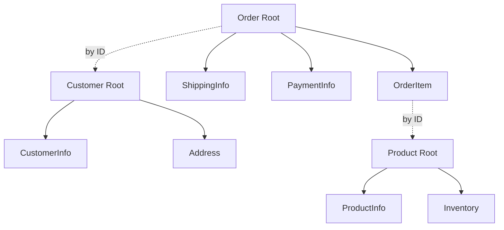

## 🏷️ Tags

#type/permanent #concept/ddd #ddd/aggregate #ddd/entity #ddd/value-object #area/architecture #area/development #design-pattern/factory  #concept/immutability 

---
# 🏗️ Aggregate

> [!info] 📋 Краткий чек-лист
> 
> - [x] Определение и назначение Aggregate
> - [x] Правила проектирования агрегатов
> - [x] Aggregate Root и границы
> - [x] Инварианты и консистентность
> - [x] Практические примеры и антипаттерны

---

## 📖 Содержание

1. [Определение и ключевые концепции](https://claude.ai/chat/4c924888-0771-4981-9e59-7e803be2eef8#%D0%BE%D0%BF%D1%80%D0%B5%D0%B4%D0%B5%D0%BB%D0%B5%D0%BD%D0%B8%D0%B5-%D0%B8-%D0%BA%D0%BB%D1%8E%D1%87%D0%B5%D0%B2%D1%8B%D0%B5-%D0%BA%D0%BE%D0%BD%D1%86%D0%B5%D0%BF%D1%86%D0%B8%D0%B8)
2. [Правила проектирования](https://claude.ai/chat/4c924888-0771-4981-9e59-7e803be2eef8#%D0%BF%D1%80%D0%B0%D0%B2%D0%B8%D0%BB%D0%B0-%D0%BF%D1%80%D0%BE%D0%B5%D0%BA%D1%82%D0%B8%D1%80%D0%BE%D0%B2%D0%B0%D0%BD%D0%B8%D1%8F)
3. [Aggregate Root](https://claude.ai/chat/4c924888-0771-4981-9e59-7e803be2eef8#aggregate-root)
4. [Инварианты и консистентность](https://claude.ai/chat/4c924888-0771-4981-9e59-7e803be2eef8#%D0%B8%D0%BD%D0%B2%D0%B0%D1%80%D0%B8%D0%B0%D0%BD%D1%82%D1%8B-%D0%B8-%D0%BA%D0%BE%D0%BD%D1%81%D0%B8%D1%81%D1%82%D0%B5%D0%BD%D1%82%D0%BD%D0%BE%D1%81%D1%82%D1%8C)
5. [Практические примеры](https://claude.ai/chat/4c924888-0771-4981-9e59-7e803be2eef8#%D0%BF%D1%80%D0%B0%D0%BA%D1%82%D0%B8%D1%87%D0%B5%D1%81%D0%BA%D0%B8%D0%B5-%D0%BF%D1%80%D0%B8%D0%BC%D0%B5%D1%80%D1%8B)
6. [Антипаттерны](https://claude.ai/chat/4c924888-0771-4981-9e59-7e803be2eef8#%D0%B0%D0%BD%D1%82%D0%B8%D0%BF%D0%B0%D1%82%D1%82%D0%B5%D1%80%D0%BD%D1%8B)
7. [Связанные концепции](https://claude.ai/chat/4c924888-0771-4981-9e59-7e803be2eef8#%D1%81%D0%B2%D1%8F%D0%B7%D0%B0%D0%BD%D0%BD%D1%8B%D0%B5-%D0%BA%D0%BE%D0%BD%D1%86%D0%B5%D0%BF%D1%86%D0%B8%D0%B8)

---

## 🎯 Определение и ключевые концепции

> [!abstract] **Aggregate** — это кластер связанных объектов, которые рассматриваются как единое целое для обеспечения инвариантов данных

**Aggregate** объединяет:

- **Entities** — объекты с идентичностью
- **Value Objects** — неизменяемые объекты-значения
- **Aggregate Root** — единственная точка входа в агрегат

> [!tip] 💡 Ключевая идея Агрегат — это граница консистентности. Все изменения внутри агрегата должны сохранять бизнес-инварианты.

---

## 📏 Правила проектирования

### 🎯 Четыре золотых правила

|Правило|Описание|
|---|---|
|**🚪 Единая точка входа**|Доступ только через Aggregate Root|
|**🔒 Транзакционная граница**|Один агрегат = одна транзакция|
|**🎯 Малый размер**|Агрегат должен быть как можно меньше|
|**📚 Ссылки по ID**|Связи между агрегатами только по идентификаторам|

### 🔍 Размер агрегата

> [!warning] ⚠️ Правило "маленьких агрегатов"
> 
> **Хорошо:** Order → OrderItems (3-5 позиций) **Плохо:** Customer → Orders → OrderItems (сотни объектов)

---

## 🏛️ Aggregate Root

**Aggregate Root** — это [[DDD/Entity|Entity]], которая служит единственной точкой входа в агрегат.

### 🎯 Обязанности Root'а

```csharp
public class Order // Aggregate Root
{
    private List<OrderItem> _items = new();
    
    // ✅ Публичный метод для изменения агрегата
    public void AddItem(ProductId productId, decimal price, int quantity)
    {
        if (Status == OrderStatus.Completed)
            throw new InvalidOperationException("Cannot modify completed order");
            
        var item = new OrderItem(productId, price, quantity);
        _items.Add(item);
        
        // Поддержание инвариантов
        RecalculateTotal();
    }
    
    // ✅ Инкапсуляция коллекции
    public IReadOnlyList<OrderItem> Items => _items.AsReadOnly();
}
```

> [!success] ✅ Aggregate Root отвечает за:
> 
> - Валидацию бизнес-правил
> - Поддержание инвариантов
> - Публикацию доменных событий
> - Контроль доступа к внутренним объектам

---

## ⚖️ Инварианты и консистентность

### 🎯 Типы инвариантов

|Тип|Пример|Уровень|
|---|---|---|
|**Простые**|`quantity > 0`|Объект|
|**Агрегатные**|`totalAmount = sum(items.price)`|Агрегат|
|**Межагрегатные**|`stock.quantity >= reserved`|Eventually Consistent|

### 🔄 Eventual Consistency

> [!info] 📊 Консистентность между агрегатами
> 
> **Немедленная:** внутри агрегата **Eventual:** между агрегатами через Domain Events

```csharp
public class Order
{
    public void Complete()
    {
        Status = OrderStatus.Completed;
        
        // 📤 Публикуем событие для других агрегатов
        AddDomainEvent(new OrderCompletedEvent(Id, CustomerId, TotalAmount));
    }
}
```

---

## 💡 Практические примеры

### 🛒 E-commerce агрегаты



### 🏦 Банковский пример

> [!example] 🏦 Account Aggregate
> 
> ```csharp
> public class Account // Aggregate Root
> {
>     private List<Transaction> _transactions = new();
>     
>     public void Debit(Money amount)
>     {
>         // ✅ Инвариант: баланс не может быть отрицательным
>         if (Balance - amount < AccountType.MinimumBalance)
>             throw new InsufficientFundsException();
>             
>         var transaction = new Transaction(amount, TransactionType.Debit);
>         _transactions.Add(transaction);
>     }
> }
> ```

---

## ⚠️ Антипаттерны

### 🚫 Что НЕ делать

|Антипаттерн|Описание|Решение|
|---|---|---|
|**🐘 Большой агрегат**|Customer содержит все Orders|Разделить на отдельные агрегаты|
|**🔗 Прямые ссылки**|`order.Customer.Name`|Использовать `order.CustomerId`|
|**🔄 Циклические ссылки**|Order ↔ Customer|Однонаправленные связи|
|**📊 Анемичная модель**|Только геттеры/сеттеры|Богатая доменная модель|

### 💀 Пример плохого дизайна

```csharp
// ❌ Плохо: прямые ссылки между агрегатами
public class Order
{
    public Customer Customer { get; set; } // Нарушение границ
    public void UpdateCustomerInfo() // Не обязанность Order
    {
        Customer.UpdateLastOrderDate(CreatedAt);
    }
}
```

```csharp
// ✅ Хорошо: ссылки по ID
public class Order
{
    public CustomerId CustomerId { get; private set; }
    
    // Используем Domain Events для уведомления других агрегатов
    public void Complete()
    {
        Status = OrderStatus.Completed;
        AddDomainEvent(new OrderCompletedEvent(Id, CustomerId));
    }
}
```

---

## 🔗 Связанные концепции

### 📚 См. также

- [[DDD/Entity|Entity]] — основные строительные блоки агрегата
- [[DDD/Value Object|Value Object]] — неизменяемые компоненты агрегата
- [[domain-service|Domain Service]] — операции, не принадлежащие агрегату
- [[DDD/MOC - Bounded Context|Bounded Context]] — контекст, в котором существуют агрегаты
- [[DDD/Domain Events|Domain Events]] — механизм связи между агрегатами

### 🏗️ Паттерны

- [[Repository Pattern]] — доступ к агрегатам
- [[Unit of Work]] — управление транзакциями
- [[Event Sourcing]] — альтернативный способ персистентности

---

> [!quote] 📖 Цитата от Eric Evans "Aggregate is a cluster of associated objects that we treat as a unit for the purpose of data changes. Each aggregate has a root and a boundary."