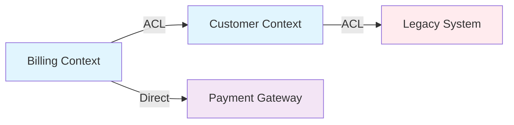

---
tags:
  - type/permanent
  - concept/ddd
  - ddd/anti-corruption-layer
  - ddd/bounded-context
  - area/architecture
  - status/active
title: 🛡️ Anti-Corruption Layer
aliases:
  - 🛡️ Anti-Corruption Layer
linter-yaml-title-alias: 🛡️ Anti-Corruption Layer
date created: Friday, September 5th 2025, 6:53:20 am
date modified: Friday, September 5th 2025, 10:27:35 am
---
## 🏷️ Tags

#type/permanent #concept/ddd #ddd/anti-corruption-layer #ddd/bounded-context #area/architecture #status/active 

---
# 🛡️ Anti-Corruption Layer

> [!abstract] 📋 Чек-лист раскрытия темы
> 
> - ✅ Определение и назначение ACL
> - ✅ Проблемы, которые решает
> - ✅ Архитектурные паттерны реализации
> - ✅ Практические примеры применения
> - ✅ Связь с другими DDD концепциями
> - ✅ Когда использовать и когда избегать

---

## 📑 Содержание

1. [[#🎯 Определение]]
2. [[#⚡ Проблемы, которые решает]]
3. [[#🏗️ Архитектурные паттерны]]
4. [[#💡 Практические примеры]]
5. [[#🔗 Связь с другими концепциями DDD]]
6. [[#✅ Когда использовать]]
7. [[#⚠️ Антипаттерны и ограничения]]

---

## 🎯 Определение

> [!info] 💡 Anti-Corruption Layer (ACL) **Антикоррупционный слой** — это изолирующий слой, который предотвращает "загрязнение" доменной модели внешними системами или устаревшим кодом.

### Ключевые характеристики

|Аспект|Описание|
|---|---|
|**Цель**|Защита целостности доменной модели|
|**Расположение**|Между Bounded Context'ами|
|**Ответственность**|Трансляция между различными моделями|
|**Направление**|Обычно односторонний|

---

## ⚡ Проблемы, которые решает

> [!warning] 🚨 Основные проблемы интеграции
> 
> ### 1. Модельное загрязнение
> 
> - Внешние структуры данных "протекают" в домен
> - Нарушение принципов [[DDD/Ubiquitous Language|Ubiquitous Language]]
> 
> ### 2. Тесная связанность
> 
> - Прямая зависимость от внешних API
> - Сложность изменений в интеграциях
> 
> ### 3. Несовместимость моделей
> 
> - Разные контексты имеют разные представления об одних сущностях
> - Конфликты в терминологии и структуре данных

---

## 🏗️ Архитектурные паттерны

### 🔄 Паттерн "Адаптер"

> [!example] 🛠️ Структура Adapter Pattern
> 
> ```
> Domain Model ←→ ACL (Adapter) ←→ External System
> ```

**Компоненты:**

- **Domain Service** — работает только с доменными объектами
- **ACL Adapter** — преобразует данные между моделями
- **External API Client** — взаимодействие с внешней системой

### 🗂️ Паттерн "Фасад"

> [!tip] 🏢 Упрощение сложных интеграций Когда внешняя система имеет сложный API с множественными вызовами

```
Domain → ACL Facade → [API Call 1, API Call 2, API Call 3] → External System
```

### 🔀 Паттерн "Translator"

> [!note] 🌐 Двунаправленный перевод Для случаев, когда нужна трансляция в обе стороны

---

## 💡 Практические примеры

### 📧 Пример 1: Интеграция с Email Service

> [!example] 🔧 E-commerce → Email Provider
> 
> **Доменная модель:**
> 
> ```csharp
> public class OrderConfirmation
> {
>     public CustomerId CustomerId { get; }
>     public OrderId OrderId { get; }
>     public Money TotalAmount { get; }
>     public IReadOnlyList<OrderItem> Items { get; }
> }
> ```
> 
> **ACL (Anti-Corruption Layer):**
> 
> ```csharp
> public class EmailServiceAdapter : INotificationService
> {
>     private readonly IExternalEmailProvider _emailProvider;
> 
>     public async Task SendOrderConfirmationAsync(
>         OrderConfirmation confirmation)
>     {
>         var emailRequest = new ExternalEmailRequest
>         {
>             ToAddress = await GetCustomerEmail(confirmation.CustomerId),
>             Subject = $"Order #{confirmation.OrderId.Value} Confirmed",
>             Template = "order-confirmation",
>             Data = new {
>                 order_number = confirmation.OrderId.Value,
>                 total = confirmation.TotalAmount.Amount,
>                 currency = confirmation.TotalAmount.Currency,
>                 items = confirmation.Items.Select(TranslateItem)
>             }
>         };
> 
>         await _emailProvider.SendEmailAsync(emailRequest);
>     }
> }
> ```

### 🏦 Пример 2: Интеграция с Legacy System

> [!example] 🗂️ CRM → Legacy Customer Database
> 
> **Проблема:** Legacy система хранит данные в денормализованном виде
> 
> **ACL решение:**
> 
> ```csharp
> public class LegacyCustomerAdapter : ICustomerRepository
> {
>     public async Task<Customer> GetByIdAsync(CustomerId id)
>     {
>         var legacyData = await _legacyDb.GetCustomerAsync(id.Value);
>         
>         return Customer.Create(
>             CustomerId.From(legacyData.CUST_ID),
>             PersonName.Create(legacyData.FNAME, legacyData.LNAME),
>             Email.From(legacyData.EMAIL_ADDR),
>             Address.Create(
>                 legacyData.ADDR_LINE1 + " " + legacyData.ADDR_LINE2,
>                 legacyData.CITY,
>                 legacyData.POSTAL_CODE
>             )
>         );
>     }
> }
> ```

---

## 🔗 Связь с другими концепциями DDD

### 🗺️ Context Map Relations

> [!info] 📊 ACL в Context Map
> 
> |Отношение|Когда использовать ACL|
> |---|---|
> |**Customer-Supplier**|Downstream (Customer) защищается от Upstream|
> |**Conformist**|ACL НЕ нужен - принимаем модель как есть|
> |**Anticorruption Layer**|Прямое применение паттерна|
> |**Open Host Service**|Upstream предоставляет стабильный API|

### 🏘️ Bounded Context Integration



---

## ✅ Когда использовать

> [!success] 🎯 Индикаторы для ACL
> 
> ### ✅ Используй когда:
> 
> - **Интеграция с Legacy системами** с плохо структурированными API
> - **Внешние сервисы** с моделью, не подходящей для твоего домена
> - **Временные интеграции** которые планируется заменить
> - **Защита от изменений** во внешних системах
> - **Разные жизненные циклы** у интегрируемых систем
> 
> ### 🔧 Технические сигналы:
> 
> - Внешний API возвращает "плоские" структуры данных
> - Требуется множественные вызовы для получения полной информации
> - Внешняя система использует устаревшие протоколы (SOAP, XML-RPC)
> - Нестабильный внешний API с частыми breaking changes

---

## ⚠️ Антипаттерны и ограничения

> [!danger] 🚫 Избегай ACL когда:
> 
> ### ❌ Антипаттерны:
> 
> - **Over-engineering**: ACL для простых, стабильных интеграций
> - **Leaky ACL**: доменные объекты знают о внешних структурах
> - **God ACL**: один ACL обслуживает множество различных интеграций
> - **No Translation**: ACL просто проксирует вызовы без трансляции
> 
> ### 🔧 Альтернативы:
> 
> |Ситуация|Используй вместо ACL|
> |---|---|
> |Стабильный внешний API|[[#ddd/integration-patterns\|Published Language]]|
> |Контролируемый Upstream|[[#ddd/context-relations\|Customer-Supplier]]|
> |Временная интеграция|Прямое подключение|
> |Внутренние bounded contexts|[[#ddd/integration-patterns\|Shared Kernel]]|

---

> [!tip] 🎯 Ключевые принципы
> 
> 1. **Одна ответственность**: каждый ACL защищает от конкретной внешней системы
> 2. **Изоляция**: домен не должен "знать" о существовании внешних систем
> 3. **Тестируемость**: ACL должен легко мокаться для unit-тестов
> 4. **Производительность**: учитывай накладные расходы на трансляцию

---

## 🔗 См. также

- [[DDD]] - основные концепции Domain-Driven Design
- [[DDD/MOC - Bounded Context |Bounded Context]] - контекст, который защищает ACL
- [[DDD/Context Map|Context Map]] - отображение отношений между контекстами
- [[DDD - Integration Patterns]] - паттерны интеграции в DDD