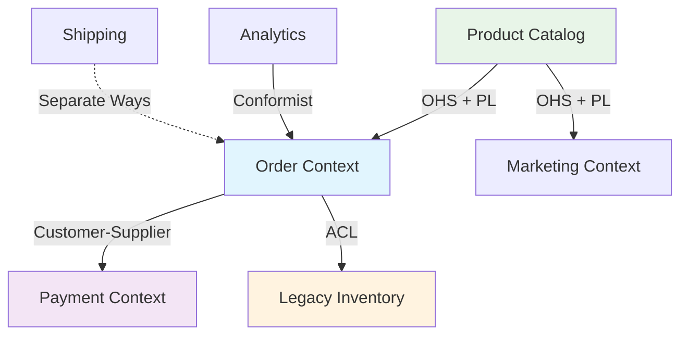

## 🏷️ Tags

#type/permanent #area/architecture #concept/ddd #ddd/context-map #ddd/bounded-context #status/active 

---
# 🗺️ Context Map

> [!abstract] 📋 Чек-лист изучения
> 
> - [ ] Понять что такое Context Map и зачем он нужен
> - [ ] Изучить типы отношений между контекстами
> - [ ] Разобрать паттерны интеграции
> - [ ] Понять как выбирать подходящий паттерн
> - [ ] Научиться создавать карты контекстов
> - [ ] Изучить примеры применения

---

## 🎯 Содержание

1. [[#🔍 Определение и назначение]]
2. [[#🔗 Типы отношений между контекстами]]
3. [[#🏗️ Паттерны интеграции]]
4. [[#🎨 Создание Context Map]]
5. [[#💡 Практические примеры]]
6. [[#⚡ Быстрые выводы]]

---

## 🔍 Определение и назначение

> [!info] 📖 Context Map (Карта контекстов) **Context Map** — это визуальное представление всех [[DDD#ddd/bounded-context|Bounded Context]] в системе и отношений между ними. Это стратегический инструмент DDD для понимания архитектуры и планирования интеграций.

### 🎯 Основные цели

|Цель|Описание|
|---|---|
|**Визуализация границ**|Четкое понимание где заканчивается один контекст и начинается другой|
|**Планирование интеграций**|Выбор оптимальных способов взаимодействия между контекстами|
|**Управление зависимостями**|Контроль направления зависимостей и минимизация coupling|
|**Коммуникация в команде**|Общий язык для обсуждения архитектуры системы|

---

## 🔗 Типы отношений между контекстами

### 🤝 Partnership (Партнерство)

> [!tip] 🤝 Равноправное сотрудничество Два контекста развиваются совместно. Команды координируют изменения и планируют совместные релизы.

**Когда использовать:** Тесно связанные домены, одна команда или тесное сотрудничество

### 🔄 Shared Kernel (Общее ядро)

> [!warning] ⚠️ Осторожно с общим кодом Контексты используют общую модель или библиотеку. Изменения требуют согласования всех команд.

**Когда использовать:** Критически важная общая логика, но минимизировать объем

### 👥 Customer-Supplier (Клиент-Поставщик)

> [!note] 📋 Upstream-Downstream отношения
> 
> - **Upstream** (поставщик) предоставляет сервис
> - **Downstream** (клиент) зависит от поставщика
> - Поставщик учитывает потребности клиента

### 🔒 Conformist (Конформист)

> [!example] 📥 Принятие внешней модели Downstream контекст полностью принимает модель Upstream без возможности влиять на неё.

**Когда использовать:** Интеграция с внешними системами, legacy системы

### 🛡️ Anti-Corruption Layer (ACL)

> [!success] 🛡️ Защита от внешнего влияния Downstream создает изоляционный слой для трансляции между моделями и защиты своего домена.

**Когда использовать:** Сложные внешние системы, защита от изменений upstream

### 🚪 Open Host Service (OHS)

> [!info] 🌐 Публичный API Контекст предоставляет стандартизированный протокол доступа для множественных клиентов.

### 📋 Published Language (PL)

> [!abstract] 📝 Общий язык обмена Документированный общий язык для обмена информацией между контекстами.

**Часто используется с:** Open Host Service

### 🔀 Separate Ways (Раздельные пути)

> [!danger] ⛔ Полная независимость Контексты развиваются независимо без интеграции. Дублирование функциональности предпочтительнее сложной интеграции.

---

## 🏗️ Паттерны интеграции



### 🎯 Выбор паттерна интеграции

|Ситуация|Рекомендуемый паттерн|
|---|---|
|Тесное сотрудничество команд|Partnership|
|Критически важная общая логика|Shared Kernel|
|Зависимость с возможностью влияния|Customer-Supplier|
|Внешние/legacy системы|Conformist или ACL|
|Множественные клиенты|OHS + PL|
|Слишком сложная интеграция|Separate Ways|

---

## 🎨 Создание Context Map

### 📝 Пошаговый процесс

> [!example] 🛠️ Алгоритм создания
> 
> 1. **Идентифицировать контексты** - найти все [[DDD#ddd/bounded-context|Bounded Contexts]]
> 2. **Определить отношения** - выявить как контексты взаимодействуют
> 3. **Выбрать паттерны** - подобрать подходящие паттерны интеграции
> 4. **Визуализировать** - создать диаграмму отношений
> 5. **Валидировать** - проверить с командами и stakeholders
> 6. **Итеративно улучшать** - обновлять по мере развития системы

### 🖼️ Формы представления

|Формат|Описание|Когда использовать|
|---|---|---|
|**Диаграмма блоков**|Прямоугольники + стрелки|Общий обзор архитектуры|
|**UML диаграмма**|Формальная нотация|Детальное документирование|
|**Мiro/Figma схема**|Интерактивная схема|Работа в команде|
|**Текстовое описание**|Структурированный текст|Для документации|

---

## 💡 Практические примеры

### 🛒 E-commerce система

```
┌─────────────────┐    Customer-Supplier    ┌──────────────────┐
│   Order Context │ ────────────────────────▶│ Payment Context  │
└─────────────────┘                         └──────────────────┘
         │                                           │
         │ ACL                              Partnership
         ▼                                           ▼
┌─────────────────┐                         ┌──────────────────┐
│ Legacy Inventory│                         │ Billing Context  │
└─────────────────┘                         └──────────────────┘
```

### 🏪 Микросервисная архитектура

> [!success] ✅ Хорошая практика
> 
> - **User Management** ←→ **Order Service** (Customer-Supplier)
> - **Order Service** → **Inventory Service** (ACL для защиты от legacy)
> - **Notification Service** ← **Multiple Services** (OHS + PL)

---

## ⚡ Быстрые выводы

> [!summary] 🎯 Ключевые принципы Context Map
> 
> **🔍 Анализ отношений**
> 
> - Каждое отношение должно быть явно определено
> - Направление зависимостей критически важно
> - Минимизировать связанность между контекстами
> 
> **🛡️ Защита границ**
> 
> - Использовать ACL для защиты от внешних изменений
> - Shared Kernel минимизировать до критически необходимого
> - Separate Ways лучше сложной интеграции
> 
> **📋 Эволюция карты**
> 
> - Context Map — живой документ
> - Регулярно пересматривать и обновлять
> - Синхронизировать с архитектурными изменениями

---

## 🔗 Связанные концепции

- [[DDD]] - основы Domain-Driven Design
- [[MOC - Bounded Context|Bounded Context]] - границы контекстов
- [[DDD - Anti-Corruption Layer]] - детали паттерна ACL
- [[Микросервисная архитектура#concept/microservice]] - применение в микросервисах

---

> [!quote] 💭 Мысль эксперта "Context Map — это не просто диаграмма архитектуры. Это инструмент для принятия решений о том, как команды должны сотрудничать, какие технологии использовать для интеграции, и где инвестировать время на развитие системы."