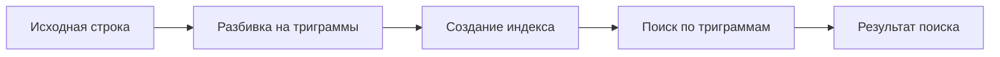

# Триграммные индексы в PostgreSQL

> [!abstract]- Содержание
> 
> - [[#Что такое триграммы?]]
> - [[#Расширение pg_trgm]]
> - [[#Принцип работы]]
> - [[#Создание триграммных индексов]]
> - [[#Практические примеры]]
> - [[#Оптимизация и настройка]]
> - [[#Ограничения и недостатки]]
> - [[#Сравнение с другими методами]]

---

## Что такое триграммы?

> [!info] Определение **Триграмма** — это последовательность из трех последовательных символов в строке. Триграммные индексы используются для быстрого поиска по подстрокам и приблизительного поиска текста.

### Примеры триграмм

Для строки `"postgresql"` триграммы будут:

- `" p"` (два пробела + первый символ)
- `"pos"`
- `"ost"`
- `"stg"`
- `"tgr"`
- `"gre"`
- `"res"`
- `"esq"`
- `"sql"`
- `"l "` (последний символ + два пробела)

---

## Расширение pg_trgm

> [!warning] Предварительная установка Перед использованием триграммных индексов необходимо установить расширение `pg_trgm`

```sql
-- Создание расширения
CREATE EXTENSION IF NOT EXISTS pg_trgm;

-- Проверка установки
SELECT * FROM pg_extension WHERE extname = 'pg_trgm';
```

### Основные функции pg_trgm

|Функция|Описание|Пример|
|---|---|---|
|`similarity(text, text)`|Вычисляет сходство между строками (0-1)|`SELECT similarity('word1', 'word2');`|
|`show_trgm(text)`|Показывает триграммы строки|`SELECT show_trgm('hello');`|
|`word_similarity(text, text)`|Сходство слов|`SELECT word_similarity('word', 'sword');`|

---

## Принцип работы

> [!tip] Как это работает?
> 
> 1. PostgreSQL разбивает строку на триграммы
> 2. Создает индекс на основе этих триграмм
> 3. При поиске сравнивает триграммы запроса с триграммами в индексе
> 4. Возвращает результаты на основе схожести

### Визуализация процесса



---

## Создание триграммных индексов

### Базовый синтаксис

```sql
-- GIN индекс (рекомендуется)
CREATE INDEX idx_table_column_gin_trgm 
ON table_name USING gin (column_name gin_trgm_ops);

-- GiST индекс
CREATE INDEX idx_table_column_gist_trgm 
ON table_name USING gist (column_name gist_trgm_ops);
```

> [!note] Выбор типа индекса
> 
> - **GIN**: быстрее для поиска, больше размер
> - **GiST**: медленнее поиск, меньше размер, поддерживает больше операторов

### Практический пример создания

```sql
-- Создаем тестовую таблицу
CREATE TABLE products (
    id SERIAL PRIMARY KEY,
    name TEXT NOT NULL,
    description TEXT,
    created_at TIMESTAMP DEFAULT NOW()
);

-- Заполняем данными
INSERT INTO products (name, description) VALUES
('iPhone 14 Pro Max', 'Смартфон Apple с камерой 48 МП'),
('Samsung Galaxy S23', 'Флагманский Android смартфон'),
('MacBook Pro 16', 'Ноутбук Apple для профессионалов'),
('Dell XPS 13', 'Ультрабук с Windows 11'),
('iPad Air', 'Планшет Apple среднего класса');

-- Создаем триграммный индекс
CREATE INDEX idx_products_name_gin_trgm 
ON products USING gin (name gin_trgm_ops);

CREATE INDEX idx_products_description_gin_trgm 
ON products USING gin (description gin_trgm_ops);
```

---

## Практические примеры

### 1. Поиск по подстроке (LIKE)

> [!example] Обычный LIKE vs Триграммный поиск

```sql
-- ❌ Медленный поиск без индекса
EXPLAIN ANALYZE
SELECT * FROM products 
WHERE name LIKE '%Pro%';

-- ✅ Быстрый поиск с триграммным индексом
EXPLAIN ANALYZE
SELECT * FROM products 
WHERE name % 'Pro';  -- оператор сходства
```

### 2. Поиск с опечатками (Fuzzy Search)

```sql
-- Поиск товаров со сходными названиями
SELECT name, similarity(name, 'iPhne') as sim
FROM products
WHERE name % 'iPhne'  -- найдет "iPhone"
ORDER BY sim DESC;

-- Результат:
-- name           | sim
-- iPhone 14 Pro Max | 0.4
```

### 3. Регулярные выражения

```sql
-- Триграммные индексы работают с регулярками
SELECT * FROM products 
WHERE name ~ '^(iPhone|Samsung).*Pro';
```

### 4. Поиск по нескольким словам

```sql
-- Поиск товаров, содержащих несколько ключевых слов
SELECT name, 
       word_similarity('Apple Pro', name) as sim
FROM products
WHERE name %> 'Apple Pro'  -- оператор word similarity
ORDER BY sim DESC;
```

---

## Оптимизация и настройка

### Настройка параметров сходства

```sql
-- Просмотр текущих настроек
SHOW pg_trgm.similarity_threshold;
SHOW pg_trgm.word_similarity_threshold;

-- Изменение порога сходства (0.0 - 1.0)
SET pg_trgm.similarity_threshold = 0.3;  -- по умолчанию 0.3
SET pg_trgm.word_similarity_threshold = 0.6;  -- по умолчанию 0.6
```

> [!tip] Рекомендации по настройке
> 
> - **Высокий порог (0.6-0.8)**: точные совпадения
> - **Средний порог (0.3-0.5)**: баланс точности и полноты
> - **Низкий порог (0.1-0.2)**: максимальная полнота поиска

### Комбинированные индексы

```sql
-- Индекс по нескольким столбцам
CREATE INDEX idx_products_multi_trgm 
ON products USING gin ((name || ' ' || description) gin_trgm_ops);

-- Использование
SELECT * FROM products 
WHERE (name || ' ' || description) % 'Apple камера';
```

### Частичные индексы

```sql
-- Индекс только для активных товаров
CREATE INDEX idx_products_active_name_trgm 
ON products USING gin (name gin_trgm_ops)
WHERE status = 'active';
```

---

## Ограничения и недостатки

> [!warning] Важные ограничения

### 1. Размер индекса

```sql
-- Проверка размера индекса
SELECT schemaname, tablename, indexname, 
       pg_size_pretty(pg_relation_size(indexname::regclass)) as size
FROM pg_indexes 
WHERE tablename = 'products';
```

### 2. Производительность на коротких строках

|Длина строки|Эффективность триграмм|
|---|---|
|1-2 символа|❌ Неэффективно|
|3-5 символов|⚠️ Ограниченно|
|6+ символов|✅ Эффективно|

### 3. Чувствительность к регистру

```sql
-- Создание индекса без учета регистра
CREATE INDEX idx_products_name_lower_trgm 
ON products USING gin (lower(name) gin_trgm_ops);

-- Поиск без учета регистра
SELECT * FROM products 
WHERE lower(name) % lower('IPHONE');
```

---

## Сравнение с другими методами

### Full-Text Search vs Триграммы

> [!note] Сравнительная таблица

|Критерий|Full-Text Search|Триграммы|
|---|---|---|
|**Поиск точных слов**|✅ Отлично|⚠️ Хорошо|
|**Поиск подстрок**|❌ Плохо|✅ Отлично|
|**Поиск с опечатками**|❌ Не поддерживает|✅ Отлично|
|**Морфология**|✅ Поддерживает|❌ Не поддерживает|
|**Размер индекса**|⚠️ Средний|❌ Большой|

### Примеры различий

```sql
-- Full-Text Search
SELECT * FROM products 
WHERE to_tsvector('russian', description) @@ to_tsquery('russian', 'смартфон');

-- Триграммный поиск
SELECT * FROM products 
WHERE description % 'смартфон';
```

---

## Мониторинг и анализ

### Анализ использования индекса

```sql
-- Статистика использования индексов
SELECT schemaname, tablename, indexname, 
       idx_tup_read, idx_tup_fetch
FROM pg_stat_user_indexes 
WHERE tablename = 'products';
```

### Оценка качества поиска

```sql
-- Функция для тестирования качества поиска
CREATE OR REPLACE FUNCTION test_search_quality(
    search_term TEXT,
    min_similarity FLOAT DEFAULT 0.3
) RETURNS TABLE(name TEXT, similarity FLOAT) AS $$
BEGIN
    RETURN QUERY
    SELECT p.name, similarity(p.name, search_term) as sim
    FROM products p
    WHERE p.name % search_term 
      AND similarity(p.name, search_term) >= min_similarity
    ORDER BY sim DESC;
END;
$$ LANGUAGE plpgsql;

-- Использование
SELECT * FROM test_search_quality('iPhone', 0.2);
```

---

## Практические рекомендации

> [!success] Лучшие практики

### 1. Выбор типа индекса

- **GIN** для большинства случаев
- **GiST** когда важен размер индекса

### 2. Настройка памяти

```sql
-- Увеличиваем память для создания индекса
SET maintenance_work_mem = '1GB';
CREATE INDEX CONCURRENTLY idx_products_name_trgm 
ON products USING gin (name gin_trgm_ops);
```

### 3. Комбинирование с другими методами

```sql
-- Гибридный поиск: сначала триграммы, потом FTS
WITH trigram_results AS (
    SELECT *, similarity(name, 'iPhone') as sim
    FROM products 
    WHERE name % 'iPhone'
),
fts_results AS (
    SELECT *, ts_rank(to_tsvector(description), to_tsquery('камера')) as rank
    FROM products 
    WHERE to_tsvector(description) @@ to_tsquery('камера')
)
SELECT * FROM trigram_results 
UNION 
SELECT *, 0 as sim FROM fts_results
ORDER BY sim DESC, rank DESC;
```

---

> [!quote] Заключение Триграммные индексы — мощный инструмент для нечеткого поиска и поиска по подстрокам в PostgreSQL. Они особенно эффективны для автодополнения, поиска с опечатками и когда точные границы слов неизвестны.

## Дополнительные ресурсы

- 📚 [Документация PostgreSQL по pg_trgm](https://www.postgresql.org/docs/current/pgtrgm.html)
- 🔧 [Настройка производительности](https://wiki.postgresql.org/wiki/Performance_Optimization)
- 💡 [Примеры использования в реальных проектах](https://github.com/postgres/postgres)

---

> [!tip] Следующие шаги
> 
> 1. Попробуйте создать триграммный индекс на ваших данных
> 2. Экспериментируйте с параметрами сходства
> 3. Сравните производительность с другими методами поиска