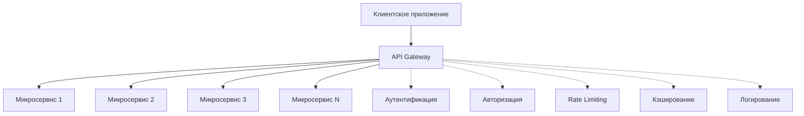

## 🏷️ Tags

#type/area #area/architecture #concept/microservice #concept/clean-architecture #design-pattern/api-gateway 

---

> [!info] Что такое API Gateway? **API Gateway** - это компонент архитектуры микросервисов, который выступает единой точкой входа для всех клиентских запросов. Он маршрутизирует запросы к соответствующим микросервисам, обеспечивает безопасность, мониторинг и другие сквозные функции.

---

## 📋 Содержание

- [[#🎯 Основные концепции]]
- [[#⚙️ Реализации в .NET]]
- [[#🏗️ Ocelot - популярное решение]]
- [[#🔧 Практические примеры]]
- [[#🛡️ Безопасность и аутентификация]]
- [[#📊 Мониторинг и логирование]]
- [[#🚀 Развертывание и производительность]]

---

## 🎯 Основные концепции

### Ключевые функции API Gateway



> [!tip] Основные преимущества
> 
> - **Единая точка входа** - упрощает клиентский код
> - **Централизованная безопасность** - аутентификация и авторизация в одном месте
> - **Агрегация данных** - объединение ответов от нескольких сервисов
> - **Версионирование API** - управление различными версиями
> - **Мониторинг** - централизованное отслеживание трафика

---

## ⚙️ Реализации в .NET

### 1. **Ocelot**

- Легковесный и гибкий
- Отличная интеграция с ASP.NET Core
- Богатая функциональность из коробки

### 2. **YARP (Yet Another Reverse Proxy)**

- От Microsoft
- Высокая производительность
- Гибкая конфигурация

### 3. **Envoy Proxy**

- C++ реализация
- Используется в Kubernetes
- Расширенные возможности Service Mesh

---

## 🏗️ Ocelot - популярное решение

### Установка и базовая настройка

```bash
# Установка пакета
dotnet add package Ocelot
dotnet add package Ocelot.Provider.Consul  # Для Service Discovery
```

### Program.cs

```csharp
using Ocelot.DependencyInjection;
using Ocelot.Middleware;

var builder = WebApplication.CreateBuilder(args);

// Добавление конфигурации Ocelot
builder.Configuration.AddJsonFile("ocelot.json", false, true);

// Регистрация сервисов Ocelot
builder.Services.AddOcelot();

var app = builder.Build();

// Использование Ocelot middleware
await app.UseOcelot();

app.Run();
```

### Конфигурационный файл ocelot.json

```json
{
  "Routes": [
    {
      "DownstreamPathTemplate": "/api/users/{everything}",
      "DownstreamScheme": "https",
      "DownstreamHostAndPorts": [
        {
          "Host": "user-service",
          "Port": 5001
        }
      ],
      "UpstreamPathTemplate": "/users/{everything}",
      "UpstreamHttpMethod": [ "Get", "Post", "Put", "Delete" ],
      "AuthenticationOptions": {
        "AuthenticationProviderKey": "Bearer",
        "AllowedScopes": []
      },
      "RateLimitOptions": {
        "ClientWhitelist": [],
        "EnableRateLimiting": true,
        "Period": "1m",
        "PeriodTimespan": 60,
        "Limit": 100
      }
    },
    {
      "DownstreamPathTemplate": "/api/orders/{everything}",
      "DownstreamScheme": "https",
      "DownstreamHostAndPorts": [
        {
          "Host": "order-service",
          "Port": 5002
        }
      ],
      "UpstreamPathTemplate": "/orders/{everything}",
      "UpstreamHttpMethod": [ "Get", "Post", "Put", "Delete" ],
      "LoadBalancerOptions": {
        "Type": "RoundRobin"
      }
    }
  ],
  "GlobalConfiguration": {
    "BaseUrl": "https://api.mycompany.com",
    "ServiceDiscoveryProvider": {
      "Host": "consul",
      "Port": 8500,
      "Type": "Consul"
    }
  }
}
```

> [!note] Объяснение конфигурации
> 
> - **DownstreamPathTemplate** - путь к микросервису
> - **UpstreamPathTemplate** - путь, который видит клиент
> - **LoadBalancerOptions** - балансировка нагрузки
> - **RateLimitOptions** - ограничение скорости запросов
> - **AuthenticationOptions** - настройки аутентификации

---

## 🔧 Практические примеры

### Пример 1: Простой Gateway с маршрутизацией

```csharp
// Startup.cs или Program.cs
public void ConfigureServices(IServiceCollection services)
{
    services.AddOcelot();
}

public void Configure(IApplicationBuilder app, IWebHostEnvironment env)
{
    app.UseOcelot().Wait();
}
```

```json
// ocelot.json - простая маршрутизация
{
  "Routes": [
    {
      "DownstreamPathTemplate": "/api/products",
      "DownstreamScheme": "http",
      "DownstreamHostAndPorts": [
        {
          "Host": "localhost",
          "Port": 5001
        }
      ],
      "UpstreamPathTemplate": "/products",
      "UpstreamHttpMethod": [ "Get" ]
    }
  ]
}
```

### Пример 2: Агрегация данных

```csharp
// Custom Aggregator
public class UserOrderAggregator : IDefinedAggregator
{
    public async Task<DownstreamResponse> Aggregate(List<HttpContext> responses)
    {
        var userResponse = await responses[0].Response.Content.ReadAsStringAsync();
        var ordersResponse = await responses[1].Response.Content.ReadAsStringAsync();
        
        var user = JsonSerializer.Deserialize<User>(userResponse);
        var orders = JsonSerializer.Deserialize<List<Order>>(ordersResponse);
        
        var result = new
        {
            User = user,
            Orders = orders,
            TotalOrders = orders.Count
        };
        
        var jsonResult = JsonSerializer.Serialize(result);
        var stringContent = new StringContent(jsonResult, Encoding.UTF8, "application/json");
        
        return new DownstreamResponse(stringContent, HttpStatusCode.OK, 
            new List<Header>(), "OK");
    }
}
```

```json
// Конфигурация агрегации
{
  "Routes": [
    {
      "DownstreamPathTemplate": "/api/users/{userId}",
      "DownstreamScheme": "http",
      "DownstreamHostAndPorts": [
        {
          "Host": "user-service",
          "Port": 5001
        }
      ],
      "UpstreamPathTemplate": "/users/{userId}/profile",
      "Key": "user"
    },
    {
      "DownstreamPathTemplate": "/api/orders/user/{userId}",
      "DownstreamScheme": "http", 
      "DownstreamHostAndPorts": [
        {
          "Host": "order-service",
          "Port": 5002
        }
      ],
      "UpstreamPathTemplate": "/users/{userId}/profile",
      "Key": "orders"
    }
  ],
  "Aggregates": [
    {
      "RouteKeys": [ "user", "orders" ],
      "UpstreamPathTemplate": "/users/{userId}/profile",
      "Aggregator": "UserOrderAggregator"
    }
  ]
}
```

### Пример 3: Custom Middleware для логирования

```csharp
public class RequestLoggingMiddleware
{
    private readonly RequestDelegate _next;
    private readonly ILogger<RequestLoggingMiddleware> _logger;

    public RequestLoggingMiddleware(RequestDelegate next, ILogger<RequestLoggingMiddleware> logger)
    {
        _next = next;
        _logger = logger;
    }

    public async Task InvokeAsync(HttpContext context)
    {
        var stopwatch = Stopwatch.StartNew();
        
        _logger.LogInformation("Incoming request: {Method} {Path} from {RemoteIP}", 
            context.Request.Method, 
            context.Request.Path, 
            context.Connection.RemoteIpAddress);

        await _next(context);

        stopwatch.Stop();
        
        _logger.LogInformation("Request completed: {Method} {Path} responded {StatusCode} in {Elapsed}ms",
            context.Request.Method,
            context.Request.Path,
            context.Response.StatusCode,
            stopwatch.ElapsedMilliseconds);
    }
}

// Регистрация middleware
app.UseMiddleware<RequestLoggingMiddleware>();
app.UseOcelot().Wait();
```

---

## 🛡️ Безопасность и аутентификация

### JWT Authentication

```csharp
// Program.cs
builder.Services.AddAuthentication(JwtBearerDefaults.AuthenticationScheme)
    .AddJwtBearer("Bearer", options =>
    {
        options.Authority = "https://your-identity-server.com";
        options.Audience = "api-gateway";
        options.RequireHttpsMetadata = false; // Только для разработки
    });

builder.Services.AddOcelot();
```

### OAuth2 + Ocelot

```json
{
  "Routes": [
    {
      "DownstreamPathTemplate": "/api/secure/{everything}",
      "DownstreamScheme": "https",
      "DownstreamHostAndPorts": [
        {
          "Host": "secure-service",
          "Port": 5003
        }
      ],
      "UpstreamPathTemplate": "/secure/{everything}",
      "AuthenticationOptions": {
        "AuthenticationProviderKey": "Bearer",
        "AllowedScopes": ["api.read", "api.write"]
      }
    }
  ]
}
```

### Claims Transformation

```csharp
public class ClaimsTransformationMiddleware : OcelotMiddleware
{
    public ClaimsTransformationMiddleware(RequestDelegate next) : base(next) { }

    public async Task Invoke(HttpContext httpContext)
    {
        if (httpContext.User.Identity.IsAuthenticated)
        {
            // Добавление кастомных claims
            var identity = (ClaimsIdentity)httpContext.User.Identity;
            identity.AddClaim(new Claim("gateway-processed", "true"));
            identity.AddClaim(new Claim("processed-at", DateTime.UtcNow.ToString()));
        }

        await Next.Invoke(httpContext);
    }
}
```

> [!warning] Важные соображения безопасности
> 
> - Всегда используйте HTTPS в production
> - Настройте CORS правильно
> - Используйте Rate Limiting для предотвращения DDoS
> - Логируйте все попытки аутентификации
> - Регулярно обновляйте зависимости

---

## 📊 Мониторинг и логирование

### Интеграция с Serilog

```csharp
// Program.cs
using Serilog;

var builder = WebApplication.CreateBuilder(args);

// Настройка Serilog
builder.Host.UseSerilog((context, services, configuration) => configuration
    .ReadFrom.Configuration(context.Configuration)
    .ReadFrom.Services(services)
    .WriteTo.Console()
    .WriteTo.File("logs/api-gateway-.log", rollingInterval: RollingInterval.Day)
    .WriteTo.Elasticsearch(new ElasticsearchSinkOptions(new Uri("http://elasticsearch:9200"))
    {
        IndexFormat = "api-gateway-logs-{0:yyyy.MM.dd}",
        AutoRegisterTemplate = true
    }));
```

### Health Checks

```csharp
builder.Services.AddHealthChecks()
    .AddCheck("user-service", () => 
    {
        // Проверка доступности user service
        using var client = new HttpClient();
        var response = client.GetAsync("http://user-service:5001/health").Result;
        return response.IsSuccessStatusCode ? 
            HealthCheckResult.Healthy() : 
            HealthCheckResult.Unhealthy();
    })
    .AddCheck("order-service", () =>
    {
        // Проверка доступности order service
        using var client = new HttpClient();
        var response = client.GetAsync("http://order-service:5002/health").Result;
        return response.IsSuccessStatusCode ? 
            HealthCheckResult.Healthy() : 
            HealthCheckResult.Unhealthy();
    });

app.MapHealthChecks("/health", new HealthCheckOptions
{
    ResponseWriter = UIResponseWriter.WriteHealthCheckUIResponse
});
```

### Metrics с Prometheus

```csharp
// Установить пакеты:
// prometheus-net.AspNetCore
// prometheus-net.SystemMetrics

builder.Services.AddSingleton<IMetrics, MetricService>();

public class MetricService : IMetrics
{
    private readonly Counter _requestCounter = Metrics
        .CreateCounter("gateway_requests_total", "Total requests", new[] { "method", "endpoint", "status" });
    
    private readonly Histogram _requestDuration = Metrics
        .CreateHistogram("gateway_request_duration_seconds", "Request duration");

    public void IncrementRequestCount(string method, string endpoint, string status)
    {
        _requestCounter.WithLabels(method, endpoint, status).Inc();
    }

    public void RecordRequestDuration(double duration)
    {
        _requestDuration.Observe(duration);
    }
}

// В Program.cs
app.UseMetricServer(); // Эндпоинт /metrics для Prometheus
app.UseHttpMetrics(); // Автоматический сбор HTTP метрик
```

---

## 🚀 Развертывание и производительность

### Docker Configuration

```dockerfile
# Dockerfile
FROM mcr.microsoft.com/dotnet/aspnet:8.0 AS base
WORKDIR /app
EXPOSE 80
EXPOSE 443

FROM mcr.microsoft.com/dotnet/sdk:8.0 AS build
WORKDIR /src
COPY ["ApiGateway/ApiGateway.csproj", "ApiGateway/"]
RUN dotnet restore "ApiGateway/ApiGateway.csproj"
COPY . .
WORKDIR "/src/ApiGateway"
RUN dotnet build "ApiGateway.csproj" -c Release -o /app/build

FROM build AS publish
RUN dotnet publish "ApiGateway.csproj" -c Release -o /app/publish

FROM base AS final
WORKDIR /app
COPY --from=publish /app/publish .
ENTRYPOINT ["dotnet", "ApiGateway.dll"]
```

### Docker Compose

```yaml
# docker-compose.yml
version: '3.8'
services:
  api-gateway:
    build: .
    ports:
      - "80:80"
      - "443:443"
    environment:
      - ASPNETCORE_ENVIRONMENT=Production
      - ASPNETCORE_URLS=http://+:80
    depends_on:
      - user-service
      - order-service
      - consul
    volumes:
      - ./logs:/app/logs

  user-service:
    image: user-service:latest
    ports:
      - "5001:80"
    environment:
      - ASPNETCORE_ENVIRONMENT=Production

  order-service:
    image: order-service:latest
    ports:
      - "5002:80"
    environment:
      - ASPNETCORE_ENVIRONMENT=Production

  consul:
    image: consul:latest
    ports:
      - "8500:8500"
    command: consul agent -server -ui -node=server-1 -bootstrap-expect=1 -client=0.0.0.0
```

### Оптимизация производительности

> [!tip] Рекомендации по производительности
> 

**Кэширование**
 ```csharp
> // Добавление кэширования ответов
> builder.Services.AddMemoryCache();
> builder.Services.AddResponseCaching();
> 
> // В конфигурации Ocelot
> {
>   "FileCacheOptions": {
>     "TtlSeconds": 300,
>     "Region": "UserRegion"
>   }
> }
> ```
 
 **Connection Pooling**

 ```csharp
> builder.Services.AddHttpClient();
> builder.Services.Configure<HttpClientFactoryOptions>(options =>
> {
>     options.HttpClientActions.Add(client =>
>     {
>         client.Timeout = TimeSpan.FromSeconds(30);
>     });
> });
> ```

 **Circuit Breaker Pattern**

 ```json
> {
>   "QoSOptions": {
>     "ExceptionsAllowedBeforeBreaking": 3,
>     "DurationOfBreak": 5000,
>     "TimeoutValue": 10000
>   }
> }
> ```

---

## 📈 Паттерны и best practices

### 1. Circuit Breaker Pattern

```csharp
// Используя Polly
public class CircuitBreakerService
{
    private readonly IAsyncPolicy<HttpResponseMessage> _circuitBreakerPolicy;

    public CircuitBreakerService()
    {
        _circuitBreakerPolicy = Policy
            .Handle<HttpRequestException>()
            .OrResult<HttpResponseMessage>(r => !r.IsSuccessStatusCode)
            .CircuitBreakerAsync(
                exceptionsAllowedBeforeBreaking: 3,
                durationOfBreak: TimeSpan.FromSeconds(30),
                onBreak: (exception, duration) => 
                {
                    // Логирование
                },
                onReset: () => 
                {
                    // Логирование восстановления
                });
    }
}
```

### 2. Retry Pattern

```json
{
  "Routes": [
    {
      "QoSOptions": {
        "ExceptionsAllowedBeforeBreaking": 3,
        "DurationOfBreak": 5000,
        "TimeoutValue": 10000
      },
      "HttpHandlerOptions": {
        "AllowAutoRedirect": false,
        "UseCookieContainer": false,
        "MaxConnectionsPerServer": 100
      }
    }
  ]
}
```

### 3. Request/Response Transformation

```csharp
public class CustomRequestTransformer : IHttpRequestMessageTransformer
{
    public async Task<RequestTransformContext> TransformAsync(RequestTransformContext context)
    {
        // Добавление кастомных заголовков
        context.ProxyRequest.Headers.Add("X-Gateway-Version", "1.0");
        context.ProxyRequest.Headers.Add("X-Request-Id", Guid.NewGuid().ToString());
        
        return context;
    }
}

// Регистрация
builder.Services.AddSingleton<IHttpRequestMessageTransformer, CustomRequestTransformer>();
```

---

## 🎯 Заключение

> [!success] Ключевые выводы
> 
> API Gateway в .NET экосистеме предоставляет мощные инструменты для построения микросервисной архитектуры:
> 
> ✅ **Ocelot** - отличный выбор для большинства сценариев  
> ✅ **YARP** - для высокопроизводительных решений от Microsoft  
> ✅ **Централизованная безопасность** и мониторинг  
> ✅ **Гибкая конфигурация** и расширяемость  
> ✅ **Готовые паттерны** для устойчивости (Circuit Breaker, Retry)

### Следующие шаги для изучения:

1. **Service Mesh** (Istio, Linkerd) - для более сложных сценариев
2. **gRPC Gateway** - для высокопроизводительных API
3. **GraphQL Gateway** - для агрегации данных
4. **Event-driven patterns** - интеграция с message brokers

---

> [!quote] "API Gateway - это не просто прокси, это интеллектуальный слой, который делает вашу микросервисную архитектуру более управляемой, безопасной и наблюдаемой."

