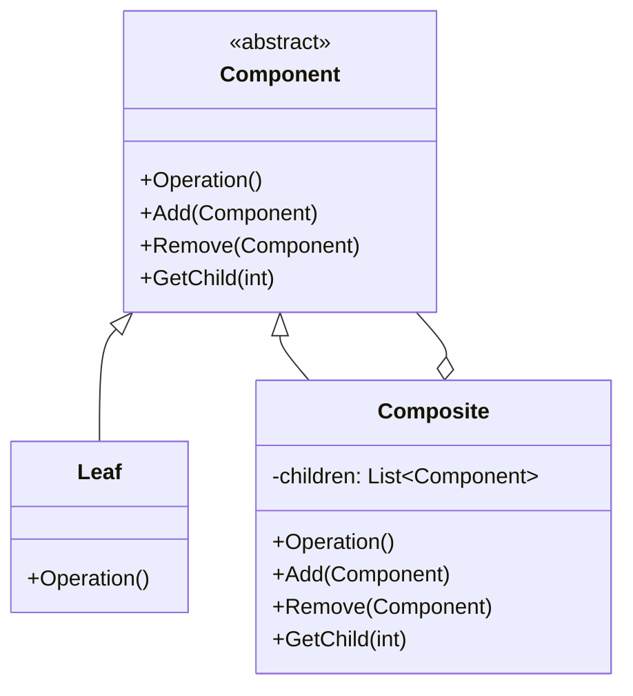

## 🏷️ Tags

#type/area #area/architecture #concept/microservice #concept/clean-architecture #design-pattern/composite 

---
 
> [!info] Определение **Composite Pattern** - структурный паттерн проектирования, который позволяет сгруппировать объекты в древовидную структуру для представления иерархии "часть-целое". Позволяет клиентам единообразно работать с отдельными объектами и их группами.

## 📋 Содержание

- [[#🎯 Назначение]]
- [[#🏗️ Структура]]
- [[#💻 Реализация на C#]]
- [[#🌟 Преимущества и недостатки]]
- [[#🔍 Применение в .NET]]

---

## 🎯 Назначение

Паттерн решает задачу работы с **древовидными структурами**, где объекты могут содержать другие объекты того же типа.

> [!example] Примеры использования
> 
> - Файловая система (папки и файлы)
> - GUI элементы (контейнеры и компоненты)
> - Организационные структуры
> - Математические выражения

---

## 🏗️ Структура



### Участники:

- **Component** - базовый интерфейс для всех объектов
- **Leaf** - простой элемент без дочерних объектов
- **Composite** - контейнер с дочерними объектами

---

## 💻 Реализация на C#

### 🔹 Базовый компонент

```csharp
// Абстрактный базовый класс для всех элементов дерева
public abstract class FileSystemComponent
{
    protected string name;
    
    public FileSystemComponent(string name)
    {
        this.name = name;
    }
    
    // Основная операция
    public abstract void Display(int depth = 0);
    
    // Операции для составных объектов (по умолчанию не поддерживаются)
    public virtual void Add(FileSystemComponent component)
    {
        throw new NotSupportedException("Операция не поддерживается");
    }
    
    public virtual void Remove(FileSystemComponent component)
    {
        throw new NotSupportedException("Операция не поддерживается");
    }
    
    public virtual FileSystemComponent GetChild(int index)
    {
        throw new NotSupportedException("Операция не поддерживается");
    }
}
```

### 🍃 Leaf - Простой элемент

```csharp
// Файл - конечный элемент дерева
public class File : FileSystemComponent
{
    private long size;
    
    public File(string name, long size) : base(name)
    {
        this.size = size;
    }
    
    public override void Display(int depth = 0)
    {
        var indent = new string(' ', depth * 2);
        Console.WriteLine($"{indent}📄 {name} ({size} bytes)");
    }
}
```

### 🏗️ Composite - Контейнер

```csharp
// Папка - составной элемент, может содержать файлы и другие папки
public class Folder : FileSystemComponent
{
    private List<FileSystemComponent> children = new List<FileSystemComponent>();
    
    public Folder(string name) : base(name) { }
    
    public override void Add(FileSystemComponent component)
    {
        children.Add(component);
    }
    
    public override void Remove(FileSystemComponent component)
    {
        children.Remove(component);
    }
    
    public override FileSystemComponent GetChild(int index)
    {
        return children[index];
    }
    
    public override void Display(int depth = 0)
    {
        var indent = new string(' ', depth * 2);
        Console.WriteLine($"{indent}📁 {name}/");
        
        // Рекурсивно отображаем все дочерние элементы
        foreach (var child in children)
        {
            child.Display(depth + 1);
        }
    }
}
```

### 🚀 Использование

```csharp
class Program
{
    static void Main(string[] args)
    {
        // Создаем корневую папку
        var rootFolder = new Folder("Root");
        
        // Создаем файлы
        var file1 = new File("document.txt", 1024);
        var file2 = new File("image.jpg", 2048);
        
        // Создаем подпапку
        var subFolder = new Folder("Documents");
        var file3 = new File("readme.md", 512);
        
        // Строим иерархию
        rootFolder.Add(file1);
        rootFolder.Add(file2);
        rootFolder.Add(subFolder);
        
        subFolder.Add(file3);
        
        // Отображаем всю структуру
        rootFolder.Display();
        
        /* Вывод:
        📁 Root/
          📄 document.txt (1024 bytes)
          📄 image.jpg (2048 bytes)
          📁 Documents/
            📄 readme.md (512 bytes)
        */
    }
}
```

---

## 🔍 Расширенный пример: GUI Компоненты

> [!tip] Практический пример Рассмотрим создание системы GUI элементов

```csharp
// Базовый UI компонент
public abstract class UIComponent
{
    protected string name;
    
    public UIComponent(string name)
    {
        this.name = name;
    }
    
    public abstract void Render();
    public abstract void HandleClick();
    
    public virtual void Add(UIComponent component) { }
    public virtual void Remove(UIComponent component) { }
}

// Простые элементы (Leaf)
public class Button : UIComponent
{
    public Button(string name) : base(name) { }
    
    public override void Render()
    {
        Console.WriteLine($"[{name}]");
    }
    
    public override void HandleClick()
    {
        Console.WriteLine($"Button '{name}' clicked!");
    }
}

public class Label : UIComponent
{
    public Label(string name) : base(name) { }
    
    public override void Render()
    {
        Console.WriteLine($"Label: {name}");
    }
    
    public override void HandleClick()
    {
        // Labels обычно не кликабельны
    }
}

// Составной элемент (Composite)
public class Panel : UIComponent
{
    private List<UIComponent> components = new List<UIComponent>();
    
    public Panel(string name) : base(name) { }
    
    public override void Add(UIComponent component)
    {
        components.Add(component);
    }
    
    public override void Remove(UIComponent component)
    {
        components.Remove(component);
    }
    
    public override void Render()
    {
        Console.WriteLine($"=== Panel: {name} ===");
        foreach (var component in components)
        {
            component.Render();
        }
        Console.WriteLine("===================");
    }
    
    public override void HandleClick()
    {
        Console.WriteLine($"Panel '{name}' area clicked");
        // Можно передать событие дочерним элементам
    }
}
```

### Использование GUI системы:

```csharp
var mainPanel = new Panel("Main Window");
var toolbar = new Panel("Toolbar");
var content = new Panel("Content Area");

toolbar.Add(new Button("Save"));
toolbar.Add(new Button("Load"));
toolbar.Add(new Button("Exit"));

content.Add(new Label("Welcome to the application"));
content.Add(new Button("Start"));

mainPanel.Add(toolbar);
mainPanel.Add(content);

// Единообразная работа со всей иерархией
mainPanel.Render();
```

---

## 🌟 Преимущества и недостатки

> [!success] ✅ Преимущества
> 
> - **Единообразная работа** с простыми и составными объектами
> - **Легкость добавления** новых типов компонентов
> - **Упрощение клиентского кода** - не нужно различать типы объектов
> - **Гибкость структуры** - легко создавать сложные иерархии

> [!warning] ⚠️ Недостатки
> 
> - **Слишком общий дизайн** - может быть сложно ограничить компоненты
> - **Производительность** - рекурсивные вызовы могут быть медленными
> - **Сложность отладки** глубоко вложенных структур

---

## 🔍 Применение в .NET Framework

### Windows Forms

```csharp
// Control - базовый Component
// Form, Panel - Composite (могут содержать другие контролы)
// Button, Label - Leaf элементы

Form form = new Form();
Panel panel = new Panel();
Button button = new Button();

form.Controls.Add(panel);  // Добавляем панель на форму
panel.Controls.Add(button); // Добавляем кнопку на панель
```

### WPF

```csharp
// FrameworkElement - Component
// Grid, StackPanel - Composite
// TextBox, Button - Leaf

Grid grid = new Grid();
StackPanel panel = new StackPanel();
Button button = new Button();

grid.Children.Add(panel);
panel.Children.Add(button);
```

---

## 📚 Связанные паттерны

|Паттерн|Связь|
|---|---|
|**Iterator**|Часто используется для обхода составных структур|
|**Visitor**|Применяется для операций над составными объектами|
|**Decorator**|Имеет схожую структуру, но разные намерения|

---

## 🎯 Когда использовать

> [!note] Используйте Composite когда:
> 
> - Нужно представить иерархию объектов "часть-целое"
> - Клиенты должны единообразно работать с простыми и составными объектами
> - Структура может изменяться динамически

---

