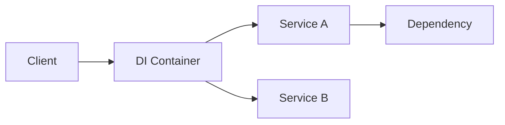

## 🏷️ Tags

#type/area #area/architecture #concept/microservice #concept/clean-architecture #design-pattern/decorator 

---

> [!info] Что это такое? **Dependency Injection Container** - это инструмент, который автоматически управляет созданием объектов и их зависимостями в приложении.

## 📋 Содержание

- [[#Основы DI Container]]
- [[#Жизненные циклы сервисов]]
- [[#Регистрация сервисов]]
- [[#Практические примеры]]
- [[#Лучшие практики]]

---

## Основы DI Container

### Принцип работы



### Встроенный контейнер Microsoft.Extensions.DependencyInjection

> [!example] Базовая настройка
> 
> ```csharp
> var services = new ServiceCollection();
> services.AddScoped<IUserService, UserService>();
> services.AddTransient<IEmailService, EmailService>();
> 
> var provider = services.BuildServiceProvider();
> var userService = provider.GetService<IUserService>();
> ```

---

## 🔄 Жизненные циклы сервисов

|Тип|Описание|Когда использовать|
|---|---|---|
|**Singleton**|Один экземпляр на всё приложение|Кеш, конфигурация, логгер|
|**Scoped**|Один экземпляр на запрос/область|DbContext, бизнес-сервисы|
|**Transient**|Новый экземпляр каждый раз|Легковесные сервисы|

### Примеры регистрации

> [!code] Lifecycle Examples
> 
> ```csharp
> // Singleton - создается один раз
> services.AddSingleton<ICacheService, CacheService>();
> 
> // Scoped - создается на каждый HTTP-запрос
> services.AddScoped<IUserService, UserService>();
> services.AddScoped<ApplicationDbContext>();
> 
> // Transient - создается каждый раз при запросе
> services.AddTransient<IEmailService, EmailService>();
> services.AddTransient<IValidator<User>, UserValidator>();
> ```

> [!warning] Внимание! Не внедряйте **Transient** сервисы в **Singleton** - это приведет к утечкам памяти!

---

## 📝 Регистрация сервисов

### 1. Интерфейс → Реализация

```csharp
public interface IUserRepository
{
    Task<User> GetByIdAsync(int id);
}

public class UserRepository : IUserRepository
{
    public async Task<User> GetByIdAsync(int id)
    {
        // Реализация
        return await _context.Users.FindAsync(id);
    }
}

// Регистрация
services.AddScoped<IUserRepository, UserRepository>();
```

### 2. Конкретный класс

```csharp
services.AddScoped<UserService>();
```

### 3. Factory Pattern

```csharp
services.AddScoped<IApiClient>(provider => 
{
    var config = provider.GetService<IConfiguration>();
    var apiKey = config["ApiKey"];
    return new ApiClient(apiKey);
});
```

### 4. Generic сервисы

```csharp
services.AddScoped(typeof(IRepository<>), typeof(Repository<>));
```

---

## 💡 Практические примеры

### ASP.NET Core приложение

> [!example] Program.cs
> 
> ```csharp
> var builder = WebApplication.CreateBuilder(args);
> 
> // Регистрация сервисов
> builder.Services.AddDbContext<ApplicationDbContext>(options =>
>     options.UseSqlServer(builder.Configuration.GetConnectionString("Default")));
> 
> builder.Services.AddScoped<IUserService, UserService>();
> builder.Services.AddScoped<IEmailService, EmailService>();
> builder.Services.AddSingleton<ICacheService, CacheService>();
> 
> var app = builder.Build();
> ```

### Контроллер с инжекцией зависимостей

```csharp
[ApiController]
[Route("api/[controller]")]
public class UsersController : ControllerBase
{
    private readonly IUserService _userService;
    private readonly ILogger<UsersController> _logger;

    public UsersController(
        IUserService userService, 
        ILogger<UsersController> logger)
    {
        _userService = userService;
        _logger = logger;
    }

    [HttpGet("{id}")]
    public async Task<ActionResult<User>> GetUser(int id)
    {
        _logger.LogInformation("Getting user {UserId}", id);
        var user = await _userService.GetByIdAsync(id);
        return Ok(user);
    }
}
```

### Сервис с зависимостями

> [!note] Цепочка зависимостей
> 
> ```csharp
> public class UserService : IUserService
> {
>     private readonly IUserRepository _repository;
>     private readonly IEmailService _emailService;
>     private readonly ILogger<UserService> _logger;
> 
>     public UserService(
>         IUserRepository repository,
>         IEmailService emailService,
>         ILogger<UserService> logger)
>     {
>         _repository = repository;
>         _emailService = emailService;
>         _logger = logger;
>     }
> 
>     public async Task<User> CreateUserAsync(CreateUserRequest request)
>     {
>         _logger.LogInformation("Creating new user: {Email}", request.Email);
>         
>         var user = new User 
>         { 
>             Email = request.Email, 
>             Name = request.Name 
>         };
>         
>         await _repository.AddAsync(user);
>         await _emailService.SendWelcomeEmailAsync(user.Email);
>         
>         return user;
>     }
> }
> ```

---

## 🎯 Лучшие практики

> [!success] ✅ Хорошие практики
> 
> - Регистрируйте сервисы по интерфейсам
> - Используйте правильные жизненные циклы
> - Избегайте Service Locator паттерна
> - Предпочитайте Constructor Injection

> [!failure] ❌ Плохие практики
> 
> - Не смешивайте жизненные циклы неправильно
> - Не создавайте циклические зависимости
> - Не регистрируйте сервисы без интерфейсов
> - Не используйте DI для всего подряд

### Проверка зависимостей

> [!tip] Диагностика
> 
> ```csharp
> // Проверка регистрации в Development
> if (app.Environment.IsDevelopment())
> {
>     var serviceProvider = app.Services;
>     var userService = serviceProvider.GetService<IUserService>();
>     
>     if (userService == null)
>         throw new InvalidOperationException("IUserService not registered!");
> }
> ```

### Расширение для групповой регистрации

```csharp
public static class ServiceCollectionExtensions
{
    public static IServiceCollection AddBusinessServices(
        this IServiceCollection services)
    {
        services.AddScoped<IUserService, UserService>();
        services.AddScoped<IOrderService, OrderService>();
        services.AddScoped<IPaymentService, PaymentService>();
        
        return services;
    }
}

// Использование
builder.Services.AddBusinessServices();
```

---

## 🔧 Альтернативные контейнеры

> [!info] Популярные DI-контейнеры
> 
> - **Autofac** - богатая функциональность, модули
> - **Unity** - от Microsoft, мощный
> - **Ninject** - простой в использовании
> - **StructureMap** - производительный

### Пример с Autofac

```csharp
var builder = new ContainerBuilder();
builder.RegisterType<UserService>().As<IUserService>().InstancePerLifetimeScope();
builder.RegisterType<EmailService>().As<IEmailService>().InstancePerDependency();

var container = builder.Build();
```

---

## 📚 Полезные ссылки

- [Microsoft DI Documentation](https://docs.microsoft.com/en-us/dotnet/core/extensions/dependency-injection)
- [[SOLID принципы]] - основа для DI
- [[ASP.NET Core Architecture]] - архитектурные паттерны

> [!quote] 💭 Помни "DI Container - это не серебряная пуля, но мощный инструмент для создания слабосвязанных и тестируемых приложений"

---
