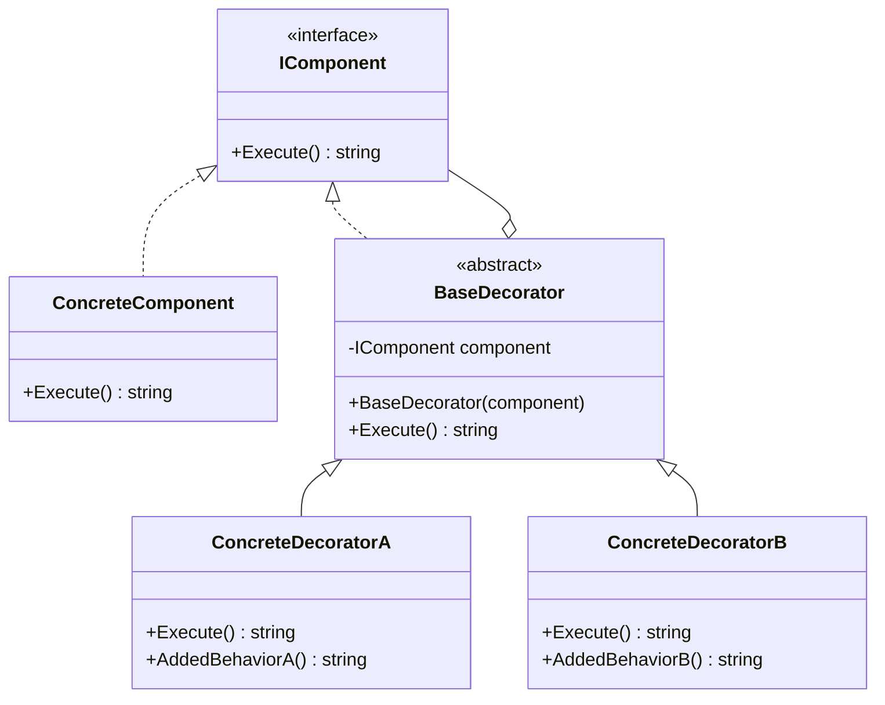

## 🏷️ Tags

#type/area #area/architecture #concept/microservice #concept/clean-architecture #design-pattern/decorator 

---
 
> [!abstract] Суть паттерна **Decorator (Декоратор)** — структурный паттерн проектирования, который позволяет динамически добавлять объектам новую функциональность, оборачивая их в полезные "обёртки".

## 🎯 Назначение и применение

**Decorator Pattern** решает проблему расширения функциональности объектов без изменения их структуры. Вместо наследования используется композиция.

### ✅ Когда использовать:

- Нужно добавить обязанности объекту динамически
- Расширение через наследование неэффективно
- Комбинирование различных поведений

### ❌ Когда НЕ использовать:

- Простые случаи с одним видом расширения
- Когда важна производительность (много слоёв обёрток)

---

## 🏗️ Структура паттерна



---

## 💻 Реализация в .NET

### 1️⃣ Базовый интерфейс

```csharp
// Базовый компонент
public interface ICoffee
{
    string GetDescription();
    decimal GetCost();
}
```

### 2️⃣ Конкретный компонент

```csharp
// Простой эспрессо
public class Espresso : ICoffee
{
    public string GetDescription() => "Espresso";
    public decimal GetCost() => 50m;
}

// Американо
public class Americano : ICoffee
{
    public string GetDescription() => "Americano";
    public decimal GetCost() => 60m;
}
```

### 3️⃣ Базовый декоратор

```csharp
// Абстрактный декоратор
public abstract class CoffeeDecorator : ICoffee
{
    protected readonly ICoffee _coffee;
    
    protected CoffeeDecorator(ICoffee coffee)
    {
        _coffee = coffee ?? throw new ArgumentNullException(nameof(coffee));
    }
    
    public virtual string GetDescription() => _coffee.GetDescription();
    public virtual decimal GetCost() => _coffee.GetCost();
}
```

### 4️⃣ Конкретные декораторы

```csharp
// Добавка молока
public class MilkDecorator : CoffeeDecorator
{
    public MilkDecorator(ICoffee coffee) : base(coffee) { }
    
    public override string GetDescription() => 
        $"{_coffee.GetDescription()}, Milk";
    
    public override decimal GetCost() => 
        _coffee.GetCost() + 15m;
}

// Добавка сахара
public class SugarDecorator : CoffeeDecorator
{
    public SugarDecorator(ICoffee coffee) : base(coffee) { }
    
    public override string GetDescription() => 
        $"{_coffee.GetDescription()}, Sugar";
    
    public override decimal GetCost() => 
        _coffee.GetCost() + 5m;
}

// Взбитые сливки
public class WhippedCreamDecorator : CoffeeDecorator
{
    public WhippedCreamDecorator(ICoffee coffee) : base(coffee) { }
    
    public override string GetDescription() => 
        $"{_coffee.GetDescription()}, Whipped Cream";
    
    public override decimal GetCost() => 
        _coffee.GetCost() + 25m;
}
```

---

## 🚀 Использование

```csharp
class Program
{
    static void Main()
    {
        // Простой эспрессо
        ICoffee coffee = new Espresso();
        Console.WriteLine($"{coffee.GetDescription()}: {coffee.GetCost()}₽");
        // Вывод: Espresso: 50₽
        
        // Эспрессо с молоком
        coffee = new MilkDecorator(coffee);
        Console.WriteLine($"{coffee.GetDescription()}: {coffee.GetCost()}₽");
        // Вывод: Espresso, Milk: 65₽
        
        // Добавляем сахар
        coffee = new SugarDecorator(coffee);
        Console.WriteLine($"{coffee.GetDescription()}: {coffee.GetCost()}₽");
        // Вывод: Espresso, Milk, Sugar: 70₽
        
        // И взбитые сливки
        coffee = new WhippedCreamDecorator(coffee);
        Console.WriteLine($"{coffee.GetDescription()}: {coffee.GetCost()}₽");
        // Вывод: Espresso, Milk, Sugar, Whipped Cream: 95₽
        
        // Создаём сложный напиток одной строкой
        ICoffee fancyCoffee = new WhippedCreamDecorator(
            new SugarDecorator(
                new MilkDecorator(
                    new Americano())));
        
        Console.WriteLine($"{fancyCoffee.GetDescription()}: {fancyCoffee.GetCost()}₽");
        // Вывод: Americano, Milk, Sugar, Whipped Cream: 105₽
    }
}
```

---

## 🔧 Продвинутый пример: HTTP Client Decorators

```csharp
// Базовый интерфейс для HTTP клиента
public interface IHttpClient
{
    Task<string> GetAsync(string url);
}

// Базовая реализация
public class BasicHttpClient : IHttpClient
{
    private readonly HttpClient _httpClient = new();
    
    public async Task<string> GetAsync(string url)
    {
        var response = await _httpClient.GetAsync(url);
        return await response.Content.ReadAsStringAsync();
    }
}

// Декоратор с логированием
public class LoggingHttpDecorator : IHttpClient
{
    private readonly IHttpClient _httpClient;
    private readonly ILogger _logger;
    
    public LoggingHttpDecorator(IHttpClient httpClient, ILogger logger)
    {
        _httpClient = httpClient;
        _logger = logger;
    }
    
    public async Task<string> GetAsync(string url)
    {
        _logger.LogInformation($"Sending GET request to: {url}");
        var result = await _httpClient.GetAsync(url);
        _logger.LogInformation($"Response received, length: {result.Length}");
        return result;
    }
}

// Декоратор с кэшированием
public class CachingHttpDecorator : IHttpClient
{
    private readonly IHttpClient _httpClient;
    private readonly Dictionary<string, string> _cache = new();
    
    public CachingHttpDecorator(IHttpClient httpClient)
    {
        _httpClient = httpClient;
    }
    
    public async Task<string> GetAsync(string url)
    {
        if (_cache.TryGetValue(url, out var cachedResult))
        {
            return cachedResult;
        }
        
        var result = await _httpClient.GetAsync(url);
        _cache[url] = result;
        return result;
    }
}

// Декоратор с retry логикой
public class RetryHttpDecorator : IHttpClient
{
    private readonly IHttpClient _httpClient;
    private readonly int _maxRetries;
    
    public RetryHttpDecorator(IHttpClient httpClient, int maxRetries = 3)
    {
        _httpClient = httpClient;
        _maxRetries = maxRetries;
    }
    
    public async Task<string> GetAsync(string url)
    {
        Exception lastException = null;
        
        for (int i = 0; i <= _maxRetries; i++)
        {
            try
            {
                return await _httpClient.GetAsync(url);
            }
            catch (Exception ex)
            {
                lastException = ex;
                if (i < _maxRetries)
                {
                    await Task.Delay(TimeSpan.FromSeconds(Math.Pow(2, i))); // Exponential backoff
                }
            }
        }
        
        throw lastException!;
    }
}
```

### Использование HTTP декораторов:

```csharp
// Создаём клиента с множественными декораторами
IHttpClient httpClient = new RetryHttpDecorator(
    new CachingHttpDecorator(
        new LoggingHttpDecorator(
            new BasicHttpClient(), 
            logger)), 
    maxRetries: 5);

var result = await httpClient.GetAsync("https://api.example.com/data");
```

---

## 📊 Сравнение с другими паттернами

|Паттерн|Назначение|Отличие от Decorator|
|---|---|---|
|**Adapter**|Изменение интерфейса|Декоратор не меняет интерфейс|
|**Proxy**|Контроль доступа|Декоратор добавляет функциональность|
|**Strategy**|Изменение алгоритма|Декоратор расширяет поведение|

---

## ⚡ Преимущества и недостатки

> [!success] ✅ Преимущества
> 
> - **Гибкость**: Можно комбинировать поведения
> - **Открытость/закрытость**: Расширение без изменения кода
> - **Динамическое добавление**: Функциональность добавляется во время выполнения
> - **Альтернатива наследованию**: Избегает "взрыва классов"

> [!danger] ❌ Недостатки
> 
> - **Сложность отладки**: Много слоёв обёрток
> - **Накладные расходы**: Дополнительные вызовы методов
> - **Порядок имеет значение**: Результат зависит от последовательности декораторов

---

## 🎭 Реальные примеры в .NET

### ASP.NET Core Middleware

```csharp
public void Configure(IApplicationBuilder app)
{
    app.UseAuthentication()    // Декоратор аутентификации
       .UseAuthorization()     // Декоратор авторизации  
       .UseLogging()           // Декоратор логирования
       .UseRouting();          // Базовая функциональность
}
```

### Stream Decorators

```csharp
// Файловый поток с сжатием и шифрованием
using var fileStream = new FileStream("data.txt", FileMode.Open);
using var gzipStream = new GZipStream(fileStream, CompressionMode.Decompress);
using var cryptoStream = new CryptoStream(gzipStream, decryptor, CryptoStreamMode.Read);
```

---

## 📝 Заключение

> [!tip] Ключевые моменты
> 
> 1. **Decorator** позволяет добавлять функциональность объектам динамически
> 2. Использует **композицию** вместо наследования
> 3. Идеален для случаев, когда нужно **комбинировать** различные поведения
> 4. Широко применяется в **.NET** (Middleware, Streams, HTTP клиенты)

**Помните**: Decorator — это как слоёный торт 🎂. Каждый слой добавляет свою "изюминку", но основа остаётся неизменной!

---

## 🔗 Связанные заметки

- [[Structural Patterns]]
- [[Composition vs Inheritance]]
- [[SOLID Principles]]
- [[ASP.NET Core Middleware]]
