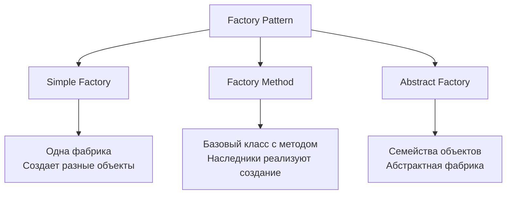

## 🏷️ Tags

#type/area #area/architecture #concept/microservice #concept/clean-architecture #design-pattern/di-container 

---

> [!abstract] Что такое Factory Pattern? **Factory Pattern** — это порождающий паттерн проектирования, который предоставляет интерфейс для создания объектов в суперклассе, но позволяет подклассам изменять тип создаваемых объектов.

---

## 📚 Основные концепции

### Зачем нужен Factory Pattern?

- **Инкапсуляция логики создания** объектов
- **Уменьшение связанности** между классами
- **Упрощение тестирования** через подмену реализаций
- **Централизованное управление** созданием объектов

---

## 🏭 Типы Factory Pattern



---

## 💡 Simple Factory

> [!tip] Простейшая реализация Один класс отвечает за создание всех объектов определенного типа

### Пример: Создание логгеров

```csharp
// Интерфейс продукта
public interface ILogger
{
    void Log(string message);
}

// Конкретные продукты
public class FileLogger : ILogger
{
    public void Log(string message) 
        => File.AppendAllText("log.txt", $"{DateTime.Now}: {message}\n");
}

public class ConsoleLogger : ILogger
{
    public void Log(string message) 
        => Console.WriteLine($"{DateTime.Now}: {message}");
}

public class DatabaseLogger : ILogger
{
    public void Log(string message) 
        => /* Запись в базу данных */ Console.WriteLine($"DB: {message}");
}

// Simple Factory
public static class LoggerFactory
{
    public static ILogger CreateLogger(string type)
    {
        return type.ToLower() switch
        {
            "file" => new FileLogger(),
            "console" => new ConsoleLogger(),
            "database" => new DatabaseLogger(),
            _ => throw new ArgumentException($"Unknown logger type: {type}")
        };
    }
}

// Использование
var logger = LoggerFactory.CreateLogger("console");
logger.Log("Hello Factory Pattern!");
```

---

## 🎯 Factory Method

> [!note] Определение Определяет интерфейс для создания объекта, но позволяет подклассам решать, какой класс инстанцировать

### Пример: Обработчики платежей

```csharp
// Продукт
public abstract class PaymentProcessor
{
    public abstract void ProcessPayment(decimal amount);
    public abstract void ValidatePayment();
}

// Конкретные продукты
public class CreditCardProcessor : PaymentProcessor
{
    public override void ProcessPayment(decimal amount)
        => Console.WriteLine($"Processing ${amount} via Credit Card");
    
    public override void ValidatePayment()
        => Console.WriteLine("Validating credit card details");
}

public class PayPalProcessor : PaymentProcessor
{
    public override void ProcessPayment(decimal amount)
        => Console.WriteLine($"Processing ${amount} via PayPal");
    
    public override void ValidatePayment()
        => Console.WriteLine("Validating PayPal credentials");
}

// Создатель (Creator)
public abstract class PaymentService
{
    // Factory Method
    protected abstract PaymentProcessor CreateProcessor();
    
    // Шаблонный метод, использующий Factory Method
    public void ExecutePayment(decimal amount)
    {
        var processor = CreateProcessor();
        processor.ValidatePayment();
        processor.ProcessPayment(amount);
        Console.WriteLine("Payment completed\n");
    }
}

// Конкретные создатели
public class CreditCardService : PaymentService
{
    protected override PaymentProcessor CreateProcessor()
        => new CreditCardProcessor();
}

public class PayPalService : PaymentService
{
    protected override PaymentProcessor CreateProcessor()
        => new PayPalProcessor();
}

// Использование
var creditCardService = new CreditCardService();
creditCardService.ExecutePayment(100.50m);

var paypalService = new PayPalService();
paypalService.ExecutePayment(75.25m);
```

---

## 🏗️ Abstract Factory

> [!warning] Сложность Самый сложный вариант Factory Pattern для создания семейств связанных объектов

### Пример: UI компоненты для разных ОС

```csharp
// Абстрактные продукты
public interface IButton
{
    void Render();
    void Click();
}

public interface ICheckbox
{
    void Render();
    void Check();
}

// Продукты для Windows
public class WindowsButton : IButton
{
    public void Render() => Console.WriteLine("Rendering Windows-style button");
    public void Click() => Console.WriteLine("Windows button clicked");
}

public class WindowsCheckbox : ICheckbox
{
    public void Render() => Console.WriteLine("Rendering Windows-style checkbox");
    public void Check() => Console.WriteLine("Windows checkbox checked");
}

// Продукты для macOS
public class MacButton : IButton
{
    public void Render() => Console.WriteLine("Rendering macOS-style button");
    public void Click() => Console.WriteLine("macOS button clicked");
}

public class MacCheckbox : ICheckbox
{
    public void Render() => Console.WriteLine("Rendering macOS-style checkbox");
    public void Check() => Console.WriteLine("macOS checkbox checked");
}

// Абстрактная фабрика
public interface IUIFactory
{
    IButton CreateButton();
    ICheckbox CreateCheckbox();
}

// Конкретные фабрики
public class WindowsUIFactory : IUIFactory
{
    public IButton CreateButton() => new WindowsButton();
    public ICheckbox CreateCheckbox() => new WindowsCheckbox();
}

public class MacUIFactory : IUIFactory
{
    public IButton CreateButton() => new MacButton();
    public ICheckbox CreateCheckbox() => new MacCheckbox();
}

// Клиентский код
public class Application
{
    private readonly IButton _button;
    private readonly ICheckbox _checkbox;
    
    public Application(IUIFactory factory)
    {
        _button = factory.CreateButton();
        _checkbox = factory.CreateCheckbox();
    }
    
    public void Render()
    {
        _button.Render();
        _checkbox.Render();
    }
}

// Использование
var isWindows = Environment.OSVersion.Platform == PlatformID.Win32NT;
IUIFactory factory = isWindows ? new WindowsUIFactory() : new MacUIFactory();

var app = new Application(factory);
app.Render();
```

---

## 🔧 Factory Pattern с Dependency Injection

> [!success] Современный подход Интеграция Factory Pattern с DI контейнером для максимальной гибкости

### Настройка DI

```csharp
using Microsoft.Extensions.DependencyInjection;
using Microsoft.Extensions.Hosting;

// Интерфейс для фабрики
public interface INotificationFactory
{
    INotification CreateNotification(NotificationType type);
}

// Типы уведомлений
public enum NotificationType
{
    Email,
    SMS,
    Push
}

// Продукты
public interface INotification
{
    Task SendAsync(string message, string recipient);
}

public class EmailNotification : INotification
{
    private readonly ILogger<EmailNotification> _logger;
    
    public EmailNotification(ILogger<EmailNotification> logger)
    {
        _logger = logger;
    }
    
    public async Task SendAsync(string message, string recipient)
    {
        _logger.LogInformation("Sending email to {Recipient}: {Message}", recipient, message);
        await Task.Delay(100); // Имитация отправки
    }
}

public class SmsNotification : INotification
{
    private readonly ILogger<SmsNotification> _logger;
    
    public SmsNotification(ILogger<SmsNotification> logger)
    {
        _logger = logger;
    }
    
    public async Task SendAsync(string message, string recipient)
    {
        _logger.LogInformation("Sending SMS to {Recipient}: {Message}", recipient, message);
        await Task.Delay(50);
    }
}

public class PushNotification : INotification
{
    private readonly ILogger<PushNotification> _logger;
    
    public PushNotification(ILogger<PushNotification> logger)
    {
        _logger = logger;
    }
    
    public async Task SendAsync(string message, string recipient)
    {
        _logger.LogInformation("Sending Push to {Recipient}: {Message}", recipient, message);
        await Task.Delay(25);
    }
}
```

### Реализация фабрики с DI

```csharp
public class NotificationFactory : INotificationFactory
{
    private readonly IServiceProvider _serviceProvider;
    
    public NotificationFactory(IServiceProvider serviceProvider)
    {
        _serviceProvider = serviceProvider;
    }
    
    public INotification CreateNotification(NotificationType type)
    {
        return type switch
        {
            NotificationType.Email => _serviceProvider.GetRequiredService<EmailNotification>(),
            NotificationType.SMS => _serviceProvider.GetRequiredService<SmsNotification>(),
            NotificationType.Push => _serviceProvider.GetRequiredService<PushNotification>(),
            _ => throw new ArgumentException($"Unsupported notification type: {type}")
        };
    }
}

// Сервис для отправки уведомлений
public class NotificationService
{
    private readonly INotificationFactory _factory;
    
    public NotificationService(INotificationFactory factory)
    {
        _factory = factory;
    }
    
    public async Task SendNotificationAsync(NotificationType type, string message, string recipient)
    {
        var notification = _factory.CreateNotification(type);
        await notification.SendAsync(message, recipient);
    }
}
```

### Регистрация в Program.cs

```csharp
var builder = Host.CreateApplicationBuilder(args);

// Регистрация конкретных реализаций
builder.Services.AddScoped<EmailNotification>();
builder.Services.AddScoped<SmsNotification>();
builder.Services.AddScoped<PushNotification>();

// Регистрация фабрики и сервиса
builder.Services.AddScoped<INotificationFactory, NotificationFactory>();
builder.Services.AddScoped<NotificationService>();

var host = builder.Build();

// Использование
using var scope = host.Services.CreateScope();
var notificationService = scope.ServiceProvider.GetRequiredService<NotificationService>();

await notificationService.SendNotificationAsync(
    NotificationType.Email, 
    "Welcome!", 
    "user@example.com"
);
```

---

## 🔥 Альтернативный подход с делегатами

> [!tip] .NET специфика Использование `Func<>` делегатов для упрощения фабрик

```csharp
public class ModernNotificationFactory : INotificationFactory
{
    private readonly IServiceProvider _serviceProvider;
    private readonly Dictionary<NotificationType, Func<INotification>> _factories;
    
    public ModernNotificationFactory(IServiceProvider serviceProvider)
    {
        _serviceProvider = serviceProvider;
        _factories = new Dictionary<NotificationType, Func<INotification>>
        {
            [NotificationType.Email] = () => _serviceProvider.GetRequiredService<EmailNotification>(),
            [NotificationType.SMS] = () => _serviceProvider.GetRequiredService<SmsNotification>(),
            [NotificationType.Push] = () => _serviceProvider.GetRequiredService<PushNotification>()
        };
    }
    
    public INotification CreateNotification(NotificationType type)
    {
        return _factories.TryGetValue(type, out var factory) 
            ? factory() 
            : throw new ArgumentException($"Unsupported notification type: {type}");
    }
}
```

---

## ⚡ Производительность и кэширование

```csharp
public class CachedFactory<TKey, TProduct> 
    where TKey : notnull
{
    private readonly ConcurrentDictionary<TKey, TProduct> _cache = new();
    private readonly Func<TKey, TProduct> _factory;
    
    public CachedFactory(Func<TKey, TProduct> factory)
    {
        _factory = factory;
    }
    
    public TProduct Create(TKey key)
    {
        return _cache.GetOrAdd(key, _factory);
    }
    
    public void ClearCache() => _cache.Clear();
}

// Использование
var cachedLoggerFactory = new CachedFactory<string, ILogger>(
    type => type switch
    {
        "file" => new FileLogger(),
        "console" => new ConsoleLogger(),
        _ => throw new ArgumentException($"Unknown type: {type}")
    });

var logger1 = cachedLoggerFactory.Create("console"); // Создается новый
var logger2 = cachedLoggerFactory.Create("console"); // Возвращается из кэша
// logger1 == logger2 -> true
```

---

## 📊 Сравнение подходов

|Подход|Сложность|Гибкость|DI Support|Использование|
|---|---|---|---|---|
|**Simple Factory**|⭐|⭐⭐|❌|Простые сценарии|
|**Factory Method**|⭐⭐|⭐⭐⭐|⚠️|Расширяемые системы|
|**Abstract Factory**|⭐⭐⭐|⭐⭐⭐⭐|⚠️|Семейства объектов|
|**Factory + DI**|⭐⭐|⭐⭐⭐⭐⭐|✅|Современные приложения|

---

## ✅ Когда использовать Factory Pattern

- [x] Много различных типов объектов одного семейства
- [x] Логика создания объектов сложная или может измениться
- [x] Нужно скрыть детали создания от клиентского кода
- [x] Требуется централизованное управление созданием объектов
- [x] Необходимо легко добавлять новые типы продуктов

## ❌ Когда НЕ использовать

- [ ] Простое создание объектов через `new`
- [ ] Только один тип объекта
- [ ] Логика создания тривиальная и не изменится
- [ ] Избыточность для простых сценариев

---

## 🎯 Ключевые выводы

> [!quote] Принцип _"Создание объектов должно быть отделено от их использования"_

1. **Factory Pattern** упрощает управление созданием объектов
2. **DI интеграция** делает фабрики еще более мощными
3. Выбор типа фабрики зависит от **сложности требований**
4. Всегда учитывайте **баланс между гибкостью и простотой**

---
