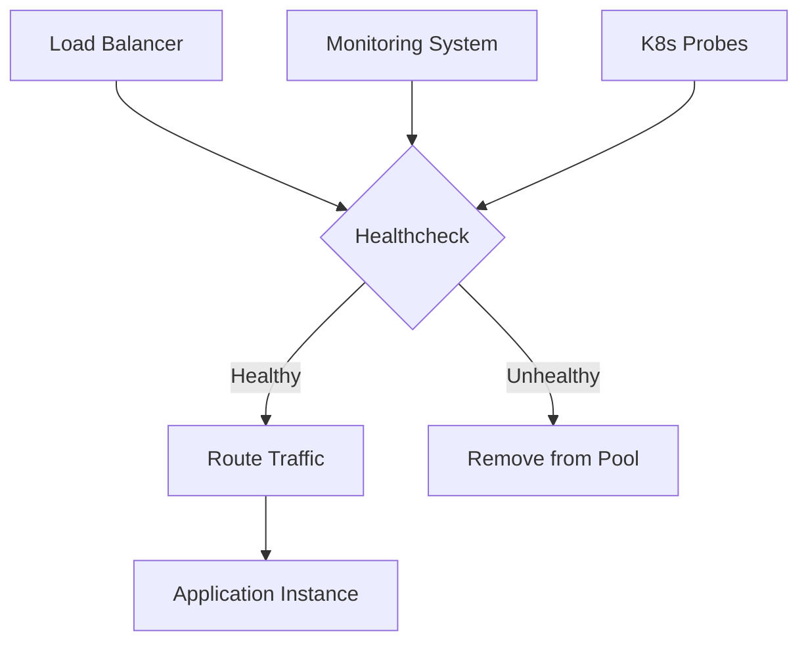

## 🏷️ Tags

#type/area #area/architecture #concept/microservice #concept/clean-architecture #design-pattern/healthcheck 

---

> [!INFO] **Healthcheck** - это механизм для проверки работоспособности приложения и его зависимостей. Позволяет определить, готово ли приложение обрабатывать запросы.

---

## 🎯 Содержание

- [[#Что такое Healthcheck?]]
- [[#Базовая настройка]]
- [[#Типы проверок]]
- [[#Кастомные проверки]]
- [[#UI интерфейс]]
- [[#Продвинутые сценарии]]
- [[#Best Practices]]

---

## 📋 Что такое Healthcheck?



### 🔍 Основные сценарии использования:

- **Orchestration**: Kubernetes liveness/readiness probes
- **Load Balancing**: Исключение нездоровых инстансов
- **Monitoring**: Мониторинг состояния сервисов
- **CI/CD**: Валидация после деплоя

---

## ⚙️ Базовая настройка

### 1️⃣ Установка пакета

```bash
dotnet add package Microsoft.Extensions.Diagnostics.HealthChecks
```

### 2️⃣ Конфигурация в Program.cs

```csharp
var builder = WebApplication.CreateBuilder(args);

// Регистрация сервисов healthcheck
builder.Services.AddHealthChecks();

var app = builder.Build();

// Добавление эндпоинта
app.MapHealthChecks("/health");

app.Run();
```

> [!TIP] По умолчанию эндпоинт возвращает простой текстовый ответ "Healthy" или "Unhealthy"

### 3️⃣ Базовый пример ответа

**Успешная проверка:**

```
HTTP/1.1 200 OK
Content-Type: text/plain

Healthy
```

**Неуспешная проверка:**

```
HTTP/1.1 503 Service Unavailable
Content-Type: text/plain

Unhealthy
```

---

## 🔧 Типы проверок

### 📊 Встроенные проверки

#### Database Health Checks

```csharp
// SQL Server
builder.Services.AddHealthChecks()
    .AddSqlServer(connectionString, name: "sqlserver");

// PostgreSQL
builder.Services.AddHealthChecks()
    .AddNpgSql(connectionString, name: "postgresql");

// MongoDB
builder.Services.AddHealthChecks()
    .AddMongoDb(connectionString, name: "mongodb");
```

#### HTTP Health Checks

```csharp
builder.Services.AddHealthChecks()
    .AddUrlGroup(new Uri("https://api.example.com/ping"), 
                 name: "external-api",
                 timeout: TimeSpan.FromSeconds(10));
```

#### Redis Health Check

```csharp
builder.Services.AddHealthChecks()
    .AddRedis(connectionString, name: "redis-cache");
```

### 📋 Полный пример с множественными проверками

```csharp
builder.Services.AddHealthChecks()
    // База данных
    .AddSqlServer(
        connectionString: builder.Configuration.GetConnectionString("DefaultConnection"),
        name: "sql-server",
        timeout: TimeSpan.FromSeconds(30))
    
    // Внешний API
    .AddUrlGroup(
        uri: new Uri("https://jsonplaceholder.typicode.com/posts/1"),
        name: "external-api",
        timeout: TimeSpan.FromSeconds(10))
    
    // Redis
    .AddRedis(
        connectionString: builder.Configuration.GetConnectionString("Redis"),
        name: "redis-cache")
    
    // Проверка диска
    .AddDiskStorageHealthCheck(
        options => options.AddDrive("C:\\", minimumFreeMegabytes: 100),
        name: "disk-storage");
```

---

## 🛠️ Кастомные проверки

### 🎨 Создание собственной проверки

```csharp
public class CustomApiHealthCheck : IHealthCheck
{
    private readonly HttpClient _httpClient;
    private readonly ILogger<CustomApiHealthCheck> _logger;

    public CustomApiHealthCheck(HttpClient httpClient, 
                               ILogger<CustomApiHealthCheck> logger)
    {
        _httpClient = httpClient;
        _logger = logger;
    }

    public async Task<HealthCheckResult> CheckHealthAsync(
        HealthCheckContext context,
        CancellationToken cancellationToken = default)
    {
        try
        {
            var stopwatch = Stopwatch.StartNew();
            var response = await _httpClient.GetAsync("/api/status", cancellationToken);
            stopwatch.Stop();

            if (response.IsSuccessStatusCode)
            {
                var responseTime = stopwatch.ElapsedMilliseconds;
                
                return responseTime < 1000
                    ? HealthCheckResult.Healthy($"API responding in {responseTime}ms")
                    : HealthCheckResult.Degraded($"API slow: {responseTime}ms");
            }

            return HealthCheckResult.Unhealthy(
                $"API returned {response.StatusCode}");
        }
        catch (TaskCanceledException)
        {
            return HealthCheckResult.Unhealthy("API timeout");
        }
        catch (Exception ex)
        {
            _logger.LogError(ex, "Health check failed");
            return HealthCheckResult.Unhealthy($"API error: {ex.Message}");
        }
    }
}
```

### 📝 Регистрация кастомной проверки

```csharp
builder.Services.AddHttpClient<CustomApiHealthCheck>();
builder.Services.AddHealthChecks()
    .AddCheck<CustomApiHealthCheck>("custom-api-check");
```

### 🏷️ Использование тегов для группировки

```csharp
builder.Services.AddHealthChecks()
    .AddSqlServer(connectionString, name: "database", tags: new[] { "db", "critical" })
    .AddRedis(redisConnection, name: "cache", tags: new[] { "cache", "optional" })
    .AddUrlGroup(apiUri, name: "external-api", tags: new[] { "external", "critical" });

// Разные эндпоинты для разных групп
app.MapHealthChecks("/health/ready", new HealthCheckOptions()
{
    Predicate = check => check.Tags.Contains("critical")
});

app.MapHealthChecks("/health/live", new HealthCheckOptions()
{
    Predicate = check => check.Tags.Contains("db")
});
```

---

## 🎨 UI интерфейс

### 📦 Установка UI пакета

```bash
dotnet add package AspNetCore.HealthChecks.UI
dotnet add package AspNetCore.HealthChecks.UI.InMemory.Storage
```

### ⚡ Конфигурация UI

```csharp
builder.Services.AddHealthChecks()
    .AddSqlServer(connectionString)
    .AddRedis(redisConnection);

// Добавляем UI
builder.Services.AddHealthChecksUI(options =>
{
    options.SetEvaluationTimeInSeconds(30); // Интервал проверки
    options.MaximumHistoryEntriesPerEndpoint(10); // История
    options.AddHealthCheckEndpoint("API Health", "/health");
})
.AddInMemoryStorage(); // Хранилище для UI

var app = builder.Build();

// JSON эндпоинт для UI
app.MapHealthChecks("/health", new HealthCheckOptions()
{
    ResponseWriter = UIResponseWriter.WriteHealthCheckUIResponse
});

// UI эндпоинт
app.MapHealthChecksUI(options => options.UIPath = "/health-ui");
```

### 🖥️ Кастомизация JSON ответа

```csharp
app.MapHealthChecks("/health", new HealthCheckOptions()
{
    ResponseWriter = async (context, report) =>
    {
        context.Response.ContentType = "application/json";
        
        var response = new
        {
            status = report.Status.ToString(),
            duration = report.TotalDuration.TotalMilliseconds,
            timestamp = DateTime.UtcNow,
            checks = report.Entries.Select(entry => new
            {
                name = entry.Key,
                status = entry.Value.Status.ToString(),
                duration = entry.Value.Duration.TotalMilliseconds,
                description = entry.Value.Description,
                data = entry.Value.Data,
                exception = entry.Value.Exception?.Message
            })
        };

        await context.Response.WriteAsync(JsonSerializer.Serialize(response, 
            new JsonSerializerOptions { WriteIndented = true }));
    }
});
```

---

## 🚀 Продвинутые сценарии

### 🐳 Kubernetes Integration

#### Deployment.yaml

```yaml
apiVersion: apps/v1
kind: Deployment
metadata:
  name: my-app
spec:
  replicas: 3
  template:
    spec:
      containers:
      - name: my-app
        image: myapp:latest
        ports:
        - containerPort: 80
        
        # Readiness probe - готовность принимать трафик
        readinessProbe:
          httpGet:
            path: /health/ready
            port: 80
          initialDelaySeconds: 10
          periodSeconds: 10
          
        # Liveness probe - проверка "жизни" приложения
        livenessProbe:
          httpGet:
            path: /health/live
            port: 80
          initialDelaySeconds: 30
          periodSeconds: 30
          failureThreshold: 3
```

#### Соответствующие эндпоинты

```csharp
// Readiness - все критичные зависимости
app.MapHealthChecks("/health/ready", new HealthCheckOptions()
{
    Predicate = check => check.Tags.Contains("critical"),
    AllowCachingResponses = false
});

// Liveness - только базовые проверки
app.MapHealthChecks("/health/live", new HealthCheckOptions()
{
    Predicate = check => check.Tags.Contains("self"),
    AllowCachingResponses = false
});
```

### 📊 Интеграция с мониторингом

#### Prometheus Metrics

```csharp
// Добавляем в Program.cs
builder.Services.AddHealthChecks()
    .ForwardToPrometheus(); // Требует AspNetCore.HealthChecks.Prometheus

// Или кастомная метрика
public class PrometheusHealthCheckPublisher : IHealthCheckPublisher
{
    private readonly IMetricServer _metricServer;

    public async Task PublishAsync(HealthReport report, 
                                  CancellationToken cancellationToken)
    {
        foreach (var (name, entry) in report.Entries)
        {
            var status = entry.Status == HealthStatus.Healthy ? 1 : 0;
            // Отправка метрики в Prometheus
        }
    }
}
```

### 🔄 Graceful Shutdown

```csharp
public class GracefulShutdownHealthCheck : IHealthCheck
{
    private readonly IHostApplicationLifetime _lifetime;
    
    public GracefulShutdownHealthCheck(IHostApplicationLifetime lifetime)
    {
        _lifetime = lifetime;
    }

    public Task<HealthCheckResult> CheckHealthAsync(
        HealthCheckContext context,
        CancellationToken cancellationToken = default)
    {
        if (_lifetime.ApplicationStopping.IsCancellationRequested)
        {
            return Task.FromResult(HealthCheckResult.Unhealthy("Application is shutting down"));
        }

        return Task.FromResult(HealthCheckResult.Healthy());
    }
}
```

---

## ✅ Best Practices

### 🎯 Рекомендации по дизайну

> [!WARNING] **Не делайте:**
> 
> - Тяжелые операции в health check
> - Проверки, которые могут повлиять на производительность
> - Долгие таймауты (>30 сек)

> [!SUCCESS] **Делайте:**
> 
> - Быстрые проверки (<10 сек)
> - Проверки критичных зависимостей
> - Логирование результатов

### 📋 Структура проверок

```csharp
// ✅ ПРАВИЛЬНО: Группировка по критичности
builder.Services.AddHealthChecks()
    // Критичные - без них приложение не работает
    .AddSqlServer(connection, tags: new[] { "critical", "db" })
    .AddRedis(redis, tags: new[] { "critical", "cache" })
    
    // Опциональные - приложение может работать без них
    .AddUrlGroup(analyticsApi, tags: new[] { "optional", "analytics" })
    .AddSmtpHealthCheck(smtp, tags: new[] { "optional", "email" });
```

### 🏗️ Архитектурные паттерны

#### Circuit Breaker Pattern

```csharp
public class CircuitBreakerHealthCheck : IHealthCheck
{
    private readonly ICircuitBreaker _circuitBreaker;

    public async Task<HealthCheckResult> CheckHealthAsync(
        HealthCheckContext context,
        CancellationToken cancellationToken = default)
    {
        return _circuitBreaker.State switch
        {
            CircuitBreakerState.Closed => HealthCheckResult.Healthy("Circuit closed"),
            CircuitBreakerState.HalfOpen => HealthCheckResult.Degraded("Circuit half-open"),
            CircuitBreakerState.Open => HealthCheckResult.Unhealthy("Circuit open"),
            _ => HealthCheckResult.Unhealthy("Unknown circuit state")
        };
    }
}
```

### 📈 Мониторинг и алерты

```csharp
// Конфигурация для разных сред
builder.Services.Configure<HealthCheckPublisherOptions>(options =>
{
    options.Delay = TimeSpan.FromSeconds(10);
    options.Period = TimeSpan.FromSeconds(30);
    options.Predicate = check => check.Tags.Contains("critical");
    options.Timeout = TimeSpan.FromSeconds(20);
});

// Кастомный publisher для алертов
public class AlertHealthCheckPublisher : IHealthCheckPublisher
{
    public async Task PublishAsync(HealthReport report, CancellationToken cancellationToken)
    {
        if (report.Status == HealthStatus.Unhealthy)
        {
            // Отправка алерта в Slack/Teams/Email
            await SendAlert($"Application unhealthy: {report.Status}");
        }
    }
}
```

---

## 🔗 Полезные ссылки

- [Microsoft Documentation](https://docs.microsoft.com/en-us/aspnet/core/host-and-deploy/health-checks)
- [AspNetCore.Diagnostics.HealthChecks](https://github.com/Xabaril/AspNetCore.Diagnostics.HealthChecks)
- [Health Check UI](https://github.com/Xabaril/AspNetCore.Diagnostics.HealthChecks/tree/master/src/HealthChecks.UI)

---

> [!NOTE] Этот документ покрывает все основные аспекты работы с Healthcheck в .NET. Используйте его как справочник для реализации надежной системы мониторинга здоровья ваших приложений.

