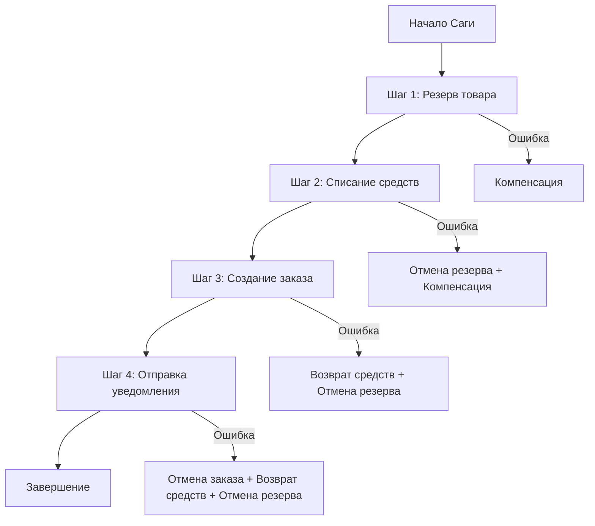

## 🏷️ Tags

#type/area #area/architecture #concept/microservice #concept/clean-architecture #concept/ddd #design-pattern/saga 

---

> [!info] Определение **Saga Pattern** - это паттерн для управления длительными бизнес-процессами, состоящими из нескольких шагов, где каждый шаг может завершиться успешно или неуспешно, требуя компенсации предыдущих операций.

---

## 📋 Содержание

- [[#🎯 Основные концепции]]
- [[#⚙️ Типы реализации]]
- [[#💡 Пример реализации на .NET]]
- [[#🔄 Компенсирующие операции]]
- [[#⚠️ Обработка ошибок]]
- [[#✅ Преимущества и недостатки]]

---

## 🎯 Основные концепции



> [!tip] Ключевые принципы
> 
> - **Атомарность на уровне бизнес-процесса** - вся сага либо выполняется полностью, либо откатывается
> - **Компенсирующие операции** - каждый шаг должен иметь возможность отката
> - **Идемпотентность** - повторное выполнение шага не должно изменять состояние

---

## ⚙️ Типы реализации

### 🎼 Orchestration (Оркестровка)

```csharp
public class OrderSaga
{
    private readonly IInventoryService _inventoryService;
    private readonly IPaymentService _paymentService;
    private readonly IOrderService _orderService;
    
    public async Task<SagaResult> ExecuteAsync(CreateOrderCommand command)
    {
        var sagaData = new OrderSagaData { OrderId = Guid.NewGuid() };
        
        try
        {
            // Шаг 1: Резервирование товара
            await _inventoryService.ReserveItemAsync(command.ItemId, command.Quantity);
            sagaData.ItemReserved = true;
            
            // Шаг 2: Списание средств
            await _paymentService.ChargeAsync(command.CustomerId, command.Amount);
            sagaData.PaymentCharged = true;
            
            // Шаг 3: Создание заказа
            await _orderService.CreateOrderAsync(sagaData.OrderId, command);
            sagaData.OrderCreated = true;
            
            return SagaResult.Success(sagaData.OrderId);
        }
        catch (Exception ex)
        {
            await CompensateAsync(sagaData, ex);
            return SagaResult.Failed(ex.Message);
        }
    }
}
```

### 🎭 Choreography (Хореография)

```csharp
// Обработчик события "Заказ создан"
public class OrderCreatedHandler : IEventHandler<OrderCreatedEvent>
{
    public async Task HandleAsync(OrderCreatedEvent @event)
    {
        try
        {
            // Резервируем товар
            await _inventoryService.ReserveItemAsync(@event.ItemId, @event.Quantity);
            
            // Публикуем событие успеха
            await _eventBus.PublishAsync(new ItemReservedEvent 
            { 
                OrderId = @event.OrderId,
                ItemId = @event.ItemId 
            });
        }
        catch (Exception ex)
        {
            // Публикуем событие ошибки
            await _eventBus.PublishAsync(new ItemReservationFailedEvent 
            { 
                OrderId = @event.OrderId,
                Error = ex.Message 
            });
        }
    }
}
```

---

## 💡 Пример реализации на .NET

### 📦 Saga Data

```csharp
public class OrderSagaData
{
    public Guid SagaId { get; set; } = Guid.NewGuid();
    public Guid OrderId { get; set; }
    public string CustomerId { get; set; }
    public decimal Amount { get; set; }
    
    // Состояние выполнения
    public bool ItemReserved { get; set; }
    public bool PaymentCharged { get; set; }
    public bool OrderCreated { get; set; }
    public bool NotificationSent { get; set; }
    
    // Данные для компенсации
    public string ReservationId { get; set; }
    public string PaymentId { get; set; }
    
    public SagaStatus Status { get; set; } = SagaStatus.InProgress;
    public DateTime CreatedAt { get; set; } = DateTime.UtcNow;
}

public enum SagaStatus
{
    InProgress,
    Completed,
    Compensating,
    Failed
}
```

### 🏗️ Базовый класс Saga

```csharp
public abstract class Saga<TData> where TData : class, new()
{
    protected TData Data { get; set; } = new TData();
    protected List<ISagaStep<TData>> Steps { get; } = new List<ISagaStep<TData>>();
    
    public async Task<SagaResult> ExecuteAsync()
    {
        var executedSteps = new List<ISagaStep<TData>>();
        
        try
        {
            foreach (var step in Steps)
            {
                await step.ExecuteAsync(Data);
                executedSteps.Add(step);
            }
            
            return SagaResult.Success();
        }
        catch (Exception ex)
        {
            await CompensateAsync(executedSteps);
            return SagaResult.Failed(ex.Message);
        }
    }
    
    private async Task CompensateAsync(List<ISagaStep<TData>> executedSteps)
    {
        // Компенсируем в обратном порядке
        for (int i = executedSteps.Count - 1; i >= 0; i--)
        {
            try
            {
                await executedSteps[i].CompensateAsync(Data);
            }
            catch (Exception ex)
            {
                // Логируем ошибку компенсации, но продолжаем
                Console.WriteLine($"Compensation failed for step {i}: {ex.Message}");
            }
        }
    }
}
```

### 🔧 Интерфейс шага Saga

```csharp
public interface ISagaStep<TData>
{
    Task ExecuteAsync(TData data);
    Task CompensateAsync(TData data);
}

// Пример конкретного шага
public class ReserveItemStep : ISagaStep<OrderSagaData>
{
    private readonly IInventoryService _inventoryService;
    
    public ReserveItemStep(IInventoryService inventoryService)
    {
        _inventoryService = inventoryService;
    }
    
    public async Task ExecuteAsync(OrderSagaData data)
    {
        var reservationId = await _inventoryService.ReserveItemAsync(
            data.ItemId, data.Quantity);
        
        data.ReservationId = reservationId;
        data.ItemReserved = true;
    }
    
    public async Task CompensateAsync(OrderSagaData data)
    {
        if (data.ItemReserved && !string.IsNullOrEmpty(data.ReservationId))
        {
            await _inventoryService.CancelReservationAsync(data.ReservationId);
        }
    }
}
```

---

## 🔄 Компенсирующие операции

> [!warning] Важно! Компенсирующие операции должны быть **идемпотентными** и **всегда успешными** (или иметь retry механизм).

|Операция|Компенсация|Особенности|
|---|---|---|
|Резерв товара|Отмена резерва|Может быть вызвана многократно|
|Списание средств|Возврат средств|Асинхронная операция|
|Создание заказа|Отмена заказа|Обновление статуса|
|Отправка email|Отправка отмены|Только уведомление|

### 📝 Пример компенсации

```csharp
public class PaymentStep : ISagaStep<OrderSagaData>
{
    public async Task ExecuteAsync(OrderSagaData data)
    {
        var paymentResult = await _paymentService.ChargeAsync(
            data.CustomerId, data.Amount);
        
        data.PaymentId = paymentResult.PaymentId;
        data.PaymentCharged = true;
    }
    
    public async Task CompensateAsync(OrderSagaData data)
    {
        if (data.PaymentCharged && !string.IsNullOrEmpty(data.PaymentId))
        {
            // Retry логика для надежной компенсации
            var retryPolicy = Policy
                .Handle<Exception>()
                .WaitAndRetryAsync(3, retryAttempt => 
                    TimeSpan.FromSeconds(Math.Pow(2, retryAttempt)));
            
            await retryPolicy.ExecuteAsync(async () =>
            {
                await _paymentService.RefundAsync(data.PaymentId);
            });
        }
    }
}
```

---

## ⚠️ Обработка ошибок

### 🔄 Retry механизм

```csharp
public class ResilientSagaStep<TData> : ISagaStep<TData>
{
    private readonly ISagaStep<TData> _innerStep;
    private readonly IAsyncPolicy _retryPolicy;
    
    public ResilientSagaStep(ISagaStep<TData> innerStep)
    {
        _innerStep = innerStep;
        _retryPolicy = Policy
            .Handle<TransientException>()
            .WaitAndRetryAsync(
                retryCount: 3,
                sleepDurationProvider: retryAttempt => 
                    TimeSpan.FromSeconds(Math.Pow(2, retryAttempt)),
                onRetry: (outcome, timespan, retryCount, context) =>
                {
                    Console.WriteLine($"Retry {retryCount} after {timespan}s");
                });
    }
    
    public async Task ExecuteAsync(TData data)
    {
        await _retryPolicy.ExecuteAsync(async () =>
        {
            await _innerStep.ExecuteAsync(data);
        });
    }
    
    public async Task CompensateAsync(TData data)
    {
        await _retryPolicy.ExecuteAsync(async () =>
        {
            await _innerStep.CompensateAsync(data);
        });
    }
}
```

### 🚨 Типы исключений

```csharp
// Временная ошибка - можно повторить
public class TransientException : Exception
{
    public TransientException(string message) : base(message) { }
}

// Критическая ошибка - требует немедленной компенсации
public class CriticalSagaException : Exception
{
    public CriticalSagaException(string message) : base(message) { }
}

// Ошибка компенсации - требует ручного вмешательства
public class CompensationException : Exception
{
    public CompensationException(string message, Exception innerException) 
        : base(message, innerException) { }
}
```

---

## ✅ Преимущества и недостатки

### ✨ Преимущества

```ad-success
title: Плюсы Saga Pattern

- **Масштабируемость** - позволяет работать с распределенными системами
- **Надежность** - обеспечивает eventual consistency
- **Гибкость** - легко добавлять новые шаги в процесс
- **Отказоустойчивость** - автоматическая компенсация при ошибках
```

### ⚠️ Недостатки

```ad-warning
title: Минусы Saga Pattern

- **Сложность** - увеличивает сложность системы
- **Отсутствие изоляции** - промежуточные состояния видны другим процессам
- **Отладка** - сложно отслеживать состояние распределенных саг
- **Порядок компенсации** - критически важен правильный порядок откатов
```

---

## 🔗 Связанные паттерны

- [[Event Sourcing]] - для хранения состояния саги
- [[CQRS]] - для разделения команд и запросов в саге
- [[Outbox Pattern]] - для надежной публикации событий
- [[Circuit Breaker]] - для защиты от каскадных сбоев

---

## 📚 Дополнительные ресурсы

> [!note] Рекомендации
> 
> - Используйте Saga для длительных бизнес-процессов (>30 секунд)
> - Всегда проектируйте компенсирующие операции
> - Логируйте все шаги для возможности аудита
> - Рассмотрите использование готовых решений (MassTransit, NServiceBus)

---
