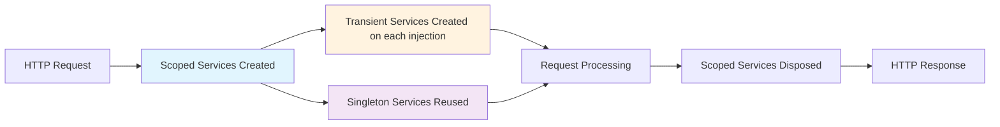

## 🏷️ Tags

#type/area #area/architecture #concept/microservice #concept/clean-architecture #design-pattern/service-lifetimes 

---

## 📋 Содержание

- [[#🎯 Что это такое?|Что это такое?]]
- [[#⚡ Три основных типа|Три основных типа]]
- [[#🔍 Детальный разбор|Детальный разбор]]
- [[#💡 Практические примеры|Практические примеры]]
- [[#⚠️ Важные моменты|Важные моменты]]
- [[#🧪 Тестирование|Тестирование]]

---

## 🎯 Что это такое?

> [!info] Service Lifetimes **Service Lifetimes** определяют, как долго живет экземпляр сервиса в DI-контейнере ASP.NET Core и когда создаются новые экземпляры.

---

## ⚡ Три основных типа

|Lifetime|Описание|Когда использовать|
|---|---|---|
|**🔄 Transient**|Новый экземпляр каждый раз|Легковесные, stateless сервисы|
|**🎯 Scoped**|Один экземпляр на HTTP-запрос|Работа с БД, бизнес-логика|
|**🌟 Singleton**|Один экземпляр на всё приложение|Кэш, конфигурация, логгеры|

---

## 🔍 Детальный разбор

### 🔄 Transient

```csharp
// Регистрация
services.AddTransient<IEmailService, EmailService>();

public class EmailService : IEmailService
{
    private readonly Guid _instanceId = Guid.NewGuid();
    
    public void SendEmail(string message)
    {
        Console.WriteLine($"Email sent from instance: {_instanceId}");
        // Каждый вызов = новый GUID!
    }
}
```

> [!tip] Особенности Transient
> 
> - ✅ Thread-safe по умолчанию
> - ✅ Не хранит состояние между вызовами
> - ❌ Может создать много объектов (memory overhead)

### 🎯 Scoped

```csharp
// Регистрация
services.AddScoped<IUserService, UserService>();

public class UserService : IUserService
{
    private readonly ApplicationDbContext _context;
    private readonly Guid _instanceId = Guid.NewGuid();
    
    public UserService(ApplicationDbContext context)
    {
        _context = context;
        Console.WriteLine($"UserService created: {_instanceId}");
    }
    
    public User GetCurrentUser() => _context.Users.First();
    // Один экземпляр на весь HTTP-запрос
}
```

> [!warning] Важно про Scoped
> 
> - 🎯 Создается один раз на HTTP-запрос
> - 🔄 Автоматически disposed в конце запроса
> - ⚠️ Нельзя использовать в Singleton сервисах!

### 🌟 Singleton

```csharp
// Регистрация
services.AddSingleton<ICacheService, MemoryCacheService>();

public class MemoryCacheService : ICacheService
{
    private readonly ConcurrentDictionary<string, object> _cache;
    private readonly DateTime _createdAt;
    
    public MemoryCacheService()
    {
        _cache = new ConcurrentDictionary<string, object>();
        _createdAt = DateTime.UtcNow;
        Console.WriteLine($"Singleton created at: {_createdAt}");
    }
    
    public void Set<T>(string key, T value) => _cache[key] = value;
    public T Get<T>(string key) => (T)_cache.GetValueOrDefault(key);
}
```

> [!danger] Осторожно с Singleton!
> 
> - ⚠️ Должен быть thread-safe
> - ⚠️ Живет до завершения приложения
> - ⚠️ Memory leaks при неправильном использовании

---

## 💡 Практические примеры

### 🏗️ Полный пример регистрации в Program.cs

```csharp
var builder = WebApplication.CreateBuilder(args);

// Transient - новый каждый раз
builder.Services.AddTransient<IEmailService, EmailService>();
builder.Services.AddTransient<IValidator<User>, UserValidator>();

// Scoped - один на запрос
builder.Services.AddScoped<IUserService, UserService>();
builder.Services.AddScoped<IOrderService, OrderService>();
builder.Services.AddDbContext<ApplicationDbContext>(options => 
    options.UseSqlServer(connectionString)); // DbContext всегда Scoped!

// Singleton - один на приложение
builder.Services.AddSingleton<ICacheService, MemoryCacheService>();
builder.Services.AddSingleton<IConfiguration>(builder.Configuration);

var app = builder.Build();
```

### 🎮 Контроллер с разными lifetime

```csharp
[ApiController]
[Route("api/[controller]")]
public class UsersController : ControllerBase
{
    private readonly IUserService _userService;        // Scoped
    private readonly IEmailService _emailService;     // Transient  
    private readonly ICacheService _cacheService;     // Singleton
    
    public UsersController(
        IUserService userService,
        IEmailService emailService, 
        ICacheService cacheService)
    {
        _userService = userService;
        _emailService = emailService;
        _cacheService = cacheService;
    }
    
    [HttpGet("{id}")]
    public async Task<User> GetUser(int id)
    {
        // Проверяем кэш (Singleton)
        var cached = _cacheService.Get<User>($"user_{id}");
        if (cached != null) return cached;
        
        // Получаем из БД (Scoped)
        var user = await _userService.GetByIdAsync(id);
        
        // Кэшируем (Singleton)
        _cacheService.Set($"user_{id}", user);
        
        // Отправляем уведомление (Transient - новый экземпляр)
        await _emailService.SendWelcomeEmailAsync(user.Email);
        
        return user;
    }
}
```

---

## ⚠️ Важные моменты

### 🚨 Captive Dependencies

> [!error] Анти-паттерн!
> 
> ```csharp
> // ❌ НЕПРАВИЛЬНО! Scoped в Singleton
> services.AddSingleton<ISomeService>(provider => 
>     new SomeService(provider.GetService<DbContext>())); // DbContext - Scoped!
> 
> // ✅ ПРАВИЛЬНО
> services.AddSingleton<ISomeService, SomeService>();
> services.AddScoped<DbContext>();
> ```

### 📊 Диаграмма жизненного цикла



### 🔧 Расширенные методы регистрации

```csharp
// Generic хост
services.AddHostedService<BackgroundService>(); // Singleton

// Фабрики
services.AddTransient<Func<string, IPaymentService>>(provider => 
    paymentType => paymentType switch
    {
        "stripe" => provider.GetService<StripePaymentService>(),
        "paypal" => provider.GetService<PaypalPaymentService>(),
        _ => throw new ArgumentException("Unknown payment type")
    });

// Условная регистрация
services.AddScoped<INotificationService>(provider =>
{
    var config = provider.GetRequiredService<IConfiguration>();
    return config["Environment"] == "Production" 
        ? new EmailNotificationService()
        : new ConsoleNotificationService();
});
```

---

## 🧪 Тестирование

### ✅ Unit Test пример

```csharp
[Test]
public void Should_Create_New_Transient_Instance_Each_Time()
{
    // Arrange
    var services = new ServiceCollection();
    services.AddTransient<ITestService, TestService>();
    var provider = services.BuildServiceProvider();
    
    // Act
    var service1 = provider.GetService<ITestService>();
    var service2 = provider.GetService<ITestService>();
    
    // Assert
    Assert.That(service1, Is.Not.SameAs(service2));
}

[Test] 
public void Should_Return_Same_Scoped_Instance_Within_Scope()
{
    // Arrange
    var services = new ServiceCollection();
    services.AddScoped<ITestService, TestService>();
    var provider = services.BuildServiceProvider();
    
    // Act & Assert
    using (var scope = provider.CreateScope())
    {
        var service1 = scope.ServiceProvider.GetService<ITestService>();
        var service2 = scope.ServiceProvider.GetService<ITestService>();
        
        Assert.That(service1, Is.SameAs(service2));
    }
}
```

---

## 🎓 Заключение

> [!success] Золотые правила
> 
> 1. **Transient** → для stateless, легких сервисов
> 2. **Scoped** → для работы с данными в рамках запроса
> 3. **Singleton** → для shared state, но только thread-safe
> 4. **Никогда** не внедряйте Scoped в Singleton!
> 5. **Всегда** тестируйте lifetime behavior

```csharp
// 🎯 Идеальный пример использования всех трех
services.AddTransient<IValidator<CreateUserRequest>, CreateUserValidator>();
services.AddScoped<IUserService, UserService>();
services.AddSingleton<IMemoryCache, MemoryCache>();
```

---

## 🔗 Полезные ссылки

- [[ASP.NET Core DI Container]]
- [[Dependency Injection Best Practices]]
- [[Memory Management in .NET]]

---

