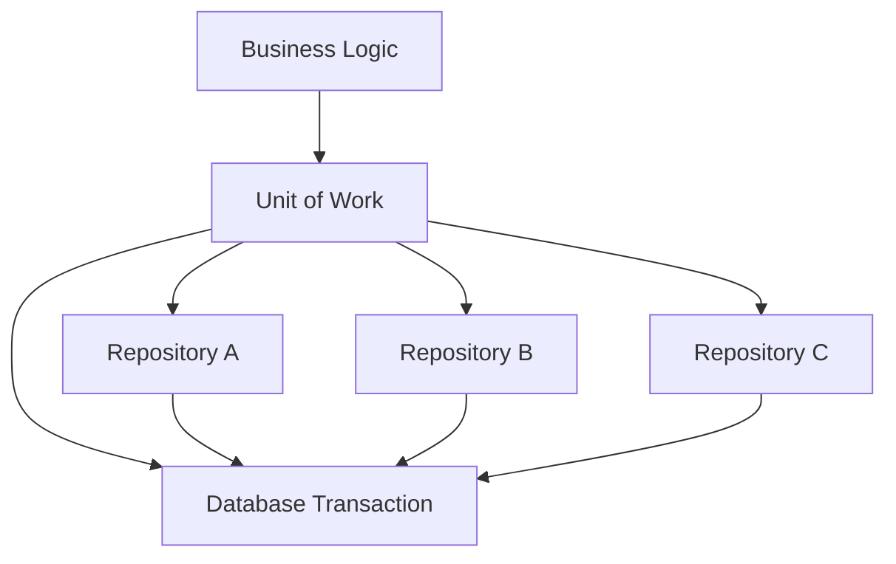
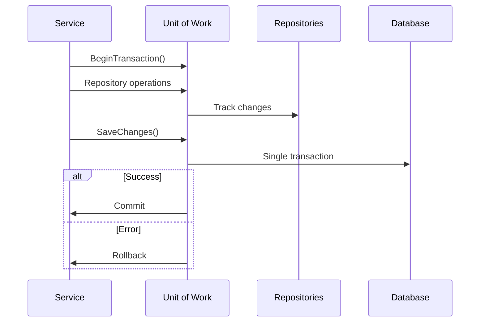

## 🏷️ Tags

#type/area #area/architecture #concept/microservice #concept/clean-architecture #design-pattern/uow 

---


## Содержание

- [[#Что такое Unit of Work?]]
- [[#Проблемы, которые решает UoW]]
- [[#Архитектурные преимущества]]
- [[#Реализация в Entity Framework]]
- [[#Собственная реализация]]
- [[#Практические примеры]]
- [[#Лучшие практики]]
- [[#Заключение]]

---

## Что такое Unit of Work? 🤔

> **Unit of Work (UoW)** — это архитектурный паттерн, который поддерживает список объектов, затронутых бизнес-транзакцией, и координирует запись изменений и разрешение проблем параллелизма.

### 🎯 Основная идея

Unit of Work работает как **"координатор транзакций"**, который:

- Отслеживает все изменения в рамках одной бизнес-операции
- Гарантирует, что все изменения применяются **атомарно**
- Управляет жизненным циклом объектов домена



### 📋 Ключевые характеристики

|Характеристика|Описание|
|---|---|
|**Атомарность**|Все операции выполняются успешно или откатываются полностью|
|**Консистентность**|Данные остаются в согласованном состоянии|
|**Изоляция**|Операции не влияют друг на друга|
|**Централизация**|Единая точка управления транзакциями|

---

## Проблемы, которые решает UoW ⚡

### ❌ Без Unit of Work

```csharp
public class OrderService
{
    private readonly IOrderRepository _orderRepository;
    private readonly IProductRepository _productRepository;
    private readonly ICustomerRepository _customerRepository;
    
    public async Task ProcessOrderAsync(CreateOrderRequest request)
    {
        // Проблема 1: Множественные подключения к БД
        var customer = await _customerRepository.GetByIdAsync(request.CustomerId);
        
        var order = new Order(customer.Id, DateTime.UtcNow);
        await _orderRepository.AddAsync(order);
        
        foreach (var item in request.Items)
        {
            var product = await _productRepository.GetByIdAsync(item.ProductId);
            
            // Проблема 2: Нет транзакционности
            product.DecreaseStock(item.Quantity);
            await _productRepository.UpdateAsync(product);
            
            var orderItem = new OrderItem(order.Id, product.Id, item.Quantity);
            await _orderItemRepository.AddAsync(orderItem);
            
            // Проблема 3: Если здесь произойдет ошибка,
            // предыдущие изменения уже сохранены!
        }
        
        // Проблема 4: Много вызовов SaveChanges
        customer.UpdateLastOrderDate(DateTime.UtcNow);
        await _customerRepository.UpdateAsync(customer);
    }
}
```

> [!danger] **Проблемы этого подхода:**
> 
> - 🔄 Множественные обращения к БД
> - ⚠️ Отсутствие транзакционности
> - 💔 Частичное сохранение при ошибках
> - 🐌 Низкая производительность

### ✅ С Unit of Work

```csharp
public class OrderService
{
    private readonly IUnitOfWork _unitOfWork;
    
    public async Task ProcessOrderAsync(CreateOrderRequest request)
    {
        using var transaction = await _unitOfWork.BeginTransactionAsync();
        try
        {
            var customer = await _unitOfWork.Customers.GetByIdAsync(request.CustomerId);
            
            var order = new Order(customer.Id, DateTime.UtcNow);
            await _unitOfWork.Orders.AddAsync(order);
            
            foreach (var item in request.Items)
            {
                var product = await _unitOfWork.Products.GetByIdAsync(item.ProductId);
                product.DecreaseStock(item.Quantity);
                
                var orderItem = new OrderItem(order.Id, product.Id, item.Quantity);
                await _unitOfWork.OrderItems.AddAsync(orderItem);
            }
            
            customer.UpdateLastOrderDate(DateTime.UtcNow);
            
            // Все изменения сохраняются одним вызовом
            await _unitOfWork.SaveChangesAsync();
            await transaction.CommitAsync();
        }
        catch
        {
            await transaction.RollbackAsync();
            throw;
        }
    }
}
```

> [!success] **Преимущества:**
> 
> - 🎯 Одна транзакция для всех операций
> - ⚡ Один вызов сохранения
> - 🛡️ Автоматический откат при ошибках
> - 🚀 Улучшенная производительность

---

## Архитектурные преимущества 🏛️

### 🔄 Управление транзакциями



### 🎭 Разделение ответственности

|Компонент|Ответственность|
|---|---|
|**Service Layer**|Бизнес-логика и оркестрация|
|**Unit of Work**|Управление транзакциями и координация|
|**Repositories**|Доступ к данным и CRUD операции|
|**Entities**|Доменная логика|

### 📊 Паттерны интеграции

```csharp
// Паттерн 1: Внедрение зависимости
public class ProductService
{
    private readonly IUnitOfWork _unitOfWork;
    
    public ProductService(IUnitOfWork unitOfWork)
    {
        _unitOfWork = unitOfWork;
    }
}

// Паттерн 2: Scoped регистрация
services.AddScoped<IUnitOfWork, UnitOfWork>();
services.AddScoped<IProductRepository, ProductRepository>();
```

---

## Реализация в Entity Framework 🚀

### 🔧 Простая реализация

Entity Framework уже реализует паттерн Unit of Work через `DbContext`:

```csharp
public class ApplicationDbContext : DbContext, IUnitOfWork
{
    public DbSet<Order> Orders { get; set; }
    public DbSet<Product> Products { get; set; }
    public DbSet<Customer> Customers { get; set; }
    
    // IUnitOfWork уже реализован в DbContext!
    public async Task<int> SaveChangesAsync()
    {
        return await base.SaveChangesAsync();
    }
    
    public async Task<IDbContextTransaction> BeginTransactionAsync()
    {
        return await Database.BeginTransactionAsync();
    }
}
```

### 🎛️ Расширенная реализация

```csharp
public interface IUnitOfWork : IDisposable
{
    IOrderRepository Orders { get; }
    IProductRepository Products { get; }
    ICustomerRepository Customers { get; }
    
    Task<int> SaveChangesAsync(CancellationToken cancellationToken = default);
    Task<IDbContextTransaction> BeginTransactionAsync();
}

public class UnitOfWork : IUnitOfWork
{
    private readonly ApplicationDbContext _context;
    private bool _disposed = false;
    
    // Lazy loading репозиториев
    private IOrderRepository _orders;
    private IProductRepository _products;
    private ICustomerRepository _customers;
    
    public UnitOfWork(ApplicationDbContext context)
    {
        _context = context;
    }
    
    public IOrderRepository Orders => 
        _orders ??= new OrderRepository(_context);
    
    public IProductRepository Products => 
        _products ??= new ProductRepository(_context);
    
    public ICustomerRepository Customers => 
        _customers ??= new CustomerRepository(_context);
    
    public async Task<int> SaveChangesAsync(CancellationToken cancellationToken = default)
    {
        return await _context.SaveChangesAsync(cancellationToken);
    }
    
    public async Task<IDbContextTransaction> BeginTransactionAsync()
    {
        return await _context.Database.BeginTransactionAsync();
    }
    
    protected virtual void Dispose(bool disposing)
    {
        if (!_disposed && disposing)
        {
            _context.Dispose();
        }
        _disposed = true;
    }
    
    public void Dispose()
    {
        Dispose(true);
        GC.SuppressFinalize(this);
    }
}
```

---

## Собственная реализация 🔨

### 🏗️ Базовый интерфейс

```csharp
public interface IUnitOfWork : IDisposable
{
    // Управление репозиториями
    TRepository GetRepository<TRepository>() where TRepository : class;
    
    // Управление транзакциями
    Task BeginTransactionAsync();
    Task CommitTransactionAsync();
    Task RollbackTransactionAsync();
    
    // Сохранение изменений
    Task<int> SaveChangesAsync();
    
    // Отслеживание изменений
    void RegisterNew<T>(T entity) where T : class;
    void RegisterModified<T>(T entity) where T : class;
    void RegisterDeleted<T>(T entity) where T : class;
}
```

### ⚙️ Реализация с отслеживанием изменений

```csharp
public class CustomUnitOfWork : IUnitOfWork
{
    private readonly IDbConnection _connection;
    private IDbTransaction _transaction;
    private readonly Dictionary<Type, object> _repositories;
    
    // Коллекции для отслеживания изменений
    private readonly List<object> _newEntities;
    private readonly List<object> _modifiedEntities;
    private readonly List<object> _deletedEntities;
    
    public CustomUnitOfWork(IDbConnection connection)
    {
        _connection = connection;
        _repositories = new Dictionary<Type, object>();
        _newEntities = new List<object>();
        _modifiedEntities = new List<object>();
        _deletedEntities = new List<object>();
    }
    
    public TRepository GetRepository<TRepository>() where TRepository : class
    {
        var type = typeof(TRepository);
        
        if (!_repositories.ContainsKey(type))
        {
            var repositoryInstance = Activator.CreateInstance<TRepository>();
            _repositories.Add(type, repositoryInstance);
        }
        
        return (TRepository)_repositories[type];
    }
    
    public void RegisterNew<T>(T entity) where T : class
    {
        _newEntities.Add(entity);
    }
    
    public void RegisterModified<T>(T entity) where T : class
    {
        if (!_modifiedEntities.Contains(entity))
            _modifiedEntities.Add(entity);
    }
    
    public void RegisterDeleted<T>(T entity) where T : class
    {
        _deletedEntities.Add(entity);
    }
    
    public async Task<int> SaveChangesAsync()
    {
        var affectedRows = 0;
        
        // Сохранение новых сущностей
        foreach (var entity in _newEntities)
        {
            affectedRows += await InsertEntityAsync(entity);
        }
        
        // Обновление измененных сущностей
        foreach (var entity in _modifiedEntities)
        {
            affectedRows += await UpdateEntityAsync(entity);
        }
        
        // Удаление сущностей
        foreach (var entity in _deletedEntities)
        {
            affectedRows += await DeleteEntityAsync(entity);
        }
        
        // Очистка коллекций
        _newEntities.Clear();
        _modifiedEntities.Clear();
        _deletedEntities.Clear();
        
        return affectedRows;
    }
    
    public async Task BeginTransactionAsync()
    {
        if (_connection.State != ConnectionState.Open)
            await _connection.OpenAsync();
            
        _transaction = _connection.BeginTransaction();
    }
    
    public async Task CommitTransactionAsync()
    {
        _transaction?.Commit();
        _transaction?.Dispose();
        _transaction = null;
    }
    
    public async Task RollbackTransactionAsync()
    {
        _transaction?.Rollback();
        _transaction?.Dispose();
        _transaction = null;
    }
}
```

---

## Практические примеры 💼

### 🛒 E-commerce приложение

```csharp
public class OrderProcessingService
{
    private readonly IUnitOfWork _unitOfWork;
    private readonly ILogger<OrderProcessingService> _logger;
    
    public OrderProcessingService(IUnitOfWork unitOfWork, ILogger<OrderProcessingService> logger)
    {
        _unitOfWork = unitOfWork;
        _logger = logger;
    }
    
    public async Task<Result<Order>> ProcessOrderAsync(CreateOrderCommand command)
    {
        using var transaction = await _unitOfWork.BeginTransactionAsync();
        
        try
        {
            _logger.LogInformation("Начало обработки заказа для клиента {CustomerId}", 
                command.CustomerId);
            
            // 1. Валидация клиента
            var customer = await _unitOfWork.Customers.GetByIdAsync(command.CustomerId);
            if (customer == null)
                return Result<Order>.Failure("Клиент не найден");
            
            // 2. Создание заказа
            var order = new Order
            {
                CustomerId = command.CustomerId,
                OrderDate = DateTime.UtcNow,
                Status = OrderStatus.Processing
            };
            
            await _unitOfWork.Orders.AddAsync(order);
            
            decimal totalAmount = 0;
            
            // 3. Обработка товаров
            foreach (var item in command.Items)
            {
                var product = await _unitOfWork.Products.GetByIdAsync(item.ProductId);
                
                if (product == null)
                    return Result<Order>.Failure($"Товар {item.ProductId} не найден");
                
                if (product.Stock < item.Quantity)
                    return Result<Order>.Failure($"Недостаточно товара {product.Name}");
                
                // Уменьшение остатка
                product.DecreaseStock(item.Quantity);
                
                // Добавление позиции заказа
                var orderItem = new OrderItem
                {
                    OrderId = order.Id,
                    ProductId = product.Id,
                    Quantity = item.Quantity,
                    Price = product.Price
                };
                
                await _unitOfWork.OrderItems.AddAsync(orderItem);
                totalAmount += product.Price * item.Quantity;
            }
            
            // 4. Обновление суммы заказа
            order.UpdateTotalAmount(totalAmount);
            
            // 5. Обновление статистики клиента
            customer.UpdateLastOrderDate(DateTime.UtcNow);
            customer.IncrementOrderCount();
            
            // 6. Сохранение всех изменений
            await _unitOfWork.SaveChangesAsync();
            await transaction.CommitAsync();
            
            _logger.LogInformation("Заказ {OrderId} успешно обработан", order.Id);
            
            return Result<Order>.Success(order);
        }
        catch (Exception ex)
        {
            await transaction.RollbackAsync();
            _logger.LogError(ex, "Ошибка при обработке заказа");
            return Result<Order>.Failure("Ошибка при обработке заказа");
        }
    }
}
```

### 📊 Отчетная система

```csharp
public class ReportService
{
    private readonly IUnitOfWork _unitOfWork;
    
    public async Task<MonthlyReport> GenerateMonthlyReportAsync(int year, int month)
    {
        using var transaction = await _unitOfWork.BeginTransactionAsync();
        
        try
        {
            // Параллельное выполнение запросов в рамках одной транзакции
            var ordersTask = _unitOfWork.Orders
                .GetOrdersByMonthAsync(year, month);
            
            var customersTask = _unitOfWork.Customers
                .GetActiveCustomersByMonthAsync(year, month);
            
            var productsTask = _unitOfWork.Products
                .GetTopSellingProductsByMonthAsync(year, month);
            
            await Task.WhenAll(ordersTask, customersTask, productsTask);
            
            var report = new MonthlyReport
            {
                Year = year,
                Month = month,
                Orders = await ordersTask,
                ActiveCustomers = await customersTask,
                TopProducts = await productsTask,
                GeneratedAt = DateTime.UtcNow
            };
            
            // Сохранение отчета
            await _unitOfWork.Reports.AddAsync(report);
            await _unitOfWork.SaveChangesAsync();
            
            await transaction.CommitAsync();
            return report;
        }
        catch
        {
            await transaction.RollbackAsync();
            throw;
        }
    }
}
```

### 🔄 Batch операции

```csharp
public class BulkOperationService
{
    private readonly IUnitOfWork _unitOfWork;
    
    public async Task<BulkResult> ProcessBulkProductUpdateAsync(
        IEnumerable<ProductUpdateRequest> updates)
    {
        const int batchSize = 100;
        var results = new List<BulkResult>();
        var batches = updates.Chunk(batchSize);
        
        foreach (var batch in batches)
        {
            using var transaction = await _unitOfWork.BeginTransactionAsync();
            
            try
            {
                var batchResult = new BulkResult { ProcessedCount = 0, Errors = new List<string>() };
                
                foreach (var update in batch)
                {
                    var product = await _unitOfWork.Products.GetByIdAsync(update.Id);
                    
                    if (product == null)
                    {
                        batchResult.Errors.Add($"Товар {update.Id} не найден");
                        continue;
                    }
                    
                    // Применение изменений
                    product.UpdatePrice(update.Price);
                    product.UpdateStock(update.Stock);
                    product.UpdateDescription(update.Description);
                    
                    batchResult.ProcessedCount++;
                }
                
                await _unitOfWork.SaveChangesAsync();
                await transaction.CommitAsync();
                
                results.Add(batchResult);
            }
            catch (Exception ex)
            {
                await transaction.RollbackAsync();
                results.Add(new BulkResult 
                { 
                    ProcessedCount = 0, 
                    Errors = new[] { ex.Message } 
                });
            }
        }
        
        return BulkResult.Combine(results);
    }
}
```

---

## Лучшие практики 🎯

### ✅ Рекомендуется

> [!tip] **Управление жизненным циклом**
> 
> ```csharp
> // Используйте Scoped регистрацию
> services.AddScoped<IUnitOfWork, UnitOfWork>();
> 
> // Или явное управление с using
> public async Task ProcessDataAsync()
> {
>     using var unitOfWork = serviceProvider.GetRequiredService<IUnitOfWork>();
>     // ... логика
>     await unitOfWork.SaveChangesAsync();
> }
> ```

> [!tip] **Обработка исключений**
> 
> ```csharp
> public async Task<Result> ExecuteOperationAsync()
> {
>     using var transaction = await _unitOfWork.BeginTransactionAsync();
>     
>     try
>     {
>         // Бизнес-логика
>         await _unitOfWork.SaveChangesAsync();
>         await transaction.CommitAsync();
>         return Result.Success();
>     }
>     catch (Exception ex)
>     {
>         await transaction.RollbackAsync();
>         return Result.Failure(ex.Message);
>     }
> }
> ```

> [!tip] **Async/await правильно**
> 
> ```csharp
> // ✅ Правильно
> public async Task ProcessAsync()
> {
>     using var uow = _serviceProvider.GetRequiredService<IUnitOfWork>();
>     await uow.Repository.AddAsync(entity);
>     await uow.SaveChangesAsync();
> }
> 
> // ❌ Неправильно - блокирующий вызов
> public void Process()
> {
>     using var uow = _serviceProvider.GetRequiredService<IUnitOfWork>();
>     uow.Repository.AddAsync(entity).Wait(); // Дедлок!
>     uow.SaveChangesAsync().Wait();
> }
> ```

### ❌ Антипаттерны

> [!warning] **Избегайте**
> 
> **1. Multiple Unit of Work в одной операции:**
> 
> ```csharp
> // ❌ Плохо
> public async Task BadExampleAsync()
> {
>     using var uow1 = new UnitOfWork();
>     using var uow2 = new UnitOfWork(); // Разные транзакции!
>     
>     await uow1.Orders.AddAsync(order);
>     await uow1.SaveChangesAsync();
>     
>     await uow2.Products.UpdateAsync(product);
>     await uow2.SaveChangesAsync(); // Может упасть после первого commit
> }
> ```
> 
> **2. Долгоживущие Unit of Work:**
> 
> ```csharp
> // ❌ Плохо - держит подключение к БД
> public class BadService
> {
>     private readonly IUnitOfWork _unitOfWork; // Singleton/долгоживущий
>     
>     public BadService(IUnitOfWork unitOfWork)
>     {
>         _unitOfWork = unitOfWork; // Утечка ресурсов!
>     }
> }
> ```
> 
> **3. Забывание SaveChanges:**
> 
> ```csharp
> // ❌ Плохо
> public async Task ForgetfulMethodAsync()
> {
>     await _unitOfWork.Repository.AddAsync(entity);
>     // Забыли вызвать SaveChanges - изменения потеряны!
> }
> ```

### 📋 Чеклист внедрения

- [ ] **Определены границы транзакций**
- [ ] **Настроена DI регистрация (Scoped)**
- [ ] **Реализована обработка исключений**
- [ ] **Добавлено логирование операций**
- [ ] **Написаны unit тесты**
- [ ] **Проведено нагрузочное тестирование**
- [ ] **Документированы все публичные методы**

---

## Тестирование 🧪

### 🔍 Unit тестирование

```csharp
[Test]
public async Task ProcessOrder_Success_ShouldSaveAllChanges()
{
    // Arrange
    var mockUoW = new Mock<IUnitOfWork>();
    var mockOrderRepo = new Mock<IOrderRepository>();
    var mockProductRepo = new Mock<IProductRepository>();
    
    mockUoW.Setup(x => x.Orders).Returns(mockOrderRepo.Object);
    mockUoW.Setup(x => x.Products).Returns(mockProductRepo.Object);
    
    var service = new OrderService(mockUoW.Object);
    
    // Act
    await service.ProcessOrderAsync(command);
    
    // Assert
    mockUoW.Verify(x => x.SaveChangesAsync(), Times.Once);
    mockUoW.Verify(x => x.BeginTransactionAsync(), Times.Once);
}
```

### 🔧 Integration тестирование

```csharp
[Test]
public async Task Integration_OrderProcessing_ShouldBeAtomic()
{
    // Arrange
    using var scope = _factory.Services.CreateScope();
    var unitOfWork = scope.ServiceProvider.GetRequiredService<IUnitOfWork>();
    var service = new OrderService(unitOfWork);
    
    var initialProductCount = await unitOfWork.Products.CountAsync();
    
    // Act & Assert
    var ex = await Assert.ThrowsAsync<InvalidOperationException>(
        () => service.ProcessInvalidOrderAsync(command));
    
    // Проверяем, что транзакция откатилась
    var finalProductCount = await unitOfWork.Products.CountAsync();
    Assert.AreEqual(initialProductCount, finalProductCount);
}
```

---

## Заключение 🎉

Unit of Work — это **мощный паттерн** для управления транзакциями в .NET приложениях, который обеспечивает:

### 🌟 Ключевые преимущества

1. **Атомарность операций** — все или ничего
2. **Консистентность данных** — согласованное состояние
3. **Производительность** — меньше обращений к БД
4. **Упрощение кода** — централизованное управление транзакциями

### 🎯 Когда использовать

- Сложные бизнес-операции с множественными изменениями
- Необходимость транзакционности
- Работа с несколькими репозиториями
- Высокие требования к производительности

### 🚀 Современные подходы

В современных .NET приложениях Unit of Work часто реализуется через:

- **Entity Framework Core** (встроенный UoW в DbContext)
- **MediatR** для CQRS паттернов
- **Minimal APIs** с dependency injection
- **Clean Architecture** в качестве части инфраструктурного слоя

> [!success] **Помните** Unit of Work не серебряная пуля. Используйте его осознанно, когда он действительно нужен, и всегда следите за производительностью и сложностью вашего кода.

---

### 📚 Дополнительные ресурсы

- [Microsoft Docs: DbContext](https://docs.microsoft.com/en-us/ef/core/dbcontext-configuration/)
- [Martin Fowler: Unit of Work](https://martinfowler.com/eaaCatalog/unitOfWork.html)
- [Clean Architecture by Robert Martin](https://blog.cleancoder.com/uncle-bob/2012/08/13/the-clean-architecture.html)

---

_Создано с ❤️ для изучения архитектурных паттернов в .NET_