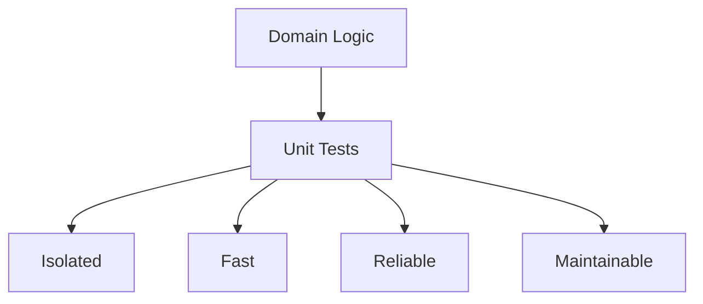

## 🏷️ Tags

#type/area #area/architecture #concept/microservice #concept/clean-architecture #concept/ddd 

---

> [!abstract] Обзор Руководство по тестированию доменной логики в .NET приложениях с использованием Factory Pattern и Dependency Injection

## 📋 Содержание

- [[#Основы тестирования доменной логики]]
- [[#Паттерны тестирования]]
- [[#Factory Pattern с DI]]
- [[#Практические примеры]]
- [[#Лучшие практики]]

---

## Основы тестирования доменной логики

### 🎯 Что такое доменная логика?

> [!info] Определение **Доменная логика** — это бизнес-правила и операции, которые представляют суть предметной области приложения

### Принципы тестирования



---

## Паттерны тестирования

### 🏗️ AAA Pattern (Arrange-Act-Assert)

```csharp
[Test]
public void CalculateDiscount_WhenPremiumCustomer_ShouldApply20PercentDiscount()
{
    // Arrange
    var customer = new Customer { IsPremium = true };
    var order = new Order { Amount = 100m };
    var discountService = new DiscountService();
    
    // Act
    var discount = discountService.Calculate(customer, order);
    
    // Assert
    Assert.AreEqual(20m, discount);
}
```

### 🎭 Test Doubles

|Тип|Назначение|Пример использования|
|---|---|---|
|**Mock**|Проверка взаимодействий|Проверка вызова методов|
|**Stub**|Возврат предопределенных данных|Имитация внешних сервисов|
|**Fake**|Упрощенная реализация|In-memory база данных|

---

## Factory Pattern с DI

### 🏭 Основная концепция

> [!tip] Factory Pattern Позволяет создавать объекты без указания их конкретных классов, обеспечивая гибкость и тестируемость

### Реализация Factory

```csharp
// Интерфейс фабрики
public interface IOrderProcessorFactory
{
    IOrderProcessor Create(OrderType orderType);
}

// Реализация фабрики с DI
public class OrderProcessorFactory : IOrderProcessorFactory
{
    private readonly IServiceProvider _serviceProvider;
    
    public OrderProcessorFactory(IServiceProvider serviceProvider)
    {
        _serviceProvider = serviceProvider;
    }
    
    public IOrderProcessor Create(OrderType orderType)
    {
        return orderType switch
        {
            OrderType.Standard => _serviceProvider.GetRequiredService<StandardOrderProcessor>(),
            OrderType.Express => _serviceProvider.GetRequiredService<ExpressOrderProcessor>(),
            OrderType.Bulk => _serviceProvider.GetRequiredService<BulkOrderProcessor>(),
            _ => throw new ArgumentException($"Unknown order type: {orderType}")
        };
    }
}
```

### Настройка DI контейнера

```csharp
// Startup.cs или Program.cs
services.AddScoped<IOrderProcessorFactory, OrderProcessorFactory>();
services.AddScoped<StandardOrderProcessor>();
services.AddScoped<ExpressOrderProcessor>();
services.AddScoped<BulkOrderProcessor>();
services.AddScoped<IPaymentService, PaymentService>();
services.AddScoped<INotificationService, NotificationService>();
```

---

## Практические примеры

### 📦 Доменная модель заказа

```csharp
public class Order
{
    public Guid Id { get; private set; }
    public decimal Amount { get; private set; }
    public OrderStatus Status { get; private set; }
    public List<OrderItem> Items { get; private set; } = new();
    
    public Order(decimal amount)
    {
        Id = Guid.NewGuid();
        Amount = amount;
        Status = OrderStatus.Pending;
    }
    
    public void AddItem(OrderItem item)
    {
        if (Status != OrderStatus.Pending)
            throw new InvalidOperationException("Cannot add items to processed order");
            
        Items.Add(item);
        Amount += item.Price * item.Quantity;
    }
    
    public void Process()
    {
        if (Status != OrderStatus.Pending)
            throw new InvalidOperationException("Order already processed");
            
        if (!Items.Any())
            throw new InvalidOperationException("Cannot process empty order");
            
        Status = OrderStatus.Processing;
    }
}
```

### 🧪 Тесты доменной модели

```csharp
[TestFixture]
public class OrderTests
{
    private Order _order;
    
    [SetUp]
    public void Setup()
    {
        _order = new Order(0);
    }
    
    [Test]
    public void AddItem_WhenOrderIsPending_ShouldAddItemAndUpdateAmount()
    {
        // Arrange
        var item = new OrderItem("Product", 10m, 2);
        
        // Act
        _order.AddItem(item);
        
        // Assert
        Assert.AreEqual(1, _order.Items.Count);
        Assert.AreEqual(20m, _order.Amount);
    }
    
    [Test]
    public void AddItem_WhenOrderIsProcessed_ShouldThrowException()
    {
        // Arrange
        _order.AddItem(new OrderItem("Product", 10m, 1));
        _order.Process();
        var newItem = new OrderItem("Another Product", 5m, 1);
        
        // Act & Assert
        Assert.Throws<InvalidOperationException>(() => _order.AddItem(newItem));
    }
    
    [Test]
    public void Process_WhenOrderHasItems_ShouldChangeStatusToProcessing()
    {
        // Arrange
        _order.AddItem(new OrderItem("Product", 10m, 1));
        
        // Act
        _order.Process();
        
        // Assert
        Assert.AreEqual(OrderStatus.Processing, _order.Status);
    }
}
```

### 🏭 Тестирование с Factory Pattern

```csharp
[TestFixture]
public class OrderServiceTests
{
    private Mock<IOrderProcessorFactory> _factoryMock;
    private Mock<IOrderProcessor> _processorMock;
    private Mock<IOrderRepository> _repositoryMock;
    private OrderService _orderService;
    
    [SetUp]
    public void Setup()
    {
        _factoryMock = new Mock<IOrderProcessorFactory>();
        _processorMock = new Mock<IOrderProcessor>();
        _repositoryMock = new Mock<IOrderRepository>();
        
        _factoryMock.Setup(f => f.Create(It.IsAny<OrderType>()))
                   .Returns(_processorMock.Object);
        
        _orderService = new OrderService(_factoryMock.Object, _repositoryMock.Object);
    }
    
    [Test]
    public async Task ProcessOrder_ShouldUseCorrectProcessor()
    {
        // Arrange
        var order = new Order(100m);
        var orderType = OrderType.Express;
        
        _repositoryMock.Setup(r => r.GetByIdAsync(order.Id))
                      .ReturnsAsync(order);
        
        // Act
        await _orderService.ProcessOrderAsync(order.Id, orderType);
        
        // Assert
        _factoryMock.Verify(f => f.Create(orderType), Times.Once);
        _processorMock.Verify(p => p.ProcessAsync(order), Times.Once);
    }
}
```

### 🎯 Integration Test с TestContainers

```csharp
[TestFixture]
public class OrderServiceIntegrationTests
{
    private PostgreSqlContainer _dbContainer;
    private IServiceProvider _serviceProvider;
    
    [OneTimeSetUp]
    public async Task OneTimeSetUp()
    {
        _dbContainer = new PostgreSqlBuilder()
            .WithDatabase("testdb")
            .WithUsername("test")
            .WithPassword("test")
            .Build();
            
        await _dbContainer.StartAsync();
        
        var services = new ServiceCollection();
        services.AddDbContext<OrderContext>(options =>
            options.UseNpgsql(_dbContainer.GetConnectionString()));
        services.AddScoped<IOrderService, OrderService>();
        services.AddScoped<IOrderProcessorFactory, OrderProcessorFactory>();
        
        _serviceProvider = services.BuildServiceProvider();
        
        using var scope = _serviceProvider.CreateScope();
        var context = scope.ServiceProvider.GetRequiredService<OrderContext>();
        await context.Database.MigrateAsync();
    }
    
    [Test]
    public async Task ProcessOrder_EndToEnd_ShouldWorkCorrectly()
    {
        using var scope = _serviceProvider.CreateScope();
        var orderService = scope.ServiceProvider.GetRequiredService<IOrderService>();
        
        // Arrange
        var order = new Order(100m);
        order.AddItem(new OrderItem("Test Product", 50m, 2));
        
        // Act
        var result = await orderService.CreateAndProcessAsync(order, OrderType.Standard);
        
        // Assert
        Assert.IsTrue(result.IsSuccess);
        Assert.AreEqual(OrderStatus.Processing, result.Value.Status);
    }
    
    [OneTimeTearDown]
    public async Task OneTimeTearDown()
    {
        await _dbContainer.DisposeAsync();
    }
}
```

---

## Лучшие практики

### ✅ Do's

> [!success] Рекомендации
> 
> - **Тестируй поведение, а не реализацию**
> - **Используй описательные имена тестов**
> - **Один тест — одна проверка**
> - **Изолируй зависимости с помощью моков**

### ❌ Don'ts

> [!warning] Избегай
> 
> - **Тестирования деталей реализации**
> - **Больших и сложных тестов**
> - **Зависимостей между тестами**
> - **Хардкода в тестах**

### 🔧 Полезные инструменты

```csharp
// FluentAssertions - читаемые проверки
result.Should().NotBeNull();
result.Amount.Should().BeGreaterThan(0);
result.Status.Should().Be(OrderStatus.Processing);

// AutoFixture - генерация тестовых данных
var fixture = new Fixture();
var order = fixture.Create<Order>();

// Bogus - генерация реалистичных данных
var orderFaker = new Faker<Order>()
    .RuleFor(o => o.Amount, f => f.Random.Decimal(10, 1000))
    .RuleFor(o => o.Status, f => f.PickRandom<OrderStatus>());
```

### 📊 Метрики качества тестов

|Метрика|Цель|Инструмент|
|---|---|---|
|**Code Coverage**|> 80%|dotcover, coverlet|
|**Mutation Testing**|> 70%|Stryker.NET|
|**Test Performance**|< 1s на тест|BenchmarkDotNet|

---

## 📚 Дополнительные ресурсы

> [!note] Ссылки
> 
> - [xUnit Documentation](https://xunit.net/)
> - [Moq Framework](https://github.com/moq/moq4)
> - [FluentAssertions](https://fluentassertions.com/)
> - [TestContainers for .NET](https://testcontainers.org/)

---
