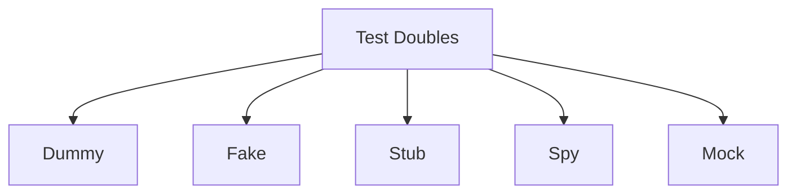

## 🏷️ Tags

#type/area #area/architecture #concept/microservice #concept/clean-architecture 

---

> [!info]- 💡 **Что такое Test Doubles?** Test Doubles (тестовые дублёры) — это объекты, которые заменяют реальные зависимости в unit тестах. Они позволяют изолировать тестируемый код и контролировать поведение внешних компонентов.

---

## 📋 Типы Test Doubles



### 🎭 1. Dummy Objects

> [!example]- **Dummy** - простые объекты-заглушки Передаются как параметры, но никогда не используются

```csharp
public class DummyLogger : ILogger
{
    public void Log(string message) 
    {
        // Ничего не делает - это просто заглушка
    }
}

[Test]
public void ProcessOrder_ShouldCalculateTotal()
{
    var dummyLogger = new DummyLogger(); // Не используется в тесте
    var processor = new OrderProcessor(dummyLogger);
    
    var result = processor.CalculateTotal(100);
    
    Assert.AreEqual(120, result); // 100 + 20% налог
}
```

---

### 🏭 2. Fake Objects

> [!example]- **Fake** - рабочие реализации с упрощённой логикой Имеют рабочую реализацию, но не подходят для production

```csharp
public class FakeEmailService : IEmailService
{
    public List<string> SentEmails { get; } = new();
    
    public void SendEmail(string to, string subject, string body)
    {
        SentEmails.Add($"{to}: {subject}");
    }
}

[Test]
public void RegisterUser_ShouldSendWelcomeEmail()
{
    var fakeEmailService = new FakeEmailService();
    var userService = new UserService(fakeEmailService);
    
    userService.RegisterUser("test@example.com", "John");
    
    Assert.AreEqual(1, fakeEmailService.SentEmails.Count);
    Assert.IsTrue(fakeEmailService.SentEmails[0].Contains("Welcome"));
}
```

---

### 🎯 3. Stub Objects

> [!example]- **Stub** - предоставляют заранее определённые ответы Возвращают фиксированные данные на вызовы методов

```csharp
public class StubUserRepository : IUserRepository
{
    public User GetById(int id)
    {
        return new User { Id = id, Name = "Test User", Email = "test@example.com" };
    }
}

[Test]
public void GetUserProfile_ShouldReturnFormattedName()
{
    var stubRepository = new StubUserRepository();
    var profileService = new ProfileService(stubRepository);
    
    var profile = profileService.GetUserProfile(1);
    
    Assert.AreEqual("Test User (test@example.com)", profile.DisplayName);
}
```

---

### 🕵️ 4. Spy Objects

> [!example]- **Spy** - записывают информацию о том, как они использовались Позволяют проверить, какие методы были вызваны и с какими параметрами

```csharp
public class SpyNotificationService : INotificationService
{
    public int NotificationsSent { get; private set; }
    public List<string> Recipients { get; } = new();
    
    public void SendNotification(string recipient, string message)
    {
        NotificationsSent++;
        Recipients.Add(recipient);
    }
}

[Test]
public void ProcessBulkOrders_ShouldNotifyAllCustomers()
{
    var spyNotificationService = new SpyNotificationService();
    var orderProcessor = new BulkOrderProcessor(spyNotificationService);
    
    var orders = new[] { 
        new Order { CustomerEmail = "user1@test.com" },
        new Order { CustomerEmail = "user2@test.com" }
    };
    
    orderProcessor.ProcessOrders(orders);
    
    Assert.AreEqual(2, spyNotificationService.NotificationsSent);
    Assert.Contains("user1@test.com", spyNotificationService.Recipients);
}
```

---

## 🎪 Mocking Frameworks

> [!tip]- 📚 **Популярные .NET библиотеки**
> 
> - **Moq** - самая популярная
> - **NSubstitute** - простой синтаксис
> - **FakeItEasy** - читаемый код
> - **Microsoft Fakes** - встроенная в Visual Studio

---

### 🚀 Moq - Основы

> [!note]- 🔧 **Установка**
> 
> ```bash
> Install-Package Moq
> ```

#### Setup и Verification

```csharp
[Test]
public void TransferMoney_ShouldUpdateBothAccounts()
{
    // Arrange
    var mockAccountRepo = new Mock<IAccountRepository>();
    var mockLogger = new Mock<ILogger>();
    
    var fromAccount = new Account { Id = 1, Balance = 1000 };
    var toAccount = new Account { Id = 2, Balance = 500 };
    
    // Setup - настройка поведения mock'ов
    mockAccountRepo.Setup(x => x.GetById(1)).Returns(fromAccount);
    mockAccountRepo.Setup(x => x.GetById(2)).Returns(toAccount);
    
    var transferService = new MoneyTransferService(mockAccountRepo.Object, mockLogger.Object);
    
    // Act
    transferService.Transfer(1, 2, 200);
    
    // Assert - проверка вызовов
    mockAccountRepo.Verify(x => x.Update(fromAccount), Times.Once);
    mockAccountRepo.Verify(x => x.Update(toAccount), Times.Once);
    mockLogger.Verify(x => x.Log(It.IsAny<string>()), Times.AtLeastOnce);
}
```

---

### 🎨 Продвинутые возможности Moq

> [!abstract]- 🔍 **Matchers и Callbacks**

#### It.IsAny и параметры

```csharp
[Test]
public void SendEmail_WithInvalidEmail_ShouldLogError()
{
    var mockEmailService = new Mock<IEmailService>();
    var mockLogger = new Mock<ILogger>();
    
    // Setup с исключением
    mockEmailService
        .Setup(x => x.Send(It.IsAny<string>(), It.IsAny<string>()))
        .Throws(new InvalidOperationException("Invalid email"));
    
    var notificationService = new NotificationService(mockEmailService.Object, mockLogger.Object);
    
    notificationService.SendWelcomeEmail("invalid-email");
    
    // Проверяем, что ошибка была залогирована
    mockLogger.Verify(
        x => x.LogError(It.Is<string>(msg => msg.Contains("Invalid email"))),
        Times.Once
    );
}
```

#### Callbacks и сложная логика

```csharp
[Test] 
public void ProcessPayment_ShouldUpdateOrderStatus()
{
    var mockPaymentGateway = new Mock<IPaymentGateway>();
    var mockOrderRepository = new Mock<IOrderRepository>();
    
    var order = new Order { Id = 1, Status = OrderStatus.Pending };
    mockOrderRepository.Setup(x => x.GetById(1)).Returns(order);
    
    // Callback для изменения состояния
    mockPaymentGateway
        .Setup(x => x.ProcessPayment(It.IsAny<decimal>()))
        .Callback<decimal>(amount => 
        {
            if (amount > 0) 
                order.Status = OrderStatus.Paid;
        })
        .Returns(true);
    
    var paymentService = new PaymentService(mockPaymentGateway.Object, mockOrderRepository.Object);
    
    var result = paymentService.ProcessOrder(1, 100);
    
    Assert.IsTrue(result);
    Assert.AreEqual(OrderStatus.Paid, order.Status);
}
```

---

### 🎯 NSubstitute - Альтернативный синтаксис

> [!success]- ✨ **Более читаемый код**

```csharp
[Test]
public void GetWeatherForecast_ShouldReturnCachedData()
{
    // Arrange - создание substitute
    var weatherApi = Substitute.For<IWeatherApi>();
    var cache = Substitute.For<ICache>();
    
    var cachedForecast = new WeatherForecast { Temperature = 25 };
    cache.Get<WeatherForecast>("weather_today").Returns(cachedForecast);
    
    var weatherService = new WeatherService(weatherApi, cache);
    
    // Act
    var result = weatherService.GetTodayForecast();
    
    // Assert
    Assert.AreEqual(25, result.Temperature);
    
    // Проверяем, что API НЕ вызывался (используется кеш)
    weatherApi.DidNotReceive().GetCurrentWeather();
    cache.Received(1).Get<WeatherForecast>("weather_today");
}
```

---

## ⚠️ Лучшие практики

> [!warning]- 🚨 **Что НЕ надо делать**
> 
> - ❌ **Over-mocking** - не мокайте простые объекты (string, int)
> - ❌ **Тестирование реализации** вместо поведения
> - ❌ **Слишком сложные mock'и** - признак плохого дизайна

### ✅ Правильные подходы

> [!check]- **AAA Pattern** **Arrange** → **Act** → **Assert**

```csharp
[Test]
public void CalculateDiscount_ForPremiumCustomer_ShouldApply20Percent()
{
    // ====== ARRANGE ======
    var mockCustomerRepo = new Mock<ICustomerRepository>();
    var customer = new Customer { Id = 1, IsPremium = true };
    mockCustomerRepo.Setup(x => x.GetById(1)).Returns(customer);
    
    var discountService = new DiscountService(mockCustomerRepo.Object);
    
    // ====== ACT ======
    var discount = discountService.CalculateDiscount(1, 1000);
    
    // ====== ASSERT ======
    Assert.AreEqual(200, discount); // 20% от 1000
}
```

---

### 🎪 Интеграционные тесты vs Unit тесты

> [!info]- 📊 **Пирамида тестирования**

```
     /\     E2E Tests
    /  \    (Немного)
   /____\   
  /      \  Integration Tests
 /        \ (Умеренно)
/__________\
Unit Tests (Много)
```

#### Unit Test с Mock'ами

```csharp
[Test]
public void SendOrderConfirmation_ShouldUseCorrectTemplate()
{
    // Все зависимости замокованы
    var mockEmailService = new Mock<IEmailService>();
    var mockTemplateService = new Mock<ITemplateService>();
    
    mockTemplateService
        .Setup(x => x.GetTemplate("order_confirmation"))
        .Returns("Dear {CustomerName}, your order #{OrderId} is confirmed");
    
    var service = new OrderConfirmationService(mockEmailService.Object, mockTemplateService.Object);
    
    service.SendConfirmation(new Order { Id = 123, CustomerName = "John" });
    
    mockEmailService.Verify(x => x.Send(
        It.IsAny<string>(), 
        It.Is<string>(body => body.Contains("John") && body.Contains("123"))
    ), Times.Once);
}
```

#### Integration Test (без Mock'ов)

```csharp
[Test]
public void OrderWorkflow_EndToEnd_ShouldCompleteSuccessfully()
{
    // Используем реальные реализации или TestContainers
    var dbContext = new TestDbContext();
    var emailService = new TestEmailService();
    var orderService = new OrderService(dbContext, emailService);
    
    var order = new Order { CustomerId = 1, Amount = 100 };
    
    var result = orderService.ProcessOrder(order);
    
    Assert.IsTrue(result.IsSuccess);
    Assert.AreEqual(1, emailService.SentEmails.Count);
    Assert.AreEqual(OrderStatus.Processed, dbContext.Orders.First().Status);
}
```

---

## 🛠️ Практические примеры

### Scenario 1: HTTP Client Mock

```csharp
public interface IHttpClientWrapper
{
    Task<string> GetStringAsync(string url);
}

[Test]
public async Task GetExchangeRate_ShouldReturnParsedValue()
{
    // Arrange
    var mockHttpClient = new Mock<IHttpClientWrapper>();
    mockHttpClient
        .Setup(x => x.GetStringAsync("https://api.exchangerate.com/usd"))
        .ReturnsAsync("{\"rate\": 1.25}");
    
    var service = new CurrencyService(mockHttpClient.Object);
    
    // Act
    var rate = await service.GetUsdToEurRate();
    
    // Assert
    Assert.AreEqual(1.25m, rate);
}
```

### Scenario 2: Database Repository Mock

```csharp
[Test]
public void GetActiveUsers_ShouldFilterCorrectly()
{
    // Arrange
    var users = new List<User>
    {
        new User { Id = 1, IsActive = true, Name = "John" },
        new User { Id = 2, IsActive = false, Name = "Jane" },
        new User { Id = 3, IsActive = true, Name = "Bob" }
    };
    
    var mockRepo = new Mock<IUserRepository>();
    mockRepo.Setup(x => x.GetAll()).Returns(users);
    
    var userService = new UserService(mockRepo.Object);
    
    // Act
    var activeUsers = userService.GetActiveUsers();
    
    // Assert
    Assert.AreEqual(2, activeUsers.Count());
    Assert.IsTrue(activeUsers.All(u => u.IsActive));
}
```

---

## 🎲 Verify vs Returns

> [!tip]- **Setup vs Verify**
> 
> - **Setup** - определяет что mock должен возвращать
> - **Verify** - проверяет что методы были вызваны

|Метод|Назначение|Пример|
|---|---|---|
|`Setup()`|Настройка поведения|`mock.Setup(x => x.Get()).Returns(data)`|
|`Verify()`|Проверка вызовов|`mock.Verify(x => x.Save(It.IsAny<User>()), Times.Once)`|
|`VerifyAll()`|Проверка всех Setup'ов|`mock.VerifyAll()`|

### Times - варианты проверки

```csharp
// Различные способы проверки количества вызовов
mock.Verify(x => x.Method(), Times.Never);      // Никогда
mock.Verify(x => x.Method(), Times.Once);       // Ровно один раз  
mock.Verify(x => x.Method(), Times.Exactly(3)); // Ровно 3 раза
mock.Verify(x => x.Method(), Times.AtLeast(1)); // Минимум 1 раз
mock.Verify(x => x.Method(), Times.AtMost(5));  // Максимум 5 раз
mock.Verify(x => x.Method(), Times.Between(2, 4, Range.Inclusive)); // От 2 до 4
```

---

## 🏗️ Dependency Injection в тестах

> [!example]- 🔄 **Тестирование с DI Container**

```csharp
[Test]
public void OrderService_WithMockedDependencies_ShouldWork()
{
    // Arrange - создаём тестовый контейнер
    var services = new ServiceCollection();
    
    // Регистрируем реальный сервис
    services.AddTransient<OrderService>();
    
    // Регистрируем mock'и
    var mockRepo = new Mock<IOrderRepository>();
    var mockEmailService = new Mock<IEmailService>();
    
    services.AddSingleton(mockRepo.Object);
    services.AddSingleton(mockEmailService.Object);
    
    var provider = services.BuildServiceProvider();
    var orderService = provider.GetRequiredService<OrderService>();
    
    // Setup mock behavior
    mockRepo.Setup(x => x.Save(It.IsAny<Order>())).Returns(true);
    
    // Act & Assert
    var result = orderService.CreateOrder(new CreateOrderRequest());
    Assert.IsTrue(result.Success);
}
```

---

## 🎯 Продвинутые техники

### Async/Await Mocking

```csharp
[Test]
public async Task ProcessAsync_ShouldHandleTimeout()
{
    var mockService = new Mock<IApiService>();
    
    // Мокаем асинхронный метод с задержкой
    mockService
        .Setup(x => x.GetDataAsync())
        .Returns(async () => 
        {
            await Task.Delay(100);
            return new ApiResponse { Success = true };
        });
    
    var processor = new DataProcessor(mockService.Object);
    
    var result = await processor.ProcessAsync();
    
    Assert.IsTrue(result.Success);
}
```

### Property Mocking

```csharp
[Test]
public void ConfigService_ShouldUseCorrectSettings()
{
    var mockConfig = new Mock<IConfiguration>();
    
    // Мокаем свойства
    mockConfig.SetupGet(x => x.DatabaseTimeout).Returns(30);
    mockConfig.SetupGet(x => x.MaxRetryCount).Returns(3);
    
    var service = new DatabaseService(mockConfig.Object);
    
    // Проверяем что настройки используются
    Assert.AreEqual(30, service.GetTimeout());
}
```

---

## ⚖️ Когда использовать каждый тип

> [!abstract]- 📋 **Шпаргалка по выбору**

|Тип|Когда использовать|Пример использования|
|---|---|---|
|**Dummy**|Параметр нужен, но не используется|Логгер в конструкторе|
|**Fake**|Нужна простая рабочая реализация|In-memory база данных|
|**Stub**|Нужны предсказуемые ответы|Конфигурационные данные|
|**Spy**|Нужно проверить взаимодействие|Подсчёт отправленных email'ов|
|**Mock**|Нужна проверка поведения|Verification паттерн|

---

## 🧪 Примеры из реальной жизни

### E-commerce сценарий

```csharp
public class OrderProcessorTests
{
    private Mock<IPaymentService> _mockPaymentService;
    private Mock<IInventoryService> _mockInventoryService;
    private Mock<IEmailService> _mockEmailService;
    private OrderProcessor _orderProcessor;
    
    [SetUp]
    public void Setup()
    {
        _mockPaymentService = new Mock<IPaymentService>();
        _mockInventoryService = new Mock<IInventoryService>();
        _mockEmailService = new Mock<IEmailService>();
        
        _orderProcessor = new OrderProcessor(
            _mockPaymentService.Object,
            _mockInventoryService.Object, 
            _mockEmailService.Object
        );
    }
    
    [Test]
    public async Task ProcessOrder_HappyPath_ShouldCompleteSuccessfully()
    {
        // Arrange
        var order = new Order 
        { 
            Id = 1, 
            ProductId = 100, 
            Quantity = 2, 
            Amount = 50.00m 
        };
        
        _mockInventoryService.Setup(x => x.IsAvailable(100, 2)).Returns(true);
        _mockPaymentService.Setup(x => x.ProcessPayment(50.00m)).ReturnsAsync(true);
        
        // Act
        var result = await _orderProcessor.ProcessOrder(order);
        
        // Assert
        Assert.IsTrue(result.Success);
        
        // Verify the workflow
        _mockInventoryService.Verify(x => x.ReserveItems(100, 2), Times.Once);
        _mockPaymentService.Verify(x => x.ProcessPayment(50.00m), Times.Once);
        _mockEmailService.Verify(x => x.SendOrderConfirmation(order), Times.Once);
    }
    
    [Test]  
    public async Task ProcessOrder_InsufficientInventory_ShouldFail()
    {
        var order = new Order { ProductId = 100, Quantity = 10 };
        
        _mockInventoryService.Setup(x => x.IsAvailable(100, 10)).Returns(false);
        
        var result = await _orderProcessor.ProcessOrder(order);
        
        Assert.IsFalse(result.Success);
        Assert.AreEqual("Insufficient inventory", result.ErrorMessage);
        
        // Убеждаемся что платёж НЕ обрабатывался
        _mockPaymentService.Verify(x => x.ProcessPayment(It.IsAny<decimal>()), Times.Never);
    }
}
```

---

## 📚 Заключение

> [!success] **✨ Ключевые выводы**
> 
> 1. **Test Doubles** изолируют тестируемый код
> 2. **Moq** - стандарт де-факто для .NET
> 3. **Verify** поведение, а не реализацию
> 4. **AAA Pattern** делает тесты читаемыми
> 5. **Не злоупотребляйте** мокингом

> [!quote]- 💭 **Помните** "Лучший mock - это тот, которого нет. Но когда он нужен, делайте его правильно."

---

## 🔗 Связанные темы

- [[Unit Testing Best Practices]]
- [[Dependency Injection in .NET]]
- [[TDD - Test Driven Development]]
- [[Integration Testing Strategies]]

---
