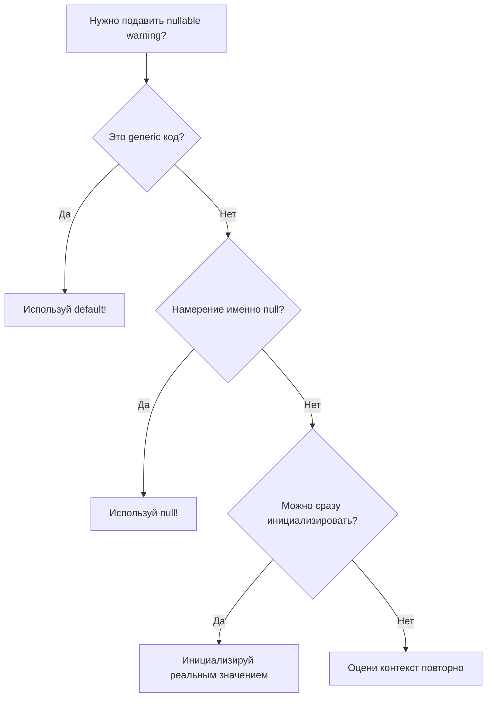

# .NET: Когда использовать `null!` а когда `default!`

> [!abstract] Краткое содержание Подробное руководство по выбору между `null!` и `default!` операторами в .NET для подавления предупреждений nullable reference types с практическими примерами и рекомендациями.

---

## 🎯 Основные понятия

### Что такое null-forgiving operator (!)

**Null-forgiving operator** (`!`) сообщает компилятору, что выражение **не является null**, даже если статический анализ не может это определить.

```csharp
string? nullableString = GetNullableString();
string nonNullString = nullableString!; // Подавляем предупреждение CS8600
```

> [!warning] Важно! Использование `!` не изменяет runtime поведение - это только подсказка для компилятора

---

## 🔍 `null!` - Явное указание на null

### Когда использовать `null!`

> [!tip] Используйте `null!` когда:
> 
> - Нужно явно присвоить null значение
> - Поле будет инициализировано позже через dependency injection
> - Работаете с lazy initialization
> - Используете паттерн "позднее связывание"

### ✅ Правильные примеры использования `null!`

#### 1. Dependency Injection

```csharp
public class UserService
{
    // Поле будет инициализировано DI контейнером
    private readonly ILogger<UserService> _logger = null!;
    private readonly IUserRepository _repository = null!;
    
    public UserService(ILogger<UserService> logger, IUserRepository repository)
    {
        _logger = logger;
        _repository = repository;
    }
}
```

#### 2. Lazy Initialization

```csharp
public class DataManager
{
    private List<string> _cache = null!;
    
    public List<string> Cache
    {
        get
        {
            if (_cache == null)
            {
                _cache = LoadDataFromDatabase();
            }
            return _cache;
        }
    }
    
    private List<string> LoadDataFromDatabase()
    {
        // Логика загрузки данных
        return new List<string>();
    }
}
```

#### 3. Паттерн Builder с обязательными полями

```csharp
public class EmailBuilder
{
    private string _recipient = null!;
    private string _subject = null!;
    private string _body = null!;
    
    public EmailBuilder SetRecipient(string recipient)
    {
        _recipient = recipient;
        return this;
    }
    
    public EmailBuilder SetSubject(string subject)
    {
        _subject = subject;
        return this;
    }
    
    public EmailBuilder SetBody(string body)
    {
        _body = body;
        return this;
    }
    
    public Email Build()
    {
        // Валидация перед созданием объекта
        if (string.IsNullOrEmpty(_recipient))
            throw new InvalidOperationException("Recipient is required");
        
        return new Email(_recipient, _subject, _body);
    }
}
```

---

## ⚡ `default!` - Значение по умолчанию

### Когда использовать `default!`

> [!tip] Используйте `default!` когда:
> 
> - Работаете с generic типами
> - Нужно значение по умолчанию для типа
> - В generic constraints где тип может быть value или reference
> - При инициализации массивов или коллекций

### ✅ Правильные примеры использования `default!`

#### 1. Generic методы и классы

```csharp
public class Repository<T> where T : class
{
    private T _cachedItem = default!;
    
    public T GetCachedOrDefault()
    {
        return _cachedItem ?? CreateDefault();
    }
    
    private T CreateDefault()
    {
        // Для reference types default будет null
        // Для value types - значение по умолчанию
        return default!;
    }
}
```

#### 2. Универсальные utility методы

```csharp
public static class DefaultValueHelper
{
    public static T GetDefaultValue<T>() where T : notnull
    {
        // default! работает как для value types, так и для reference types
        return default!;
    }
    
    public static bool IsDefault<T>(T value) where T : notnull
    {
        return EqualityComparer<T>.Default.Equals(value, default!);
    }
}

// Использование
string defaultString = DefaultValueHelper.GetDefaultValue<string>(); // ""
int defaultInt = DefaultValueHelper.GetDefaultValue<int>(); // 0
DateTime defaultDate = DefaultValueHelper.GetDefaultValue<DateTime>(); // 01.01.0001
```

#### 3. Инициализация коллекций в generic классах

```csharp
public class DataContainer<T> where T : class
{
    private readonly List<T> _items;
    private T _selectedItem = default!;
    
    public DataContainer()
    {
        _items = new List<T>();
        // default! подходит для любого reference type
        _selectedItem = default!;
    }
    
    public T SelectedItem 
    { 
        get => _selectedItem ?? _items.FirstOrDefault() ?? default!;
        set => _selectedItem = value;
    }
}
```

#### 4. Работа с Nullable Value Types

```csharp
public class ConfigurationManager
{
    private int? _maxRetries = default!; // null
    private TimeSpan? _timeout = default!; // null
    
    public void SetDefaults()
    {
        // Для nullable value types default даёт null
        _maxRetries = default!; // null
        _timeout = default!;    // null
    }
    
    public void SetActualDefaults()
    {
        // Для actual defaults используем конкретные значения
        _maxRetries = 3;
        _timeout = TimeSpan.FromSeconds(30);
    }
}
```

---

## 📊 Сравнительная таблица

|Аспект|`null!`|`default!`|
|---|---|---|
|**Семантика**|Явно указывает на null|Значение по умолчанию для типа|
|**Generic типы**|❌ Не подходит|✅ Идеально|
|**Reference types**|✅ Явное намерение|⚠️ Может быть неочевидно|
|**Value types**|❌ Ошибка компиляции|✅ Работает|
|**Читаемость**|✅ Ясно показывает null|⚠️ Может быть неоднозначно|

---

## ⚠️ Антипаттерны и ошибки

### ❌ Неправильное использование `null!`

```csharp
// ПЛОХО: null! для value types
public class BadExample
{
    private int _count = null!; // ❌ Ошибка компиляции!
    private DateTime _created = null!; // ❌ Ошибка компиляции!
}

// ПЛОХО: null! когда можно использовать реальное значение
public class AnotherBadExample
{
    private string _name = null!; // ❌ Если можно сразу задать значение
    
    public AnotherBadExample()
    {
        _name = "DefaultName"; // Лучше сразу в объявлении
    }
}
```

### ❌ Неправильное использование `default!`

```csharp
// ПЛОХО: default! когда намерение - именно null
public class BadGenericExample<T> where T : class
{
    private T _item = default!;
    
    public void Reset()
    {
        _item = default!; // Неясно - это null или "значение по умолчанию"?
        // ЛУЧШЕ:
        _item = null!; // Явно показываем намерение
    }
}
```

---

## 🏗️ Практические паттерны

### Паттерн: Generic Factory

```csharp
public class GenericFactory<T> where T : class, new()
{
    private readonly Dictionary<string, T> _cache = new();
    private T _defaultInstance = default!;
    
    public T GetOrCreate(string key)
    {
        if (_cache.TryGetValue(key, out var cached))
            return cached;
            
        var instance = new T();
        _cache[key] = instance;
        return instance;
    }
    
    public T GetDefault()
    {
        return _defaultInstance ??= new T();
    }
}
```

### Паттерн: Conditional Initialization

```csharp
public class ConditionalService
{
    private readonly bool _isEnabled;
    private IExternalService? _externalService;
    private ILocalService _localService = null!;
    
    public ConditionalService(bool isEnabled)
    {
        _isEnabled = isEnabled;
        
        if (_isEnabled)
        {
            _externalService = new ExternalService();
        }
        else
        {
            _localService = new LocalService();
        }
    }
    
    public void DoWork()
    {
        if (_isEnabled)
        {
            _externalService?.Process(); // nullable, может быть null
        }
        else
        {
            _localService.Process(); // non-null, инициализирован в конструкторе
        }
    }
}
```

---

## 🎓 Рекомендации экспертов

> [!note] Золотые правила
> 
> 1. **Используйте `null!`** когда намерение именно null
> 2. **Используйте `default!`** в generic коде
> 3. **Документируйте** сложные случаи использования
> 4. **Избегайте** если можно инициализировать сразу

### Чек-лист выбора



---

## 🔗 Дополнительные ресурсы

- [Microsoft Docs: Nullable reference types](https://docs.microsoft.com/en-us/dotnet/csharp/nullable-references)
- [C# 8.0 Features](https://docs.microsoft.com/en-us/dotnet/csharp/whats-new/csharp-8)
- [Best Practices for Nullable Reference Types](https://docs.microsoft.com/en-us/dotnet/csharp/nullable-references-best-practices)

---

> [!success] Заключение Правильный выбор между `null!` и `default!` делает код более читаемым и выражает намерения разработчика. Помните: `null!` для явного null, `default!` для generic кода.
