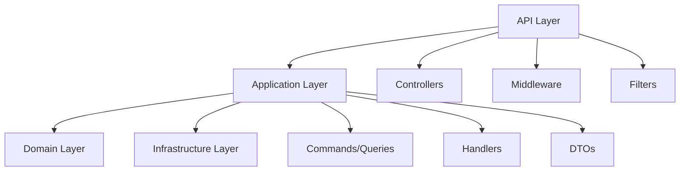

---
aliases:
  - MOC - API Design
  - API Design
tags:
  - type/moc
  - status/active
  - area/architecture
  - tech/csharp
  - tech/asp-net
  - concept/api-first-design
  - concept/clean-architecture
  - impl/rest
  - impl/openapi
title: MOC - API Design
linter-yaml-title-alias: MOC - API Design
date created: Monday, September 8th 2025, 2:48:16 pm
date modified: Tuesday, September 9th 2025, 5:01:11 am
---

## 🏷️ Tags

#type/moc #status/active #area/architecture #tech/csharp #tech/asp-net #concept/api-first-design #concept/clean-architecture #impl/rest #impl/openapi 

---

# MOC - API Design

> [!abstract] 📋 О чём эта карта знаний Комплексный подход к проектированию API в .NET экосистеме - от базовых принципов до продвинутых техник масштабирования и безопасности

---

## 🎯 Чек-лист изучения

- [ ] Освоить принципы API-first design
- [ ] Изучить REST архитектурный стиль
- [ ] Настроить автодокументирование через OpenAPI/Swagger
- [ ] Реализовать стратегию версионирования
- [ ] Внедрить аутентификацию и авторизацию
- [ ] Настроить валидацию и обработку ошибок
- [ ] Оптимизировать производительность и кэширование

---

## 🗺️ Карта знаний

### 🔰 Основы проектирования API

**[[.NET API Design - Принципы и основы]]**

- API-first подход в разработке
- RESTful принципы и HTTP семантика
- Структура проекта ASP.NET Core Web API
- Настройка Dependency Injection контейнера

### 📚 Документирование и спецификации

**[[.NET API Design - OpenAPI и Swagger]]**

- Настройка Swashbuckle.AspNetCore
- Генерация OpenAPI спецификаций
- Кастомизация Swagger UI
- Автогенерация клиентских SDK

### 🔄 Управление версиями

**[[.NET API Design - Версионирование]]**

- Стратегии версионирования API
- URL versioning vs Header versioning
- Поддержка legacy версий
- Миграционные стратегии

### 🛡️ Безопасность

**[[.NET API Design - Аутентификация и авторизация]]**

- JWT токены и Claims-based авторизация
- OAuth 2.0 и OpenID Connect
- API Keys и Custom Authentication
- Политики авторизации и атрибуты

### ✅ Валидация и обработка ошибок

**[[.NET API Design - Валидация и ошибки]]**

- FluentValidation integration
- Global exception handling
- Problem Details (RFC 7807)
- Централизованная обработка ошибок

### 🚀 Производительность и оптимизация

**[[.NET API Design - Производительность]]**

- Response caching стратегии
- Compression и минимизация payload
- Async/await best practices
- Database optimization patterns

### 🧪 Тестирование API

**[[.NET API Design - Тестирование]]**

- Unit тесты для контроллеров
- Integration тесты с TestServer
- Contract testing подходы
- Load testing стратегии

---

## 🏗️ Архитектурные паттерны

### Интеграция с Clean Architecture



### Связь с DDD концепциями

- **[[MOC - DDD - Bounded Context|Bounded Context]]** - разделение API по доменным границам
- **[[DDD.Aggregate|Aggregate]]** - проектирование endpoints вокруг агрегатов
- **[[DDD.Domain Service|Domain Service]]** - бизнес-логика в сервисном слое

---

## 🔧 Инструменты и библиотеки

> [!tip] 🛠️ Рекомендуемый стек
> 
> **Основа**: ASP.NET Core 8.0+, Minimal APIs **Документирование**: Swashbuckle.AspNetCore, NSwag **Валидация**: FluentValidation **Мапинг**: AutoMapper, Mapster **Авторизация**: IdentityServer, Auth0 **Тестирование**: xUnit, Microsoft.AspNetCore.Mvc.Testing

---

## 📋 Быстрый старт

### 1. Создание базового API проекта

```bash
dotnet new webapi -n MyApi
cd MyApi
dotnet add package Swashbuckle.AspNetCore
dotnet add package FluentValidation.AspNetCore
```

### 2. Настройка Program.cs

```csharp
var builder = WebApplication.CreateBuilder(args);

builder.Services.AddControllers();
builder.Services.AddEndpointsApiExplorer();
builder.Services.AddSwaggerGen();

var app = builder.Build();

if (app.Environment.IsDevelopment())
{
    app.UseSwagger();
    app.UseSwaggerUI();
}

app.UseHttpsRedirection();
app.UseAuthorization();
app.MapControllers();

app.Run();
```

### 3. Создание первого контроллера

```csharp
[ApiController]
[Route("api/[controller]")]
public class ProductsController : ControllerBase
{
    [HttpGet]
    public async Task<ActionResult<IEnumerable<ProductDto>>> GetProducts()
    {
        // Реализация
    }
}
```

---

## 🎨 Best Practices Summary

> [!success] ✨ Ключевые принципы
> 
> - **Consistency** - единообразие в naming, structure, response format
> - **Discoverability** - самодокументируемые API через OpenAPI
> - **Resilience** - graceful degradation и proper error handling
> - **Security** - defense in depth подход
> - **Performance** - caching, compression, async operations

---

## 🔗 Связанные концепции

- [[MOC - Clean Architcture|Clean Architecture]] - архитектурная основа
- [[MOC - ArchPat - CQRS|CQRS]] - разделение команд и запросов
- [[MOC - Microservices|Microservices]] - распределённая архитектура
- [[API Gateway]] - централизация API management
- [[Arch.Event-Driven|Event-Driven Architecture]] - асинхронная интеграция

---

## 📚 Дополнительные ресурсы

- [Microsoft REST API Guidelines](https://github.com/Microsoft/api-guidelines)
- [ASP.NET Core Web API Documentation](https://docs.microsoft.com/aspnet/core/web-api)
- [OpenAPI Specification](https://swagger.io/specification/)
