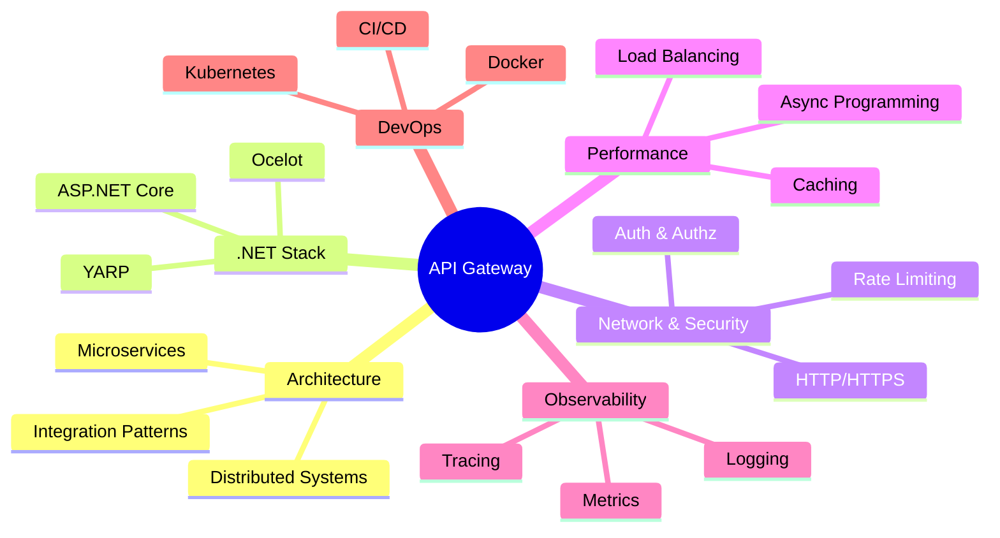
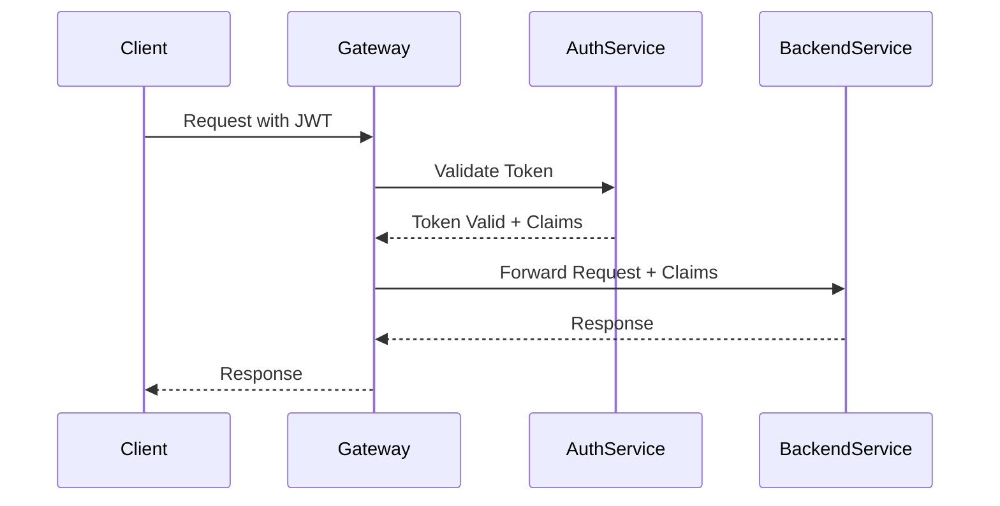

# 🚀 API Gateway 

> [!INFO]+ Цель обучения Развитие компетенций middle backend разработчика для качественной реализации API Gateway в .NET экосистеме

## 📚 Структура знаний



---

## 🏗️ Архитектурные паттерны и концепции

### [[Микросервисная архитектура]]

- [ ] Принципы декомпозиции сервисов
- [ ] Границы контекстов (Bounded Contexts)
- [ ] Межсервисное взаимодействие
- [ ] API Gateway как Single Entry Point

> [!TIP]+ Практическое задание Спроектировать архитектуру e-commerce системы с Gateway

### [[Паттерны интеграции]]

|Паттерн|Описание|Применение в Gateway|
|---|---|---|
|**Circuit Breaker**|Защита от каскадных отказов|Прерывание запросов к недоступным сервисам|
|**Retry**|Повторные попытки|Обработка временных сбоев|
|**Bulkhead**|Изоляция ресурсов|Разделение пулов подключений|
|**Timeout**|Контроль времени ожидания|Предотвращение зависания запросов|

```csharp
// Пример реализации Circuit Breaker
services.AddHttpClient<IOrderService, OrderService>()
    .AddPolicyHandler(GetRetryPolicy())
    .AddPolicyHandler(GetCircuitBreakerPolicy());
```

### [[Принципы распределенных систем]]

- [ ] CAP-теорема и её применение
- [ ] Eventual Consistency
- [ ] Обработка частичных отказов
- [ ] Идемпотентность операций

> [!WARNING]+ Важные моменты В распределенных системах отказы - это норма, а не исключение

---

## 🔧 Технический стек .NET

### [[ASP.NET Core Deep Dive]]

- [ ] **Middleware Pipeline**
    - Порядок выполнения middleware
    - Создание кастомных middleware
    - Обработка исключений
- [ ] **Dependency Injection**
    - Жизненный цикл сервисов
    - Scoped vs Singleton в Gateway
- [ ] **Configuration System**
    - appsettings.json структура
    - Environment-specific конфигурация
- [ ] **Hosting Model**
    - Kestrel настройки
    - Performance tuning

### [[YARP - Yet Another Reverse Proxy]]

> [!SUCCESS]+ Рекомендуемое решение YARP - современный выбор Microsoft для реализации API Gateway

**Ключевые возможности:**

- ✅ High-performance reverse proxy
- ✅ Load balancing algorithms
- ✅ Health checks
- ✅ Request/Response transformation
- ✅ Rate limiting
- ✅ Authentication integration

```yaml
# yarp-config.json пример
{
  "Routes": {
    "orders-route": {
      "ClusterId": "orders-cluster",
      "Match": {
        "Path": "/api/orders/{**catch-all}"
      }
    }
  },
  "Clusters": {
    "orders-cluster": {
      "Destinations": {
        "destination1": {
          "Address": "https://orders-service:8080/"
        }
      }
    }
  }
}
```

**Изучить:**

- [ ] Конфигурация через файлы и код
- [ ] Кастомные трансформации
- [ ] Middleware интеграция
- [ ] Service Discovery integration

### [[Ocelot Gateway]]

- [ ] Сравнение с YARP
- [ ] Миграционные стратегии
- [ ] Legacy поддержка

---

## 🔒 Сетевые протоколы и безопасность

### [[HTTP/HTTPS в деталях]]

- [ ] **HTTP/1.1 vs HTTP/2 vs HTTP/3**
    - Keep-alive connections
    - Multiplexing
    - Server Push
- [ ] **Headers management**
    - Custom headers propagation
    - Security headers (HSTS, CSP)
- [ ] **Content negotiation**

### [[Authentication & Authorization]]



**Технологии:**

- [ ] **JWT (JSON Web Tokens)**
    - Token validation
    - Claims transformation
    - Refresh token flow
- [ ] **OAuth 2.0 / OpenID Connect**
    - Authorization Code flow
    - Client Credentials flow
    - Token introspection
- [ ] **API Keys**
    - Key validation
    - Rate limiting per key

### [[Rate Limiting & Throttling]]

|Алгоритм|Описание|Use Case|
|---|---|---|
|**Token Bucket**|Пополняемый bucket токенов|Burst traffic handling|
|**Fixed Window**|Фиксированные временные окна|Простая реализация|
|**Sliding Window**|Скользящее окно|Более точное ограничение|

```csharp
// ASP.NET Core Rate Limiting
services.AddRateLimiter(options =>
{
    options.AddFixedWindowLimiter("api", opt =>
    {
        opt.Window = TimeSpan.FromMinutes(1);
        opt.PermitLimit = 100;
    });
});
```

---

## ⚡ Производительность и масштабируемость

### [[Асинхронное программирование]]

- [ ] **async/await best practices**
    - ConfigureAwait(false) в библиотеках
    - Avoid async void
    - Task vs ValueTask
- [ ] **Thread Pool management**
- [ ] **Cancellation Tokens**
    - Propagation через Gateway
    - Timeout handling

### [[Кэширование стратегии]]

> [!EXAMPLE]+ Levels of Caching
> 
> 1. **HTTP Caching** - Browser/CDN level
> 2. **Gateway Caching** - Response caching middleware
> 3. **Distributed Caching** - Redis, Memcached
> 4. **Application Caching** - In-memory caching

```csharp
// Response Caching Middleware
services.AddResponseCaching();
app.UseResponseCaching();

// Custom caching logic
[ResponseCache(Duration = 300, VaryByQueryKeys = new[] { "id" })]
public async Task<IActionResult> GetProduct(int id)
```

### [[Load Balancing]]

- [ ] **Алгоритмы балансировки**
    - Round Robin
    - Weighted Round Robin
    - Least Connections
    - Random
- [ ] **Health Checks**
    - Active health checks
    - Passive health checks
    - Circuit breaker integration
- [ ] **Service Discovery**
    - Consul integration
    - Kubernetes service discovery

---

## 📊 Мониторинг и наблюдаемость

### [[Структурированное логирование]]

```csharp
// Structured logging с Serilog
Log.Information("Processing request for {UserId} to {Endpoint}", 
    userId, endpoint);

// Correlation ID middleware
public async Task InvokeAsync(HttpContext context, RequestDelegate next)
{
    var correlationId = context.Request.Headers["X-Correlation-ID"]
        .FirstOrDefault() ?? Guid.NewGuid().ToString();
    
    using (LogContext.PushProperty("CorrelationId", correlationId))
    {
        await next(context);
    }
}
```

### [[Метрики и мониторинг]]

- [ ] **Application Insights**
    - Custom telemetry
    - Dependency tracking
    - Performance counters
- [ ] **Prometheus + Grafana**
    - Custom metrics
    - Alerting rules
    - Dashboard design

### [[Distributed Tracing]]

- [ ] **OpenTelemetry**
    - Trace context propagation
    - Span attributes
    - Jaeger integration

---

## 🛠️ Практические навыки

### [[Routing Configuration]]

> [!NOTE]+ Типы маршрутизации
> 
> - **Path-based**: `/api/orders/*` → Orders Service
> - **Header-based**: `Version: v2` → V2 Services
> - **Query parameter**: `?version=beta` → Beta Services

```csharp
// Dynamic routing в YARP
public class CustomTransform : ITransform
{
    public ValueTask ApplyAsync(RequestTransformContext context)
    {
        if (context.HttpContext.Request.Headers.TryGetValue("API-Version", out var version))
        {
            context.ProxyRequest.RequestUri = new Uri($"https://api-{version}.service.com/");
        }
        return default;
    }
}
```

### [[Request/Response Transformation]]

- [ ] Header manipulation
- [ ] Body transformation
- [ ] Content-Type conversion
- [ ] Error response standardization

### [[Централизованная обработка ошибок]]

```csharp
public class GlobalExceptionMiddleware
{
    public async Task InvokeAsync(HttpContext context, RequestDelegate next)
    {
        try
        {
            await next(context);
        }
        catch (Exception ex)
        {
            await HandleExceptionAsync(context, ex);
        }
    }
}
```

---

## 🚀 DevOps и развертывание

### [[Контейнеризация]]

- [ ] **Docker best practices**
    - Multi-stage builds
    - Image optimization
    - Security scanning
- [ ] **Container networking**
    - Bridge networks
    - Service mesh integration

### [[Kubernetes Integration]]

```yaml
# Gateway Deployment
apiVersion: apps/v1
kind: Deployment
metadata:
  name: api-gateway
spec:
  replicas: 3
  selector:
    matchLabels:
      app: api-gateway
  template:
    metadata:
      labels:
        app: api-gateway
    spec:
      containers:
      - name: gateway
        image: myregistry/api-gateway:latest
        ports:
        - containerPort: 8080
        env:
        - name: ASPNETCORE_ENVIRONMENT
          value: "Production"
```

- [ ] **Ingress Controllers**
- [ ] **Service Mesh** (Istio, Linkerd)
- [ ] **Config Maps & Secrets**

---

## 📋 Чек-лист практических навыков

### Базовый уровень

- [ ] Создать простой API Gateway с YARP
- [ ] Настроить базовую аутентификацию
- [ ] Реализовать health checks
- [ ] Добавить логирование

### Продвинутый уровень

- [ ] Реализовать rate limiting
- [ ] Настроить circuit breaker
- [ ] Создать custom middleware для трансформации
- [ ] Интегрировать с service discovery

### Экспертный уровень

- [ ] Настроить distributed tracing
- [ ] Реализовать A/B testing через Gateway
- [ ] Создать plugin архитектуру
- [ ] Оптимизировать производительность

---

## 📚 Рекомендуемые ресурсы

### Книги

- [ ] "Microservices Patterns" - Chris Richardson
- [ ] "Building Microservices" - Sam Newman
- [ ] "Designing Data-Intensive Applications" - Martin Kleppmann

### Документация

- [ ] [YARP Documentation](https://microsoft.github.io/reverse-proxy/)
- [ ] [ASP.NET Core Performance](https://docs.microsoft.com/en-us/aspnet/core/performance/)
- [ ] [.NET Application Architecture Guides](https://dotnet.microsoft.com/en-us/learn/dotnet/architecture-guides)


---

## 🏷️ Теги

#api-gateway #dotnet #microservices #yarp #architecture #backend #middle-developer #performance #security #devops

---
