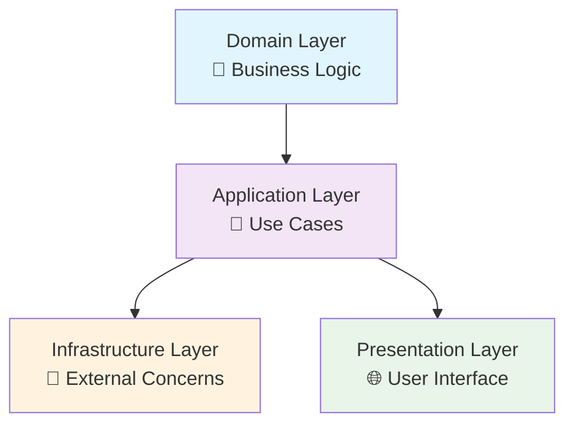

## 🏷️ Tags

#type/moc #area/architecture #area/development #concept/clean-architecture #concept/ddd #concept/solid #tech/csharp #tech/asp-net #tech/ef-core #status/active 

---

# MOC -  Clean Architecture

> [!info] 📋 О документе Комплексный гид по реализации Clean Architecture в .NET экосистеме с практическими примерами и лучшими практиками

---

## 🎯 Что вы изучите

- [ ] Принципы и философию Clean Architecture
- [ ] Структуру слоев и их зависимости
- [ ] Практическую реализацию в .NET проектах
- [ ] Интеграцию с современными технологиями .NET
- [ ] Паттерны тестирования архитектуры
- [ ] Миграцию существующих проектов
- [ ] Распространенные ошибки и их решения

---

## 📖 Содержание

### 🔍 Основы

[[Clean Architecture - Принципы и философия]] - Базовые концепции, правила зависимостей, сравнение с другими подходами

[[Clean Architecture - Структура слоев]] - Детальное описание каждого слоя, их ответственности и взаимодействие

### 🛠️ Реализация в .NET

[[Clean Architecture - Структура .NET проекта]] - Организация solution, проекты, папки и naming conventions

[[Clean Architecture - Domain Layer .NET]] - Entities, Value Objects, Domain Services, Domain Events

[[Clean Architecture - Application Layer .NET]] - Use Cases, Commands/Queries, Interfaces, Validation

[[Clean Architecture - Infrastructure Layer .NET]] - Repository, External Services, Configuration, Persistence

[[Clean Architecture - Presentation Layer .NET]] - Controllers, Middleware, Authentication, API Documentation

### 🔧 Технические аспекты

[[Clean Architecture - Dependency Injection .NET]] - Настройка DI Container, Lifetimes, лучшие практики

[[Clean Architecture - Testing Strategy]] - Unit, Integration, Architecture Tests, Test Doubles

[[Clean Architecture - Migration Guide]] - Поэтапный переход от существующих архитектур

---

## 🧠 Ключевые концепции

> [!tip] 💡 Основные принципы
> 
> **Dependency Rule** - Зависимости направлены от внешних слоев к внутренним
> 
> **Independence** - Бизнес-логика независима от фреймворков, БД, UI
> 
> **Testability** - Архитектура способствует легкому тестированию

### 🏗️ Структура слоев (изнутри наружу)



### 🔗 Связанные концепции

- [[MOC - DDD (Domain-Driven Design) 1|DDD]] - Domain-Driven Design как фундамент
- [[SOLID принципы]] - Основа проектирования классов
- [[Dependency Inversion]] - Ключевой принцип архитектуры
- [[CQRS]] - Разделение команд и запросов
- [[Mediator Pattern]] - Развязка между слоями

---

## 🚀 Быстрый старт

> [!example] 🏃‍♂️ Минимальный пример структуры
> 
> ```
> MyProject.sln
> ├── src/
> │   ├── MyProject.Domain/
> │   ├── MyProject.Application/
> │   ├── MyProject.Infrastructure/
> │   └── MyProject.Web/
> └── tests/
>     ├── MyProject.Domain.Tests/
>     ├── MyProject.Application.Tests/
>     └── MyProject.Architecture.Tests/
> ```

### 📚 Рекомендуемая последовательность изучения

1. 🎯 **[[Clean Architecture - Принципы и философия]]** - Понимание "зачем"
2. 🏗️ **[[Clean Architecture - Структура слоев]]** - Понимание "что"
3. 📁 **[[Clean Architecture - Структура .NET проекта]]** - Понимание "как организовать"
4. 🎯 **[[Clean Architecture - Domain Layer .NET]]** - Начинаем с ядра
5. 🔄 **[[Clean Architecture - Application Layer .NET]]** - Добавляем логику приложения
6. 🔧 **[[Clean Architecture - Infrastructure Layer .NET]]** - Подключаем внешние зависимости
7. 🌐 **[[Clean Architecture - Presentation Layer .NET]]** - Завершаем API
8. 💉 **[[Clean Architecture - Dependency Injection .NET]]** - Связываем все воедино
9. 🧪 **[[Clean Architecture - Testing Strategy]]** - Проверяем качество

---

## ⚡ Преимущества

|Аспект|Преимущество|Пример|
|---|---|---|
|**Независимость**|Бизнес-логика не зависит от фреймворков|Смена с ASP.NET на Minimal API без изменения логики|
|**Тестируемость**|Легко тестировать изолированно|Unit-тесты Domain без БД и веба|
|**Гибкость**|Простая смена реализаций|Переход с SQL Server на PostgreSQL|
|**Поддержка**|Четкое разделение ответственности|Разные команды могут работать над разными слоями|

---

## ⚠️ Потенциальные проблемы

> [!warning] 🚨 Частые ошибки
> 
> - **Over-engineering** - Применение для простых CRUD приложений
> - **Leaky Abstractions** - Нарушение инкапсуляции между слоями
> - **God Classes** - Раздутые Application Services
> - **Anemic Domain** - Отсутствие логики в Domain объектах

---

## 🔗 Связанные заметки

### Архитектурные паттерны

- [[Hexagonal Architecture]] - Альтернативный подход
- [[Onion Architecture]] - Предшественник Clean Architecture
- [[Microservices Architecture]] - Применение на уровне системы

### .NET специфичные темы

- [[ASP.NET Core Middleware]] - Реализация на уровне Presentation
- [[Entity Framework Core]] - ORM для Infrastructure
- [[MediatR]] - Реализация Mediator Pattern

### Методологии разработки

- [[TDD]] - Test-Driven Development
- [[BDD]] - Behavior-Driven Development
- [[Domain Modeling]] - Моделирование предметной области

---

## 📊 Метрики и KPI

> [!success] 📈 Показатели успешной реализации
> 
> - **Cycle Time** - Время от идеи до продакшена ⬇️
> - **Test Coverage** - Покрытие тестами >80% ⬆️
> - **Coupling** - Связанность между слоями ⬇️
> - **Cohesion** - Сплоченность внутри слоев ⬆️
