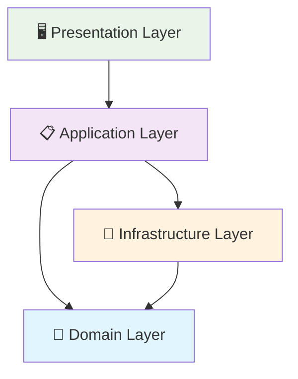

## 🏷️ Tags

#type/moc #area/architecture #area/development #concept/ddd #status/active 

---

# 🏗️ DDD - Domain-Driven Design

> [!info] 📋 О концепции Методология разработки программного обеспечения, которая ставит в центр внимания предметную область (домен) и её логику, а не технические детали реализации.

---

## ✅ Что будет раскрыто

- [ ] Основные принципы и философия DDD
- [ ] Архитектурные паттерны и структуры
- [ ] Тактические паттерны проектирования
- [ ] Стратегическое проектирование
- [ ] Практические примеры применения
- [ ] Связь с другими архитектурными подходами
- [ ] Инструменты и техники моделирования

---

## 📑 Оглавление

1. [Основы и философия](https://claude.ai/chat/f91a8df1-64a6-40f3-9a96-7c0734557135#%D0%BE%D1%81%D0%BD%D0%BE%D0%B2%D1%8B-%D0%B8-%D1%84%D0%B8%D0%BB%D0%BE%D1%81%D0%BE%D1%84%D0%B8%D1%8F)
2. [Стратегическое проектирование](https://claude.ai/chat/f91a8df1-64a6-40f3-9a96-7c0734557135#%D1%81%D1%82%D1%80%D0%B0%D1%82%D0%B5%D0%B3%D0%B8%D1%87%D0%B5%D1%81%D0%BA%D0%BE%D0%B5-%D0%BF%D1%80%D0%BE%D0%B5%D0%BA%D1%82%D0%B8%D1%80%D0%BE%D0%B2%D0%B0%D0%BD%D0%B8%D0%B5)
3. [Тактическое проектирование](https://claude.ai/chat/f91a8df1-64a6-40f3-9a96-7c0734557135#%D1%82%D0%B0%D0%BA%D1%82%D0%B8%D1%87%D0%B5%D1%81%D0%BA%D0%BE%D0%B5-%D0%BF%D1%80%D0%BE%D0%B5%D0%BA%D1%82%D0%B8%D1%80%D0%BE%D0%B2%D0%B0%D0%BD%D0%B8%D0%B5)
4. [Архитектурные слои](https://claude.ai/chat/f91a8df1-64a6-40f3-9a96-7c0734557135#%D0%B0%D1%80%D1%85%D0%B8%D1%82%D0%B5%D0%BA%D1%82%D1%83%D1%80%D0%BD%D1%8B%D0%B5-%D1%81%D0%BB%D0%BE%D0%B8)
5. [Практическое применение](https://claude.ai/chat/f91a8df1-64a6-40f3-9a96-7c0734557135#%D0%BF%D1%80%D0%B0%D0%BA%D1%82%D0%B8%D1%87%D0%B5%D1%81%D0%BA%D0%BE%D0%B5-%D0%BF%D1%80%D0%B8%D0%BC%D0%B5%D0%BD%D0%B5%D0%BD%D0%B8%D0%B5)
6. [Связанные концепции](https://claude.ai/chat/f91a8df1-64a6-40f3-9a96-7c0734557135#%D1%81%D0%B2%D1%8F%D0%B7%D0%B0%D0%BD%D0%BD%D1%8B%D0%B5-%D0%BA%D0%BE%D0%BD%D1%86%D0%B5%D0%BF%D1%86%D0%B8%D0%B8)

---

## 🎯 Основы и философия

> [!tip] 💡 Ключевая идея **Код должен отражать язык предметной области**, а не технические детали реализации

### Фундаментальные принципы

|Принцип|Описание|
|---|---|
|**Ubiquitous Language**|Единый язык между разработчиками и экспертами домена|
|**Domain Focus**|Сосредоточение на бизнес-логике, а не на технических деталях|
|**Model-Driven Design**|Модель домена как основа архитектуры|
|**Iterative Refinement**|Постоянное улучшение модели через обратную связь|

### Основные преимущества

- 🎯 **Фокус на бизнесе** — решение реальных проблем домена
- 🗣️ **Общий язык** — улучшение коммуникации в команде
- 🔧 **Гибкость** — легче адаптироваться к изменениям требований
- 📐 **Чистая архитектура** — разделение бизнес-логики и технических деталей

---

## 🗺️ Стратегическое проектирование

### Ключевые концепции

> [!note] 📋 Стратегические паттерны Определяют границы и взаимодействие между различными частями системы

#### [[DDD/MOC - Bounded Context|Bounded Context]]

- Явные границы модели домена
- Контекст, в котором модель имеет конкретное значение
- Основа для разделения больших систем

#### [[DDD/Context Map|🗺️ Context Map]]

- Карта взаимосвязей между Bounded Context'ами
- Паттерны интеграции (Shared Kernel, ACL, Open Host Service)
- Стратегия развития системы

#### [[DDD/Subdomain Types|🏢 Subdomain Types]]

|Тип|Описание|Стратегия|
|---|---|---|
|**Core Domain**|Ключевая бизнес-область|Максимум инвестиций|
|**Supporting**|Поддерживающие функции|Собственная разработка|
|**Generic**|Общие функции|Готовые решения|

---

## ⚙️ Тактическое проектирование

### Строительные блоки домена

> [!example] 🧱 Building Blocks Тактические паттерны для реализации модели домена в коде

#### [[DDD/Entity|🆔 Entity (Сущность)]]

```
✅ Имеет уникальную идентичность
✅ Изменяемое состояние
✅ Жизненный цикл
```

#### [[DDD/Value Object|💎 Value Object (Объект-значение)]]

```
✅ Неизменяемый
✅ Определяется значениями
✅ Без идентичности
```

#### [[DDD/Aggregate|📦 Aggregate (Агрегат)]]

```
✅ Граница консистентности
✅ Aggregate Root как точка входа
✅ Инвариант внутри границ
```

#### [[DDD Domain Service|🔧 Domain Service]]

```
✅ Бизнес-операции между сущностями
✅ Не принадлежит конкретной сущности
✅ Выражает концепции домена
```

#### [[DDD Repository|📚 Repository]]

```
✅ Абстракция доступа к данным
✅ Имитация коллекции в памяти
✅ Только для Aggregate Root
```

---

## 🏗️ Архитектурные слои

> [!info] 🎂 Layered Architecture Классическая слоистая архитектура DDD



|Слой|Ответственность|Примеры|
|---|---|---|
|**Presentation**|UI, контроллеры, API|Controllers, Views, DTOs|
|**Application**|Оркестрация, use cases|Services, Commands, Queries|
|**Domain**|Бизнес-логика, правила|Entities, Value Objects, Services|
|**Infrastructure**|Техническая реализация|Repositories, External APIs|

---

## 💼 Практическое применение

### 🚀 Когда использовать DDD

> [!success] ✅ Подходит для:
> 
> - Сложной бизнес-логики
> - Долгосрочных проектов
> - Команд с экспертами домена
> - Системы с частыми изменениями требований

> [!warning] ❌ Не подходит для:
> 
> - CRUD-приложений
> - Простых систем
> - Жестких временных рамок
> - Команд без экспертов домена

### 🛠️ Инструменты и техники

#### Event Storming

```
🎯 Цель: Исследование домена через события
📋 Процесс: События → Команды → Агрегаты → Bounded Contexts
👥 Участники: Вся команда + эксперты домена
```

#### Domain Modeling

```
📊 Техники:
• Интервью с экспертами
• Анализ существующих процессов
• Прототипирование моделей
• Итеративное улучшение
```

---

## 🔗 Связанные концепции

### Архитектурные паттерны

- [[Clean Architecture]] — дополняет DDD принципами чистой архитектуры
- [[CQRS]] — разделение команд и запросов
- [[Event Sourcing]] — хранение событий вместо состояния
- [[Hexagonal Architecture]] — изоляция домена от внешних зависимостей

### Методологии

- [[Event-Driven Architecture]] — архитектура на основе событий
- [[Microservices]] — каждый сервис = Bounded Context
- [[API Design]] — проектирование API согласно доменной модели

---

## 📚 Дополнительные материалы

### Книги

- 📖 "Domain-Driven Design" - Eric Evans
- 📖 "Implementing Domain-Driven Design" - Vaughn Vernon
- 📖 "Domain-Driven Design Distilled" - Vaughn Vernon

### Практические ресурсы

- [[DDD Sample Applications]] — примеры реализации
- [[DDD Patterns Cheatsheet]] — шпаргалка по паттернам
- [[DDD Anti-Patterns]] — что не стоит делать

---

> [!quote] 💭 Ключевая мысль "The heart of software is its ability to solve domain-related problems for its user. All other features, vital though they may be, support this basic purpose." — Eric Evans