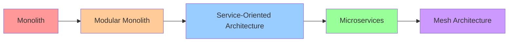

## 🏷️ Tags

#type/moc #concept/microservice #concept/ddd #concept/api-gateway #concept/event-driven #concept/cqrs #area/architecture #area/development #tech/csharp #tech/asp-net #tech/docker #status/active 

---

# MOC - Microservices

> [!info] 📋 О заметке Комплексное руководство по построению микросервисной архитектуры в экосистеме .NET с использованием современных паттернов и практик

---

## ✅ Что будет раскрыто

- [ ] Основы микросервисной архитектуры в .NET
- [ ] Архитектурные паттерны и принципы проектирования
- [ ] Коммуникация между сервисами
- [ ] Управление данными и транзакциями
- [ ] Безопасность и аутентификация
- [ ] Мониторинг и наблюдаемость
- [ ] Развертывание и оркестрация

---

## 📑 Оглавление

1. **[[.NET Microservices - Fundamentals]]** - Основы и принципы
2. **[[.NET Microservices - Architecture Patterns]]** - Архитектурные паттерны
3. **[[.NET Microservices - Communication]]** - Коммуникация между сервисами
4. **[[.NET Microservices - Data Management]]** - Управление данными
5. **[[.NET Microservices - Security]]** - Безопасность
6. **[[.NET Microservices - Observability]]** - Мониторинг и наблюдаемость
7. **[[.NET Microservices - Deployment]]** - Развертывание и оркестрация
8. **[[.NET Microservices - Testing]]** - Тестирование
9. **[[.NET Microservices - Best Practices]]** - Лучшие практики

---

## 🎯 Краткий обзор

### Что такое микросервисы в .NET?

> [!abstract] Определение Микросервисная архитектура в .NET - это подход к проектированию приложений как набора слабо связанных сервисов, каждый из которых выполняет определенную бизнес-функцию и может разрабатываться, развертываться и масштабироваться независимо.

### Ключевые характеристики

- **Автономность** - каждый сервис независим
- **Бизнес-ориентированность** - один сервис = одна доменная область
- **Децентрализация** - собственные данные и логика
- **Отказоустойчивость** - изолированные сбои
- **Технологическое разнообразие** - свобода выбора стека

### Основные технологии .NET для микросервисов

|Технология|Назначение|Примеры|
|---|---|---|
|**ASP.NET Core**|Web API, gRPC|RESTful APIs, GraphQL|
|**MediatR**|CQRS, медиатор|Command/Query handlers|
|**Entity Framework Core**|ORM|Database per service|
|**Docker**|Контейнеризация|Изолированное развертывание|
|**Kubernetes**|Оркестрация|Service mesh, load balancing|
|**Azure Service Bus**|Messaging|Async communication|

---

## 🔄 Эволюция архитектуры

### Когда использовать микросервисы?

> [!success] ✅ Подходящие сценарии
> 
> - Большие команды разработки (>10 человек)
> - Сложные доменные области
> - Различные требования к масштабированию
> - Необходимость быстрого time-to-market
> - Разные технологические стеки для разных сервисов

> [!warning] ❌ Избегайте микросервисов если
> 
> - Команда <5 человек
> - Простая доменная область
> - Старт проекта (начните с модульного монолита)
> - Отсутствие DevOps зрелости

---

## 🏛️ Архитектурные принципы

### Domain-Driven Design (DDD)

- **Bounded Context** → Service boundary
- **Aggregate** → Data consistency boundary
- **Ubiquitous Language** → API contracts

### SOLID принципы на уровне сервисов

- **SRP** - один сервис, одна ответственность
- **OCP** - расширение через новые сервисы
- **LSP** - совместимость API versions
- **ISP** - минимальные интерфейсы
- **DIP** - зависимость от абстракций (contracts)

---

## 📊 Паттерны коммуникации

|Паттерн|Тип|Использование|
|---|---|---|
|**Synchronous**|HTTP/gRPC|Query operations|
|**Asynchronous**|Message Queues|Commands, Events|
|**API Gateway**|Proxy|Client aggregation|
|**Service Mesh**|Infrastructure|Service-to-service|

---

## 🔗 Связанные концепции

- [[MOC - Clean Architcture|Clean Architecture]] - архитектурный подход
- [[MOC - DDD (Domain-Driven Design)|DDD]] - доменное моделирование
- [[MOC - ArchPat - CQRS|CQRS]] - разделение команд и запросов
- [[ArchPat.EventSourcing|Event Sourcing]] - хранение событий
- [[API Gateway Pattern]] - единая точка входа
- [[Circuit Breaker Pattern]] - отказоустойчивость
- [[Saga Pattern]] - распределенные транзакции

---

## 📚 Дополнительные ресурсы

### Официальная документация Microsoft

- [.NET Microservices Architecture Guidance](https://docs.microsoft.com/en-us/dotnet/architecture/microservices/)
- [eShopOnContainers Reference Application](https://github.com/dotnet-architecture/eShopOnContainers)

### Рекомендуемая литература

- "Microservices Patterns" - Chris Richardson
- "Building Microservices" - Sam Newman
- "Microservices in .NET" - Christian Horsdal

---

> [!tip] 💡 Следующие шаги
> 
> 1. Начните с изучения [[MS.Fundamentals|Fundamentals]]
> 2. Изучите референсную архитектуру eShopOnContainers
> 3. Практикуйтесь на простом проекте (2-3 сервиса)
> 4. Постепенно добавляйте сложность (оркестрация, мониторинг)