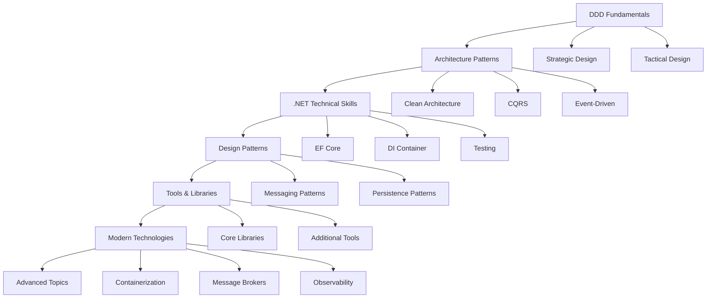

## 🏷️ Tags

#type/moc #area/architecture #concept/microservice #concept/clean-architecture #concept/ddd 

---

> [!info] Цель Roadmap для развития как уверенный middle .NET разработчик с глубоким пониманием Domain-Driven Design

## 🗺️ Roadmap

---

## 📚 Области знаний

### 🎯 1. DDD Fundamentals

#### Strategic Design

- [x] [[Bounded Context|Bounded Context]]
- [x] [[Context Mapping|Context Mapping]]
- [x] [[Ubiquitous Language|Ubiquitous Language]]
- [ ] [[Domain Events|Domain Events]]
- [x] [[Subdomains|Subdomains]] (Core, Supporting, Generic)
- [x] [[Ant-Corruption Layer|Ant-Corruption Layer]]

#### Tactical Design

- [x] [[Entities and Value Objects|Entities and Value Objects]]
- [ ] [[Aggregates & Aggregate Root|Aggregates & Aggregate Root]]
- [ ] [[Domain Services|Domain Services]]
- [x] [[Repository Pattern|Repository Pattern]]
- [ ] [[Domain Factories|Domain Factories]]
- [ ] [[Domain Specifications|Domain Specifications]]

> [!tip] Priority Начинайте с Strategic Design - это основа для понимания всей архитектуры

---

### 🏗️ 2. Architecture Patterns

#### Clean Architecture / Hexagonal Architecture

- [x] [[Layer Separation|Layer Separation]] (Domain, Application, Infrastructure, Presentation)
- [ ] [[Dependency Inversion Principle|Dependency Inversion Principle]]
- [ ] [[Ports & Adapters|Ports & Adapters]]
- [x] [[Application Services|Application Services]]

#### CQRS (Command Query Responsibility Segregation)

- [ ] [[Commands & Queries|Commands & Queries]]
- [ ] [[Command Handlers]]
- [ ] [[Query Handlers]]
- [ ] [[MediatR Pattern]]

#### Event-Driven Architecture

- [ ] [[Domain Events Implementation]]
- [ ] [[Integration Events]]
- [ ] [[ArchPat.EventSourcing]]
- [ ] [[Eventual Consistency]]
- [ ] [[Saga Pattern]]

> [!warning] Complexity Event Sourcing - для продвинутого уровня, начинайте с простых Domain Events

---

### 🛠️ 3. .NET Technical Skills

#### Entity Framework Core

- [ ] [[EF Core Domain Mapping]]
- [ ] [[Value Objects in EF]]
- [ ] [[Owned Entities]]
- [ ] [[EF Core Configurations]]
- [ ] [[Optimistic Concurrency]]
- [ ] [[EF Core Transactions]]
- [ ] [[Unit of Work with EF]]

#### Dependency Injection

- [ ] [[DI Container]]
- [ ] [[Service Lifetimes]]
- [ ] [[Decorator Pattern]]
- [ ] [[Composite Pattern]]
- [ ] [[Factory Pattern]]

#### Testing Strategies

- [ ] [[Domain Logic Unit Testing]]
- [ ] [[Integration Testing]]
- [ ] [[Test Containers]]
- [ ] [[Architecture Tests]]
- [ ] [[ArchUnitNET]]
- [ ] [[Test Doubles & Mocking]]

---

### 🎨 4. Design Patterns

#### Messaging Patterns

- [ ] [[Command Pattern]]
- [ ] [[Query Objects]]
- [ ] [[Result Pattern]]
- [ ] [[Specification Pattern]]
- [ ] [[Strategy Pattern]]
- [ ] [[Chain of Responsibility]]

#### Persistence Patterns

- [ ] [[Repository Pattern Advanced]]
- [ ] [[Unit of Work Pattern]]
- [ ] [[Data Mapper Pattern]]
- [ ] [[Active Record vs Data Mapper]]

> [!note] Best Practice Result Pattern - современная альтернativa exceptions для error handling

---

### 🧰 5. Tools & Libraries

#### Core Libraries

- [ ] **MediatR** - CQRS и медиатор паттерн
- [ ] **FluentValidation** - валидация команд/запросов
- [ ] **AutoMapper** - маппинг между слоями
- [ ] **Serilog** - структурированное логирование

#### Additional Tools

- [ ] **Polly** - устойчивость и retry policies
- [ ] **Hangfire/Quartz** - фоновые задачи
- [ ] **MassTransit/NServiceBus** - messaging
- [ ] **FluentAssertions** - тестирование
- [ ] **Bogus** - генерация тестовых данных

---

### 🚀 6. Modern Technologies

#### Containerization

- [ ] [[Docker for .NET]]
- [ ] [[Docker Compose]]
- [ ] [[Multi-stage builds]]
- [ ] [[Docker best practices]]

#### Message Brokers

- [ ] [[RabbitMQ]]
- [ ] [[Azure Service Bus]]
- [ ] [[Apache Kafka]]
- [ ] [[Message Patterns]]

#### Observability

- [ ] [[Application Performance Monitoring]]
- [ ] [[OpenTelemetry]]
- [ ] [[Distributed Tracing]]
- [ ] [[Metrics & Health Checks]]
- [ ] [[Logging Best Practices]]

---

### 🔬 7. Advanced Topics

#### Event Sourcing & CQRS Advanced

- [ ] [[Event Store]]
- [ ] [[Projections]]
- [ ] [[Snapshots]]
- [ ] [[Event Versioning]]

#### Microservices with DDD

- [ ] [[Service Decomposition]]
- [ ] [[Data Consistency]]
- [ ] [[Service Communication]]
- [ ] [[Distributed Transactions]]

#### Performance & Scalability

- [ ] [[Caching Strategies]]
- [ ] [[Database Sharding]]
- [ ] [[Read Replicas]]
- [ ] [[Load Balancing]]

---

## 📖 Recommended Resources

### Books

- 📚 **"Domain-Driven Design"** - Eric Evans
- 📚 **"Implementing Domain-Driven Design"** - Vaughn Vernon
- 📚 **"Clean Architecture"** - Robert Martin
- 📚 **".NET Microservices Architecture"** - Microsoft

### Blogs & Authors

- 👨‍💻 **Jimmy Bogard** - MediatR creator
- 👨‍💻 **Steve Smith** - Clean Architecture
- 👨‍💻 **Vladimir Khorikov** - Domain modeling
- 👨‍💻 **Udi Dahan** - Service-oriented architecture

### Sample Projects

- 🔗 **eShopOnContainers** - Microsoft reference application
- 🔗 **Clean Architecture Template** - Jason Taylor
- 🔗 **Northwind Traders** - Clean Architecture example

---
